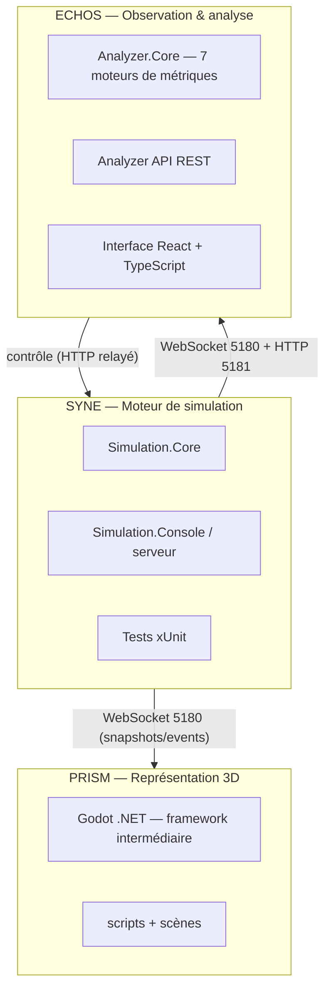
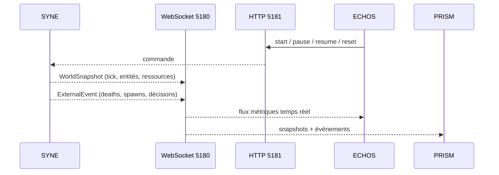

# ARCHITECTURE.md

**Composant** : LIVEX (général)
**Statut** : [STABLE]
**Dernière mise à jour** : 17 septembre 2026
**Dépend de** : `VISION.md`, `CI_CD.md`
**Source Monographie** : Partie 2 (Présentation du Projet), §7.1–7.3 (monorepo, diagrammes, contrats)

---

## 1. Vue d'ensemble

LIVEX est un **monorepo** à trois composants, chacun autonome et versionné indépendamment :



## 2. Les trois composants

### 2.1 SYNE — Systems & Emergent Network Engine

Source : Monographie §2.3, Partie 3.

- **Rôle** : possède la vérité du monde simulé ; calcule états, interactions, décisions.
- **Contraintes** : indépendant du rendu, fonctionne headless, déterministe bit-à-bit, persistant.
- **Sous-systèmes** : World, Agents, Cognition, Actions, Interaction, Spatial (grille spatiale), Nav (pathfinding).
- **Contrats de sortie** : `WorldSnapshot` et `ExternalEvent` (JSON camelCase) via WebSocket 5180 ; API de contrôle HTTP 5181.

Voir `docs/docs-syne/ARCHITECTURE.md`.

### 2.2 ECHOS — Emergent Cognition & Holistic Observation System

Source : Monographie Partie 4.

- **Rôle** : observe, analyse et pilote la simulation ; expose des métriques, un score d'émergence, une analyse causale et la comparaison d'expériences.
- **Implémentation V0.1** : interface **web locale React + TypeScript servie par FastAPI** (`echos-ui`, Vite — shell Electron conservé, implémentation différée à un horizon ultérieur), backend d'analyse **Python (FastAPI, API locale)** sur la base des moteurs de métriques ; stockage SQLite / fichiers Parquet.
- **Contrats d'entrée** : consomme le flux WebSocket 5180 de SYNE (snapshots + événements).
- **Contrats de sortie** : API REST (liste des runs, métriques, comparaison, export), interface d'analyse intégrée.

> Divergence documentée : la Monographie (§7.1) décrit un prototype ECHOS en **C#/.NET (Analyzer.Core + ASP.NET) avec interface web React TS**. **Décision V0.1 (utilisateur, 23/09/2026)** : ECHOS a une interface **web locale React/Vite servie par FastAPI** avec backend **Python FastAPI** (analyse NumPy/Pandas/SciPy, graphes NetworkX, graphiques ECharts/Plotly) et stockage **SQLite/Parquet**. Le **shell Electron est conservé** (non abandonné) : son implémentation est **différée à un horizon ultérieur (post-V0.1)** (correction 23/09/2026, `ADR-001` ECHOS). La logique métier reste calquée sur les 7 moteurs de métriques de la Monographie.

Voir `docs/docs-echos/ARCHITECTURE.md`.

### 2.3 PRISM — Perceptual Rendering & Interactive Simulation Module

Source : Monographie Partie 5.

- **Rôle** : affiche le monde en 3D et permet d'interagir, sans jamais devenir source de vérité.
- **Implémentation actuelles** : Godot 4.7.2 édition .NET (piste [HÉRITÉ] du prototype) ; le moteur graphique définitif reste **ouvert** (Unreal/Unity/autre).
- **Contrats d'entrée** : WebSocket 5180 (snapshots/events), reconnexion automatique (1,5 s).
- **Contrôle** : relaie les commandes à l'API de contrôle HTTP 5181 de SYNE (start/pause/resume/reset).

Voir `docs/docs-prism/ARCHITECTURE.md`.

## 3. Communication inter-composants

Détaillé dans `COMMUNICATION.md`. Résumé contractuel :

| Flux | Transport | Port | Payload (JSON camelCase) |
| :-- | :-- | :-- | :-- |
| SYNE → ECHOS/PRISM | WebSocket | 5180 | `WorldSnapshot`, `ExternalEvent` |
| Contrôle de SYNE | HTTP REST | 5181 | commandes `start/pause/resume/reset` |
| ECHOS API | HTTP REST | 5000 (V0.1 FastAPI) | runs, métriques, export, comparaison |

## 4. Matrice de dépendances

| → | Core (SYNE) | Console | ECHOS | PRISM |
| :-- | :-- | :-- | :-- | :-- |
| **Core** | − | − | − | − |
| **Console** | → Core | − | − | − |
| **ECHOS** | → Core (DTOs) | − | − | − |
| **PRISM** | − | − | − | − |

Règle structurante (Monographie §7.3.3) : **Presentation Adapter → Simulation.Core** (jamais l'inverse). Aucun module ne dépend d'un moteur graphique (Monographie §2.4.2).

## 5. Stacks (Monographie §7.1)

| Agent | Stack |
| :-- | :-- |
| Moteur de simulation | C#/.NET, SDK 10.0.400 (pinné `global.json`) — [HÉRITÉ] |
| Analyse ECHOS | Prototype C#/.NET ; **V0.1 : Python (FastAPI)** |
| Interface ECHOS | React + TypeScript (intégrée à ECHOS) |
| PRISM | Godot 4.7.2 .NET (moteur définitif ouvert) |
| Tests C# | xUnit + Moq |
| Tests interface | Vitest + ESLint + Prettier |
| CI/CD | GitHub Actions |
| Conteneurisation | Docker multi-stage |
| Registre d'images | GHCR |

## 6. Monorepo (cible V0.1)

```text
LIVEX/
├── syne/                  # Moteur de simulation (C#/.NET)
├── echos/                 # Observation & analyse (Python/FastAPI + React/TS)
├── prism/                 # Représentation (Godot .NET — moteur définitif ouvert)
├── docs/                  # Documentation technique
│   ├── docs-syne/
│   ├── docs-echos/
│   ├── docs-prism/
│   ├── governance/
│   └── adr/
├── compose.yml            # Orchestration Docker
└── .github/workflows/     # GitHub Actions (ci.yml, release.yml)
```

> Note : le dépôt conserve en `docs/docs_prototype/` l'historique de spécification V1/V2 du prototype.

## 7. Flux de données de référence



### 7.1 Déterminisme transverse

Le **déterminisme bit-à-bit** est un contrat transverse : le format `WorldSnapshot` et l'ordre causal des événements sont des engagements stables de SYNE vers ECHOS et PRISM. Toute évolution de ce contrat est gérée selon `VERSIONING.md` (MINOR si rétrocompatible, sinon MAJOR).

---

## Points restés ouverts dans ce document
- Moteur graphique définitif de PRISM : [OUVERT] (Godot 4.7.2 pour le prototype, piste [HÉRITÉ]).
- Port de l'API REST ECHOS en V0.1 : **5000** (FastAPI local, confirmé dans `docs/docs-echos/API_REST.md`).
- La structuration courante du dépôt : `syne/`, `echos/` initialisés (Jalon U0) ; `prism/` créé après U0 → U8 (condition ROADMAP §6).