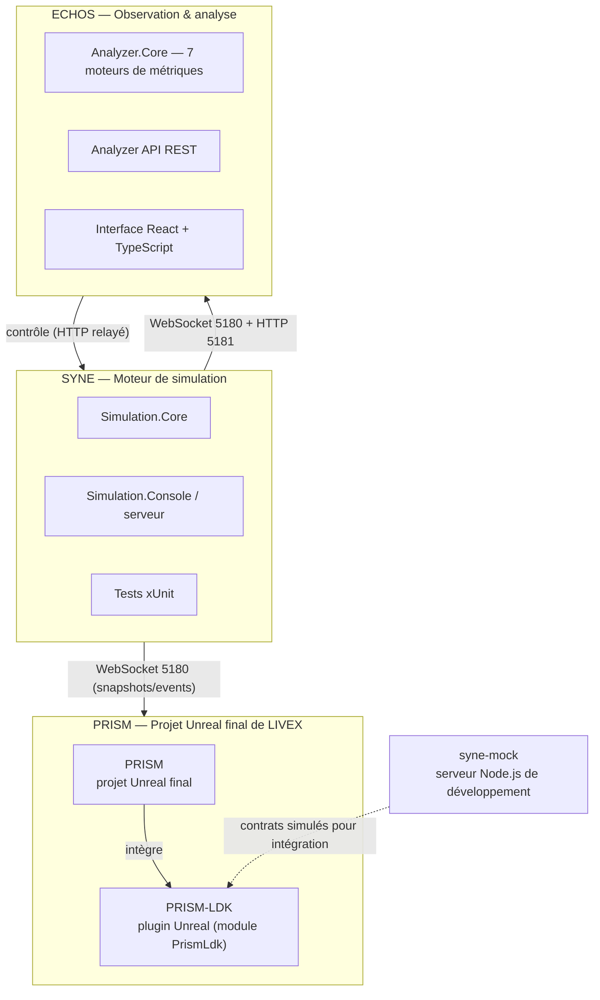
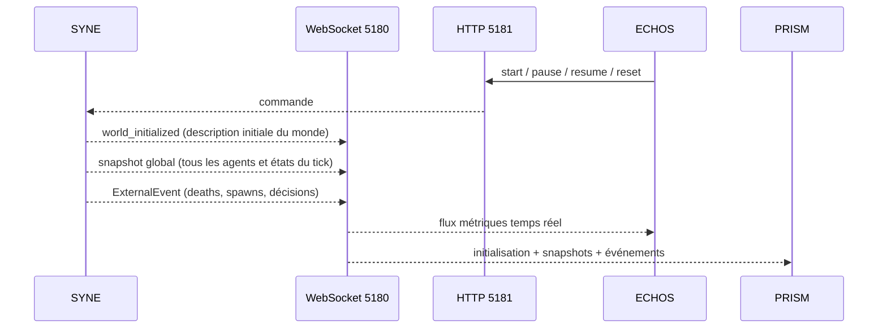

# ARCHITECTURE.md

**Composant** : LIVEX (général)
**Statut** : [STABLE]
**Dernière mise à jour** : 27 septembre 2026
**Dépend de** : `VISION.md`, `CI_CD.md`
**Source Monographie** : Partie 2 (Présentation du Projet), §7.1–7.3 (monorepo, diagrammes, contrats)

---

## 1. Vue d'ensemble

LIVEX réunit trois composants applicatifs et un outil de développement :


```mermaid
flowchart TB
    subgraph SYNE["SYNE — Moteur de simulation"]
        CORE[Simulation.Core]
        CONSOLE[Simulation.Console / serveur]
        TESTS1[Tests xUnit]
    end
    subgraph ECHOS["ECHOS — Observation & analyse"]
        ACORE[Analyzer.Core — 7 moteurs de métriques]
        AAPI[Analyzer API REST]
        UI[Interface React + TypeScript]
    end
    subgraph PRISM["PRISM — Projet Unreal final de LIVEX"]
        APP["PRISM<br/>projet Unreal final"]
        PLUGIN["PRISM-LDK<br/>plugin Unreal (module PrismLdk)"]
        APP -->|"intègre"| PLUGIN
    end
    MOCK["syne-mock<br/>serveur Node.js de développement"]
    SYNE -- "WebSocket 5180 + HTTP 5181" --> ECHOS
    SYNE -- "WebSocket 5180 (snapshots/events)" --> PRISM
    MOCK -. "contrats simulés pour intégration" .-> PLUGIN
    ECHOS -- "contrôle (HTTP relayé)" --> SYNE
```

## 2. Les trois composants

### 2.1 SYNE — Systems & Emergent Network Engine

Source : Monographie §2.3, Partie 3.

- **Rôle** : possède la vérité du monde simulé ; calcule états, interactions, décisions.
- **Contraintes** : indépendant du rendu, fonctionne headless, déterministe pour un seed, une configuration et une version identiques, persistant.
- **Sous-systèmes** : World, Agents, Cognition, Actions, Interaction, Spatial (grille spatiale), Nav (pathfinding).
- **Contrats de sortie** : `WorldSnapshot` et `ExternalEvent` (JSON camelCase) via WebSocket 5180 ; API de contrôle HTTP 5181.

Voir `docs/docs-syne/ARCHITECTURE.md`.

### 2.2 ECHOS — Emergent Cognition & Holistic Observation System

Source : Monographie Partie 4.

- **Rôle** : observe, analyse et pilote la simulation ; expose des métriques, un score d'émergence, une analyse causale et la comparaison d'expériences.
- **Implémentation V0.1** : interface **web locale React + TypeScript servie par FastAPI** (`echos-ui`, Vite — shell Electron conservé, implémentation différée à un horizon ultérieur), backend d'analyse **Python (FastAPI, API locale)** sur la base des moteurs de métriques ; stockage SQLite / fichiers Parquet.
- **Contrats d'entrée** : consomme le flux WebSocket 5180 de SYNE (snapshots + événements).
- **Contrats de sortie** : API REST (liste des runs, métriques, comparaison, export), interface d'analyse intégrée.

> Divergence documentée : la Monographie (§7.1) décrit un prototype ECHOS en **C#/.NET (Analyzer.Core + ASP.NET) avec interface web React TS**. **Décision V0.1 (utilisateur, 23/09/2026)** : ECHOS a une interface **web locale React/Vite servie par FastAPI** avec backend **Python FastAPI** (analyse NumPy/Pandas/SciPy, graphes NetworkX, graphiques ECharts/Plotly) et stockage **SQLite/Parquet**. Le **shell Electron est conservé** (non abandonné) : son implémentation est **différée à un horizon ultérieur (post-V0.1)** (correction 23/09/2026, `ADR-001` ECHOS). La logique métier reste calquée sur les 7 moteurs de métriques de la Monographie.

Voir `docs/docs-echos/ARCHITECTURE.md`.

### 2.3 PRISM — Perceptual Rendering & Interactive Simulation Module

Source : Monographie Partie 5.

- **Rôle** : projet Unreal final de LIVEX, qui porte la représentation et l'expérience interactive en Blueprint.
- **Plugin** : PRISM intègre **PRISM-LDK** (*LIVEX Development Kit* ; nom technique du module `PrismLdk`). LDK est le plugin, pas un projet complet distinct. Il expose types, fonctions et événements Blueprint avec une couche C++ limitée au transport, au parsing et au cycle de connexion.
- **Hôte de développement** : le dépôt contient `prism/LDK/LDK.uproject`, environnement Unreal technique pour développer/compiler/tester le plugin. Ce fichier hôte ne constitue pas un second produit ni le projet LIVEX complet.
- **Contrats** : consomme le flux WebSocket de SYNE (initialisation du monde puis snapshots globaux et événements) et ses commandes HTTP. Les adresses et ports par défaut sont documentés dans `COMMUNICATION.md` et les contrats SYNE.

Voir `docs/docs-prism/ARCHITECTURE.md`.

### 2.4 syne-mock — serveur de simulation de contrat

- **Rôle** : serveur Node.js autonome pour développer et tester l'intégration PRISM sans lancer le moteur SYNE complet.
- **Couverture** : cycle de contrôle, initialisation du monde, messages WebSocket, snapshots globaux, événements et scénario configurable (par défaut 50 agents, jusqu'à 400 ticks).
- **Limite** : ce n'est pas SYNE, ne remplace ni ses tests ni sa validation scientifique et n'en reproduit pas fidèlement les algorithmes. Les décisions sociales et le pathfinding notamment sont simplifiés ; voir `syne-mock/README.md`.

## 3. Communication inter-composants

Détaillé dans `COMMUNICATION.md`. Résumé contractuel :

| Flux | Transport | Port | Payload (JSON camelCase) |
| :-- | :-- | :-- | :-- |
| SYNE → ECHOS/PRISM | WebSocket | 5180 par défaut | `world_initialized`, snapshot global par tick (contrat **0.2.1** — champ `seed` additif) et événements |
| Contrôle de SYNE | HTTP REST | 5181 par défaut | `prepare/ready/start/pause/resume/stop/reset`, état (moteur **0.13.0** — `409 run_finished` sur relance après fin) |
| ECHOS API | HTTP REST | 5000 (V0.1 FastAPI) | runs (avec `outcome` de population), métriques, export, comparaison (`?light=1`) |

Les valeurs par défaut ne remplacent pas la configuration du serveur. Le détail
des schémas et du cycle de préparation est dans
[`docs/docs-syne/API_CONTRACTS.md`](docs/docs-syne/API_CONTRACTS.md).

## 4. Dépendances et frontières

| Élément | Dépendance / frontière |
| :-- | :-- |
| `Simulation.Console` | Référence en processus à `Simulation.Core`. |
| ECHOS | Client externe des contrats HTTP/WebSocket ; ne référence pas les assemblies C# de SYNE. |
| Projet PRISM | Projet Unreal final de LIVEX ; intègre PRISM-LDK et porte l'expérience graphique/Blueprint. |
| Plugin PRISM-LDK | Plugin d'intégration Unreal, module technique `PrismLdk`, qui expose les contrats SYNE à Blueprint. |
| `prism/LDK/LDK.uproject` | Hôte Unreal technique de développement/build du plugin dans le checkout actuel ; n'est pas un produit distinct. |
| SYNE ↔ PRISM | Échange des contrats HTTP/WebSocket ; le projet Unreal ne référence pas les assemblies C# de SYNE. |
| `syne-mock` | Émule les échanges réseau destinés aux clients ; ne référence pas le moteur et n'en remplace pas la logique. |

Règle structurante : les clients présentent ou analysent des données venant de
SYNE par des contrats versionnés. Ils ne partagent pas les abstractions de
rendu avec le cœur et ne deviennent pas propriétaires de l'état simulé.

## 5. Stacks (Monographie §7.1)

| Agent | Stack |
| :-- | :-- |
| Moteur de simulation | C#/.NET, SDK 10.0.400 (pinné `global.json`) — [HÉRITÉ] |
| Analyse ECHOS | Prototype C#/.NET ; **V0.1 : Python (FastAPI)** |
| Interface ECHOS | React + TypeScript (intégrée à ECHOS) |
| PRISM | Projet Unreal final de LIVEX, intégrant PRISM-LDK (`PrismLdk`) |
| Mock SYNE | Node.js ; outil de développement, non moteur scientifique |
| Tests C# | xUnit + Moq |
| Tests interface | Vitest + ESLint + Prettier |
| CI/CD | GitHub Actions |
| Conteneurisation | Docker multi-stage |
| Registre d'images | GHCR |

## 6. Organisation actuelle du dépôt

```text
LIVEX/
├── syne/                  # Moteur de simulation (C#/.NET)
├── echos/                 # Observation & analyse (Python/FastAPI + React/TS)
├── prism/                 # Projet Unreal PRISM et plugin PRISM-LDK
│   └── LDK/               # Emplacement actuel du plugin et de son hôte technique
│       ├── LDK.uproject   # Hôte de développement/build, pas le produit LIVEX complet
│       └── Plugins/PrismLdk/
├── syne-mock/             # Serveur Node.js de simulation du contrat SYNE
├── docs/                  # Documentation technique
│   ├── docs-syne/
│   ├── docs-echos/
│   ├── docs-prism/
│   ├── governance/
│   └── adr/
├── compose.yml            # Orchestration Docker
└── .github/workflows/     # GitHub Actions (ci.yml, release.yml)
```

> Note : `docs/docs_prototype/` conserve des spécifications historiques de prototypes. Les références à Godot dans ces documents ne décrivent pas l'implémentation PRISM actuelle.

## 7. Flux de données de référence


```mermaid
sequenceDiagram
    participant SYNE
    participant WS as WebSocket 5180
    participant HTTP as HTTP 5181
    participant ECHOS
    participant PRISM
    ECHOS->>HTTP: start / pause / resume / reset
    HTTP-->>SYNE: commande
    SYNE-->>WS: world_initialized (description initiale du monde)
    SYNE-->>WS: snapshot global (tous les agents et états du tick)
    SYNE-->>WS: ExternalEvent (deaths, spawns, décisions)
    WS-->>ECHOS: flux métriques temps réel
    WS-->>PRISM: initialisation + snapshots + événements
```

### 7.1 Déterminisme transverse

Le **déterminisme bit-à-bit** est un contrat transverse : le format `WorldSnapshot` et l'ordre causal des événements sont des engagements stables de SYNE vers ECHOS et PRISM. Toute évolution de ce contrat est gérée selon `VERSIONING.md` (MINOR si rétrocompatible, sinon MAJOR).

---

## Points restés ouverts dans ce document
- Le dépôt LIVEX contient le projet Unreal PRISM et le plugin PRISM-LDK ; le `LDK.uproject` actuel sous `prism/LDK/` sert d'hôte technique au plugin et n'est pas un second produit.
- Le plugin Unreal n'est pas encore validé par une matrice CI dédiée ; valider le build dans la version d'Unreal ciblée avant une livraison.