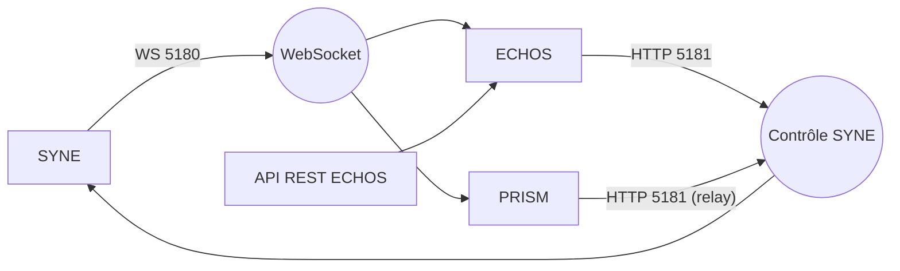

# COMMUNICATION.md

**Composant** : LIVEX (général)
**Statut** : [STABLE]
**Dernière mise à jour** : 17 septembre 2026
**Dépend de** : `ARCHITECTURE.md`
**Source Monographie** : §2.4 (contrats de transport), Partie 5.4 (PRISM), Partie 4.7 (API ECHOS)

---

## 1. Objectif

Ce document décrit les **échanges inter-composants** de LIVEX. Il ne doit pas être confondu avec `docs/docs-syne/COMMUNICATION_PROTOCOL.md`, qui décrit la **communication inter-entités dans le monde simulé** (pulsations lumineuses).

## 2. Principes

- **JSON texte camelCase** pour toutes les charges utiles (contrat hérité du prototype).
- **Gateways à sens unique** : SYNE émet (WebSocket), ECHOS et PRISM consomment ; le contrôle circule via API HTTP relayée.
- **Simple consommateur** par défaut sur WebSocket (Monographie ADR-004 §F.5) : un seul consommateur à la fois, sauf évolution future.
- **Indépendance** : aucun module ne dépend des abstractions des autres (Matrice de dépendances `ARCHITECTURE.md`).

## 3. Flux réseau

| # | Flux | Transport | Port | Destinataire | Contenu |
| :-- | :-- | :-- | :-- | :-- | :-- |
| 1 | Snapshots | WebSocket | 5180 | ECHOS, PRISM | `WorldSnapshot` |
| 2 | Événements | WebSocket | 5180 | ECHOS, PRISM | `ExternalEvent` |
| 3 | Contrôle | HTTP REST | 5181 | SYNE | start / pause / resume / stop / reset |
| 4 | Analyse | HTTP REST | 5000 | ECHOS consumers | runs, métriques, comparaison, export |

Schéma :

## 4. WS 5180 — WebSocket temps réel

Source : Monographie ADR-004 (§F.5).

- URL (local) : `ws://127.0.0.1:5180/`
- Messages : **trames texte UTF-8 contenant du JSON** (camelCase). Le serveur
  WebSocket envoie `WebSocketMessageType.Text`; les clients ne doivent pas
  attendre des trames binaires.
- Chaque `snapshot` porte l'identité canonique du run dans `runId`. Cette
  valeur opaque est stable pour toute la durée du run et doit être propagée
  par ECHOS dans ses réponses et son stockage. Le mode batch peut dériver
  `run-<seed>` ; le serveur contrôlé génère un identifiant opaque.
- Événements typés : `tick_summary`, `agent_spawned`, `agent_died`, `decision_made` (prototype). En V2/V0.1, la nomenclature s'élargit (perceptions, actions, communications) — cf. `docs/docs-syne/API_CONTRACTS.md`.
- Politique : **single-consumer** par défaut (un consommateur à la fois) — évolution vers multi-consommateur à trancher.

## 5. HTTP 5181 — API de contrôle SYNE

Source : Monographie §3.5 (contrôle), Partie 5.4.2.

| Commande | Action |
| :-- | :-- |
| `start` | Démarrer la simulation |
| `pause` | Mettre en pause |
| `resume` | Reprendre |
| `stop` | Arrêter le run proprement, sans arrêter le serveur SYNE |
| `reset` | Réinitialiser (avec seed et run id) |

- URL (local) : `http://127.0.0.1:5181/api/control/`
- PRISM relaie les commandes utilisateur vers cette API (réflexion passive, Monographie §5.15.3) ; ECHOS pilote aussi la simulation depuis son interface.
- L'état de SYNE est interrogé (polling) environ toutes les 2 secondes (valeur prototype, [HÉRITÉ]).
- `stop` annule le run courant et ramène son état à `Idle`; il ne ferme ni
  l'API de contrôle ni le serveur WebSocket. Un arrêt de toute la pile reste
  une responsabilité du processus (`Ctrl+C`/arrêt du service).

## 6. API REST ECHOS

Source : Monographie §4.7.

Endpoints principaux (prototype) :

| Méthode | Endpoint | Description |
| :-- | :-- | :-- |
| GET | `/health` | Santé du service |
| GET | `/api/runs` | Liste des runs |
| GET | `/api/runs/{id}` | Métriques complètes |
| GET | `/api/runs/{id}/metrics` | Dernières métriques (JSON) |
| GET | `/api/runs/{id}/export` | Export CSV/JSON |
| GET | `/api/compare?a={run1}&b={run2}` | Comparaison de deux runs |
| GET | `/api/beliefs/{agentId}` | Croyances d'une entité |
| GET | `/api/relationships/{agentId}` | Réseau de confiance |
| GET | `/api/groups` | Groupes actifs |
| GET | `/api/emergent-phenomena` | Phénomènes émergents détectés |
| GET | `/api/communication-heatmap` | Heatmap des communications |

Voir `docs/docs-echos/API_REST.md` pour le détail V0.1 (révise stack Python/FastAPI locale).

## 7. Compatibilité ascendante

- Règle V0.1 : les consumers (ECHOS/PRISM) doivent tolérer les champs **ajoutés** (`MINOR`). Tout retrait ou changement de sens d'un champ = `MAJOR` (cf. `VERSIONING.md`).
- Les structures `WorldSnapshot` / `ExternalEvent` sont des **contrats versionnés** : une entrée `version` est portée par le snapshot.

---

## Points restés ouverts dans ce document
- Politique multi-consommateur WebSocket : un seul consommateur à la fois en défaut (ADR-004) ; extension à trancher si besoin.
- Authentification entre composants : non requis en local V0.1 ; à réévaluer si ECHOS n'est plus local.
- Le port 5000 (API REST ECHOS) et le binding local (`127.0.0.1`) sont confirmés pour V0.1 (cf. `docs/docs-echos/API_REST.md`).