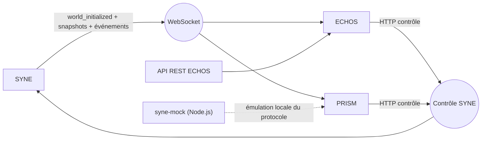

# COMMUNICATION.md

**Composant** : LIVEX (général)
**Statut** : [STABLE]
**Dernière mise à jour** : 27 septembre 2026
**Dépend de** : `ARCHITECTURE.md`
**Source Monographie** : §2.4 (contrats de transport), Partie 5.4 (PRISM), Partie 4.7 (API ECHOS)

---

## 1. Objectif

Ce document décrit les **échanges inter-composants** de LIVEX. Il ne doit pas être confondu avec `docs/docs-syne/COMMUNICATION_PROTOCOL.md`, qui décrit la **communication inter-entités dans le monde simulé** (pulsations lumineuses).

## 2. Principes

- **JSON texte camelCase** pour les charges utiles observabilité.
- SYNE est l'autorité : ses consommateurs (ECHOS et PRISM) ne réécrivent pas l'état simulé.
- Le transport est indépendant du moteur graphique : le plugin Unreal PRISM consomme les mêmes contrats que les autres clients.
- **Indépendance** : aucun module ne dépend des abstractions des autres (Matrice de dépendances `ARCHITECTURE.md`).

## 3. Flux réseau

| # | Flux | Transport | Port | Destinataire | Contenu |
| :-- | :-- | :-- | :-- | :-- | :-- |
| 1 | Initialisation du monde | WebSocket | 5180 par défaut | ECHOS, PRISM | `world_initialized` |
| 2 | Snapshot global et événements | WebSocket | 5180 par défaut | ECHOS, PRISM | Un snapshot global par tick, événements typés |
| 3 | Contrôle | HTTP REST | 5181 par défaut | SYNE | prepare / ready / start / pause / resume / stop / reset / status |
| 4 | Analyse | HTTP REST | 5000 | ECHOS consumers | runs, métriques, comparaison, export |

Schéma :

```mermaid
flowchart LR
    SYNE -->|"world_initialized + snapshots + événements"| WS((WebSocket))
    WS --> ECHOS
    WS --> PRISM
    ECHOS -->|"HTTP contrôle"| CTL((Contrôle SYNE))
    PRISM -->|"HTTP contrôle"| CTL
    CTL --> SYNE
    MOCK["syne-mock (Node.js)"] -. "émulation locale du protocole" .-> PRISM
    EA[API REST ECHOS] --> ECHOS
```

## 4. WS 5180 — WebSocket temps réel

Le port et le chemin d'écoute sont configurables ; les valeurs ci-dessous sont
les valeurs locales par défaut.

- URL par défaut : `ws://127.0.0.1:5180/`
- Messages : **trames texte UTF-8 contenant du JSON** (camelCase). Le serveur
  WebSocket envoie `WebSocketMessageType.Text`; les clients ne doivent pas
  attendre des trames binaires.
- Chaque `snapshot` porte l'identité canonique du run dans `runId` et, depuis
  le contrat **0.2.1**, le **seed effectif** du run (champ additif `seed`).
  Ces valeurs sont stables pour toute la durée du run et doivent être
  propagées par ECHOS dans ses réponses et son stockage. Le mode batch peut
  dériver `run-<seed>` ; le serveur contrôlé génère l'identifiant canonique
  **`run-<seed>-<12hex>`** — le seed reste lisible dans l'identifiant et le
  suffixe garantit l'unicité entre deux runs de même seed.
- Événements typés : notamment `tick_summary`, `decision_made`,
  `action_completed`, `world_delta` et les événements de communication. La
  liste et les schémas effectivement émis sont versionnés dans
  `docs/docs-syne/API_CONTRACTS.md`.
- Le flux est diffusé aux clients WebSocket connectés. Les consommateurs doivent gérer les reconnexions et ne pas présumer que les événements remplacent l'état du snapshot.
- Le premier message de préparation `world_initialized` décrit la topologie et les entités de départ. Ensuite, un snapshot global rassemble l'état des agents et du monde à chaque tick ; voir `docs/docs-syne/API_CONTRACTS.md`.

## 5. HTTP 5181 — API de contrôle SYNE

Source : Monographie §3.5 (contrôle), Partie 5.4.2.

| Commande | Action |
| :-- | :-- |
| `prepare` | Préparer le monde avec seed et cadence ticks/seconde |
| `ready` | Accuser réception du monde initialisé avant son démarrage |
| `start` | Démarrer la simulation préparée |
| `pause` | Mettre en pause |
| `resume` | Reprendre |
| `stop` | Arrêter le run proprement, sans arrêter le serveur SYNE |
| `reset` | Réinitialiser (avec seed et run id) |
| `status` | Lire l'état courant |

- URL par défaut : `http://127.0.0.1:5181/api/control/`
- PRISM commande directement SYNE depuis ses contrôles Unreal ; ECHOS peut aussi piloter le moteur depuis son interface.
- Un monde préparé explicitement doit être acquitté avant `start`. La cadence et la seed sont attachées à la préparation ; consulter le statut et le contrat SYNE pour les règles complètes.
- Depuis **SYNE 0.13.0** : un `start` alors que le run est arrivé à son
  `maxTicks` (état `finished`) répond **`409 run_finished`** (« run terminé —
  appelez /api/control/reset avant de redémarrer ») au lieu du générique
  `world_not_ready`.
- `stop` annule le run courant et ramène son état à `Idle`; il ne ferme ni
  l'API de contrôle ni le serveur WebSocket. Un arrêt de toute la pile reste
  une responsabilité du processus (`Ctrl+C`/arrêt du service).

## 6. API REST ECHOS

Source : Monographie §4.7.

Endpoints principaux (prototype) :

| Méthode | Endpoint | Description |
| :-- | :-- | :-- |
| GET | `/health` | Santé du service |
| GET | `/api/runs` | Liste des runs |
| GET | `/api/runs/{id}` | Métriques complètes |
| GET | `/api/runs/{id}/metrics` | Dernières métriques (JSON) |
| GET | `/api/runs/{id}/export` | Export CSV/JSON |
| GET | `/api/compare?a={run1}&b={run2}` | Comparaison de deux runs |
| GET | `/api/beliefs/{agentId}` | Croyances d'une entité |
| GET | `/api/relationships/{agentId}` | Réseau de confiance |
| GET | `/api/groups` | Groupes actifs |
| GET | `/api/emergent-phenomena` | Phénomènes émergents détectés |
| GET | `/api/communication-heatmap` | Heatmap des communications |

Voir `docs/docs-echos/API_REST.md` pour le détail V0.1 (révise stack Python/FastAPI locale).

## 7. Mock SYNE pour le développement PRISM

[`syne-mock/`](syne-mock/README.md) est un serveur Node.js local qui expose des
routes HTTP et un WebSocket compatibles avec le flux d'intégration documenté.
Il permet de développer les connexions, structures Blueprint, événements et
cycle de vie d'Unreal sans lancer le moteur complet. Il n'est pas la source du
contrat ni une implémentation de référence des algorithmes de SYNE : ses
décisions, le déplacement et les systèmes sociaux sont simplifiés.

## 8. Compatibilité ascendante

- Règle V0.1 : les consumers (ECHOS/PRISM) doivent tolérer les champs **ajoutés** (`MINOR`). Tout retrait ou changement de sens d'un champ = `MAJOR` (cf. `VERSIONING.md`).
- `world_initialized`, les structures de snapshot global et les événements sont des **contrats versionnés**. La documentation SYNE décrit les versions et schémas courants.

---

## Points restés ouverts dans ce document
- Authentification entre composants : non requis en local V0.1 ; à réévaluer si ECHOS n'est plus local.
- Le port 5000 (API REST ECHOS) et le binding local (`127.0.0.1`) sont confirmés pour V0.1 (cf. `docs/docs-echos/API_REST.md`).