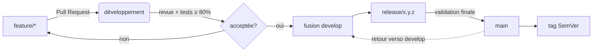

# GITFLOW.md

**Composant** : LIVEX (général)
**Statut** : [STABLE]
**Dernière mise à jour** : 17 septembre 2026
**Dépend de** : `VERSIONING.md`
**Source Monographie** : §7.1 (organisation du monorepo, `.github/workflows`)

---

## 1. Objectif

Ce document définit le modèle de branches et le cycle de vie du code pour LIVEX. Il s'agit d'une variante du modèle **Git Flow** adaptée à un monorepo à trois composants versionnés indépendamment.

## 2. Branches principales

| Branche | Rôle | Règle |
| :-- | :-- | :-- |
| `main` | Code stable, versionné et taggé | Ne reçoit que des `release/*` et `hotfix/*` fusionnées via Pull Request. Protégée (aucun push direct). |
| `develop` | Intégration courante | Ne reçoit que des `feature/*` et des `hotfix/*` (via PR). C'est la branche de base de toute nouvelle fonctionnalité. |

## 3. Branches de contribution

| Préfixe | Usage | Base | Cible |
| :-- | :-- | :-- | :-- |
| `feature/*` | Nouvelle fonctionnalité ou évolution d'un composant | `develop` | `develop` |
| `fix/*` | Correction ciblée en cours de dev | `develop` | `develop` |
| `docs/*` | Documentation seule | `develop` | `develop` |
| `release/x.y.z` | Préparation d'une libération (gel, stabilisation) | `develop` | `main` + retour `develop` |
| `hotfix/*` | Correction urgente sur le stable | `main` | `main` + retour `develop` |

Règle de nommage : `feature/syne-bdi-10-etapes`, `fix/echos-export-nan`, `docs/prism-assets-conventions`, etc.

## 4. Cycle de vie d'une fonctionnalité

`GITFLOW.md` et `CI_CD.md` sont liés : chaque fusion dans `main`/`develop` déclenche le pipeline de validation défini dans `CI_CD.md`.

## 5. Engagement sur les branches

- `feature/*` doit vivre **le moins longtemps possible** : objectif de fusion sous 1 sprint lorsque la roadmap est datée, sinon dès la validation du jalon associé.
- Aucune branche `feature/*` n'est fusionnée sans GitHub Actions verte (build + tests + couverture) et sans PR validée (voir `docs/governance/PULL_REQUESTS.md`).
- Les `release/*` ne reçoivent que des corrections de stabilisation, jamais de nouvelles fonctionnalités.

## 6. Hotfix

1. Créer `hotfix/*` depuis `main`.
2. Corriger ; pousser la PR vers `main`.
3. Après validation, fusionner dans `main`, tagguer (`syne-v0.1.1`, etc.), puis **répercuter la correction dans `develop`**.

Un hotfix est réservé aux défauts bloquants du stable. Toute autre correction passe par le flux normal.

## 7. Convention de commits

Messages conformes à **Conventional Commits** (`feat`, `fix`, `docs`, `refactor`, `perf`, `test`, `build`, `ci`, `chore`) avec **portée** (`syne`, `echos`, `prism`, `governance`, `docs`).

Exemples :

- `fix(syne): calcule la salience mémoire avant purge (Monographie §3.10.4)`
- `feat(echos): ajoute le moteur FeedbackLoopDetector (§4.3.5)`
- `docs(prism): précise le mapping 2D→3D (§5.3.3)`

Ces conventions alimentent directement le changelog et la détermination du niveau SemVer suivant.

---

## Points restés ouverts dans ce document
- Aucun — document stabilisé. La politique de protection de branches (reviewers obligatoires) sera affinée à l'arrivée des premiers contributeurs (actuellement : répo solo, revue seule).