*Living Intelligent Virtual Ecosystem eXperience*

**SYNE** — *Systems & Emergent Network Engine*  
**ECHOS** — Emergent Cognition & Holistic Observation System  
**PRISM** — *Perceptual Rendering & Interactive Simulation Module*  

Simulation émergente multi-agents persistante — Architecture BDI — Observabilité partielle — Visualisation 3D

**Date** : Septembre 2026    **Statut** : Document de référence    **Auteur** : CHARTRAIN Donovan

```{=openxml}
<w:p><w:r><w:br w:type="page"/></w:r></w:p>
```

# **Note de l’auteur**

**Peut-on construire un environnement virtuel régi par des lois fondamentales, au sein duquel des entités autonomes peuvent produire des comportements et des structures qui n'ont pas été explicitement programmés ?**

C’est la question qui a donné naissance à LIVEX.

Avant d’être un projet de développement, LIVEX est né d’une curiosité pour les mondes que l’on rencontre dans la science-fiction et, plus particulièrement, dans le LitRPG : ces mondes virtuels qui paraissent réellement vivants, où les entités ne se contentent pas de répéter des dialogues ou des comportements prévus à l’avance, mais disposent de besoins, d’envies, de perceptions et de capacités de raisonnement qui leur permettent de prendre leurs propres décisions. C’est cette autonomie, et ce qu’elle peut produire lorsqu’elle se confronte aux autres et à son environnement, qui m’intéresse.

Je suis développeur et infographiste 3D. Mon parcours m’a naturellement amené à m’intéresser à ces deux faces d’un même problème : **comment représenter un monde, et comment construire ce qui le fait fonctionner ?** LIVEX est né de cette rencontre entre création visuelle, développement et curiosité pour les systèmes complexes.

Ma vision est simple : ne pas programmer directement les comportements ou les structures que je souhaite observer, mais construire **l’environnement et les lois fondamentales qui peuvent leur permettre d’émerger**. Les entités disposent de leurs propres capacités, perceptions, besoins et objectifs ; leurs interactions avec le monde et entre elles doivent pouvoir produire des comportements et des structures qui n’ont pas été définis à l’avance.

C’est aussi ce qui fait de LIVEX une recherche expérimentale. Je veux construire, expérimenter, observer et remettre en question mes propres hypothèses. Et si quelque chose d’intéressant apparaît, il ne suffit pas de le montrer : il faut pouvoir l’observer, le mesurer, l’analyser et, autant que possible, le reproduire.

Car au fond, l’enjeu de LIVEX n’est pas seulement de créer un monde virtuel. Il est d’explorer ce qu’un monde peut produire lorsque ses règles sont définies, mais que les comportements qui en résultent ne le sont pas.

Une société peut-elle émerger sans avoir été programmée ? Une culture peut-elle apparaître, se transmettre, évoluer puis disparaître sans qu’aucune règle ne l’ait explicitement ordonnée ?

Je ne connais pas encore les réponses. C’est précisément pour essayer de les découvrir que je construis LIVEX.

Cette monographie  présente cette démarche : sa vision, ses fondements, son architecture, ses méthodes d’expérimentation et les moyens mis en place pour observer ce qui pourra émerger.

**Bienvenue dans LIVEX.**									*Donovan Chartrain*

```{=openxml}
<w:p><w:r><w:br w:type="page"/></w:r></w:p>
```

```{=openxml}
<w:p><w:r><w:br w:type="page"/></w:r></w:p>
```
# Partie 1 - Préface, Introduction et Fondements Scientifiques

---

## 1.1 Préface

Cette monographie constitue le document de référence du projet **LIVEX** - *Living Intelligent Virtual Ecosystem eXperience*. Il a pour vocation de présenter, de manière complète et rigoureuse, les ambitions scientifiques, techniques et philosophiques d'un projet de simulation émergente persistante.

LIVEX n'est pas un jeu vidéo au sens traditionnel du terme. Il ne s'agit pas non plus d'un simple banc d'essai technologique. LIVEX est une expérimentation numérique dont l'objectif est de répondre à une question fondamentale : **peut-on construire un monde artificiel capable de produire sa propre histoire ?**

Cette question, qui semble relever de la science-fiction, s'appuie en réalité sur des décennies de recherches en intelligence artificielle, en simulation multi-agent, en sciences des systèmes complexes et en Artificial Life. Le projet se situe à l'intersection de ces domaines, tout en proposant une approche singulière : celle d'un monde où les structures sociales, économiques et culturelles émergent de règles locales simples, sans jamais être imposées par un scénario prédéfini.

Ce document s'adresse à un public large. Le lecteur curieux y trouvera une introduction accessible aux concepts fondamentaux. Le chercheur y découvrira les fondements scientifiques et les choix architecturaux. Le développeur y lira les spécifications techniques détaillées. L'ensemble est conçu pour offrir une vision à 360 degrés d'un projet qui se veut à la fois ambitieux et humble    
Ambitieux dans ses objectifs, humble face à la complexité des phénomènes qu'il cherche à explorer.

Donovan Chartrain, septembre 2026.

---


## 1.2 Introduction

### 1.2.1 La problématique

Depuis les premières simulations informatiques, les créateurs de mondes virtuels font face à un même dilemme : comment produire des comportements crédibles, intéressants et imprévisibles sans pour autant tout scripter à l'avance ?

Dans les jeux vidéo modernes, les personnages non-joueurs (PNJ) suivent des arbres de comportement (*Behavior Trees*) ou des machines à états finis (*Finite State Machines*) qui, aussi sophistiqués soient-ils, restent fondamentalement déterministes et pré-écrits. Un garde dans un jeu de rôle existera toujours. Un villageois marchera toujours entre les mêmes points. La « vie » dans ces mondes est une illusion orchestrée.

Les systèmes d'intelligence artificielle les plus avancés reposent aujourd'hui sur des modèles de langage (LLM) capables de produire des réponses sophistiquées. Mais ces systèmes introduisent leurs propres limites : coût de calcul élevé, absence de reproductibilité, difficulté à tracer les chaînes causales, et incapacité à garantir la cohérence d'un monde sur le long terme.

**LIVEX propose une troisième voie.** Plutôt que de scripter des comportements ou de déléguer la cognition à un réseau de neurones, le projet construit un moteur de simulation où des entités autonomes, dotées de besoins, de mémoire, de croyances et de capacités d'action, interagissent dans un environnement persistant et partiellement observable. Les structures collectives - regroupements, flux d'échange, spécialisations, conflits - ne sont pas programmées. Elles émergent.


### 1.2.2 Résumé du projet

LIVEX est un écosystème logiciel composé de trois modules principaux :

- **SYNE** - Le moteur de simulation, responsable de la vérité du monde simulé. C'est un programme C#/.NET capable de fonctionner en mode *headless* (sans interface graphique), de produire des événements observables et de sauvegarder/restaurer son état avec une garantie de déterminisme bit-à-bit.  
    
- **ECHOS** - Le système d'observation, d'analyse et de pilotage. Il consomme le flux d'événements de SYNE, calcule des métriques d'émergence (diversité cognitive, propagation de l'information, complexité sociale, dynamiques de groupes) et fournit l'interface de la simulation. (Stack du prototype : Python/Django — à définir pour la V0.1.)  
    
- **PRISM** - La couche de représentation 3D, actuellement implémentée avec Godot 4.7 en C#. Elle se contente de refléter l'état du monde fourni par SYNE, sans jamais intervenir dans les décisions des entités.

Ce document présente l'ensemble de ces composants, ainsi que les choix scientifiques, techniques et philosophiques qui les fondent.


## 1.3 Origine du projet

### 1.3.1 De l'intuition à la formalisation

L'idée centrale de LIVEX est née d'une intuition simple : dans la nature, les structures les plus complexes - fourmilières, réseaux de nidification, hiérarchies sociales - ne résultent pas d'un plan central. Elles émergent de règles locales que chaque individu applique de manière indépendante.

Cette observation, bien connue en biologie et en sciences des systèmes complexes, n'a que rarement été appliquée de manière systématique à la création de mondes virtuels persistants. Les projets existants - que ce soient les sociétés artificielles d'Epstein et Axtell (*Sugarscape*, 1996), les simulations sociales de Joshua Epstein, ou les agents génératifs de Joon Sung Park (*Generative Agents*, 2023) - ont chacun exploré un aspect de cette problématique, mais aucun n'a proposé un cadre complet combinant cognition BDI, observabilité partielle, persistance longue durée et instruments d'analyse intégrés.

LIVEX se positionne à la croisée de ces lignées de recherche, avec une priorité particulière : construire un monde **mécaniste**, c'est-à-dire un monde dont chaque phénomène peut être retracé jusqu'à ses causes locales, sans recours à des règles narratives ou à des modèles génératifs opaques.

### 1.3.2 Les jalons du projet

Le développement de LIVEX a suivi une démarche progressive :

1. **Phase de conception** - Rédaction d'une spécification complète détaillant le modèle conceptuel, les règles du monde, les paramètres et les critères de réussite.  
     
2. **Prototype V1** - Développement d'un moteur de simulation fonctionnel en C#/.NET, avec des entités dotées de besoins biologiques, d'une perception locale, d'une mémoire à décroissance et d'un système de décision par utilité. Ce prototype a permis de valider les principes fondamentaux du projet.  
     
3. **Optimisation et tests** - Mise en place d'une grille spatiale pour la perception O(n²) → O(n), réduction des allocations mémoire, mise en place d'un pipeline CI/CD complet avec couverture de tests ≥80%.  
     
4. **Spécification V2** - Rédaction d'une spécification complète pour la seconde génération, intégrant une architecture cognitive BDI, un protocole de communication, un système de groupes et une persistance SQLite.  
     
5. **monographie**  - Ce document, qui constitue la référence complète du projet.

## 1.4 Vision et Philosophie

### 1.4.1 Le principe d'émergence

Le concept central de LIVEX est celui de l'**émergence**. Dans le contexte de ce projet, un comportement est dit « émergent » lorsqu'il résulte d'interactions répétées entre entités, ressources et environnement, sans avoir été explicitement codé comme comportement global.

**Exemple concret :**

Une entité a soif. Il cherche de l'eau. Il trouve une source. Une autre entité, dans le même cas, trouve la même source. Au fil du temps, plusieurs entités convergent vers ce même point. Elles s'y côtoient. Certaines interagissent. Des relations se forment. Une structure sociale locale apparaît - non pas parce qu'un script a dit « formez un groupe autour de l'eau », mais parce que des besoins individuels ont produit des convergences spatiales qui ont, à leur tour, produit des interactions sociales.

C'est précisément cette chaîne causale - du besoin individuel à la structure collective - que LIVEX cherche à produire, à observer et à analyser.


### 1.4.2 Les principes fondamentaux

Le projet repose sur un ensemble de principes invariants :

1. **Pas de narration imposée** - Aucune règle du type « au tick 1000, créer un événement » ou « si la population dépasse X, créer un village ». Les résultats du monde ne doivent jamais être préprogrammés.  
     
2. **Autonomie des entités** - Le moteur fournit aux entités un état, des besoins, une perception, une mémoire, des capacités, un système de décision et des actions. Il ne leur dicte pas ce qu'ils doivent faire.  
     
3. **Observabilité partielle** - Une entité ne connaît qu'une partie du monde. Il ne sait pas ce que font les autres entités hors de son rayon de perception. Il peut se tromper. Il peut être induit en erreur par de faux messages. Cette imperfection de l'information est un moteur puissant de diversité comportementale.  
     
4. **Déterminisme reproductible** - Avec la même seed et les mêmes paramètres, le monde produit exactement la même trajectoire. Cela permet de comparer des expériences, d'isoler l'effet d'un paramètre et de valider scientifiquement les résultats.  
     
5. **Persistance** - Le monde continue d'exister même sans observateur. Il peut être sauvegardé, arrêté, repris. L'état sauvegardé contient toute l'information nécessaire pour poursuivre la simulation sans discontinuité.  
     
6. **Indépendance du rendu** - Le moteur de simulation (SYNE) ne dépend d'aucun moteur graphique. Il peut fonctionner sans affichage, servir plusieurs clients simultanément et être testé en mode headless.  
     
7. **Observabilité scientifique** - Chaque décision d'entité, chaque action, chaque interaction est tracée et analysable. Le système d'observation (ECHOS) est conçu comme un instrument scientifique : il observe sans modifier le phénomène étudié.

### 1.4.3 Émergence faible et émergence forte

LIVEX ne prétend pas produire une « émergence forte » - c'est-à-dire l'apparition de propriétés fondamentalement nouvelles, irréductibles aux propriétés des composants. Le projet vise une **émergence faible** : des propriétés globales apparaissent à partir de règles locales et peuvent être comprises comme des conséquences de ces interactions, sans avoir été spécifiées comme objectif direct.

Cette distinction est importante scientifiquement. Elle signifie que les phénomènes observés dans LIVEX doivent pouvoir être analysés, expliqués et reproduits, sans recours à des concepts mystérieux ou à des interprétations subjectives.

## 1.5 Les Limites des Mondes Virtuels

### 1.5.1 L'état actuel des simulations

L'industrie du jeu vidéo et de la simulation a produit des mondes virtuels d'une richesse visuelle impressionnante. Les mondes ouverts de AAA offrent des paysages immenses, des PNJ aux routines quotidiennes et des systèmes économiques simulés. Pourtant, ces mondes souffrent de limitations fondamentales :

**Les PNJ scriptés.** Un personnage dans un jeu de rôle a un ensemble fini de comportements possibles. Il peut marcher, parler, combattre, dormir. Mais il ne peut pas *décider* de former un groupe avec d'autres PNJ, de créer une route commerciale, de transmettre un savoir à une génération suivante. Ses comportements sont des réponses à des conditions prédéfinies, pas des choix émergents.

**Les mondes décoratifs.** Un village dans un jeu peut sembler vivant, mais sa vie est une illusion. Les habitants n'ont pas de mémoire partagée, pas de conflits non scriptés, pas d'économie qui évolue. Si on laisse le jeu tourner pendant des heures, le village reste fondamentalement le même.

**L'agent omniscient.** Dans la plupart des simulations, chaque agent connaît l'état complet du monde. Il sait où se trouve chaque ressource, chaque allié, chaque ennemi. Cette omniscience élimine l'exploration, la surprise, la rumeur, l'erreur - autant de facteurs qui, dans le monde réel, produisent de la complexité.

**L'IA opaque.** Les modèles de langage utilisés dans certaines simulations récentes produisent des comportements impressionnants mais inexplicables. On ne peut pas tracer pourquoi une entité a fait tel choix. On ne peut pas reproduire exactement la même expérience. On ne peut pas distinguer un comportement émergent d'un artefact du modèle.

### 1.5.2 La problématique de l'immersion durable

L'immersion dans un monde virtuel ne dépend pas seulement de la qualité graphique. Elle dépend de la **cohérence du monde** - de la capacité du monde à produire des résultats qui ont du sens, qui sont causalement liés, et qui évoluent de manière compréhensible.

Un monde où les villages apparaissent et disparaissent aléatoirement n'est pas cohérent. Un monde où les PNJ réagissent toujours de la même manière à la même situation n'est pas vivant. Un monde où l'information circule parfaitement n'est pas réaliste.

LIVEX cherche à produire une immersion d'un genre différent : non pas l'immersion visuelle d'un jeu vidéo, mais l'immersion intellectuelle d'un observateur face à un système complexe qui évolue sous ses yeux, dont les résultats sont surprenants mais compréhensibles, dont les chaînes causales sont traçables.

### 1.5.3 Vers des mondes autonomes

L'ambition à long terme de LIVEX est de créer un **monde autonome** - un monde capable d'évoluer sans intervention permanente du développeur ou du joueur. Un monde qui produit sa propre histoire, avec ses propres crises, ses propres équilibres, ses propres découvertes.

Cette ambition n'est pas nouvelle. Elle remonte aux premières simulations de systèmes complexes des années 1960. Mais elle se heurte toujours aux mêmes défis : la scalabilité, la cohérence à long terme, la traçabilité des résultats, et la capacité à distinguer un phénomène réel d'un artefact technique.

LIVEX ne prétend pas résoudre tous ces défis. Mais il propose un cadre méthodologique rigoureux pour les aborder : un moteur de simulation déterministe et observé, un système d'analyse intégré, et une philosophie de conception qui place l'émergence au centre de l'architecture.


## 1.6 Les Fondements Scientifiques

### 1.6.1 L'Artificial Life

L'Artificial Life (ALife) est une discipline qui étudie les systèmes vivants à travers des systèmes artificiels. Le terme a été popularisé par Christopher Langton lors du premier colloque sur le sujet en 1987, avec la formule programmatique : *« Life as it could be »* - la vie telle qu'elle pourrait être, pas seulement telle qu'elle est.

L'ALife ne cherche pas à simuler des organismes biologiques existants. Elle cherche à comprendre les principes fondamentaux du vivant - auto-organisation, adaptation, reproduction, évolution - à travers des systèmes simplifiés. Les automates cellulaires de Conway (*Game of Life*, 1970), les fourmis artificielles de Dorigo (*Ant Colony Optimization*, 1992) et les créatures virtuelles de Karl Sims (*Virtual Creatures*, 1994) sont des exemples emblématiques de cette approche.

**Lien avec LIVEX** : LIVEX s'inscrit dans cette tradition en cherchant à produire des comportements collectifs à partir de règles locales simples. La différence majeure est que LIVEX ajoute une dimension cognitive (architecture BDI) et une persistance longue durée, ce qui ouvre la possibilité de structures sociales complexes émergentes.

### 1.6.2 Les Systèmes Complexes

La science des systèmes complexes étudie les systèmes composés de nombreux éléments interagissant, dont le comportement global est difficile à prédire à partir des propriétés individuelles. Les travaux de John Holland (*Emergence: From Chaos to Order*, 1998), de Murray Gell-Mann et de la Santa Fe Institute ont établi les fondements de ce domaine.

Les propriétés clés des systèmes complexes sont :

- **L'émergence** - Le comportement global résulte des interactions locales, sans être déductible des règles individuelles.  
- **L'adaptation** - Les agents modifient leurs comportements en réponse à l'environnement.  
- **L'auto-organisation** - Des structures apparaissent sans ordonnateur central.  
- **La rétroaction** - Les résultats des actions modifient les conditions qui ont produit ces actions.

**Lien avec LIVEX** : Le monde de LIVEX est conçu comme un système complexe. Les entités sont adaptatives (leur décision dépend de leur état et de leur perception). Les ressources s'épuisent et se régénèrent. Les interactions produisent des structures sociales qui, à leur tour, modifient les interactions futures. Les boucles de rétroaction - la zone la plus critique du projet - sont au cœur de l'architecture.


### 1.6.3 La Simulation Multi-Agent

La simulation multi-agent (MAS - *Multi-Agent System*) est un paradigme de modélisation dans lequel des agents autonomes interagissent dans un environnement partagé. Les travaux de Joshua Epstein et Robert Axtell avec *Sugarscape* (1996) ont démontré que des structures sociales complexes - migration, commerce, guerre, culture - pouvaient émerger de règles individuelles simples placées dans un environnement avec des ressources limitées.

Les principes fondamentaux du MAS sont :

- **L'autonomie** - Chaque agent prend ses propres décisions.  
- **L'hétérogénéité** - Les agents peuvent avoir des caractéristiques différentes.  
- **L'interaction locale** - Les agents n'interagissent qu'avec leurs voisins.  
- **L'environnement partagé** - Un espace commun dans lequel les agents évoluent.

**Lien avec LIVEX** : LIVEX adopte ces principes tout en les enrichissant d'une architecture cognitive (BDI), d'une observabilité partielle et d'un protocole de communication dégradable. La différence fondamentale avec Sugarscape est que les entités de LIVEX disposent de mémoire, de croyances et de raisonnement, ce qui leur permet de construire des modèles internes du monde - des modèles qui peuvent différer de la réalité.

### 1.6.4 L'Intelligence Collective

L'intelligence collective étudie comment des systèmes distribués - sans contrôleur central - peuvent produire des solutions ou des structures globales adaptatives. Les travaux d'Eric Bonabeau, Marco Dorigo et Guy Theraulaz (*Swarm Intelligence*, 1999) ont synthétisé les principes de l'intelligence en essaim : autonomie des agents, émergence de comportements collectifs, fonctionnement distribué.

Les systèmes d'intelligence en essaim - fourmis, abeilles, poissons, oiseaux - montrent comment des règles locales simples (« suis ton voisin », « va vers la source de nourriture la plus proche ») peuvent produire des organisations collectives robustes et adaptatives.

**Lien avec LIVEX** : LIVEX cherche un phénomène analogue mais plus large. Les entités de LIVEX ne se contentent pas de suivre des règles d'essaim. Elles raisonnent, se souviennent, communiquent, mentent parfois, coopèrent ou s'affrontent. L'intelligence collective dans LIVEX émerge non pas de règles de suivi, mais de l'interaction entre cognition individuelle et contraintes environnementales.


### 1.6.5 Les Architectures Cognitives BDI

L'architecture BDI (*Beliefs, Desires, Intentions*) est un modèle cognitif pour les agents rationnels, proposé par Anand Rao et Michael Georgeff en 1995. Elle structure le raisonnement de l'entité en trois composantes :

- **Croyances (Beliefs)** - Ce que l'entité considère comme vrai sur le monde. Les croyances peuvent être correctes ou erronées, complètes ou partielles.  
- **Désirs/Objectifs (Desires/Goals)** - Ce que l'entité cherche à obtenir. Les désirs résultent des besoins de l'entité et de sa compréhension du monde.  
- **Intentions (Intentions)** - Ce que l'entité s'engage à faire. L'intention est le résultat d'une délibération qui choisit un plan d'action parmi les possibilities.

Le cycle BDI suit une séquence : Perception → Mémoire → Croyances → Besoins → Objectifs → Évaluation → Délibération → Intention → Action → Conséquences → Nouvelles perceptions.

**Lien avec LIVEX** : LIVEX adopte le formalisme BDI comme structure d'organisation du raisonnement agentique. Cependant, le projet ne cherche pas à implémenter une théorie philosophique de l'esprit. BDI sert de cadre organisationnel : les croyances décrivent le modèle interne de l'entité, les objectifs expriment ses motivations, et les intentions représentent ses engagements d'action. La sélection d'action utilise une approche par utilité, qui reste transparente et explicable.

### 1.6.6 Les Agents Génératifs et les LLM

Les travaux récents sur les agents génératifs à base de LLM (*Large Language Model*) ont ouvert une nouvelle voie pour la simulation sociale. Le projet *Generative Agents* de Joon Sung Park et al. (2023) a démontré qu'un petit nombre d'agents dotés de mémoire narrative, de réflexion et de planification pouvaient produire des comportements sociaux riches dans un environnement simulé.

Cependant, cette approche présente des limites significatives pour un projet comme LIVEX :

- **Coût** - Un LLM est coûteux en calcul. Le faire tourner pour chaque entité à chaque tick serait prohibitif.  
- **Reproductibilité** - Un LLM est un modèle probabiliste. Deux exécutions identiques peuvent produire des résultats différents.  
- **Traçabilité** - Il est difficile de tracer exactement pourquoi un LLM a produit une réponse donnée.  
- **Cohérence** - Un LLM peut produire des incohérences dans le temps (une entité qui oublie soudainement un fait important).

**Position de LIVEX** : Le projet se place volontairement dans la direction mécaniste, où la causalité reste contrôlée et analysable. Un LLM peut éventuellement être introduit dans le futur, mais jamais comme mécanisme central de cohérence du monde. Si un LLM est utilisé, ce sera comme une expérimentation identifiée, comparable à une baseline non-LLM.

## 1.7 Concepts Clés

### 1.7.1 Émergence

> **Définition** : Un phénomène est dit émergent lorsqu'il résulte d'interactions entre les composants d'un système sans avoir été explicitement spécifié comme résultat global.

L'émergence ne signifie pas magie. Elle signifie que le résultat global est surprenant par rapport aux règles locales, mais qu'il peut néanmoins être analysé et compris. Un exemple familier : le vol en formation d'unenuée d'oiseaux. Aucun oiseau ne « décide » de la forme globale du groupe. Chaque oiseau suit des règles simples (« vole vers ton voisin », « ajuste ta vitesse »). La forme émergente - les vols en V, les turbulences coordonnées - est le résultat de ces interactions répétées.

Dans LIVEX, l'émergence se manifeste potentiellement à plusieurs niveaux :

- **Émergence spatiale** - Concentration d'entités autour de ressources, formation de zones densément peuplées.  
- **Émergence sociale** - Apparition de relations de confiance, de groupes, de hiérarchies informelles.  
- **Émergence informationnelle** - Circulation et déformation de l'information par communication inter-Entités.  
- **Émergence économique** - Flux d'échange, spécialisation, dépendance mutuelle.

### 1.7.2 Autonomie et Agency

> **Définition** : L'« agency » désigne la capacité d'une entité à produire des actions orientées par son état interne et ses objectifs, sans commande externe directe.

L'autonomie dans LIVEX est fonctionnelle, pas philosophique. Une entité de LIVEX est autonome au sens informatique : il sélectionne ses actions sans intervention externe. Cela ne signifie pas qu'il possède une conscience, une volonté ou un libre arbitre au sens métaphysique. LIVEX ne prétend pas résoudre le problème philosophique du libre arbitre. Une décision produite par un algorithme peut être autonome au sens technique sans être « libre » au sens philosophique.

### 1.7.3 Persistance

> **Définition** : La persistance désigne la capacité du monde simulé à continuer d'exister et d'évoluer dans le temps, indépendamment de l'observation, et à pouvoir être sauvegardé puis restauré sans perte d'état essentiel.

La persistance dans LIVEX est bit-à-bit : une simulation sauvegardée puis restaurée produit exactement la même trajectoire qu'une simulation qui n'a jamais été interrompue. Cette garantie repose sur la sérialisation de l'état complet du PRNG (*Pseudo-Random Number Generator*) - les 4 × 64 bits de l'état xoshiro256** - ainsi que de l'état de toutes les entités, ressources et relations.

### 1.7.4 Observabilité Partielle

> **Définition** : Une entité est dit « partiellement observable » lorsqu'il ne perçoit et ne connaît qu'une partie de l'état réel du monde.

L'observabilité partielle est un principe fondamental de LIVEX. Une entité ne voit que ce qui se trouve dans son rayon de perception (configurable, par défaut 30 à 50 unités). Il ne peut pas accéder à la liste de toutes les entités du monde, à toutes les ressources, à tous les événements. Il doit construire un modèle interne du monde - ses croyances - à partir de perceptions incomplètes, de souvenirs dégradés et de messages potentiellement inexacts.

Cette contrainte est un moteur puissant de diversité : deux entités dans la même situation peuvent avoir des modèles internes différents, et donc prendre des décisions différentes. L'information imparfaite produit de l'exploration, de la surprise, de l'erreur - autant de facteurs qui enrichissent les comportements émergents.

### 1.7.5 Déterminisme

> **Définition** : Un système est déterministe lorsque, pour une même configuration initiale et les mêmes règles, il produit exactement la même trajectoire.

Le déterminisme est une condition essentielle pour la scientificité de LIVEX. Sans reproductibilité, il devient difficile de distinguer une conséquence d'une règle d'un effet accidentel de l'aléatoire ou de l'ordre d'exécution.

LIVEX garantit le déterminisme par :

- Un PRNG unique et sérialisable (xoshiro256**).  
- Un ordre causal strict dans la boucle de simulation.  
- Des opérations flottantes déterministes (pas de parallélisme non contrôlé sur les calculs critiques).  
- Un test de vérification : même seed + même configuration = même résultat bit-à-bit après 100 ticks.

### 1.7.6 Tick

> **Définition** : Le tick est l'unité de temps discrète de la boucle de simulation. Dans LIVEX, 1 tick = 1 minute simulée.

Le tick est l'unité fondamentale de temps. Chaque tick, le moteur exécute une séquence d'opérations dans un ordre causal strict. La fréquence des ticks est configurable : par défaut, 10 ticks par seconde réelle, soit un rapport de 1:10 (1 seconde réelle = 10 minutes simulées).

Le tick n'est pas seulement une unité de temps. C'est l'unité de causalité : chaque tick, les entités perçoivent, décident et agissent dans un ordre déterminé. Les conséquences d'une action dans un tick T n'affectent le monde qu'au tick T+1 (ou plus tard, si l'action est multi-ticks).


### 1.7.7 SYNE, ECHOS, PRISM

Ces trois acronymes désignent les trois modules architecturaux de LIVEX :

- **SYNE** (*Systems & Emergent Network Engine*) - Le moteur de simulation. Il possède la vérité du monde. Il calcule les états, les interactions, les décisions. Il reste indépendant du rendu et peut fonctionner sans interface graphique ni module de visualisation. (Implémentation du prototype : C#/.NET — choix technologique non figé pour la V0.1.)  
    
- **ECHOS** (*Emergent Cognition & Holistic Observation System*) - Le système d'observation, d'analyse et de pilotage. Il consomme les événements produits par SYNE, calcule des métriques d'émergence, analyse les trajectoires et fournit l'interface de la simulation (observation, contrôle, calibration). (Stack du prototype : Python/Django — à définir pour la V0.1.)  
    
- **PRISM** (*Perceptual Rendering & Interactive Simulation Module*) - La couche de représentation. Elle affiche le monde en 3D et permet à l'utilisateur d'interagir avec la simulation sans jamais devenir la source de vérité du monde. Elle est actuellement implémentée avec Godot (prototype), mais le moteur graphique définitif reste ouvert (Unreal Engine, Unity ou autre).

**Invariant architectural** : SYNE peut exister sans ECHOS et PRISM. ECHOS et PRISM peuvent évoluer indépendamment tant qu'ils respectent les contrats définis avec SYNE.


```{=openxml}
<w:p><w:r><w:br w:type="page"/></w:r></w:p>
```
# Partie 2 - Présentation du Projet LIVEX

## 2.1 Qu'est-ce que LIVEX ?

**LIVEX** - *Living Intelligent Virtual Ecosystem eXperience* - est un projet de simulation émergente persistante dont l'objectif est de créer un monde artificiel capable de produire sa propre histoire.

Contrairement aux jeux vidéo traditionnels, où les comportements des personnages sont scriptés et les événements planifiés, LIVEX repose sur un principe fondamentalement différent : les structures collectives - groupes, flux d'échange, spécialisations, conflits - ne sont jamais programmées. Elles émergent de l'interaction entre entités autonomes, dotées de besoins, de mémoire, de croyances et de capacités d'action, évoluant dans un environnement persistant et partiellement observable.

LIVEX ne cherche pas à simuler le monde réel. Il cherche à créer un monde artificiel cohérent, dans lequel les phénomènes sociaux apparaissent de manière non scriptée, restent traçables et analysables, et peuvent être étudiés scientifiquement.

**L'acronie complète :**

- **L**iving - Le monde est vivant, il évolue en permanence.  
- **I**ntelligent - Les entités raisonnent, se souviennent, décident.  
- **V**irtual - Le monde est artificiel, pas une copie du réel.  
- **E**cosystem - Les entités interagissent avec un environnement et des ressources.  
- **eXperience** - Le monde est un espace d'expérience, pas un produit fini.


## 2.2 Architecture Globale

### 2.2.1 Les trois modules

LIVEX est structuré en trois modules indépendants, chacun ayant un rôle précis et des responsabilités clairement définies :  
┌───────────────────────────────────────────────────────────────┐  
```
│                         LIVEX — Architecture                  │  
├───────────────────────────────────────────────────────────────┤  
│                                                               │  
│   ┌─────────────────────┐                                    │  
│   │        SYNE         │   moteur, vérité du monde,         │  
│   │  (moteur de sim.)   │   indépendant du rendu             │  
│   └─────────┬───────────┘                                    │  
│             │                                                │  
│  observe ───┤──► ECHOS   (événements, état)                  │  
│  pilote ────┴──► SYNE    (contrôle, calibration)             │  
│  observe ───► PRISM     (état observable, sans accès aux     │  
│               décisions internes)                           │  
│                                                               │  
└───────────────────────────────────────────────────────────────┘
```
| Module | Rôle (V0.1) | Implémentation du prototype |
| :---- | :---- | :---- |
| **SYNE** | Moteur de simulation ; possède la vérité du monde ; peut fonctionner sans interface ni rendu | C#/.NET ; WebSocket 5180, contrôle 5181 |
| **ECHOS** | Observation, analyse, pilotage, calibration ; **fournit l'interface de la simulation** | Python/Django ; REST 5000 |
| **PRISM** | Représentation 3D, inspection, interaction ; observe SYNE sans être requis pour son exécution | Godot 4.7 (C#) |

> **Architecture V0.1** : il n'existe pas de module « Web UI » séparé. L'interface de la simulation (observation, analyse, contrôle) est intégrée à ECHOS. PRISM et ECHOS observent SYNE ; ils ne modifient jamais la vérité du monde hors des mécanismes de SYNE.


### 2.2.2 Le principe d'indépendance

L'invariant architectural fondamental de LIVEX est le suivant :

> **SYNE peut exister sans ECHOS et PRISM. ECHOS et PRISM peuvent évoluer indépendamment tant qu'ils respectent les contrats définis avec SYNE.**

Cela signifie que :

- SYNE peut fonctionner en mode *headless* (sans interface graphique ni module de rendu), produire des événements et les exposer via un contrat de transport (dans le prototype : WebSocket).  
- PRISM peut se connecter à SYNE, afficher le monde en 3D et interagir avec lui **sans jamais être requis** pour exécuter la simulation, et sans aucun accès aux décisions internes des entités.  
- ECHOS consomme le flux d'événements de SYNE, calcule les métriques, analyse les trajectoires et **fournit l'interface de la simulation** (observation, pilotage, calibration). Les protocoles d'exposition restent à définir pour la V0.1 (décision ouverte n°28).  
- Aucun des trois modules ne dépend directement d'un moteur graphique.

Cette séparation est essentielle pour la scientificité du projet : elle garantit que l'observation (ECHOS) et la visualisation (PRISM) ne modifient pas le phénomène observé (SYNE), et que la représentation n'intervient jamais dans les décisions des entités.

### 2.2.3 Les contrats de transport

*(Implémentation du prototype — la V0.1 ne fige pas les protocoles, décision ouverte n°28. Les contrats retenus par le prototype sont :)*

La communication entre les modules repose sur trois protocoles :

**WebSocket** (SYNE → PRISM et ECHOS) :

- Port 5180 pour les données en temps réel.  
- Deux types de messages : `snapshot` (état complet du monde) et `event` (événement ponctuel).  
- Le format est JSON, en camelCase.

**REST API** (ECHOS → interface intégrée) :

- Port 5000 pour les métriques et l'analyse. Dans le prototype, cette API alimentait un module « Web UI » séparé ; dans l'architecture V0.1, l'interface est intégrée à ECHOS.  
- Endpoints : `/api/runs`, `/api/runs/{id}`, `/api/compare`, `/api/beliefs`, `/api/groups`, etc.

**HTTP de contrôle** (PRISM → SYNE) :

- Port 5181 pour les commandes de simulation (start, pause, resume, reset). Le pilotage de la simulation peut être effectué depuis ECHOS (interface) ; PRISM relaie des interactions sans détenir la vérité du monde.  
- Les commandes sont toujours exécutées par les mécanismes prévus de SYNE.

## 2.3 Concepts Technologiques Fondamentaux

### 2.3.1 État

L'état d'un système correspond à l'ensemble des informations nécessaires pour décrire sa situation à un instant donné. Dans LIVEX, l'état comprend :

- **L'état du monde** : temps, ressources, obstacles, événements en cours.  
- **L'état des entités** : position, santé, énergie, faim, soif, traits, inventaire.  
- **L'état cognitif** : croyances, mémoire, objectifs, intentions courantes.  
- **L'état social** : relations de confiance, appartenances à des groupes.  
- **L'état aléatoire** : l'état complet du PRNG (256 bits).

### 2.3.2 Transition d'état

Une simulation est essentiellement une succession de transitions : un état S(t) évolue vers S(t+1) sous l'effet des règles, des actions et de l'aléatoire contrôlé.

Le modèle abstrait est :

S(t+1) = F(S(t), événements, actions, environnement, aléatoire contrôlé)

La fonction F n'est pas une formule mathématique unique dans LIVEX : elle représente l'ensemble des systèmes (physiologie, perception, mémoire, croyances, besoins, objectifs, décision, action, communication) qui transforment l'état courant.

### 2.3.3 Encapsulation

Chaque sous-système de SYNE doit exposer des contrats clairs et cacher autant que possible ses détails internes. Par exemple, le système de navigation peut changer d'algorithme (A*, Dijkstra, navigation par waypoints) sans modifier le système cognitif qui demande un déplacement. Cette séparation est rendue possible par l'utilisation d'interfaces C# explicites.

### 2.3.4 Interfaces

Une interface définit ce qu'un composant attend et ce qu'il fournit. Dans LIVEX, cette notion est essentielle entre SYNE, ECHOS et PRISM afin d'éviter un couplage direct. Les interfaces clés de SYNE sont :

```
public interface IPerceptionSystem { ... }  
public interface IMemorySystem { ... }  
public interface IBeliefStore { ... }  
public interface IDecisionSystem { ... }  
public interface IActionSystem { ... }  
public interface ICommunicationSystem { ... }  
public interface IResourceSystem { ... }
```
### 2.3.5 Événement et Commande

Un événement décrit qu'un fait s'est produit (« l'entité X a mangé »). Une commande exprime une demande d'action (« entité X, mange »). Cette distinction est fondamentale : ECHOS observe des événements, pas des commandes. Une entité de LIVEX ne reçoit jamais de commande comportementale de l'extérieur - sauf commandes de débogage explicites.

### 2.3.6 Sérialisation

La sérialisation consiste à représenter un état ou un événement sous une forme transportable ou stockable. Dans LIVEX, la sérialisation est utilisée pour :

- La **persistance** : sauvegarde de l'état complet du monde dans SQLite.  
- Le **transport** : diffusion des snapshots et événements via WebSocket.  
- L'**analyse** : export des données d'ECHOS pour analyse externe.

### 2.3.7 Versionnement

Un monde sauvegardé peut survivre à plusieurs versions du logiciel. Le format de sauvegarde doit donc prévoir une version de schéma et des mécanismes de migration. Dans LIVEX, la version du schéma de persistance (`schemaVersion`) évolue indépendamment de la version de l'application.

### 2.3.8 Parallélisme

La simulation de nombreux entités peut bénéficier de l'exécution parallèle. Cependant, le parallélisme introduit des problèmes d'ordre, de concurrence et de reproductibilité. Dans LIVEX, le parallélisme est utilisé de manière contrôlée :

- La perception peut être parallélisée (en lecture seule sur la grille spatiale).  
- Les écritures sur l'état des entités sont séquentielles (pour garantir le déterminisme).  
- Les calculs d'utilité sont indépendants par entité (pas de concurrence).

---


## 2.4 Mise en Situation

### 2.4.1 Un monde qui se crée lui-même

Imaginez un monde vide. Au centre, 20 entités se matérialisent. Chacune a un nom, une position, un état de santé, un niveau de faim et de soif. Chacune perçoit le monde autour d'elle, mais pas au-delà. Chacune a ses propres souvenirs, ses propres croyances, ses propres tendances.

Au début, les entités se déplacent aléatoirement. Certaines trouvent de la nourriture. D'autres trouvent de l'eau. Certaines se rencontrent. Elles échangent une information : « il y a de l'eau à l'est ». L'entité qui reçoit ce message peut y croire ou non. Il peut décider de se déplacer vers l'est, ou de rester où il est.

Au fil des heures simulées, des schémas se dessinent. Des entités convergent vers les mêmes sources d'eau. Elles s'y côtoient. Certaines développent une relation de confiance. Un groupe se forme - non pas parce qu'un script l'a décidé, mais parce que des besoins partagés ont produit des convergences spatiales qui ont produit des interactions sociales.

Plus tard, une ressource s'épuise. Les entités doivent explorer de nouvelles zones. Certaines meurent. D'autres survivent et transmettent l'information : « la forêt à l'est est riche en bois ». L'information se propage, se déforme, se perd. Certaines entités prennent des décisions basées sur de fausses informations.

Le monde évolue. Des structures apparaissent, se stabilisent, parfois disparaissent. Personne ne les a planifiées. Elles émergent.

### 2.4.2 Ce que LIVEX n'est pas

LIVEX n'est pas :

- **Un jeu vidéo** - Il n'y a pas de joueur, pas de victoire, pas de scenario.  
- **Un modèle économique** - LIVEX ne simule pas un marché réel, bien que des phénomènes de type économique puissent émerger.  
- **Une simulation biologique** - Les entités ne reproduisent pas (pas de reproduction en V1/V2), ne vieillissent pas au sens biologique.  
- **Un chatbot** - Les entités ne conversent pas en langage naturel. Leur communication utilise un protocole structuré de messages.  
- **Un modèle de société** - LIVEX ne prétend pas modéliser la société humaine. Il produit un monde artificiel dont les phénomènes sociaux sont analogues mais pas identiques.

## 2.5 Sources Étudiées et Historique du Domaine

### 2.5.1 Chronologie des avancées scientifiques

La recherche sur les systèmes multi-agents, l'intelligence artificielle et les systèmes complexes a une longue histoire. Voici les jalons les plus pertinents pour LIVEX :

| Date | Avancée | Auteur(s) | Lien avec LIVEX |
| :---- | :---- | :---- | :---- |
| 1948 | Théorie mathématique de l'information | Claude E. Shannon | Information, bruit, communication |
| 1986 | The Society of Mind | Marvin Minsky | Cognition distribuée et interaction de composants |
| 1987 | Structuration de l'Artificial Life | Christopher G. Langton | Vie artificielle, « life as it could be » |
| 1992 | Complexity | M. Mitchell Waldrop | Diffusion des idées de complexité |
| 1993 | Agent-Oriented Programming | Yoav Shoham | Agents et états mentaux |
| 1995 | BDI Agents: From Theory to Practice | Anand S. Rao, Michael P. Georgeff | Architecture cognitive BDI |
| 1995 | Intelligent Agents: Theory and Practice | Michael Wooldridge, Nicholas Jennings | Fondements des agents intelligents |
| 1996 | Growing Artificial Societies (Sugarscape) | Joshua Epstein, Robert Axtell | Sociétés artificielles, émergence bottom-up |
| 1998 | Emergence: From Chaos to Order | John H. Holland | Émergence dans les systèmes adaptatifs |
| 1998 | Reinforcement Learning | Richard S. Sutton, Andrew G. Barto | Apprentissage par interaction |
| 1999 | Swarm Intelligence | Eric Bonabeau, Marco Dorigo, Guy Theraulaz | Intelligence distribuée et auto-organisation |
| 2002 | An Introduction to MultiAgent Systems | Michael Wooldridge | Synthèse du domaine MAS |
| 2023 | Generative Agents | Joon Sung Park et al. | Mémoire, planification, réflexion, simulation sociale |
| 2024 | LLM empowered agent-based modeling | Chen Gao et al. | État récent des simulations ABM assistées par LLM |
| 2024 | GABM tutorial | Navid Ghaffarzadegan | Modèles agent-based génératifs |
| 2024 | LLMs and generative ABM | Yikang Lu et al. | Complexité et LLM |

### 2.5.2 Positionnement de LIVEX

LIVEX se situe à l'intersection de plusieurs lignées de recherche :

- **L'Artificial Life** pour la volonté de produire des comportements vivants à partir de règles simples.  
- **La simulation multi-agent** pour la modélisation par des individus hétérogènes interagissant dans un environnement partagé.  
- **Les architectures BDI** pour la représentation structurée du raisonnement pratique.  
- **Les systèmes complexes** pour l'étude des phénomènes émergents et des boucles de rétroaction.

LIVEX se distingue cependant par plusieurs choix :

- **Priorité au monde mécaniste** - La causalité reste contrôlée et analysable, sans recours à des LLM pour la cohérence fondamentale.  
- **Persistance longue durée** - Le monde continue d'exister et peut être sauvegardé/restauré.  
- **Observabilité intégrée** - Le système d'observation (ECHOS) est un composant architectural, pas un outil externe.  
- **Reproductibilité garantie** - Même seed = même résultat, vérifié bit-à-bit.


## 2.6 Histoire des Domaines Associés

### 2.6.1 L'Artificial Life

L'Artificial Life s'est structurée autour de l'idée de « life as it could be » (Langton, 1987). Plutôt que de simuler la vie biologique existante, l'ALife cherche à comprendre les principes fondamentaux du vivant à travers des systèmes artificiels.

Les automates cellulaires - en particulier le *Game of Life* de John Conway (1970) - ont montré que des règles de voisinage simples pouvaient produire des structures complexes (oscillateurs, vaisseaux, patterns glissants). Les travaux de Karl Sims sur les créatures virtuelles (1994) ont démontré qu'une évolution par algorithme génétique pouvait produire des morphologies et des comportements inattendus.

**Pertinence pour LIVEX** : L'idée que des règles locales produisent des comportements globaux complexes est le fondement même de LIVEX. La différence est que LIVEX ajoute une couche cognitive (BDI) et une dimension sociale (communication, confiance, groupes) qui enrichissent considérablement l'espace des phénomènes possibles.

### 2.6.2 La Simulation Multi-Agent Classique

Les modèles agent-based (*Agent-Based Modeling*, ABM) représentent les systèmes par des individus hétérogènes placés dans un environnement et soumis à des règles d'interaction. Le travail pionnier d'Epstein et Axtell avec *Sugarscape* (1996) a montré comment des structures sociales - migration, commerce, guerre, culture - pouvaient émerger de règles locales dans un environnement à ressources limitées.

Sugarscape a démontré plusieurs principes fondamentaux :

- Les agents avec des préférences différentes produisent des comportements collectifs variés.  
- Les ressources limitées créent de la compétition et de la spécialisation.  
- La mobilité et la communication produisent de la culture (transmission de connaissances).

**Pertinence pour LIVEX** : LIVEX s'inscrit directement dans cette tradition, mais avec des agents cognitivement plus riches (BDI), une observabilité partielle et un protocole de communication dégradable.


### 2.6.3 Les Architectures Cognitives Symboliques

Les architectures BDI apportent une représentation structurée des croyances, objectifs et intentions. Le travail fondateur de Rao et Georgeff (1995) a établi les fondements théoriques et pratiques de ces architectures, en montrant comment des agents rationnels pouvaient délibérer, adopter des intentions et les exécuter de manière cohérente.

Les systèmes BDI ont été appliqués avec succès dans de nombreux domaines : planification de missions spatiales (Remote Agent de la NASA), simulation de batailles navales, systèmes de contrôle industriels. Leur force réside dans la transparence du raisonnement : on peut toujours expliquer pourquoi un agent a fait un choix donné.

**Pertinence pour LIVEX** : LIVEX utilise le formalisme BDI comme structure d'organisation, pas comme théorie philosophique de l'esprit. Les croyances décrivent le modèle interne de l'entité, les objectifs expriment ses motivations, et les intentions représentent ses engagements. La sélection d'action utilise une approche par utilité, qui reste transparente.

### 2.6.4 L'Intelligence en Essaim

Les approches d'intelligence en essaim (*Swarm Intelligence*) montrent qu'un ensemble d'agents relativement simples peut produire des comportements collectifs robustes. Les colonies de fourmis, les essaims d'abeilles, les bancs de poissons et les volées d'oiseaux illustrent comment des règles locales de suivi, d'attraction et de répulsion peuvent produire des organisations distribuées sans coordonnateur central.

**Pertinence pour LIVEX** : Les principes d'essaim - autonomie, émergence, fonctionnement distribué - sont pertinents pour LIVEX, mais ne couvrent pas à eux seuls la mémoire autobiographique, la croyance individuelle et l'histoire intergénérationnelle recherchées par le projet.

### 2.6.5 Les Agents Génératifs à base de LLM

Les *Generative Agents* de Park et al. (2023) ont montré qu'une architecture combinant observation, mémoire, réflexion et planification pouvait produire des comportements sociaux riches dans une petite simulation sociale. Cette approche est importante pour LIVEX car elle démontre une direction récente : utiliser un modèle génératif pour produire des comportements plus crédibles.

Cependant, les défis restent majeurs : coût de calcul, reproductibilité, latence, évaluation et contrôle causal. Le projet *LLM empowered agent-based modeling* (Gao et al., 2024) et les revues de 2024 soulignent ces défis persistants autour de la perception, de la génération d'actions, de la robustesse et de l'échelle.

**Position de LIVEX** : Le projet se place principalement dans la direction mécaniste, tout en gardant la possibilité d'introduire un LLM de manière périphérique et expérimentale.

## 2.7 Présentation Simplifiée de SYNE

**SYNE** - *Systems & Emergent Network Engine* - est le cœur de LIVEX. C'est le système qui possède la vérité simulée du monde.

### 2.7.1 Ce que SYNE fait

- Il gère le **temps simulé** (tick par tick).  
- Il maintient l'**état du monde** (entités, ressources, obstacles, événements).  
- Il exécute la **boucle de simulation** : perception, mémoire, croyances, besoins, objectifs, décision, action.  
- Il produit des **événements** observables (créations, morts, décisions, actions, communications).  
- Il gère la **persistance** (sauvegarde/chargement en SQLite).  
- Il expose son **état** aux observateurs (ECHOS, PRISM) selon des contrats de transport (dans le prototype : WebSocket ; protocole à définir pour la V0.1).

### 2.7.2 Ce que SYNE ne fait pas

- Il ne **rend pas** la scène graphique.  
- Il ne **dépend** d'aucun moteur graphique (Godot, Unity, Unreal).  
- Il ne **décide** pas des résultats à partir de ce qu'ECHOS souhaite observer.  
- Il ne **donne** pas à une entité une connaissance globale du monde.  
- Il ne **narrate** pas artificiellement les événements.  
- Il n'utilise pas de **LLM** comme mécanisme nécessaire à la cohérence fondamentale.

### 2.7.3 Technologies

*(Choix de l'implémentation du prototype V1/V2 — repères [HÉRITÉ], non figés pour la V0.1 : le langage, le stockage et les protocoles restent des décisions ouvertes.)*

- **Langage** : C# / .NET 10  
- **Architecture** : Monorepo avec `Simulation.Core` (bibliothèque) et `Simulation.Console` (exécutable)  
- **Déterminisme** : PRNG xoshiro256**, seed configurable  
- **Persistance** : SQLite (schema v2.0, 11 tables)  
- **Transport** : WebSocket (port 5180), HTTP de contrôle (port 5181)

---


## 2.8 Présentation Simplifiée d'ECHOS

**ECHOS** - *Emergent Cognition & Holistic Observation System* - est l'observatoire de LIVEX.

### 2.8.1 Ce qu'ECHOS fait

- Il **consomme** le flux d'événements de SYNE.  
- Il **calcule** des métriques d'émergence (7 dimensions de métriques).  
- Il **stocke** les résultats dans SQLite pour analyse historique (*[HÉRITÉ]* — stockage à définir pour la V0.1).  
- Il **fournit l'interface** de la simulation : observation, pilotage (pause, reprise, vitesse, seed, lancement, sauvegarde, export) et calibration. Il n'existe pas de module d'interface séparé dans l'architecture V0.1.  
- Il **détecte** les phénomènes émergents (communautés, boucles de rétroaction, coordination collective).

### 2.8.2 Ce qu'ECHOS ne fait pas

- Il ne **modifie** pas l'état de la simulation.  
- Il ne **produit** pas d'événements qui affectent les entités.  
- Il ne **remplace** pas l'observation humaine - il la complète.

### 2.8.3 Technologies

*(Stack de l'implémentation du prototype — repères [HÉRITÉ], non figés pour la V0.1.)*

- **Langage** : Python + Django  
- **Interface** : intégrée à ECHOS (prototype : shell Electron abandonné, remplacé par le web React)  
- **Stockage** : SQLite  
- **API** : REST (port 5000)  
- **Métriques** : Diversité cognitive, propagation information, complexité sociale, convergence d'objectifs, boucles de rétroaction, dynamiques de groupes, durabilité des ressources.


## 2.9 Présentation Simplifiée de PRISM

**PRISM** - *Perceptual Rendering & Interactive Simulation Module* - est la couche qui rend le monde perceptible.

### 2.9.1 Ce que PRISM fait

- Il **affiche** le monde en 3D (entités, ressources, obstacles, livres, constructions, territoires).  
- Il permet à l'utilisateur de **naviguer** (caméra, zoom, déplacement).  
- Il permet d'**inspecter** une Entité (croyances, objectifs, décision).  
- Il permet à l'utilisateur d'**interagir** avec le monde par ses mécanismes prévus par SYNE (interaction, sélection, visualisation analytique).  
- Il **visualise** les croyances, la confiance inter-Entités, les groupes, la communication lumineuse.

### 2.9.2 Ce que PRISM ne fait pas

- Il ne **possède** pas l'état canonique d'une Entité.  
- Il ne **calcule** pas les règles sociales.  
- Il ne **détermine** pas la vérité d'une croyance.  
- Il ne **modifie** pas directement le monde sans passer par les mécanismes prévus par SYNE.  
- Il n'introduit pas de **comportements** non présents dans le modèle de simulation.

### 2.9.3 Technologies

*(Implémentation du prototype — repères [HÉRITÉ], non figés pour la V0.1. Le moteur graphique définitif reste ouvert : Godot est le moteur actuel.)*

- **Moteur** : Godot 4.7.2 (édition .NET)  
- **Langage** : C#  
- **Assets** : Totalement procéduraux (aucun asset externe)  
- **Transport** : WebSocket (port 5180), HTTP (port 5181)  
- **Rendu** : CapsuleMesh (entités), SphereMesh (ressources), PlaneMesh (sol)

### 2.9.4 Les sous-composants (V0.1)

La V0.1 structure PRISM autour de sous-composants de visualisation clairement séparés :

1. **World Renderer** — le monde, le sol, l'environnement.  
2. **Camera** — navigation (zoom, déplacement, angles).  
3. **Entity Renderer** — entités et leurs états.  
4. **Environment Renderer** — environnement, ressources, obstacles.  
5. **Resource Visualization** — ressources et quantités.  
6. **Construction Visualization** — constructions.  
7. **Territory Visualization** — territoires et influences.  
8. **Communication Visualization** — pulsations lumineuses.  
9. **Debug Visualization** — couches d'aide au développement.  
10. **Analysis Overlay** — superposition des données d'analyse ECHOS.  
11. **Interaction Layer** — sélection, inspection, pilotage.

Cette séparation reflète le principe que PRISM n'est pas la source de vérité du monde (§2.9.2) et peut être enrichi ou modifié sans toucher au moteur.


## 2.10 Ce que LIVEX Cherche à Faire Différemment

| Approche | Limite principale | Réponse LIVEX |
| :---- | :---- | :---- |
| PNJ scriptés | Comportement pré-écrit | Mécanismes génératifs (règles locales) |
| Monde décoratif | Décor fixe | Monde modifiable par les entités |
| Agent omniscient | Information parfaite | Perception locale et croyances |
| IA opaque | Difficulté d'explication | Cognition structurée (BDI) et événements tracés |
| LLM au centre | Coût et reproductibilité | LLM périphérique et optionnel |
| Simulation sans mémoire | Peu d'histoire individuelle | Mémoire, croyances et trajectoire individuelle |
| Société imposée | Résultat préprogrammé | Organisation émergente |
| Rendu propriétaire du modèle | Couplage moteur/simulation | SYNE indépendant + PRISM inter-changeable |
| Analyse après coup seulement | Faible observabilité | ECHOS intégré dès l'architecture |

LIVEX ne prétend pas que son approche est supérieure à toutes les autres. Il prétend qu'elle est **différente** et qu'elle ouvre des possibilités que les autres approches n'explorent pas : la production de structures sociales non scriptées dans un monde persistant, reproductible et observable.


```{=openxml}
<w:p><w:r><w:br w:type="page"/></w:r></w:p>
```
# Partie 3 - **SYNE** - *Systems & Emergent Network Engine*

## 3.1 Présentation de SYNE

### 3.1.1 Rôle fondamental

**SYNE** - *Systems & Emergent Network Engine* - est le système qui possède la vérité simulée de LIVEX. Il est responsable de l'évolution causale du monde : temps, espace, environnement, ressources, énergie, entités, cognition, actions, interactions, événements, cycle de vie et persistance.

Cette responsabilité implique une séparation stricte entre le monde tel qu'il existe dans la simulation et les représentations qu'en ont les autres composants. PRISM peut afficher une information ; ECHOS peut l'analyser ; ni l'un ni l'autre ne doit créer une seconde version concurrente de la réalité.

### 3.1.2 Ce que SYNE doit garantir

SYNE doit respecter un ensemble d'invariants fondamentaux :

1. **Déterministe** - Avec une seed, une configuration et un état initial identiques, la simulation produit exactement la même trajectoire.  
2. **Autonome** - Le moteur décide seul des comportements des entités, sans intervention externe.  
3. **Observable** - Chaque décision, action, interaction est tracée et exportable.  
4. **Persistant** - L'état peut être sauvegardé et restauré sans perte.  
5. **Indépendant du rendu** - Aucune dépendance graphique.  
6. **Scalable** - Capable de simuler 20, 100, 500, 1000+ entités avec un budget de calcul contrôlé.

### 3.1.3 Ce que SYNE ne doit pas faire

La liste des interdictions est aussi importante que la liste des responsabilités :

-  Rendre directement la scène graphique.  
-  Dépendre d'Unreal Engine, Unity ou d'un autre moteur de rendu.  
-  Décider des résultats à partir de ce qu'ECHOS souhaite observer.  
-  Donner à une entité une connaissance globale du monde.  
-  Introduire une narration pour expliquer artificiellement un événement.  
-  Utiliser un LLM comme mécanisme nécessaire à la cohérence fondamentale du monde.


## 3.2 Architecture Logique

### 3.2.1 Les couches de SYNE

SYNE est organisé en couches logiques, chacune ayant des responsabilités claires :

| Couche | Responsabilité | Dépendance principale |
| :---- | :---- | :---- |
| **Runtime** | Tick, scheduler, ordre d'exécution, configuration | Temps simulé |
| **World** | État global, espace, environnement | Runtime |
| **Entity** | Cycle de vie et état des entités | World |
| **Cognition** | Perception, mémoire, croyances, besoins, objectifs, décision | Entity + World |
| **Action** | Exécution des intentions et conséquences | Cognition + World |
| **Interaction** | Relations, communication, conflits, échanges | Entity + World |
| **Spatial** | Proximité, visibilité, voisinage, requêtes spatiales | World |
| **Navigation** | Calcul et maintenance des chemins | Spatial + World |
| **Persistence** | Sauvegarde, chargement, versionnement | État global |
| **Events** | Traçabilité et instrumentation | Tous les systèmes |


### 3.2.2 Les systèmes internes

Dans l'implémentation V2, SYNE est composé de 14 systèmes complémentaires :

1. **WorldSystem** - Gestion du monde (dimensions, obstacles, environnement).  
2. **PhysiologySystem** - Évolution des paramètres biologiques (faim, soif, énergie, santé).  
3. **PerceptionSystem** - Génération des observations sensorielles.  
4. **MemorySystem** - Stockage et décroissance des souvenirs.  
5. **BeliefStore** - Gestion des croyances et leur révision.  
6. **NeedsSystem** - Calcul de l'état des besoins.  
7. **GoalSystem** - Génération et filtrage des objectifs.  
8. **DecisionSystem** - Sélection de la meilleure action (utilité).  
9. **ActionSystem** - Exécution des actions et gestion de leur cycle de vie.  
10. **MovementSystem** - Déplacement des entités dans le monde.  
11. **CommunicationSystem** - Protocole de messages entre entités.  
12. **GroupSystem** - Formation, gestion et dissolution des groupes.  
13. **ResourceSystem** - Gestion des ressources (quantité, régénération, dégradation).  
14. **EnvironmentSystem** - Événements mondiaux (saisons, catastrophes, cycles).

> **V0.1 (17 sous-systèmes de référence)** : la V0.1 structure SYNE autour de **17 sous-systèmes**
> clairement séparés (séparation des responsabilités, chaque couche testable indépendamment,
> §27 de la Fondation) :  
> 1. Core Runtime (boucle, tick, scheduler, état global, configuration, cycle de vie)  
> 2. World System (état du monde, espace, environnement, règles globales minimales)  
> 3. Entity System (entités)  
> 4. Cognitive System (Perception, Memory, Beliefs, Internal State, Needs, Goals, Utility, Decision, Intention, Actions)  
> 5. Resource & Energy System (ressources, disponibilité, consommation, énergie, coûts)  
> 6. Spatial System (position, proximité, requêtes spatiales, visibilité, voisinage)  
> 7. Navigation System (pathfinding, chemins, réévaluation, obstacles)  
> 8. Communication System (émission, réception, portée, ligne de vue, coût, confiance, propagation)  
> 9. Social System (relations, confiance, réputation, groupes, coalitions)  
> 10. Knowledge System (connaissances, livres, lecture, écriture, transmission)  
> 11. Construction System (bâtiments, coûts, placement, effets physiques)  
> 12. Territory System (occupation, contrôle, influence spatiale, évolution territoriale)  
> 13. Conflict System (confrontation, dégâts, épuisement, dissolution)  
> 14. Life Cycle System (naissance, reproduction, générations, mort)  
> 15. Event System (événements structurés, propagation interne, instrumentation, replay, analyse)  
> 16. Persistence System (sauvegarde, chargement, cohérence, état PRNG)  
> 17. Determinism System (seed, état PRNG, ordre d'exécution contrôlé, reproduction d'expérience)  
>  
> Les 14 systèmes du prototype ci-dessus n'en sont que le sous-ensemble implémenté ([HÉRITÉ]).

### 3.2.3 Le modèle de données

Le modèle de données central de SYNE est :

┌─────────────────────────────────────────────────────────────────┐  
```
│                          World                                  │  
├─────────────────────────────────────────────────────────────────┤  
│  ┌───────┐  ┌──────────┐  ┌──────────┐  ┌────────────────────┐  │  
│  │Agent  │  │Resource  │  │Obstacle  │  │EnvironmentEvent    │  │  
│  ├───────┤  ├──────────┤  ├──────────┤  ├────────────────────┤  │  
│  │- Id   │  │- Type    │  │- Shape   │  │- Type              │  │  
│  │- State│  │- Position│  │- Position│  │- Tick              │  │  
│  │- Needs│  │- Quantity│  │- Size    │  │- Data              │  │  
│  │- BDI  │  │- Capacity│  │- Passable│  │                    │  │  
│  │- ...  │  │- ...     │  │          │  │                    │  │  
│  └───────┘  └──────────┘  └──────────┘  └────────────────────┘  │  
│                                                                 │  
│  ┌────────────────────────────────────────────────────────────┐ │  
│  │                     SpatialGrid                            │ │  
│  │         (optimisation des requêtes de proximité)           │ │  
│  └────────────────────────────────────────────────────────────┘ │  
└─────────────────────────────────────────────────────────────────┘
```
## 3.3 Boucle de Simulation

### 3.3.1 Définition du tick

Le **tick** est l'unité logique d'avancement de la simulation. Sa durée simulée est configurable ; la valeur par défaut en V1 est de 1 tick = 1 minute simulée, et le rapport par défaut est de 10 ticks par seconde réelle. Cela signifie qu'une seconde réelle correspond à 10 minutes simulées.

### 3.3.2 Ordre causal V1 (11 étapes) — [HÉRITÉ]

La boucle V1 suit un ordre causal strict de 11 étapes, documenté dans la spécification du prototype :

1.  Avancer le temps  
2.  Mettre à jour l'environnement  
3.  Mettre à jour la physiologie  
4.  Mettre à jour la perception  
5.  Mettre à jour la mémoire  
6.  Calculer les besoins  
7.  Évaluer les décisions  
8.  Mettre à jour les actions  
9.  Appliquer les effets sur le monde  
10. Générer les événements  
11. Valider l'état

Cet ordre est **contractuel** : il doit rester stable entre versions pour garantir la reproductibilité. La causalité est documentée et testée (par exemple : l'action « boire » diminue la soif → l'événement « DrinkCompleted » est émis → l'état est modifié → la prochaine décision en tient compte).

### 3.3.3 Chaîne causale V2 (10 étapes BDI) — [HÉRITÉ]

La boucle V2 étend la boucle V1 avec le cycle cognitif BDI complet :  
*Perception → Mémoire → Croyances → État interne → Besoins →*  
*Objectifs → Possibilités → Évaluation → Délibération → Intention →*  
*Action → Conséquences → Modification du monde → Événements →*  
*Nouvelles perceptions*

Cette chaîne est **conceptuelle** : le scheduler peut distribuer chaque sous-système sur des fréquences différentes. Par exemple, la délibération cognitive ne doit pas nécessairement être exécutée à chaque tick.

### 3.3.4 La boucle décisionnelle V0.1 (15 étapes)

La boucle de simulation de référence pour la V0.1 est la suivante ([V0.1], §28 de la Fondation) :

1.  **Percevoir**  
2.  **Mettre à jour la mémoire**  
3.  **Réviser les croyances**  
4.  **Mettre à jour l'état interne**  
5.  **Mettre à jour les besoins**  
6.  **Générer / actualiser les objectifs**  
7.  **Générer les possibilités**  
8.  **Évaluer les possibilités**  
9.  **Délibérer**  
10. **Définir une intention**  
11. **Exécuter l'action**  
12. **Produire des conséquences**  
13. **Modifier le monde**  
14. **Produire des événements**  
15. **Nouvelles perceptions** ↺

Cette boucle est **conceptuelle** : elle ne signifie pas que chaque étape doit être exécutée à chaque tick (le scheduler distribue les sous-systèmes sur des fréquences distinctes, §3.4). Elle remplace les boucles V1/V2 (§3.3.2-§3.3.3), conservées comme historique du prototype ([HÉRITÉ]).

**Traçabilité** : toute action est reconstructible remontant à sa perception d'origine (exigence ECHOS, §32.3) :

`Action ← Intention ← Objectif ← Besoin ← Croyance ← Mémoire ← Perception`

### 3.3.5 Fréquence des ticks

| Mode | Ticks/seconde | Usage |
| :---- | :---- | :---- |
| Réel (défaut) | 10 | Visualisation en temps réel |
| Rapide | >10 | Analyse, expériences batch |
| Lent | <10 | Débogage, inspection détaillée |
| Pause | 0 | Inspection d'état, analyse |

Le moteur supporte : pause, reprise, avance pas-à-pas (1 tick), changement de vitesse.

## 3.4 Scheduler Adaptatif

### 3.4.1 Le principe

Tous les sous-systèmes ne doivent pas être exécutés à la même fréquence. Le scheduler de SYNE permet de faire fonctionner les systèmes à des fréquences différentes. Cette approche est importante pour éviter de traiter une décision cognitive coûteuse avec la même fréquence qu'un déplacement ou qu'une mise à jour graphique.

### 3.4.2 Les fréquences indicatives

| Fréquence | Exemples de systèmes | Justification |
| :---- | :---- | :---- |
| **Élevée** | Mouvement, collisions, contraintes immédiates | Réactivité physique |
| **Moyenne** | Besoins, perception locale, environnement | Évolution régulière |
| **Adaptative** | Délibération, planification | Coût dépendant du contexte |
| **Faible** | Analyse, agrégations, statistiques | Pas nécessaire à chaque tick |

Ces fréquences sont des **principes d'architecture**, pas des valeurs numériques figées.

### 3.4.3 Le Level of Detail (LOD)

Dans le scénario de haute échelle (500-1000 entités), SYNE applique un niveau de détail décisionnel basé sur la distance :

| Zone | Distance | Fréquence de décision |
| :---- | :---- | :---- |
| Zone 0 (zone de jeu) | ≤ 100 unités | Tous les ticks (1.0) |
| Zone 1 | 100-200 unités | Tous les 2 ticks (0.5) |
| Zone 2 | 200-400 unités | Tous les 4 ticks (0.25) |

La formule est simple : `decisionFrequency = 1 / 2^LOD`, et la décision n'est réévaluée que si `currentTick % decisionInterval == 0` (avec `decisionInterval = 2^LOD` ticks). Sinon, l'entité continue son action courante.

Ce mécanisme permet de réduire d'environ 2× le coût de décision pour les entités distantes, sans impact perceptible sur la qualité de simulation.

## 3.5 Le Monde Simulé

### 3.5.1 Espace logique

Le monde de SYNE est un **plan 2D logique** de dimensions configurables (défaut : 500 × 500 unités). Les positions sont notées `{x, y}`. Le système 3D (PRISM) remappe ces coordonnées : X → X, Y → Z (l'axe Y devient la hauteur dans l'espace 3D).

### 3.5.2 Obstacles

Le monde peut contenir des obstacles statiques. Deux formes sont supportées en V1 :

- **Rectangle** : `{x, y}` centre, `{width, height}` dimensions.  
- **Cercle** : `{x, y}` centre, `{radius}` rayon.

Les obstacles bloquent le mouvement (collision simple : pas annulé ou glissé le long du bord). En V1, ils ne bloquent **pas** la perception. En V2, les obstacles de type *wall* bloquent la ligne de vue.

### 3.5.3 Clamping des positions

Les entités sont contraintes aux limites du monde (monde non-toroidal). La position est clampée à `[0, width] × [0, height]`. À chaque fin de tick, une validation d'état garantit que toutes les positions sont dans les limites.

### 3.5.4 Ressources spatiales

Le monde contient des sources de nourriture (FoodSource) et des sources d'eau (WaterSource) :

| Propriété | FoodSource | WaterSource |
| :---- | :---- | :---- |
| Id | string | string |
| Type | "food" | "water" |
| Position | {x, y} | {x, y} |
| Quantity | ≥ 0 | - |
| MaxQuantity | ≥ 0 | - |
| RegenerationRate | 0 (V1) | - |
| Capacity | - | 1000 (V1) |
| Infinite | false | **true** (V1) |
| KnownFromStart | true (V1) | true (V1) |

En V1, les ressources ne se régénèrent pas (FoodSource.RegenerationRate = 0) et l'eau est infinie (WaterInfinite = true). En V2, les ressources se régénèrent et peuvent se dégrader.

## 3.6 Le Temps Simulé

### 3.6.1 Modèle de temps

SYNE utilise un modèle de temps discret par ticks. Le rapport entre tick, temps réel et temps simulé est configurable :

1 tick = SimulatedMinutesPerTick minute(s) simulée(s)  
TargetTicksPerSecond = 10 (défaut)

Soit, par défaut : **1 seconde réelle = 10 minutes simulées**.

### 3.6.2 Seed et reproductibilité

Chaque expérience est associée à :

- Une **seed** (entier 64 bits) qui initialise le PRNG.  
- Une **configuration** (config.json) qui définit les paramètres du monde.  
- Une **version de moteur** qui garantit des règles identiques.  
- Un **état initial** (positions, ressources, entités).

### 3.6.3 PRNG xoshiro256**

SYNE utilise le PRNG **xoshiro256**** pour tous les tirages aléatoires. Ce choix est lié à sa vitesse (l'un des PRNG les plus rapides pour les mathématiques 64 bits), sa qualité (il a passé les batteries de tests BigCrush de TestU01) et son état compact (4 × 64 bits = 256 bits).

L'initialisation se fait via **splitmix64**, un mélangeur qui permet de dériver une séquence reproductible à partir d'une seed.

**Règle stricte : `System.Random` est interdit.** Il n'est pas stable entre versions de .NET et son état n'est pas directement sérialisable.

### 3.6.4 Sérialisation de l'état RNG

Pour la garantie de reprise bit-à-bit, l'état complet du PRNG (4 × ulong) est sauvegardé dans le fichier de persistance. Cela signifie qu'une simulation sauvegardée au tick 1000, rechargée, puis poursuivie, produit exactement les mêmes événements qu'une simulation qui n'a jamais été interrompue.

## 3.7 Les Entités

### 3.7.1 Principe d'autonomie

L'entité est la notion centrale de LIVEX. Elle possède un état, des besoins, une perception, une mémoire, des croyances, des capacités, un système de décision et des actions. Le moteur fournit ces structures - il ne dicte pas ce que l'entité doit faire.

### 3.7.2 Structure de l'entité (V1)

En V1, l'entité est composé de :

| Composant | Contenu |
| :---- | :---- |
| **Identité** | Id (string), Espèce (string, réservée pour le futur), Nom, Âge |
| **État** | Santé (0-100), Énergie (0-100), Faim (0-100), Soif (0-100), Position |
| **Traits** | Agressivité (0..1), Sociabilité (0..1) |
| **Inventaire** | Nourriture (int), Eau (int) |
| **Perception** | Observations courantes |
| **Mémoire** | Entités connues, positions, confiance |
| **Décision** | État de décision, action courante |


### 3.7.3 Structure de l'entité (V2)

En V2, l'entité adopte l'architecture BDI complète :  
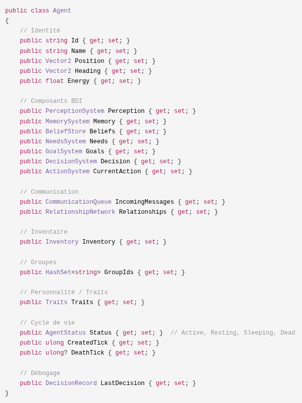

### 3.7.4 Les 8 traits de personnalité (repère [HÉRITÉ])

| Trait | Plage | État neutre | Rôle |
| :---- | :---- | :---- | :---- |
| Bravery (Courage) | 0-2 | 1.0 | Tolérance au risque |
| Curiosity | 0-2 | 1.0 | Pulsion d'exploration |
| Sociability | 0-2 | 1.0 | Préférence pour la socialisation |
| Greed | 0-2 | 1.0 | Concentration sur les ressources |
| Pessimism | 0-2 | 1.0 | Prudence / perception du danger |
| Aggression | 0-2 | 1.0 | Disposition à l'attaque |
| Strength (Force) | 0-2 | 1.0 | Puissance de combat |
| Speed (Vitesse) | 0-2 | 1.0 | Vitesse de déplacement |

Les traits sont initialisés aléatoirement entre 0,5 et 1,5 (gaussienne autour de 1,0) :

Bravery = 0.5 + Random.Shared.NextSingle();  // Plage : 0.5-1.5

Les traits influencent les décisions via le modificateur de personnalité dans la fonction d'utilité.

> **V0.1 (paramétrage conceptuel)** : le jeu de 8 traits fixe ci-dessus est l'implémentation du
> prototype ([HÉRITÉ]). La V0.1 n'impose pas de classes rigides d'entités : les types sont définis
> par des **paramétrages** (variantes « Entité A » / « Entité B » : plages de traits, taux de
> besoins, capacités) plutôt que par des types codés en dur. Les entités d'un même paramétrage
> restent singulières (traits tirés individuellement).

### 3.7.5 Cycle de vie

| État | Description |
| :---- | :---- |
| **Active** | L'entité perçoit, décide, agit normalement |
| **Resting** | L'entité est inactive mais consciente (état transitoire) |
| **Sleeping** | L'entité est inactive et ne perçoit pas le danger |
| **Dead** | L'entité ne perçoit plus, ne décide plus, ne bouge plus |

**Comportement du prototype ([HÉRITÉ])** : l'entité mourait lorsque la santé atteignait 0 ; la mort était irréversible (pas de résurrection en V1/V2) et l'entité morte restait dans le monde comme objet observable, sans interagir. En V0.1, ce comportement est remplacé par la **dissolution complète** (voir la note ci-dessous et §6.2.5).

> **V0.1** : la naissance repose sur la **fusion consentie** (§6.6.2) et la mort sur la **dissolution complète** (§6.2.5) : l'entité cesse d'exister et ne laisse qu'un événement de trace. L'état `Dead` persistant du prototype ([HÉRITÉ]) est remplacé par la suppression de l'entité.

## 3.8 Architecture Cognitive BDI

### 3.8.1 La boucle cognitive V2

La boucle cognitive de chaque entité suit le cycle BDI complet du prototype en 10 étapes :

```
Tick i:  
  1.  PERCEPTION       - Lire les capteurs (entités proches)  
  2.  MÉMOIRE          - Stocker les observations, appliquer la décroissance  
  3.  CROYANCES        - Réviser les croyances avec les nouvelles informations  
  4.  BESOINS          - Calculer les niveaux de besoins actuels  
  5.  OBJECTIFS        - Générer des objectifs à partir des besoins non satisfaits  
  6.  FILTRAGE         - Garder uniquement les objectifs réalisables  
  7.  ÉVALUATION       - Score les actions potentielles  
  8.  DÉLIBÉRATION     - Choisir l'action à utilité maximale  
  9.  EXÉCUTION        - Exécuter l'action (peut s'étendre sur plusieurs ticks)  
  10. SORTIE           - Record de décision, événements
```
### 3.8.2 Les 3 composantes BDI

Dans LIVEX, les trois composantes BDI sont :

1. **Croyances** - Ce que l'entité tient pour vrai sur le monde. Les croyances décrivent des faits : « il y a de la nourriture à (85, 42) », « Bob est un allié », « l'eau est abondante à l'est ». Chaque croyance est associée à une confiance (0-1) et à une source (perception directe, mémoire, communication, inférence).  
     
2. **Désirs/Objectifs** - Ce que l'entité cherche à obtenir. Les objectifs sont générés à partir des besoins non satisfaits : « faim > 60 → cherche nourriture », « soif > 60 → cherche eau ». Chaque objectif a une priorité calculée à partir de l'intensité du besoin, de la probabilité de succès et de l'urgence.  
     
3. **Intentions** - Ce que l'entité s'engage à faire. L'intention est le résultat de la délibération : c'est l'action sélectionnée par la fonction d'utilité, associée à un niveau d'engagement (commitmentLevel) et des conditions d'interruption.


### 3.8.3 Exemple de cycle complet

Voici un exemple réaliste du raisonnement d'une entité « Alice » au tick 5000 :

```
1. PERCEPTION (rayon 50) :  
   - Ressource (Nourriture, pos 60,80, dist 13, conf 0.95)  
   - Entité Bob (pos 40,70, dist 15, conf 0.93)  
   - Obstacle (pos 70,75, dist 20, conf 0.97)

2. MÉMOIRE :

   - Stocke 3 observations  
   - Applique la décroissance à 50 vieux souvenirs  
     (salience du plus ancien ≈ 0.05)

3. CROYANCES :

   - « Nourriture à (60,80) » - confiance 0.95  
   - « Bob à proximité » - confiance 0.93  
   - Révision : « status de Bob » était « repos » → « marche »  
     → confiance 0.8

4. BESOINS :

   - Faim = 75/100, Soif = 82/100, Fatigue = 45/100, Sécurité = 25/100

5-6. OBJECTIFS :

   - Non satisfaits : [Faim(75), Soif(82), Fatigue(45)]  
   - Générés : [Eat, Drink, Rest]  
   - Réalisables : [Eat(oui), Drink(non - pas d'eau connue), Rest(oui)]

7-8. UTILITÉ :

   - Eat Food : (20 - 3 - 1) × 0.95 × 0.9 + 1.82 = 15.5  
   - Rest : (5 - 0 - 0) × 1.0 + 0 = 5.0  
   - Choix : Eat (15.5 > 5.0)

9. EXÉCUTION : Continue MoveTo Food, avance de 3 pas → nouvelle position (53, 76.5)

10. RECORD : Trace de décision enregistrée
```
## 3.9 Système de Perception

### 3.9.1 Rôle

Le système de perception transforme l'état du monde en observations pour l'entité. C'est la première étape de la boucle BDI. L'objectif est de fournir à chaque entité une vue **locale** et **potentiellement inexacte** du monde.

### 3.9.2 Le rayon de perception

Le rayon de perception est configurable par espèce, dans une plage de **20 à 50 unités**. La valeur par défaut en V2 est 30 unités (avec une plage documentée de 20-50 selon les documents).

> **Note de cohérence** : le rayon de perception doit rester supérieur à la vitesse de déplacement par tick pour éviter des « angles morts ». En V1 : WalkSpeed = 0,25 m/s → 15 m/tick < PerceptionRange = 30 m.

### 3.9.3 Structure des observations

```
public class Observation
```
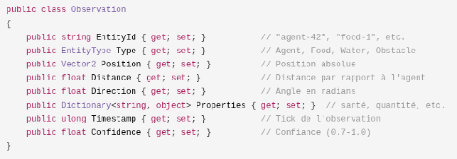

### 3.9.4 Algorithme de perception

```
FUNCTION Perceive(entité, world, tick):  
  observations ← []  
  nearby ← SpatialGrid.QueryRadius(entité.position, sensor_radius)  
  POUR CHAQUE entity DANS nearby:  
    SI Random() > entité.traits.perception_accuracy: CONTINUE  
    distance ← Distance(entité.position, entity.position)  
    confidence ← 1.0 - (distance / sensor_radius) * 0.3  
    confidence ← Clamp(confidence, 0.7, 1.0)   // Confiance min 0.7  
    obs ← Observation(entity_id, entity_type, position, confidence, tick, attributes)  
    observations.Append(obs)  
  RETOURNER observations
```
### 3.9.5 Les attributs perçus

Selon le type d'entité, l'entité perçoit différents attributs :

| Type d'entité | Attributs perçus |
| :---- | :---- |
| Entité | AgentId, Énergie, Statut, Heading |
| Ressource | ResourceType, Quantité, Régénération |
| Obstacle | Position, Taille, Passable |

### 3.9.6 Optimisation : la grille spatiale

La perception naïve est en **O(n²)** : chaque entité compare sa position avec celle de  tous les autres. Pour 1000 entités, cela représente 1 000 000 de comparaison par tick.

La solution est une **grille spatiale uniforme** :

- Cellule de taille configurable (la formule optimale : `cellSize = sqrt(worldArea / (agentCount / 7))`).  
- Chaque entité est indexée dans sa cellule.  
- Pour interroger : vérifier les 9 cellules du voisinage (le centre + 8 voisins).  
- Puis filtrer par distance réelle.

| Échelle | Naïf | Grille spatiale |
| :---- | :---- | :---- |
| 50 entités | 2 500 comparaisons | ~quelques dizaines |
| 500 entités | 250 000 comparaisons | ~quelques centaines |
| 1000 entités | 1 000 000 comparaisons | ~quelques milliers |

La grille est reconstruite intégralement tous les 10 ticks, avec des mises à jour incrémentales entre les reconstructions.

### 3.9.7 Perception étagée (staggered perception)

Pour réduire davantage le coût de perception aux hautes échelles, les entités sont réparties en 4 groupes de rotation (`agentId hash % 4`) : chaque entité perçoit tous les 4 ticks. Cela réduit le travail de perception d'un facteur 4, au prix d'une perception pouvant être obsolète jusqu'à 4 ticks.

## 3.10 Système de Mémoire

### 3.10.1 Rôle

La mémoire stocke les informations passées. Elle ne représente pas le monde tel qu'il est, mais le monde tel que l'entité l'a perçu. Cette distinction est cruciale : un souvenir peut être obsolète, incomplet ou inexact.

### 3.10.2 Structure des entrées mémoire

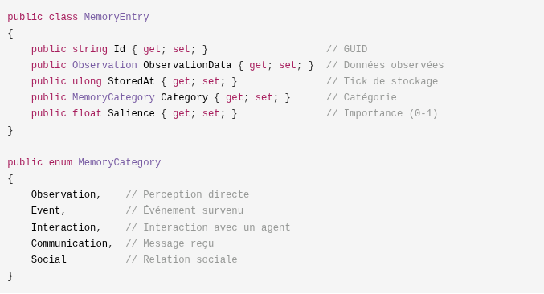

### 3.10.3 La décroissance exponentielle

La mémoire décroît selon une loi exponentielle :

```
salience(t) = salience(0) × exp(-decayRate × (currentTick - storedAt))
```
| Type de souvenir | decayRate | Comportement |
| :---- | :---- | :---- |
| Observation | 0.01 | Oubli lent |
| Événement | 0.005 | Très lent |
| Interaction | 0.002 | Quasi persistant |

Exemple chiffré avec decayRate = 0.05 :

- Tick 0 : salience = 1.0  
- Tick 50 : salience ≈ 0.08  
- Tick 100 : salience ≈ 0.006 (< 0.01 → souvenir « mort »)

### 3.10.4 Seuil d'oubli

Un souvenir « meurt » lorsque sa salience passe sous le seuil de **0.01**. Il peut alors être purgé. La fonction de rappel filtre les entrées :

```
FUNCTION Recall(filter = None):  
  recalled ← []  
  POUR CHAQUE entry DANS memory:  
    SI entry.salience > 0.01 ET (filter == None OU entry.category == filter):  
      recalled.Append(entry)  
  RETOURNER recalled
```
### 3.10.5 Capacité maximale

La mémoire est bornée à **1000 entrées** par entité (valeur configurable en V2). Au-delà, la plus ancienne entrée est supprimée (`Queue.Dequeue()`). Cette limite empêche la croissance mémoire illimitée dans les longues simulations.

### 3.10.6 Lien avec les croyances

La mémoire ne doit pas être confondue avec les croyances :

- **Mémoire** : enregistrement des expériences passées (« j'ai vu de la nourriture à 85,42 au tick 500 »).  
- **Croyance** : interprétation du monde (« il y a probablement de la nourriture à 85,42 »).

Une expérience peut être mémorisée, puis oubliée, contredite par une expérience plus récente, ou réinterprétée. Cette distinction permet d'obtenir des **erreurs persistantes** - une entité peut croire une chose fausse parce que sa mémoire contient une information obsolète qui n'était pas contradictoire.


## 3.11 Système de Croyances

### 3.11.1 Rôle

Le système de croyances (BeliefStore) est l'interface entre les perceptions/mémoires et la prise de décision. Les croyances sont la représentation structurée de ce que l'entité considère comme vrai sur le monde.

### 3.11.2 Structure d'une croyance

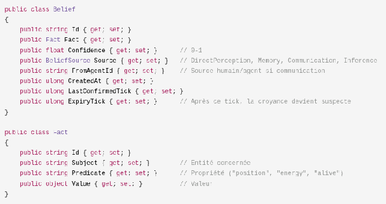

### 3.11.3 Cycle de vie d'une croyance

Tick 100 : L'entité perçoit de la nourriture à (85, 42)

  → Croyance créée : confiance 0.8, source DirectPerception

Tick 101 : L'entité perçoit de nouveau la nourriture au même endroit

  → Croyance confirmée : confiance 0.95 (alignement)

Tick 110 : Plus d'observation nouvelle

  → La confiance commence à décroître (décroissance temporelle)  
  → Confiance : 0.7

Tick 150 : Expiration atteinte (expiry_tick)  
  → La croyance devient "suspecte" : confiance maximale 0.4

### 3.11.4 Révision des croyances

La révision des croyances est un processus continu. Voici les règles d'application :

```
FUNCTION BeliefRevision(existing, new):  
  SI ConflictingBeliefs(existing, new) :  
    existing.confidence ← max(0.1, existing.confidence - 0.1)  
    new.confidence ← max(0.1, new.confidence - 0.1)  
  SINON SI AlignedBeliefs(existing, new) :  
    existing.confidence ← min(1.0, existing.confidence + 0.2)  
  SINON SI DifferentSources(existing, new) :  
    existing.confidence ← (existing.confidence + new.confidence) / 2  
  UPDATE existing.last_updated ← current_tick  
  UPDATE existing.source ← new.source
```
**Exemple de contradiction** :

ANCIENNE : « Pas d'eau à (75, 75) » - confiance 0.9  
NOUVELLE : Observation d'eau à (75, 75) - confiance 1.0  
ACTION   : L'ancienne croyance est supprimée, la nouvelle est confirmée

### 3.11.5 Le seuil de croyance

Une croyance est considérée comme « vraie » pour l'entité si sa confiance est ≥ **0.5**. En dessous de ce seuil, l'entité peut l'ignorer ou la traiter avec prudence.

La prise de décision utilise la confiance dans la fonction d'utilité : une action basée sur une croyance peu fiable sera pénalisée.


## 3.12 Système de Besoins

### 3.12.1 Les 6 besoins

En V2, les entités possèdent 6 besoins (catégories conservées en V0.1) :

| Besoin | Échelle | Seuil de déclenchement | Rôle |
| :---- | :---- | :---- | :---- |
| Faim (Hunger) | 0-100 | 60 | Pousse à chercher de la nourriture |
| Soif (Thirst) | 0-100 | 60 | Pousse à chercher de l'eau |
| Fatigue | 0-100 | 70 | Pousse à se reposer |
| Sécurité | 0-1 | 0.5 | Pousse à fuir le danger |
| Social | 0-1 | 0.7 | Pousse à socialiser |
| Curiosité | 0-1 | 0.3 | Pousse à explorer |

> **V0.1** : les **échelles et seuils** ci-dessus sont des exemples chiffrés du prototype
> ([HÉRITÉ]), non une norme. La V0.1 conserve les 6 catégories ; le dimensionnement exact des
> seuils sera calibré par les décisions ouvertes (notamment décision n°6).

### 3.12.2 Définition anthropomorphique

Les besoins sont définis comme des **tensions** - des pressions comportementales - et non comme des objectifs. Un besoin élevé n'implique pas une action directe ; il alimente la génération d'objectifs et la fonction d'utilité.

### 3.12.3 Mise à jour par tick

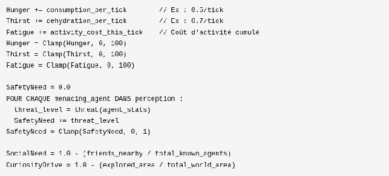


### 3.12.4 Besoins non satisfaits

Le système repère les besoins non satisfaits par rapport à un seuil :

```
FUNCTION GetUnmetNeeds(threshold = 50):  
  needs ← []  
  POUR CHAQUE need DANS Needs :  
    SI need.Level >= threshold:  
      needs.Append(need)  
  RETOURNER needs
```
### 3.12.5 Configuration par espèce

Les taux de consommation sont configurables par espèce (JSON) :

```
{  
  "species": "Human",  
  "consumption_rate": 0.5,  
  "dehydration_rate": 0.3,  
  "base_metabolism": 0.1,  
  "movement_cost": 0.2  
```
}

## 3.13 Système d'Objectifs

### 3.13.1 Génération d'objectifs

Les objectifs sont générés à partir des besoins non satisfaits :

| Condition | Objectif généré |
| :---- | :---- |
| Faim > 60 | SeekerFood(pos from beliefs) |
| Soif > 60 | SeekerWater(pos from beliefs) |
| Fatigue > 70 | Rest() |
| Sécurité > 0.5 | Flee(threat_agent) |
| Social > 0.7 | Socialize(nearby_agents) |
| Curiosité > 0.3 (et pas en combat) | Explore(unknown_regions) |


### 3.13.2 Filtrage de faisabilité

Chaque objectif candidat est examiné pour sa faisabilité :  
- L'entité a-t-elle la capacité nécessaire ?  
- La cible est-elle accessible (dans les croyances) ?  
- Taux de succès estimé > 0 ?  
- La mémoire ne contient-elle pas un échec récent ?  
Si l'une de ces conditions échoue, l'objectif est écarté.

### 3.13.3 Priorisation

goal.priority = need_level × success_probability × urgency_factor  
Les objectifs sont triés par priorité décroissante.

### 3.13.4 Exemple

Une entité « Charlie » :  
Besoins : Faim = 68, Social = 52  
Non satisfaits (seuil 50) : [Faim(68), Social(52)]  
Objectifs : [Eat(priorité 0.8), Interact(priorité 0.7)]  
Réalisables : [Eat(0.8), Interact(0.7)]  
Scoring des actions :  
  MoveTo food :    (18-4-2) × 0.85 × 1.1 + 6 = 17.22  
  Communiquer :    (8-1-1) × 0.7 × 0.8 + 3 = 6.36  
  MoveTo David :   (8-5-1) × 0.9 × 0.8 + 3 = 4.44  
  Rest :           (3-0-0) × 1.0 × 1.0 + 1 = 4.0  
Sélection : MoveTo food (17.22)


## 3.14 Système de Décision (Utility AI)

### 3.14.1 La formule d'utilité

Le système de décision de SYNE utilise une approche par **utilité multi-critères**. La formule centrale est :

utility = (benefit - cost - risk) × confidence × personality_modifier + urgency

Chaque terme est calculé séparément, ce qui rend la décision **transparente et explicable** : on peut toujours expliquer pourquoi une entité a choisi telle action.

### 3.14.2 La structure du calcul

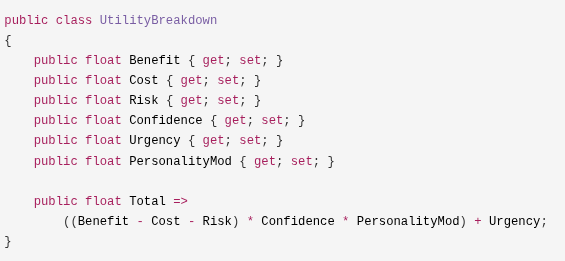

### 3.14.3 Le calcul du bénéfice (Benefit)

Le bénéfice mesure la satisfaction potentielle d'un besoin par l'action :

"Eat"      : benefit = Min(entité.Needs["Hunger"].Level, 30)  
"Drink"    : benefit = Min(entité.Needs["Thirst"].Level, 25)  
"Explore"  : benefit = entité.Needs["Curiosity"].Level × 0.5 + 10  
"Rest"     : benefit = Min(entité.Needs["Fatigue"].Level, 40)  
"Social"   : benefit = entité.Needs["Social"].Level × 0.8  
"Gather"   : benefit = action.Metadata["ResourceAmount"] ?? 10  
default    : benefit = 5

**Bonus d'alignement** : si l'action soutient directement l'objectif courant, le bénéfice est multiplié par **1.2**.


### 3.14.4 Le calcul du coût (Cost)

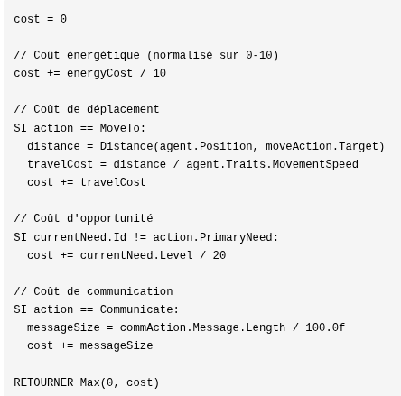

### 3.14.5 Le calcul du risque (Risk)

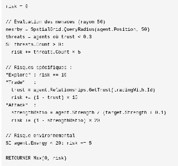

### 3.14.6 Le calcul de la confiance (Confidence)

La confiance mesure la fiabilité de l'information sur laquelle se base l'action :

confidence = 0.5   // Confiance de base

"MoveTo" :  
  targetBeliefs = beliefs où subject == target  
  confidence = Average(targetBeliefs.Confidence)

"Eat" :  
  foodBeliefs = beliefs où predicate == "food_location"  
  SI foodBeliefs.Count > 0: confidence = Average(foodBeliefs.Confidence)  
  SINON: confidence = 0.3

"Trade" :  
  trust = agent.Relationships.GetTrust(tradingWith.Id)  
  confidence = 0.5 + trust × 0.5   // Plage : 0.5-1.0

// Modificateur historique  
SI actionHistory.Count > 0:  
  successRate = count(successful) / count(total)  
  confidence *= (0.5 + successRate × 0.5)

RETOURNER Min(1.0, Max(0.0, confidence))

### 3.14.7 Le calcul de l'urgence (Urgency)

L'urgence mesure la pression temporelle du besoin :

// Courbe sigmoïde (transition douce autour du seuil 50)  
urgency = 1 / (1 + exp(-0.1 × (need.Level - 50)))  
urgency ×= 20   // Mise à l'échelle 0-20  
// Bonus pour objectif ancien  
SI goalAge > 100 ticks: urgency += 5  
// Bonus pour état critique  
SI entité.Energy < 10 OU entité.Needs["Hunger"].Level > 90 :  
  urgency += 10


### 3.14.8 Le modificateur de personnalité (PersonalityMod)

La personnalité module le score d'utilité en fonction des traits de l'entité :

mod = 1.0  
SI action.IsRisky:  mod ×= (0.5 + traits.Bravery)       // 0.5-1.5  
SI action == "Explore": mod ×= (0.5 + traits.Curiosity) // 0.5-1.5  
SI action.IsSocial: mod ×= (0.5 + traits.Sociability)    // 0.5-1.5  
SI action == "Gather": mod ×= (0.5 + traits.Greed)      // 0.5-1.5  
RETOURNER Max(0.1, mod)

### 3.14.9 La sélection de l'action

Toutes les actions possibles pour chaque objectif sont évaluées. L'action à l'utilité maximale est sélectionnée.

**Optimisations** :

- **Cache d'utilité** : si les objectifs n'ont pas changé (`GoalsChanged = false`), les scores ne sont pas recalculés.  
- **Arrêt précoce** : si un score dépasse 0.9, la sélection s'arrête immédiatement.

### 3.14.10 L'hystérésis (anti-oscillation)

Pour éviter qu'une entité ne change d'action à chaque tick, un mécanisme d'hystérésis est appliqué : le passage d'une action courante à une nouvelle action nécessite que la nouvelle action dépasse l'action courante d'au moins `actionSwitchMargin` (par défaut 0.05).

### 3.14.11 Les interruptions

Une action peut être interrompue dans les cas suivants :

- Nouvelle perception rend l'action infaisable  
- Nouveau besoin urgent apparaît (menace de sécurité)  
- L'action échoue (cible inaccessible)  
- L'objectif est atteint

Seuil d'interruption : si le besoin critique dépasse **85**, une action d'utilité supérieure de plus de **10** à l'action courante peut l'interrompre.


### 3.14.12 L'explicabilité : les Decision Records

Chaque décision produit un **DecisionRecord** complet :  
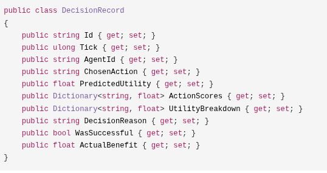

Cela permet de répondre à la question : « Pourquoi cette entité a-t-elle fait ce choix, à ce tick, dans ces circonstances ? » - avec des données chiffrées.


## 3.15 Système d'Actions

### 3.15.1 Rôle

Le système d'actions exécute les intentions sélectionnées par le système de décision. Une action est une séquence d'effets sur le monde, pouvant s'étendre sur plusieurs ticks.

### 3.15.2 La liste des actions (V2)

| Action | Description |
| :---- | :---- |
| **MoveTo** | Se déplacer vers un point cible |
| **Eat** | Consommer une ressource alimentaire |
| **Drink** | Consommer de l'eau |
| **Rest** | Se reposer (récupération d'énergie) |
| **Explore** | Explorer une zone inconnue |
| **Gather** | Collecter une ressource |
| **Observe** | Observer attentivement une entité |
| **Wait** | Attendre (faible coût) |
| **Think** | Délibérer / réévaluer les objectifs |
| **CommunicateTo** | Envoyer un message |
| **Trade** | Proposer un échange de ressources |

### 3.15.3 Cycle de vie d'une action

1. Démarrer l'action (status = Executing)

2. Chaque tick : mettre à jour le progrès, appliquer les effets

3. Terminer (Completed) ou échouer (Failed) ou être annulée (Cancelled)

4. Générer les événements

5. Mettre à jour les croyances/mémoire selon le résultat


### 3.15.4 Effets des actions (V1)

Les effets chiffrés des actions V1 sont documentés dans la spécification :

| Action | Effet | Valeur |
| :---- | :---- | :---- |
| Eat | Faim | -35 |
| Drink | Soif | -50 |
| Rest | Énergie | +0.50 / tick |
| Gather | Ressource | +1 par batch |
| Talk | Lien social | +0.10 (asymptotique) |
| Attack | Santé cible | -5 × Agressivité / tick |

### 3.15.5 Les actions multi-ticks

Les actions de déplacement sont multi-ticks. Un déplacement de 30 unités à 1 unité/tick dure 30 ticks. Pendant ce temps, l'entité n'est pas re-décidé à chaque tick - la décision a été prise au démarrage, l'exécution est continue.

### 3.15.6 La gestion des interruptions

Une action peut être interrompue pour plusieurs raisons :

1. **Nouveau besoin critique** (par exemple, un danger imminent).  
2. **Invalidation de la cible** (la cible a disparu ou a bougé).  
3. **Échec de précondition** (la ressource est épuisée).  
4. **Remplacement par une décision meilleure** (via l'hystérésis).

Interruption ≠ échec : l'action interrompue devient `Cancelled`, pas `Failed`.


## 3.16 Système de Communication

### 3.16.1 Rôle (V0.1)

Dans le monde fermé et continu de LIVEX, la communication **n'est pas abstraite** : les entités échangent par des **pulsations lumineuses publiques**. Une entité qui émet une pulsation produit un signal physique visible par **toute entité en ligne de vue** — elle n'adresse pas de destinataire privilégié.

Deux propriétés découlent de ce choix (V0.1) :

- **Publicité** : le signal est visible de quiconque le perçoit. La possibilité d'une **interception** (une entité interprétant des pulsations qui ne lui étaient pas destinées) découle logiquement de cette publicité, mais elle reste **[OUVERTE]** (décision n°8) : elle ne doit pas devenir une règle implicite du moteur avant d'être tranchée.  
- **Obstruction** : un **mur ou un obstacle bloque** la pulsation — pas de propagation à travers la matière.

La portée effective est délimitée par la **ligne de vue** et la **distance** (pas de transmission à travers les obstacles). Les coûts de production d'une pulsation (énergie, temps) restent **ouverts** (décision n°9). Les mécanismes de dégradation (confiance, rumeur, incompréhension) s'appliquent toujours à l'interprétation du signal.

> **Héritage du prototype** : le prototype V1/V2 implémentait une **messagerie dirigée par adresses** (messages `Information`, `Request`, `Response`, ... adressés à des entités dans un rayon). La V0.1 généralise ce modèle en **signal public observable** ; la messagerie dirigée reste une optimisation permise (codage des pulsations), non une obligation.

### 3.16.2 La structure d'une pulsation lumineuse

Une pulsation est un signal lumineux composé de **symboles** (cadence, couleur, modulation). Le sens véhiculé (information, demande, alerte, offre...) est décodé par l'entité qui la reçoit, selon son répertoire de symboles et sa confiance dans l'émettrice.

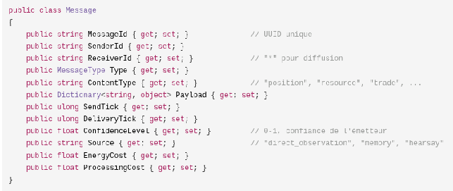

> L'image ci-dessus illustre la **structure d'un message du prototype**. En V0.1, le message structuré devient le contenu *sémantique* d'une pulsation ; le support physique est la pulsation lumineuse.

### 3.16.3 Les types de messages (protocole du prototype — [HÉRITÉ])

Les pulsations peuvent porter les significations suivantes, héritées du protocole de messagerie du prototype :

| Type | Description | Exemple |
| :---- | :---- | :---- |
| **Information** | Partage d'information | « Je vois de la nourriture à (100, 50) » |
| **Request** | Demande d'aide | « Peux-tu m'aider à chasser ? » |
| **Response** | Réponse à une demande | « Oui » / « Non » |
| **Announcement** | Annonce de groupe | « Formation de groupe - rejoignez-nous ! » |
| **Warning** | Avertissement de danger | « Danger à l'est ! » |
| **Trading** | Proposition d'échange | « Offre 5 nourriture contre 3 eau » |
| **Acknowledgement** | Accusé de réception | « Message reçu » |

### 3.16.4 La portée : ligne de vue et distance

La portée effective d'une pulsation est **physique** : elle est reçue si le récepteur est **en ligne de vue** de l'émettrice (segment du trajet non coupé par un obstacle) et si la distance est inférieure à la portée de visibilité. Dans le prototype, la valeur par défaut du rayon de communication était 20 unités (avec des variantes à 50) ; cette valeur doit être **centralisée dans une source unique** pour la V0.1.

### 3.16.5 L'algorithme de diffusion

```
FUNCTION EmitPulse(pulse):  
  sender = world.GetAgent(pulse.SenderId)  
  POUR CHAQUE agent DANS world.agents:  
    SI EstEnLigneDeVue(sender.position, agent.position)  
       ET Distance(sender.position, agent.position) <= visibilityRange  
       ET agent.id != sender.id:  
      agent.receivePulse(pulse)  
      agent.energy -= pulse.ProcessingCost   // coût de traitement (prototype)
```
Le test de **ligne de vue** (tir de rayon contre les obstacles) est requis ; le prototype à rayon simple (sans obstacles) ne l'effectuait pas.

### 3.16.6 La dégradation de l'information

Chaque retransmission d'un message dégrade sa confiance de **10% par saut** :

confiance_transmise = confiance_originale × 0.9^(nombre de sauts)

Exemple :

- Tick 100 : A voit de la nourriture → confiance A = 1.0  
- Tick 101 : A le dit à B → confiance B = 0.9  
- Tick 102 : B le dit à C → confiance C = 0.81 ≈ 0.8  
- Tick 103 : C le dit à D → confiance D = 0.7  
- Tick 104 : D le dit à E → confiance E = 0.6

### 3.16.7 Le risque d'incompréhension

Chaque transmission a une probabilité de **5%** de produire une incompréhension :

Action d'incompréhension :  
  belief.Position += Vector2(Random(-5, 5), Random(-5, 5))  
  belief.Confidence *= 0.7  
  belief.Source = "misunderstood_communication"


### 3.16.8 L'intégration des croyances

À la réception, la confiance perçue est ajustée par la **confiance dans l'émetteur** :

senderTrust = entité.Relationships[senderId].TrustLevel  
adjustedConfidence = message.ConfidenceLevel × senderTrust  
entité.beliefs.Add(fact, confidence = adjustedConfidence,  
                  source = Communication, fromAgent = senderId)  
La croyance reçue expire après 100 ticks (expiryTick = deliveryTick + 100).

### 3.16.9 Les coûts de communication ([OUVERT])

La V0.1 ne fige pas les coûts de production d'une pulsation (décision n°9). À titre de référence, le prototype appliquait des coûts d'envoi/réception de messages :

Coût d'envoi : 0.5 + (payloadCount × 0.1) × broadcastMultiplier  
  broadcastMultiplier = 1.5 pour "*" (diffusion), 1.0 pour direct  
Coût de réception : 0.2 + (payloadCount × 0.05)

### 3.16.10 Les limites de bande passante ([HÉRITÉ])

Le prototype limitait le trafic entrant/sortant (5 envois, 3 traitements par entité et par tick). Pour la V0.1, la régulation du flux (nombre de pulsations émises, saturation de la perception, coût d'attention) reste à définir.

### 3.16.11 La latence ([HÉRITÉ])

Dans la messagerie du prototype, la livraison d'un message dépendait de la distance : `deliveryLatency = Ceil(distance / 10)`. À l'échelle du monde V0.1, une pulsation lumineuse se propage quasi instantanément : **la latence n'est plus une contrainte physique** ; le facteur dominant de dégradation reste la confiance et la ré-interprétation.

### 3.16.12 La gestion de la confiance

La confiance envers une entité évolue selon la véracité de ses messages :

SI information vérifiée correcte : TrustLevel += 0.1  
SI information fausse/induite   : TrustLevel -= 0.15   // Pénalité pour mensonge  
TrustLevel = Clamp(TrustLevel, 0, 1)  
// Décroissance en l'absence d'interaction  
elapsedTicks = currentTick - lastInteractionTick  
trust *= exp(-0.001 × elapsedTicks)


## 3.17 Système de Groupes

### 3.17.1 Rôle

Le système de groupes permet aux entités de former des coalitions autour d'objectifs communs. Les groupes sont le premier niveau de structure sociale émergente de LIVEX.

### 3.17.2 Structure d'un groupe

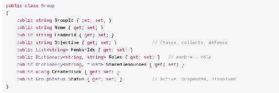

### 3.17.3 Le protocole d'admission

L'entité A crée un groupe : leader = A, membres = [A]  
L'entité B envoie « Puis-je rejoindre ? » à A  
A évalue : confiance en B ? besoin des compétences de B ?  
A accepte : groupe.members.Add(B), B.groupId = groupe.id

### 3.17.4 Le départ et le changement de leader

Si le leader quitte le groupe (ou meurt), un nouveau leader est désigné : celui avec les meilleures compétences ou la meilleure confiance du groupe.

### 3.17.5 Les décisions collectives (vote)

Les groupes peuvent prendre des décisions collectives par vote démocratique :

goals = GenerateGoalsForGroup()  
```
POUR CHAQUE goal DANS goals:  
  POUR CHAQUE member DANS members:  
    member_score = member.EvaluateUtility(goal)  
  average_score = scores.Average()  
bestGoal = goals.MaxBy(g => AverageScore(g))  
POUR CHAQUE member: member.AddGoal(bestGoal)
```
### 3.17.6 Les conditions de dissolution

- Objectif atteint  
- Trop peu de membres (< 2)  
- Le leader meurt (et aucun successeur disponible)  
- Épuisement des ressources

## 3.18 Les Livres (Savoirs tangibles) [V0.1]

Dans la V0.1, la transmission **durable** du savoir passe par des **livres** : des objets
physiques du monde (et non des inscriptions abstraites). Un livre est rédigé, transporté,
gardé, consulté ou volé comme n'importe quel objet de l'environnement. Cette matérialité
crée des tensions concrètes (concurrence pour le savoir, vols, monopoles, conflits) qui
n'existent pas dans une communication éphémère.

### 3.18.1 La définition d'un livre

| Propriété | Description (V0.1) |
| :---- | :---- |
| **Support physique** | Le livre occupe un emplacement du monde ; il peut être transporté, déplacé, détruit. |
| **Contenu** | Un savoir matérialisé (connaissances pratiques, mémoires, récits, croyances). |
| **Consultation** | Une entité doit être à proximité et consacrer du temps pour le lire. |
| **Rareté** | Un livre n'existe qu'en un (ou très peu d') exemplaire(s) → valeur et conflit. |

### 3.18.2 Les types de livres

Le livre peut porter différents types de savoir : savoirs pratiques (ressources, techniques),
mémoires (événements passés), récits et histoires, croyances et rites. La catégorisation fine
des types de livres et de leurs dégradations reste **[OUVERT]**. Les catégories du
prototype (savoirs pratiques, mémoires, récits) sont conservées comme repères [HÉRITÉ].

### 3.18.3 Les rôles autour du livre

- **Auteur** : l'entité qui rédige un livre, matérialisant une partie de ses connaissances à un instant T. La rédaction a un coût (énergie, temps) — modèle **[OUVERT]** (décision n°18).  
- **Gardien** : l'entité (ou le groupe) qui détient et protège un livre. Garder un livre est une fonction sociale (prestige, pouvoir de transmission, rôle de bibliothèque).  
- **Voleur** : l'entité qui subtilise un livre. Le vol est une alternative à l'écriture et à la coopération, au prix de la confiance et des représailles.  
- **Lecteur consultant** : toute entité peut consulter un livre auquel elle a accès ; la lecture a elle aussi un coût et un bénéfice (décision n°19).

### 3.18.4 Le cycle de vie d'un livre

`Écriture (Auteur)` → `Détention / garde (Gardien)` → `Consultation (Lecteur)` → `Vol / échange (Voleur)` → `Destruction ou altération`

Chaque étape produit un événement observable (SYNE) : `BookWritten`, `BookRead`, `BookStolen`,
`BookDestroyed` — alimentant les métriques d'ECHOS (diffusion culturelle, inégalités d'accès au savoir).

### 3.18.5 Coûts et bénéfices ([OUVERT])

La modélisation fine des coûts (rédaction, transport, conservation) et des bénéfices (transmission
fiable, accumulate culturelle, prestige) est laissée ouverte : **décisions n°18 et n°19** de la V0.1.

### 3.18.6 Effets attendus sur l'émergence

Les livres agissent comme **réceptacles matérialisés de la mémoire collective** : ils permettent une
accumulation culturelle qui survit aux individus (contrairement aux croyances éphémères, §6.7), tout en créant
des inégalités — qui détient le savoir ? — et des enjeux de protection, de vol et de territoire. Ils
complètent la communication éphémère (§3.16) par un canal **asynchrone et persistant**.

## 3.19 Système de Relations

### 3.19.1 Rôle

Le système de relations gère les liens sociaux entre entités : confiance, familiarité, histoire d'interaction.

### 3.19.2 Structure d'une relation

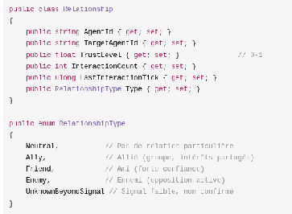

### 3.19.3 L'évolution de la confiance

// Interaction positive  
trust += 0.1  
trust = Min(1.0, trust)  
// Interaction négative  
trust -= 0.15  
trust = Max(0.0, trust)  
// Décroissance si pas d'interaction  
elapsedTicks = currentTick - lastInteractionTick  
trust *= exp(-0.001 × elapsedTicks)

### 3.19.4 L'impact sur les décisions

La confiance influence :

- **L'acceptation des messages** : un message d'une entité de confiance ≤ 0.3 est ignoré ou fortement dévalué.  
- **L'évaluation du risque** : commercer avec une entité de faible confiance augmente le risque.  
- **La formation de groupes** : on ne rejoint un groupe que si le leader est assez fiable.  
- **La détection de menaces** : une entité avec `trust < 0.3` dans le rayon de perception est une menace potentielle.


## 3.20 Système de Ressources

### 3.20.1 Les types de ressources

En V2, quatre types de ressources sont prévus :

| Type | Description | Exemple d'utilisation |
| :---- | :---- | :---- |
| Food | Nourriture | Consommée pour réduire la faim |
| Water | Eau | Consommée pour réduire la soif |
| Wood | Bois | Collectée pour construction/échange |
| Mineral | Minéral | Collectée pour outils/échange |

### 3.20.2 Les cycles énergétiques (V0.1)

Le monde V0.1 n'est pas un « garde-manger » statique : **l'énergie circule**. Les ressources
servent de supports à des cycles (absorption, transformation, régénération, perte) qui relient
l'environnement aux besoins des entités :

- **Abondance** : surplus de ressources → énergie disponible, croissance de l'activité.
- **Pauvreté** : pénurie → compétition, migrations, conflits, stagnation.

Le modèle complet de conversion (biomasse → énergie, rendements, pertes, résidus) est
**[OUVERT]** (**décisions n°3-5** de la V0.1). Les types de ressources du prototype
(Food, Water, Wood, Mineral) sont conservés comme supports **[HÉRITÉ]** de ces cycles.

### 3.20.3 Structure d'une ressource

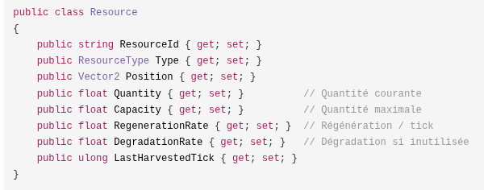

### 3.20.4 La logique de mise à jour

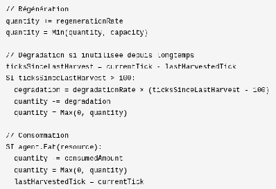

### 3.20.5 La durabilité

Une ressource est durable si :  
regenerationRate >= average_consumption_rate  
L'analyse de durabilité est l'une des métriques fournies par ECHOS.

## 3.21 Système d'Environnement

### 3.21.1 Les événements mondiaux

En V2, le système d'environnement introduit des événements à l'échelle du monde qui affectent les entités et les ressources dans un rayon donné :

| Type d'événement | Effet |
| :---- | :---- |
| **Drought** (sécheresse) | Diminution des ressources en eau |
| **Abundance** (abondance) | Bonus de ressources |
| **Epidemic** (épidémie) | Baisse de la santé des entités |
| **Earthquake** (séisme) | Disruption des ressources |
| **SeasonChange** (changement de saison) | Modification des paramètres |
| **DayNightCycle** (cycle jour/nuit) | Affecte la perception et l'activité |

### 3.21.2 Structure d'un événement

```
public class EnvironmentEvent
```
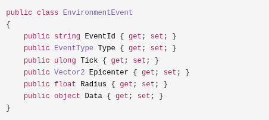

### 3.21.3 Application des effets

```
OnEventOccurs(event):

  POUR CHAQUE agent DANS event.radius: agent.HandleEvent(event)

  POUR CHAQUE resource DANS event.radius: resource.HandleEvent(event)
```
### 3.21.4 Interactions avec les besoins

Les événements environnementaux modifient les paramètres du monde, ce qui affecte indirectement les besoins des entités. Un hiver rigoureux peut augmenter le taux de consommation d'énergie, une sécheresse réduit la disponibilité de l'eau - les entités doivent s'adapter.


## 3.22 Obstacles Statiques

### 3.22.1 Le modèle d'obstacle

En V2, les obstacles sont des entités statiques :

| Propriété | Type | Description |
| :---- | :---- | :---- |
| Id | string | Identifiant unique |
| Position | Vector2 | Centre de l'obstacle |
| Size | Vector2 | Largeur, hauteur |
| Shape | ObstacleShape | Rectangle, Cercle, Polygone, Custom |
| IsWall | bool | Si true, bloque complètement (incluant la ligne de vue) |
| Passability | float (0-1) | Facilité de traversée |
| CreatedTick | ulong | Tick de création |

### 3.22.2 La détection de collision

La collision utilise un test AABB (Axis-Aligned Bounding Box) :

SI |obstacle.Position.x - pos.x| < (obstacle.Size.x / 2 + entité.radius)

  ET |obstacle.Position.y - pos.y| < (obstacle.Size.y / 2 + entité.radius):

  → Collision

### 3.22.3 Le pathfinding

Le **pathfinding** est un sous-système de **SYNE** (module de navigation, §2.9.2) : il calcule un chemin sur le plan 2D autour des obstacles sans dépendre d'un moteur graphique. L'appui sur la navigation du moteur repère (`Navigation2D.GetSimplePath`) relève du prototype ([HÉRITÉ]) ; en V0.1, SYNE assure lui-même le calcul. Un cache de chemins évite le recalcul inutile :

Cache key : "{from}->{to}"

Expiration : 50 ticks

### 3.22.4 Le blocage de ligne de vue

En V2, un obstacle de type `IsWall = true` bloque la perception : un segment de ligne entre l'observateur et la cible est testé contre tous les murs. Les observations bloquées sont écartées.

### 3.22.5 Métriques d'obstacles

| Métrique | Description |
| :---- | :---- |
| TotalObstacles | Nombre d'obstacles |
| AveragePathLength | Longueur moyenne des chemins |
| NavigationDifficulty | Ratio `actualPath / directPath` (1.0 = pas d'impact) |
| PathReplanCount | Fréquence de replanification |


## 3.23 Persistance

### 3.23.1 Vue d'ensemble

SYNE utilise **SQLite** pour la persistance (V2). Le choix de SQLite repose sur :

- **ACID** - Transactions atomiques, garantie d'intégrité.  
- **Performances** - Requêtes indexées O(log n), cruciales pour 1000+ entités.  
- **Portabilité** - Un fichier .db unique, aucun service externe.  
- **Évolution** - Gestion des versions de schéma intégrée.

### 3.23.2 Les tables principales

Le schéma v2.0 comprend 11 tables principales :

| Table | Rôle |
| :---- | :---- |
| `simulation_state` | État global (tick, seed, temps, saison) |
| `agents` | État des entités |
| `agent_beliefs` | Croyances des entités |
| `agent_memories` | Souvenirs des entités |
| `agent_relationships` | Relations entre entités |
| `groups` | Groupes |
| `group_memberships` | Appartenances aux groupes |
| `resources` | Ressources |
| `obstacles` | Obstacles |
| `events_log` | Journal des événements |
| `communication_log` | Journal des communications |

Plus les tables de configuration : `species`, `resource_types`, `obstacle_types`, `prng_state`, `schema_version`.

*(Le DDL complet est fourni en Annexe G.)*


### 3.23.3 La procédure de sauvegarde (atomique)

1. BeginTransaction  
2. SaveSimulationState (INSERT OR REPLACE)  
3. SaveAgents (INSERT OR REPLACE par entité)  
4. SaveAgentInternal (croyances, souvenirs, relations)  
5. SaveGroups  
6. SaveResources  
7. SaveObstacles  
8. SaveEventsLog (les 1000 derniers événements)  
9. Commit (ou Rollback en cas d'exception)

### 3.23.4 La procédure de chargement

1. Charger simulation_state → seed, tick  
2. Construire World(seed, tick)  
3. Charger les entités  
4. Par entité : croyances, souvenirs, relations  
5. Charger les groupes  
6. Charger les ressources, obstacles  
7. Vérifier l'intégrité  
8. Reprendre au tick suivant

### 3.23.5 La garantie bit-à-bit

Le test de déterminisme de la persistance :  
// Run 100 ticks → Snapshot → Save → Load → Run 50 ticks → state150_continue  
// Fresh run from same snapshot → Run 50 ticks → state150_fresh  
// Assert: state150_continue == state150_fresh  
Cette garantie repose sur :

1. La sérialisation de l'état complet du PRNG (`prng_state` : 4 × BIGINT).  
2. L'ordre causal strict de la boucle de simulation.  
3. Des opérations flottantes déterministes.

### 3.23.6 La gestion des versions

```sql
CREATE TABLE schema_version (  
    version INTEGER PRIMARY KEY,  
    applied_at DATETIME DEFAULT CURRENT_TIMESTAMP  
```
);  
La stratégie de migration est séquentielle : v1 = Initial, v2 = Ajout des groupes, v3+ = évolution.  
La version du schéma évolue **indépendamment** de la version de l'application (SemVer).

### 3.23.7 L'optimisation de la base

REINDEX;    -- Reconstruit les index  
ANALYZE;    -- Optimise le plan de requête  
VACUUM;     -- Compacte la base

Les insertions en masse utilisent **une seule transaction** pour réduire les allers-retours de 1000 à 1.

## 3.24 Événements et Traçabilité

### 3.24.1 La distinction état / événement

- **État** : ce qui est vrai actuellement (position, santé, quantité de ressources).  
- **Événement** : ce qui s'est produit (une décision, une action terminée, une mort).

Les événements sont fondamentaux pour l'observation : ils permettent de reconstruire l'historique et de comprendre les chaînes causales.

### 3.24.2 Les types d'événements (V1)

| Catégorie | Événements |
| :---- | :---- |
| Simulation | SimulationStarted, SimulationPaused, SimulationResumed, TickCompleted |
| Entité | EntityCreated, EntityMoved, EntityDied |
| Physiologie | NeedChanged |
| Perception | PerceptionUpdated |
| Décision | DecisionMade |
| Action | ActionStarted, ActionCompleted, ActionCancelled, ActionFailed |
| Ressource | ResourceCreated, ResourceChanged, ResourceDepleted |

### 3.24.3 Les types d'événements (V2 - étendus)

| Catégorie | Événements |
| :---- | :---- |
| Cognitive | PerceptionEvent, DecisionEvent, BeliefEvent |
| Action | ActionEvent (Started/Updated/Completed/Failed) |
| Social | CommunicationEvent, GroupEvent (Formed/MemberJoined/MemberLeft/Dissolved) |
| Monde | ResourceEvent, EnvironmentEvent |


### 3.24.4 Le EventBus (ring buffer)

Le bus d'événements de SYNE utilise un **ring buffer** de capacité fixe (500 000 événements en V1 optimisé). Au-delà de la limite, les événements les plus anciens sont écrasés. Le bus supporte le drainage incrémental (`DrainSince(ref token, batch)`) pour une distribution efficace aux clients.

### 3.24.5 Le DecisionRecord

Chaque décision produit un DecisionRecord complet, incluant :

- Le tick et l'ID de l'entité.  
- Le contexte (niveaux de besoins, croyances utilisées, objectifs actifs).  
- Les scores (utilité de chaque action candidate).  
- L'action sélectionnée et la raison.

Cela permet d'expliquer chaque décision et de reconstruire le raisonnement.

### 3.24.6 La politique d'émission

En mode benchmark, les événements verbeux (décisions, actions) peuvent être désactivés pour maximiser les performances. En mode observé, tous les événements sont émis.


## 3.25 Déterminisme

### 3.25.1 Pourquoi le déterminisme ?

Le déterminisme est une condition essentielle pour la scientificité du projet :

- Sans reproductibilité, il est impossible de distinguer un effet d'une règle d'un artefact du hasard.  
- Sans reproductibilité, la comparaison de runs avec des paramètres différents perd son sens.  
- Sans reproductibilité, ECHOS ne peut pas établir de conclusions fiables.

### 3.25.2 Les mécanismes garantissant le déterminisme

1. **PRNG unique et sérialisable** - xoshiro256**, seed via splitmix64, état complet sérialisé dans la sauvegarde.  
2. **Ordre causal strict** - la boucle de simulation exécute les systèmes dans un ordre documenté et stable.  
3. **Grille spatiale déterministe** - les candidats de la grille sont triés par index original pour produire un résultat bit-identique à la version naive O(n²).  
4. **Aucun parallélisme non contrôlé** - les parallélisations (perception) sont en lecture seule sur les structures partagées, avec écritures disjointes par entité.  
5. **Calculs flottants cohérents** - pas de réordonnancement des opérations flottantes qui changerait les arrondis.

### 3.25.3 Le test de reproductibilité

Configuration : même seed, même config.json, même version de moteur

Résultat attendu : événements et états identiques après N ticks

Vérification : série des états comparés bit-à-bit à chaque tick

### 3.25.4 Les limites du déterminisme

Le déterminisme n'est pas une fin en soi, mais un outil. Il ne garantit pas que les phénomènes émergents sont reproductibles statistiquement - seulement qu'une exécution donnée peut être exactement reproduite. Deux seeds différentes peuvent produire des trajectoires très différentes (sensibilité aux conditions initiales, comportement chaotique).


## 3.26 Choix Technologiques

> **V0.1** : le présent chapitre documente les choix du prototype (C#/.NET, SQLite, WebSocket) et
> leurs ADR. Pour la V0.1 ils constituent des **repères et non des contraintes** : la question de
> la plateforme finale reste ouverte, les pistes ci-dessous étant évaluées sans engagement
> ([HÉRITÉ]).

### 3.26.1 Pourquoi C# / .NET Core ?

| Critère | Évaluation |
| :---- | :---- |
| Productivité | Excellente (typage fort, outils modernes) |
| Performance | Très bonne (proche de C++ pour de nombreux workloads) |
| Écosystème | Riche (WebSocket, SQLite, xUnit, etc.) |
| Indépendance du rendu | Complète (pas de dépendance graphique) |
| Tests | Exceptionnels (xUnit, couverture intégrée) |
| Déterminisme | Contrôlable (pas de GC non déterministe au niveau des calculs critiques) |

**Pistes évaluées** :

- **Python** : excellent pour l'analyse, mais trop lent pour la boucle de simulation massive.  
- **TypeScript/Node.js** : productif pour les services réseaux, mais moins performant pour le calcul pur.  
- **Rust** : performance et concurrence excellentes, mais courbe d'apprentissage élevée.  
- **C++** : performance excellente, mais complexité élevée et productivité réduite.

> Ces alternatives sont des **pistes** ([HÉRITÉ]) : la V0.1 tranchera par une ADR
> (decisions n°1-30, §9.6.4).

### 3.26.2 Pourquoi SQLite ?

| Critère | Évaluation |
| :---- | :---- |
| Transactions ACID | Oui |
| Requêtes indexées | Oui (O(log n)) |
| Portabilité | Un fichier .db unique |
| Services externes | Aucun nécessaire |
| Versionnement de schéma | Intégré (PRAGMA user_version, table dédiée) |

**Alternatives évaluées** :

- **JSON (V1)** : simple et lisible, mais O(n) pour les requêtes, lent pour de gros volumes.  
- **MongoDB** : flexible, mais nécessite un service externe.

### 3.26.3 Pourquoi WebSocket ?

| Critère | Évaluation |
| :---- | :---- |
| Universalité | Natif dans les navigateurs et .NET |
| Bidirectionnel | Simulation → clients et clients → contrôle |
| Faible latence | Adapté au temps réel |
| Compatibilité | Godot, .NET, Python, TypeScript supportent WebSocket |

**Alternatives évaluées** : gRPC (excellent mais plus lourd), IPC (mais limité au machine local).


### 3.26.4 Les ADR (Architecture Decision Records)

Les décisions architecturales sont documentées dans des ADR formels (contexte, décision, alternatives, conséquences, statut) :

| ADR | Décision | Statut |
| :---- | :---- | :---- |
| ADR-001 | Séparation Simulation / Présentation | Accepté |
| ADR-002 | C#/.NET pour le moteur | Accepté |
| ADR-003 | SQLite vs JSON (V2) | Accepté |
| ADR-004 | BDI + utilité vs Behaviour Trees | Accepté |
| ADR-005 | Observabilité partielle comme fonctionnalité de premier plan | Accepté |
| ADR-006 | Communication locale avec relais | Accepté |
| ADR-007 | Traits de personnalité vs fichiers config | Accepté |
| ADR-008 | Grille spatiale vs quadtree | Accepté (Phase 9) |
| ADR-009 | Métriques d'émergence vs KPI custom | Accepté |
| ADR-010 | Déterminisme persistance via état PRNG | Accepté |
| ADR-011 | Événements structurés + SQLite | Accepté |

*(Le détail des ADR est fourni en Annexe F.)*

## 3.27 Paramètres et Configuration

### 3.27.1 Principe de séparation

LIVEX sépare strictement :

- **config.json** : décrit comment le monde fonctionne (paramètres).  
- **save.json / world.db** : décrit ce qui s'est produit dans le monde (état).

Cette séparation est essentielle : la configuration est reproductible, l'état est évolutif.

### 3.27.2 Les groupes de paramètres (V1)

| Groupe | Paramètre | Valeur par défaut | Unité |
| :---- | :---- | :---- | :---- |
| World | width | 500 | m |
| World | height | 500 | m |
| Population | initialAgents | 20 | entités |
| Population | initialFoodSources | 10 | sources |
| Population | initialWaterSources | 5 | sources |
| Simulation | simulatedMinutesPerTick | 1 | min |
| Simulation | targetTicksPerSecond | 10 | tick/s |
| Simulation | seed | configurable | - |
| Entité | initialHealth | 100 | - |
| Entité | initialEnergy | 80 | - |
| Entité | initialHunger | 20 | - |
| Entité | initialThirst | 20 | - |
| Entité | perceptionRange | 30 | m |
| Entité | interactionRange | 2 | m |
| Entité | walkSpeed | 0.25 | m/s |
| Entité | dangerRange | 30 | m |
| Physiologie | hungerIncreasePerTick | +0.10 | /tick |
| Physiologie | thirstIncreasePerTick | +0.15 | /tick |
| Physiologie | energyDecreasePerTick | -0.05 | /tick |
| Physiologie | restEnergyGainPerTick | +0.50 | /tick |
| Physiologie | eatHungerReduction | -35 | - |
| Physiologie | drinkThirstReduction | -50 | - |
| Dégradation | hungerDamageThreshold | 90 | - |
| Dégradation | hungerDamagePerTick | 0.10 | /tick |
| Dégradation | thirstDamageThreshold | 90 | - |
| Dégradation | thirstDamagePerTick | 0.20 | /tick |
| Dégradation | exhaustionThreshold | 5 | - |
| Dégradation | exhaustionDamagePerTick | 0.02 | /tick |
| Ressources | foodInitialQuantity | 100 | - |
| Ressources | foodMaxQuantity | 100 | - |
| Ressources | foodRegenerationRate | 0 | - |
| Ressources | waterInfinite | true | - |
| Décision | decisionIntervalTicks | 1 | tick |
| Décision | actionSwitchMargin | 0.05 | - |
| Décision | dangerRange | 30 | m |
| Décision | attackBase | 5 | santé/tick |
| Décision | talkGain | 0.10 | - |
| Mémoire | confidenceDecayPerTick | 0.01 | /tick |


### 3.27.3 Les groupes de paramètres (V2)

En V2, la configuration est étendue avec les sous-systèmes BDI :

| Groupe | Paramètre | Valeur par défaut |
| :---- | :---- | :---- |
| Perception | sensorRadius | 20-50 (configurable) |
| Perception | accuracy | 1.0 (0-1) |
| Mémoire | maxMemorySize | 1000 |
| Mémoire | decayRate | 0.05 (exemple) |
| Croyances | minConfidence | 0.5 |
| Croyances | conflictPenalty | 0.1 |
| Croyances | alignmentBonus | 0.2 |
| Besoins | consumptionRate | 0.5 |
| Besoins | dehydrationRate | 0.7 |
| Objectifs | goalPriorityFormula | need × success × urgency |
| Utilité | interruptionThreshold | 10 |
| Utilité | criticalNeedLevel | 85 |
| Communication | radiusMeters | 20 |
| Communication | degradationPerHop | 0.1 |
| Communication | maxMessagesPerTick | 5 |
| Communication | processingLimit | 3 |
| Communication | misunderstandingChance | 0.05 |
| Groupes | minGroupSize | 2 |
| Ressources | regenerationWindow | 100 ticks |
| Persistance | autoSaveEveryNTicks | 1000 |
| Persistance | maxBackups | 5 |

*(L'annexe H fournit le tableau exhaustif complet.)*


### 3.27.4 La philosophie de réglage

Les paramètres doivent être :

- **Compréhensibles** : chaque paramètre a un rôle documenté et justifié.  
- **Observables** : chaque paramètre influence des métriques mesurables.  
- **Producteurs d'événements** : les modifications produisent des effets traçables.  
- **Faciles à modifier** : un fichier de configuration JSON, versionné.  
- **Reproductibles** : la même configuration produit le même monde.


## 3.28 Ce que SYNE ne doit pas faire

La liste des interdictions est aussi importante que la liste des responsabilités. SYNE ne doit jamais :

1. **Rendre directement la scène graphique** - le rendu est la fonction de PRISM.  
2. **Dépendre d'Unreal Engine, Unity ou d'un autre moteur de rendu** - SYNE fonctionne headless.  
3. **Décider des résultats à partir de ce qu'ECHOS souhaiterait observer** - ECHOS observe, il ne dirige pas.  
4. **Donner à une entité une connaissance globale du monde** - l'observabilité partielle est un principe.  
5. **Introduire une narration pour expliquer artificiellement un événement** - les événements sont des faits causaux.  
6. **Utiliser un LLM comme mécanisme nécessaire à la cohérence du monde** - le monde est mécaniste.

Cet ensemble de contraintes est ce qui fait de SYNE un moteur de simulation **scientifiquement valide** : les phénomènes observés sont le résultat de règles explicites, déterministes dans leur exécution et traçables dans leur causalité.


```{=openxml}
<w:p><w:r><w:br w:type="page"/></w:r></w:p>
```
# Partie 4 - ECHOS : Emergent Cognition & Holistic Observation System

## 4.1 Présentation d'ECHOS

### 4.1.1 Rôle scientifique

**ECHOS** - *Emergent Cognition & Holistic Observation System* - est l'observatoire de LIVEX. Son rôle est de transformer l'exécution de SYNE en données compréhensibles : états, événements, métriques, graphes, historiques, comparaisons et outils de contrôle.

Le principe est comparable à celui d'un laboratoire : **l'instrument d'observation ne doit pas modifier le phénomène étudié** simplement parce qu'il le mesure.

### 4.1.2 Les dimensions d'observation

ECHOS observe l'évolution de dix dimensions de la simulation :

1. **Diversité cognitive** - Distribution des croyances, comportements et décisions.  
2. **Propagation de l'information** - Circulation des messages, rumeurs, dégradation.  
3. **Structure des réseaux sociaux** - Évolution des relations de confiance.  
4. **Convergence/divergence des objectifs** - Les entités partagent-ils des buts ?  
5. **Formation et dissolution des groupes** - Dynamique des coalitions.  
6. **Concentration des ressources et échanges** - Flux économiques.  
7. **Territoires** - Apparition et stabilité de zones d'influence.  
8. **Fréquence des conflits** - Structure et intensité des oppositions.  
9. **Démographie** - Naissances, morts, survie, espérance de vie.  
10. **Conservation du savoir** - Transmission et perte de connaissances.

### 4.1.3 Ce qu'ECHOS ne doit pas faire

- Ne pas transformer un indicateur en vérité scientifique. Un score d'émergence, une centralité ou une entropie sont des **mesures particulières** d'un phénomène, et ne suffisent pas, isolément, à démontrer l'existence d'une intelligence ou d'une société.  
- Ne pas introduire de biais d'observation : les catégories de mesure doivent être explicitement documentées.  
- Ne pas remplacer l'analyse humaine : ECHOS produit des données et des outils, le chercheur interprète.


## 4.2 Architecture Cible

### 4.2.1 Les composants

La cible architecturale d'ECHOS est :

| Composant | Rôle (V0.1) | Implémentation du prototype |
| :---- | :---- | :---- |
| **Analyse** | Calculs scientifiques, traitement des données, métriques | Python |
| **Application** | Couche applicative, API REST, pilotage | Django |
| **Interface** | Vues d'observation, contrôle, calibration (**intégrée à ECHOS**) | héritage du prototype web (React) ; shell Electron abandonné |
| **Stockage** | Données d'analyse (séparé de la donnée SYNE) | SQLite |
| **Source** | SYNE — production d'événements | WebSocket 5180 |

### 4.2.2 L'intégration avec SYNE

ECHOS observe SYNE (contrat de transport, prototype : WebSocket :5180) ──► ECHOS (consommateur d'événements) et ECHOS pilote SYNE (contrôle, calibration) :

                              │  
                              ├──► Métriques en temps réel  
                              ├──► Stockage SQLite (historique)  
                              ├──► API REST (:5000)  
                              └──► Diffusion WebSocket (métriques)

### 4.2.3 La séparation des données

Les données d'analyse d'ECHOS sont **séparées** des données de persistance de SYNE. La base SYNE contient l'état canonique du monde simulé ; la base ECHOS contient les agrégations, métriques et indices mesurés.


## 4.3 Les Moteurs de Métriques

ECHOS implémente **7 moteurs de métriques** pour analyser la simulation :

### 4.3.1 CognitiveDiversityMetrics - Diversité cognitive

Mesure la séparation des croyances et des comportements entre entités :

| Métrique | Définition |
| :---- | :---- |
| `BeliefDiversity` | Entropie de Shannon des croyances de la population |
| `BeliefDisagreement` | % d'entités qui divergent sur un même fait |
| `BeliefConfidenceVariance` | Variance de la confiance entre entités |
| `GoalDiversity` | Entropie de Shannon des objectifs |
| `GoalConvergence` | % d'entités partageant le même objectif principal |
| `DecisionDiversity` | % d'entités faisant des choix différents |
| `IntentionStability` | Durée moyenne d'engagement sur une intention |
| `TraitExpressionDiversity` | Variance des comportements émergents selon les traits |

**Formule d'entropie de Shannon** :

H(P) = -Σᵢ pᵢ × log₂(pᵢ)     pour toute pᵢ > 0

### 4.3.2 InformationPropagationMetrics - Propagation de l'information

Mesure la circulation et la dégradation de l'information :

| Métrique | Définition |
| :---- | :---- |
| `MessageVolume` | Messages par entité et par tick |
| `InformationDiffusionSpeed` | Ticks nécessaires pour atteindre 80% des entités |
| `RumorAccuracyDegradation` | Perte de confiance par saut |
| `MaxMessageHops` | Plus longue chaîne avant perte du message |
| `NetworkCentrality` | Concentration des hubs : `max_senders / total_messages` |


### 4.3.3 SocialComplexityMetrics - Complexité sociale

Mesure la structure des réseaux de relations :

| Métrique | Définition |
| :---- | :---- |
| `AverageTrustLevel` | Confiance moyenne sur toutes les relations |
| `TrustVariance` | Variance des niveaux de confiance |
| `NetworkDensity` | Arêtes / arêtes possibles : `edges / (n×(n-1))` |
| `ClusteringCoefficient` | Tendance à former des triangles (A→B→C→A) |
| `AverageCentrality` | Centralité intermédiaire moyenne |
| `NumberOfCommunities` | Communautés détectées (algorithme de Louvain) |
| `CommunityStability` | % de communautés stables vs fluctuantes |

### 4.3.4 GoalConvergenceMetrics - Convergence des objectifs

Mesure l'alignement ou la divergence des objectifs :

| Métrique | Définition |
| :---- | :---- |
| `GlobalGoalAlignment` | % d'entités partageant le même objectif principal |
| `GoalDiversity` | Entropie de Shannon de la distribution des objectifs |
| `CooperationPotential` | % d'entités avec des objectifs compatibles (vérification par paire) |
| `GoalTypeCounts` | Distribution des types d'objectifs actifs |

### 4.3.5 FeedbackLoopDetector - Détection des boucles de rétroaction

Identifie les cycles où action → conséquence → décision :

| Métrique | Définition |
| :---- | :---- |
| `IdentifiedLoops` | Nombre de cycles détectés |
| `LoopStrength` | Facteur d'amplification moyen |
| `SystemStability` | `1 - divergence de l'équilibre` |
| `CriticalLoops` | Boucles où `AmplificationFactor > 1.5` |
| `LoopTypes` | Classification positive / négative |

**Heuristique de détection** : un pattern est considéré comme une boucle s'il se répète avec une fréquence > 2 dans une fenêtre configurable (défaut : 100 ticks).

### 4.3.6 ResourceSustainabilityMetrics - Durabilité des ressources

Mesure l'équilibre entre consommation et production :

| Métrique | Définition |
| :---- | :---- |
| `ResourceToConsumptionRatio` | Ratio ressource disponible / consommation |
| `CriticalityPoints` | Points proches de l'épuisement |
| `RecoveryTime` | Temps de récupération après un effondrement |

### 4.3.7 GroupDynamicsMetrics - Dynamique des groupes

Mesure la formation, la vie et la dissolution des groupes :

| Métrique | Définition |
| :---- | :---- |
| `ActiveGroups` | Nombre de groupes actifs |
| `AverageGroupSize` | Membres moyens par groupe |
| `AverageGroupLifetime` | Durée de vie moyenne (en ticks) |
| `GroupFormationRate` | Nouveaux groupes par 1000 ticks |
| `GroupDissolutionRate` | Groupes dissous par 1000 ticks |
| `GroupObjectiveSuccessRate` | Succès / total des groupes dissous |
| `MemberTurnoverRate` | % de membres qui quittent par 100 ticks |

## 4.4 Les Indicateurs d'Émergence

### 4.4.1 Le score d'émergence composite

ECHOS calcule un **score d'émergence** composite (0-1) à partir des métriques :

```
EmergenceScore = (  
    BeliefDiversity × 0.15  
    + GoalDiversity × 0.15  
    + DiffusionSpeed_Norm × 0.10  
    + ClusteringCoefficient × 0.15  
    + LoopStrength × 0.20  
    + (ActiveGroups / 100) × 0.25  
```
)

avec  DiffusionSpeed_Norm = clamp(1 - InformationDiffusionSpeed / 100, 0, 1)

Chaque terme est normalisé sur [0, 1] (DiffusionSpeed_Norm convertit la vitesse de diffusion,
exprimée en ticks pour atteindre 80 % des entités, en valeur croissante avec la vitesse) ; les
poids somment à 1.0, le score est donc borné sur [0, 1].

> ⚠️ **Avertissement méthodologique** : ce score est une heuristique d'observation, pas une preuve scientifique d'émergence.

### 4.4.2 Les phénomènes auto-détectés

ECHOS peut signaler automatiquement des phénomènes :

| Phénomène | Condition de détection |
| :---- | :---- |
| Formation de communauté | `NumberOfCommunities > 2` |
| Dynamiques de rétroaction complexes | `IdentifiedLoops > 5` |
| Coordination collective | `GoalConvergence > 0.7` |
| Goulot d'information | `NetworkCentrality > 0.3` |
| Dynamiques organisationnelles | `ActiveGroups > 5 ET MemberTurnoverRate > 0.1` |

### 4.4.3 La complexité du système

SystemComplexity = (BeliefDiversity + GoalDiversity + DiffusionSpeed) / 3

Approximation de la complexité de Kolmogorov à partir de la diversité des représentations.

### 4.4.4 L'indice d'imprévisibilité

UnpredictabilityIndex = LoopStrength × DecisionVariability

Mesure de la capacité du système à produire des résultats non anticipés.

---


## 4.5 Analyse Causale

### 4.5.1 Corrélation vs Causalité

Une simple corrélation n'est pas suffisante pour démontrer une émergence. ECHOS doit permettre de reconstruire autant que possible les **chaînes causales** :

Événement initial → Perceptions → Décisions → Actions →

Conséquences → Événements secondaires

L'objectif est de répondre à une question telle que : « Pourquoi ce groupe est-il apparu ? » en remontant aux interactions et contraintes qui ont précédé sa formation, plutôt qu'en constatant seulement qu'il existe.

### 4.5.2 Les outils causaux

- **Traces de décision** : chaque DecisionRecord contient le contexte complet (besoins, croyances, scores).  
- **Journal d'événements** : chaque événement est horodaté et attribué.  
- **Reconstruction par tick** : la boucle de simulation peut être rejouée pas-à-pas.

### 4.5.3 Les limites de l'analyse causale

- L'émergence d'un phénomène social implique généralement de nombreuses causes concourantes.  
- Les boucles de rétroaction rendent l'attribution causale difficile : qui a causé quoi, quand ?  
- Le biais de conception : ECHOS observe un système que le concepteur a défini ; les catégories de mesure dépendent de ce que le développeur a choisi d'instrumenter.


## 4.6 Comparaison Expérimentale

### 4.6.1 Le principe

ECHOS permet de comparer plusieurs runs contrôlés :

Expérience 1 : seed=12345, sociabilité=0.2

Expérience 2 : seed=12345, sociabilité=0.8

Même seed et même état initial, un seul paramètre modifié. La comparaison permet d'étudier l'effet de cette variable sur les trajectoires.

### 4.6.2 Les métriques de reproductibilité

| Métrique | Définition |
| :---- | :---- |
| `IsReproducible` | Booléen : même seed ET même config |
| `ReproducibilityScore` | `1.0` si reproductible, sinon `1.0 - (cognitiveDiff + socialDiff) / 2` |
| `CognitiveDiff` | Distance L2 normalisée entre distributions de croyances |
| `SocialDiff` | Distance L2 normalisée entre réseaux sociaux |

### 4.6.3 Le format d'export

Les résultats d'une expérience peuvent être exportés en CSV ou JSON :

- Identification du run : seed, configuration, population, durée, version du moteur.  
- Métriques temporelles : séries de tous les indicateurs.  
- Événements : journal complet ou échantillonné.  
- État final : monde, entités, ressources.


## 4.7 API REST

### 4.7.1 Les endpoints principaux

| Méthode | Endpoint | Description |
| :---- | :---- | :---- |
| GET | `/health` | Vérification de santé du service |
| GET | `/api/runs` | Liste des runs enregistrés |
| GET | `/api/runs/{id}` | Métriques complètes du run |
| GET | `/api/runs/{id}/metrics` | Dernières métriques (JSON) |
| GET | `/api/runs/{id}/export` | Export des métriques (CSV/JSON) |
| GET | `/api/compare?a={run1}&b={run2}` | Comparaison de deux runs |
| GET | `/api/beliefs/{agentId}` | Croyances de l'entité au tick courant |
| GET | `/api/relationships/{agentId}` | Réseau de confiance de l'entité |
| GET | `/api/groups` | Liste des groupes actifs |
| GET | `/api/emergent-phenomena` | Phénomènes émergents détectés |
| GET | `/api/communication-heatmap` | Heatmap des communications entre entités |

### 4.7.2 La diffusion temps réel

Dans le prototype, ECHOS diffusait aussi les métriques en temps réel via WebSocket (`ws://localhost:5180/metrics`) vers l'interface ; l'interface étant intégrée à ECHOS en V0.1, cette diffusion alimente directement les vues d'analyse :

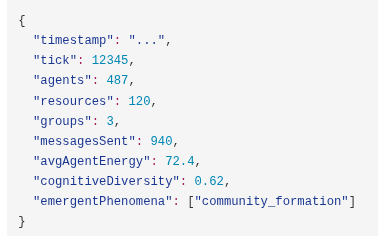


### 4.7.3 L'optimisation

Le traitement des métriques est optimisé :

- **Agrégation incrémentale** : les métriques sont calculées à chaque snapshot au moment de l'ingestion (aucun recalcul complet).  
- **Cache de séries** : les métriques par run sont mises en cache et invalidées uniquement sur ajout/mort d'entité.  
- **Parallélisation** : les calculs lourds (co-localisation O(n²), plus proche ressource) sont parallélisés.  
- **Sous-échantillonnage** : `--sample-every=N` pour ne garder 1 snapshot sur N ; `?every=N` pour retourner des séries sous-échantillonnées.

## 4.8 Logging et Instrumentation

### 4.8.1 Les 3 niveaux de journalisation

| Niveau | Format | Support | Usage |
| :---- | :---- | :---- | :---- |
| **Événements structurés** | Schéma SQLite (`events_log`) | Interrogation ELT | Analyse scientifique |
| **Traces de décision** | Schéma SQLite (`decision_traces`) | BDI complet | Reconstruction causale |
| **Logs texte** | Serilog (console + fichier) | Débogage | Développement |

### 4.8.2 Les événements structurés

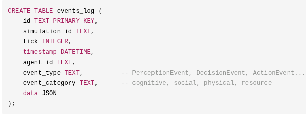  
Les catégories d'événements :

| Événement | Contenu |
| :---- | :---- |
| PerceptionEvent | ObservedEntityIds, Count, AverageConfidence |
| DecisionEvent | ConsideredGoals, ActionScores, ChosenAction, ChosenUtility |
| ActionEvent | ActionType, ActionStatus (Started/Updated/Completed/Failed), Outcome |
| CommunicationEvent | SenderId, ReceiverIds, MessageType, MessageConfidence |
| BeliefEvent | Fact, OldConfidence, NewConfidence, Source |
| GroupEvent | GroupId, GroupAction (Formed/Joined/Left/Dissolved) |


### 4.8.3 Les traces de décision

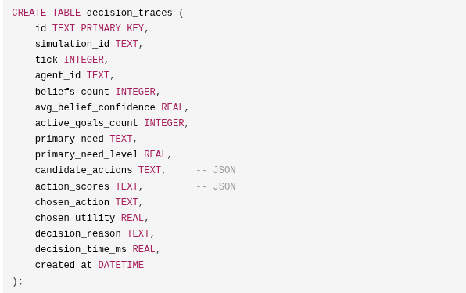

### 4.8.4 Les logs texte (Serilog)

- Rotation quotidienne : `logs/v2_simulation_{date}.log`.  
- Format : `"{Timestamp:yyyy-MM-dd HH:mm:ss.fff} [{Level:u3}] {Message}{NewLine}{Exception}"`.  
- Tag d'application : "SSE-V2".

| Niveau | Usage |
| :---- | :---- |
| Error | Échec d'action, état incohérent |
| Warning | Chemin bloqué, ressources insuffisantes |
| Information | Résumé de tick, formation de groupe |
| Debug | Décisions d'entités, mises à jour de croyances |
| Verbose | Traces BDI complètes (développement uniquement) |

### 4.8.5 Le profilage

ECHOS utilise des **ProfileMarkers** (basés sur `Stopwatch.GetTimestamp()`) pour mesurer les temps d'exécution de chaque sous-système :

Exemple de sortie (500 appels) :  
  Perception   : 240.51 ms total, 0.48 ms avg  
  Decision     : 185.23 ms total, 0.37 ms avg  
  Communication:  92.15 ms total, 0.18 ms avg  
  Movement     :  45.67 ms total, 0.09 ms avg  
  Belief Update:  78.34 ms total, 0.16 ms avg

### 4.8.6 La console de débogage

| Commande | Description |
| :---- | :---- |
| `list-agents` | Liste toutes les entités (position, énergie, faim) |
| `inspect-agent <name>` | Détail complet d'une entité (croyances, objectifs, action) |
| `trace-decision <name>` | Trace de décision détaillée pour un tick spécifique |
| `set-breakpoint <agent> "<condition>"` | Exemple : `"hunger > 90"` |

### 4.8.7 L'export

- Export CSV des traces de décision : AgentId, Tick, BeliefCount, GoalCount, ChosenAction, Utility.  
- Export JSON des données complètes pour analyse externe.

## 4.9 L'Instrumentation dans le Prototype V1

Le prototype V1 a validé l'approche d'ECHOS avec une version .NET/C# de l'analyzer :

### 4.9.1 Les métriques implémentées

- **Population** : total, décès, espérance de vie.  
- **Besoins moyens** : série temporelle des besoins moyens de la population.  
- **Entropie comportementale** : diversité de Shannon des actions.  
- **Distance moyenne à la ressource la plus proche**.  
- **Clustering spatial** : composantes connexes.  
- **Réseau de co-localisation** : degré moyen comme proxy du réseau social.  
- **Épuisement des ressources**.  
- **Persistance des comportements dominants**.  
- **Comparaison de runs**.

### 4.9.2 Les résultats validés

- 18 tests xUnit couvrant `MetricsTests`, `RunStoreTests`, `EmergenceTests`.  
- Couverture : 85.0% des lignes.  
- Agrégation incrémentale validée : identique au calcul de référence.  
- Sous-échantillonnage validé : `?every=10` retourne 9/86 échantillons.


## 4.10 Les Limites d'ECHOS

### 4.10.1 Les limites méthodologiques

- Un indice d'émergence est une **mesure particulière**, pas une preuve.  
- L'observation peut introduire un biais de conception : les mesures reflètent les choix du développeur.  
- Un phénomène rare mais intéressant peut passer inaperçu si la métrique correspondante n'existe pas.

### 4.10.2 Les limites techniques

- La volumétrie des événements peut dépasser la capacité d'analyse (besoin de sous-échantillonnage).  
- Les calculs O(n²) (co-localisation, centralité) doivent être parallélisés aux hautes échelles.  
- L'analyse causale précise devient difficile avec les boucles de rétroaction multiples.

### 4.10.3 La règle d'or

> **ECHOS ne doit jamais transformer une métrique en vérité scientifique.** Un score d'émergence ou une valeur de centralité reste une mesure particulière d'un phénomène, jamais une preuve de l'existence d'une intelligence ou d'une société.

```{=openxml}
<w:p><w:r><w:br w:type="page"/></w:r></w:p>
```
# Partie 5 - PRISM : Perceptual Rendering & Interactive Simulation Module

## 5.1 Présentation de PRISM

### 5.1.1 Rôle

**PRISM** - Perceptual Rendering & Interactive Simulation Module - est la couche qui rend le monde perceptible et interactif. Il représente graphiquement l'état fourni par SYNE et fournit les moyens de navigation, de caméra, d'inspection et d'interaction.

PRISM est un **reflet du monde simulé**, jamais un co-auteur de la simulation. Il observe, il affiche, il permet d'interagir - il ne décide pas.

### 5.1.2 Ce que PRISM fait

1. Rendu du monde (sol, obstacles, environnement).  
2. Représentation des entités (entités, ressources).  
3. Caméra et navigation de l'utilisateur.  
4. Représentation des constructions et territoires (futur).  
5. Inspection d'une entité (croyances, besoins, décisions).  
6. Affichage de données ECHOS (métriques, phénomènes).  
7. Outils de debug visuel.  
8. Interaction utilisateur.  
9. Préparation du futur mode joueur-habitant.

### 5.1.3 Ce que PRISM ne doit pas faire

-  Posséder l'état canonique d'une entité.  
-  Calculer les règles sociales.  
-  Déterminer la vérité d'une croyance.  
-  Modifier directement le monde sans passer par les mécanismes prévus par SYNE.  
-  Introduire des comportements non présents dans le modèle de simulation.


## 5.2 Pourquoi un Framework Intermédiaire

### 5.2.1 Le problème

Unreal Engine et Unity disposent chacun de leur propre organisation des objets, composants, scènes, physique, rendu et logique de gameplay. Si le modèle de simulation était construit autour des abstractions d'un moteur graphique, le projet serait lié à ce moteur pour toujours.

### 5.2.2 La solution

PRISM est un **framework intermédiaire** : il définit des concepts propres à LIVEX (entité, ressource, obstacle, croyance, groupe) et les adapte au moteur graphique choisi. Si le moteur change (Godot → Unity → Unreal), seuls les adaptateurs changent, pas le modèle de simulation.

```
Modèle LIVEX (SYNE)  
    ↓ adaptation  
PRISM (framework intermédiaire)  
    ↓ bindings  
Godot / Unity / Unreal (moteur graphique)
```
### 5.2.3 Le moteur actuel : Godot

Le prototype utilise **Godot 4.7.2 édition .NET** (piste [HÉRITÉ] ; le moteur graphique définitif reste ouvert), avec C# comme langage. Ce choix préserve la cohérence du monorepo 100% .NET (typage fort, build/débug via `dotnet`, tests communs).

**Alternatives évaluées** :

- GDScript : rompt la cohérence .NET.  
- Godot non-.NET : incompatible avec le workflow C#.  
- Three.js : alternative à Godot pour un rendu 2D/3D dans l'interface ECHOS ; non retenu pour PRISM.  
- Unity/Unreal : surdimensionnés pour un prototype de visualisation.

## 5.3 Scènes et Architecture

### 5.3.1 Structure des scènes (V1)

```
res://  
  main.tscn                (scène racine)  
  scripts/  
    SimClient.cs            (client WebSocket)  
    CameraController.cs     (contrôle caméra)  
    Hud.cs                  (interface)
```
### 5.3.2 Structure des scènes (V2 - version enrichie)

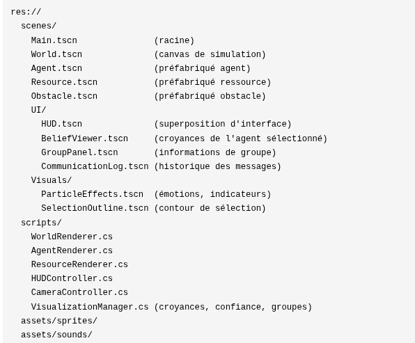


### 5.3.3 Le mapping 2D → 3D

Le monde est simulé en 2D (plan x, y). Dans l'espace 3D de Godot :

Simulation (2D)      Godot (3D)  
x                    x  
y                    z  
-                    y (hauteur)

Le sol est un `PlaneMesh` (aucune rotation nécessaire en Godot 4.7, le plan XZ est le défaut, vérifié via AABB).

### 5.3.4 Les assets

Le prototype est **100% procédural** : aucun asset externe. Les primitives générées sont :

| Élément | Mesh |
| :---- | :---- |
| Sol | PlaneMesh |
| Entité | CapsuleMesh |
| Ressource | SphereMesh |
| Obstacle | BoxMesh / CylinderMesh |


## 5.4 Le Transport

### 5.4.1 WebSocket (données)

PRISM se connecte à SYNE via WebSocket (`ws://127.0.0.1:5180/`) avec reconnexion automatique (1,5 seconde). Deux types de messages :

- **snapshot** : état complet du monde (WorldSnapshot).  
- **event** : événements ponctuels (ExternalEvent).

### 5.4.2 HTTP (contrôle)

PRISM relaie les commandes de contrôle à l'API REST de SYNE (`http://127.0.0.1:5181/api/control/`) :

| Commande | Action |
| :---- | :---- |
| `start` | Démarrer la simulation |
| `pause` | Mettre en pause |
| `resume` | Reprendre |
| `reset` | Réinitialiser (avec seed et run id) |

L'état de SYNE est interrogé toutes les 2 secondes.

### 5.4.3 L'interface TypeScript

Dans le prototype, l'interface ECHOS (sous forme d'une application web React + TypeScript) consommait les métriques d'ECHOS et le flux WebSocket de SYNE, offrant un tableau de bord complémentaire à PRISM.


## 5.5 Rendu des Entités

### 5.5.1 Représentation visuelle

Chaque entité est représenté par une capsule 3D, avec :

- **Couleur** : par santé (vert → rouge) ou par action (touche A pour basculer).  
- **Interpolation** : la position est interpolée entre deux snapshots pour un mouvement fluide.  
- **Animation de mort** : fondu progressif.  
- **Indicateur de cap** : ligne depuis la position jusqu'à `position + heading × 15`.

### 5.5.2 Code couleur

| Condition | Couleur |
| :---- | :---- |
| Énergie basse (< 20) | Rouge |
| Faim élevée (> 80) | Orange |
| En bonne santé | Vert |
| Dans un groupe | Couleur du groupe (hash HSV) |
| Sélectionné | Modulation blanche |
| Non sélectionné | Modulation grise |

### 5.5.3 La sélection

La sélection se fait par clic (raycast physique). Un `CircleShape2D` de rayon 5 sert de zone de détection. L'entité sélectionné ouvre le panneau BeliefViewer.

## 5.6 Rendu des Ressources

Les ressources sont représentées par des sphères :

| Type | Couleur |
| :---- | :---- |
| Nourriture | Vert |
| Eau | Bleu |

La taille est normalisée par la proportion `quantité / capacité`. Des taches translucides sur le sol indiquent les zones de ressource.

## 5.7 Visualisation des Croyances

### 5.7.1 BeliefViewer

L'inspection d'une entité sélectionné ouvre un panneau listant ses croyances, triées par confiance décroissante. Chaque croyance affiche :

- Le fait (subject, predicate, value).  
- La confiance (avec icône : haute / moyenne / basse).  
- La source (perception, mémoire, communication, inférence).  
- L'âge (en ticks).

### 5.7.2 Heatmap de croyance (spatiale)

Une grille 50×50 (cellule = 10 unités) est utilisée pour cartographier les croyances, en projetant la confiance sur la position spatiale. Couleur : HSV teinte 120-0 (vert = confiance haute, rouge = confiance basse).

### 5.7.3 Bulle de croyance

Au-dessus de chaque entité : affichage de la croyance dominante (confiance > 0.8), avec disparition automatique après 2 secondes.


## 5.8 Visualisation Sociale

### 5.8.1 Le graphe de relations

Les relations entre entités sont affichées sous forme de lignes si la confiance est ≥ 0.3 :

| Confiance | Couleur de la ligne |
| :---- | :---- |
| > 0.7 | Vert |
| 0.4 - 0.7 | Orange |
| < 0.4 | Rouge (non affichée par défaut) |

Épaisseur de ligne : `trust × 3`. Des flèches indiquent le sens de la relation.

### 5.8.2 Heatmap de confiance

Une heatmap 256×256 (une pixel par paire d'entités) visualise la matrice de confiance globale. Couleur : HSV teinte `120 - trust × 120` (rouge = méfiance, vert = confiance).

### 5.8.3 Le graphe social (interface ECHOS)

L'interface ECHOS (prototype : application web React + TypeScript) complète PRISM avec un graphe D3 force-directed :

- **Force links** : distance 80.  
- **ForceManyBody** : strength -300.  
- **ForceCenter** : centrage.  
- Couleur des arêtes par niveau de confiance.  
- Nœuds : rayon 8 px, couleur par groupe.  
- Drag interactif.


## 5.9 Visualisation des Groupes

### 5.9.1 Couleur par groupe

Chaque groupe reçoit une couleur dérivée de son hash (`groupId.GetHashCode()` → hue) :

hue = groupId.GetHashCode() % 360

saturation = 0.8

value = 1.0

Les leaders sont éclaircis (Lightened 0.3), les membres ont la couleur normale du groupe.

### 5.9.2 Panneau de groupe

Le GroupPanel affiche :

- Nom du groupe.  
- Nombre de membres.  
- Couleur de fond issue de la couleur du groupe (assombrie 50%).  
- Rôles des membres (dans la vue détaillée).

### 5.9.3 Vue groupes complémentaire (interface ECHOS)

L'interface ECHOS fournit GroupList, GroupDetail et MembershipTree (formation → dissolution, timeline).


## 5.10 Communication Visuelle

Les pulsations lumineuses entre entités sont rendues comme des éclairs transients (durée de vie 0,5 seconde), colorés selon leur signification :

| Type de pulsation | Couleur rendue |
| :---- | :---- |
| Warning | Rouge |
| Information | Blanc |
| Request | Jaune |
| Trading | Vert |
| Autre | Gris |

Le rendu utilise une file de pulsations avec minuterie delta-time.

## 5.11 Caméra et Interaction

| Action | Contrôle |
| :---- | :---- |
| Rotation | Clic droit + glisser (orbit) |
| Zoom | Molette (sensible 0.1, borné 0.5 - 5.0) |
| Déplacement | ZQSD / WASD |
| Sélection | Clic gauche |
| Suivre l'entité | Touche F |
| Ne plus suivre | Échap |
| Recentrer | Espace (centre monde, zoom 1.0) |


## 5.12 HUD

Le HUD affiche en superposition :

- Tick courant.  
- Nombre d'entités vivants.  
- Score d'émergence (format F2).  
- Diversité des croyances (format F2).  
- Liste des phénomènes détectés.  
- État du WebSocket (connecté / reconnexion).  
- Temps simulé (jours/heures).  
- FPS.

Les contrôles de simulation sont accessibles depuis le HUD :

- Start / Pause / Resume / Reset.  
- Onglets : Paramètres (URL WS, run id, seed), Commandes & légende, Liste des entités, Journal (décès, ressources épuisées).

## 5.13 L'interface d'analyse (intégrée à ECHOS — héritage du prototype)

PRISM n'est pas la seule interface. Dans le prototype V1/V2, une application web séparée (React + TypeScript) fournissait un tableau de bord d'analyse ; dans l'architecture V0.1, cette interface est intégrée à ECHOS. Composants hérités :

### 5.13.1 Les composants principaux

| Composant | Rôle |
| :---- | :---- |
| `DashboardPage` | Vue d'ensemble : métriques en temps réel |
| `KPICards` | 4 cartes : entités actifs, score émergence, groupes, messages/tick |
| `MetricsPanel` | Jauges : diversité des croyances, diversité des objectifs, coefficient de clustering, vitesse de diffusion |
| `TimelineChart` | Évolution des métriques dans le temps |
| `AgentInspector` | Inspection d'entité (sondage toutes les 500 ms) |
| `SocialGraph` | Graphe social D3 (sondage toutes les 2 s) |
| `GroupExplorer` | Liste/détail des groupes |
| `MessageHeatmap` | Matrice entité×entité des communications |
| `SimulationControls` | Contrôles play/pause/step |
| `SpeedControl` | Contrôle de la vitesse |
| `RecordingPanel` | Panneau d'enregistrement des runs |

### 5.13.2 Les interfaces TypeScript

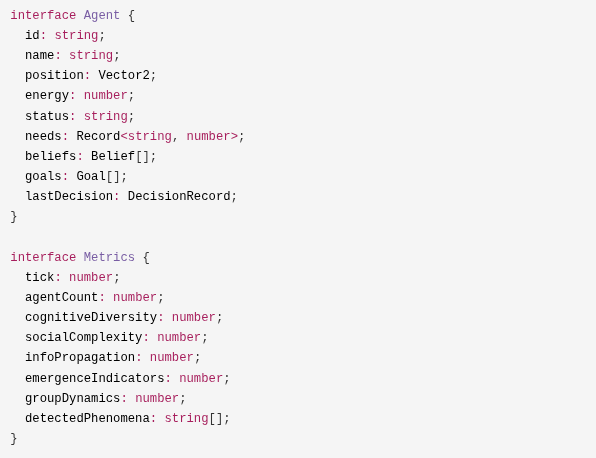

### 5.13.3 Technologie

- Vite + React 18 + TypeScript.  
- Recharts pour les graphiques.  
- D3.js pour la visualisation de graphes.  
- Tailwind CSS (thème sombre : `bg-gray-900`).


## 5.14 Les Limites de PRISM

Les limites reconnues de l'implémentation actuelle :

1. **V1** : les obstacles et la taille du monde ne sont pas transmis par le contrat de transport (sol fixe 500×500, obstacles ignorés). Corrigé en V2.  
2. **Pas de sons** : aucune piste audio.  
3. **Pas d'animations squelettiques** : les entités sont des capsules simples.  
4. **Pas de minimap** : la navigation à grande échelle repose sur le zoom.  
5. **Pas de rendu LOD** en V1 pour les entités distantes.  
6. **Complexité du rendu** : 1000 entités = 1000 capsules à rendre (culling nécessaire au-delà).

## 5.15 Vers PRISM Futur

### 5.15.1 L'évolution envisagée

PRISM évoluera vers un framework complet destiné à **Unreal Engine ou Unity**. Le moteur graphique définitif reste volontairement ouvert ; le choix sera effectué après comparaison des besoins de PRISM, du pipeline d'assets, des performances et des contraintes de développement.

### 5.15.2 Les fonctionnalités futures

- Mode joueur-habitant : l'utilisateur pourra incarner une entité dans le monde simulé.  
- Représentation des constructions et territoires.  
- Affichage multi-échelle (zoom sur une région → vue globale).  
- Intégration de données ECHOS directement dans la scène.  
- Effets visuels environnementaux (saisons, météo, jour/nuit).

### 5.15.3 Le principe invariant

Quel que soit le moteur choisi, PRISM restera :

- **Réflexion passive** : il n'expose jamais de décisions, il reflète l'état du moteur.  
- **Commandes relayées** : le contrôle du moteur passe par l'API HTTP de SYNE.  
- **Modèle propre** : LIVEX conserve son propre modèle de données, indépendant du moteur graphique.


```{=openxml}
<w:p><w:r><w:br w:type="page"/></w:r></w:p>
```
# Partie 6 - Concepts Détaillés

## 6.1 Le Monde Simulé

### 6.1.1 Définition

Le monde simulé est l'espace dans lequel les entités évoluent. Il est composé :

- D'un **espace logique** - un plan 2D de dimensions configurable (défaut 500×500).  
- De **ressources** - nourriture, eau, bois, minéraux.  
- D'**obstacles** - éléments qui bloquent le mouvement et, en V2, la ligne de vue.  
- D'**événements d'environnement** - saisons, catastrophes, cycles.  
- De **contraintes** - limites du monde, règles de transition d'état.

### 6.1.2 Espace logique vs espace de rendu

L'espace logique est **abstrait et indépendant de toute représentation visuelle**.

- La simulation utilise des coordonnées entières/flottantes simples `{x, y}`.  
- Le rendu 3D remappe ces coordonnées : X → X, Y → Z.  
- Aucune information graphique (maillages, textures, primitives) n'existe dans l'espace logique.

Cette séparation est une conséquence directe du principe d'indépendance du rendu (ADR-001).

### 6.1.3 Le monde comme acteur

Le monde n'est pas un simple décor passif. Il est un **acteur** de la simulation : il contient des ressources qui s'épuisent et se régénèrent, des obstacles qui contraignent les déplacements, des événements qui perturbent les entités, et des lois biologiques qui font vieillir les entités.

La formule générale de transition d'état : **S(t+1) = F(S(t), événements, actions, environnement, hasard contrôlé)**.


## 6.2 L'Entité

### 6.2.1 Définition

> **Entité** : entité autonome capable d'agir dans le monde simulé.

Une entité de LIVEX est caractérisé par :

| Aspect | Contenu |
| :---- | :---- |
| **Identité** | Id, nom, espèce, date de création |
| **État physique** | Santé, énergie, faim, soif, position |
| **État cognitif** | Perception, mémoire, croyances, besoins |
| **État motivationnel** | Objectifs, intentions, engagement |
| **État social** | Relations, confiance, appartenances |
| **Capacités** | Mouvement, consommation, communication, combat |
| **Traits** | Personnalité (8 traits en V2) |
| **Cycle de vie** | Naissance, vie, mort |

### 6.2.2 L'autonomie

L'autonomie d'une entité se définit informatiquement comme la capacité à sélectionner ses actions sans commande externe directe. Cette définition est **fonctionnelle** : elle ne présuppose ni conscience, ni libre arbitre, ni intentionnalité au sens philosophique.


### 6.2.3 L'hétérogénéité

Deux entités ne sont jamais identiques :

- Les traits de personnalité varient (tirage aléatoire contrôlé par seed).  
- L'expérience vécue varie (perceptions différentes, interactions différentes).  
- La mémoire varie (les souvenirs s'oublient différemment).  
- Les croyances varient (l'information est dégradée à chaque échange).

C'est cette hétérogénéité qui est la source de la diversité comportementale.

### 6.2.4 La mortalité

Les entités peuvent mourir. La mort est déclenchée par :

- Santé ≤ 0 (conséquence des dégâts prolongés).  
- Faim ou soif critiques prolongées (dégâts continus).  
- Épuisement prolongé.  
- Conflits avec d'autres entités (V0.1 : conflit frontal ; V2 : attaques).

La mort n'est pas un échec de la simulation : elle est une **condition nécessaire** de l'évolution et de la diversité. Une population immortelle n'aurait aucune pression adaptative.

### 6.2.5 La dissolution complète (V0.1)

En V0.1, la mort est une **dissolution complète** : l'entité cesse d'exister, ses ressources et son corps quittent le monde, et il ne subsiste qu'**un événement de trace** (`EntityDied`) consigné dans le journal de traçabilité (SYNE, §3.24) et exploitable par ECHOS. Il n'y a pas de corps résiduel observable ni d'état `Dead` persistant (contrairement au prototype V1/V2, [HÉRITÉ]).

Cette dissolution renforce la matérialité des **livres** (§3.18) : puisque le savoir d'une entité disparaît avec elle, seule une transmission *explicite* (livre, groupe, écrit) lui survit. La question de savoir si une dissolution laisse des résidus (matière, substances) reste [OUVERT].


## 6.3 L'Architecture Cognitive

### 6.3.1 BDI - Beliefs, Desires, Intentions

L'architecture cognitive de LIVEX s'inspire du modèle BDI de Rao et Georgeff (1995), sans chercher à implémenter une théorie philosophique de l'esprit.

| Composante | Définition LIVEX | Question que cela résout |
| :---- | :---- | :---- |
| **Croyances** | Ce que l'entité considère comme vrai | « Que sais-je du monde ? » |
| **Désirs/Objectifs** | Ce que l'entité cherche à obtenir | « Qu'est-ce qui est important pour moi ? » |
| **Intentions** | Ce que l'entité s'engage à faire | « Que vais-je faire maintenant ? » |

### 6.3.2 Le cycle cognitif

Perception → Mémoire → Croyances → État interne → Besoins →

Objectifs → Possibilités → Évaluation → Délibération → Intention →

Action → Conséquences → Modification du monde → Événements →

Nouvelles perceptions

> **V0.1** : ce cycle correspond aux boucles du prototype ([HÉRITÉ]). La boucle de référence de
> la V0.1 est la **boucle décisionnelle en 15 étapes** (voir §3.3.4), qui conserve ce déroulé
> tout en formalisant la séparation des responsabilités et la traçabilité
> `Action ← Intention ← Objectif ← Besoin ← Croyance ← Mémoire ← Perception`.

### 6.3.3 La distinction intention / action

Une **intention** est une décision délibérée : l'engagement de l'entité à poursuivre un objectif. Une **action** est l'exécution concrète de cette intention sur le monde.

Cette distinction est essentielle : une entité peut avoir l'intention de manger mais être temporairement incapable de le faire (pas de nourriture accessible). L'intention persiste, l'action attend ou change.

### 6.3.4 La fréquence de décision

La décision n'est pas nécessairement recalculée à chaque tick. Le scheduler adaptatif distingue :

- Le **raisonnement de haut niveau** (délibération) : fréquence adaptative.  
- L'**exécution d'action** (mouvement, consommation) : fréquence élevée.  
- L'**analyse sociale** (évaluation des relations) : fréquence faible.

Cette séparation est une question de coût : la cognition complète pour chaque entité à chaque tick serait prohibitive.

## 6.4 L'Émergence

### 6.4.1 Définition détaillée

> Un phénomène est dit émergent dans LIVEX s'il satisfait les **5 critères** suivants :  
> 

1. **Non imposé** - Le phénomène n'est pas une action ordonnée directement par une règle globale.  
2. **Résultant d'interactions locales** - Il émerge de l'interaction de multiples mécanismes locaux.  
3. **Variable avec les conditions initiales** - Des conditions légèrement différentes produisent des résultats différents.  
4. **Producteur de conséquences secondaires** - Le phénomène influence d'autres mécanismes.  
5. **Influence sur les décisions futures** - Le phénomène modifie les perceptions, les croyances et les décisions ultérieures.

### 6.4.2 Les trois niveaux de comportement

| Niveau | Description | Exemple |
| :---- | :---- | :---- |
| **Scripté** | « SI événement X ALORS comportement Y » | Un PNJ qui attaque dès que le joueur entre dans son champ |
| **Paramétré** | « L'entité choisit Y car Y maximise son utilité » | Une entité qui mange car sa faim est élevée |
| **Émergent** | « Plusieurs entités + règles locales + ressources + interactions + boucles de rétroaction → phénomène collectif non spécifié » | Un marché informel qui apparaît à un carrefour |

LIVEX cherche à produire des comportements des trois niveaux, mais uniquement les deux derniers sont « intéressants ». Le niveau scripté est interdit pour les comportements collectifs.

### 6.4.3 Émergence contre scénario

| Scénario | Simulation émergente |
| :---- | :---- |
| « La ville apparaît ici au moment prévu » | « Des entités rencontrent certaines contraintes, interagissent et peuvent produire une concentration urbaine » |
| Le résultat est une exigence | Le résultat est une possibilité du système |
| Si le résultat n'apparaît pas → bug | Si le résultat n'apparaît pas → expérience infructueuse (mais informative) |

### 6.4.4 Émergence et imprévisibilité

L'imprévisibilité pratique n'implique pas une indétermination fondamentale. Un système déterministe peut être difficile à prévoir lorsque de nombreuses interactions et rétroactions rendent la trajectoire sensible aux conditions initiales (comportement chaotique).

Cela a une conséquence importante pour LIVEX : le monde est déterministe *dans son exécution* (même seed = même trajectoire), mais *pratiquement imprévisible* dans ses phénomènes à moyen terme.

### 6.4.5 Le problème de la démonstration

Dire qu'une ville est apparue « spontanément » n'est pas suffisant. Il faut pouvoir démontrer :

1. Qu'aucune règle directe n'a ordonné sa création.  
2. Quels mécanismes ont rendu cette structure possible.  
3. Que le phénomène est robuste (apparaît dans plusieurs runs ou sur une plage de paramètres).  
4. Que le phénomène n'est pas un artefact statistique.

Cette exigence de validation est au cœur du module ECHOS.


## 6.5 Paramètres et Configuration

### 6.5.1 Les traits de personnalité

Les 8 traits de personnalité (repère [HÉRITÉ]) structurent les différences individuelles :

| Trait | Plage | Rôle dans la décision |
| :---- | :---- | :---- |
| Courage (Bravery) | 0-2 | Modifie le score des actions risquées |
| Curiosité | 0-2 | Modifie le score des actions d'exploration |
| Sociabilité | 0-2 | Modifie le score des actions sociales |
| Cupidité (Greed) | 0-2 | Modifie le score des actions de collecte |
| Pessimisme | 0-2 | Modifie la perception du risque |
| Agressivité | 0-2 | Modifie le score des actions d'attaque |
| Force | 0-2 | Puissance de combat (calcul du risque d'attaque) |
| Vitesse | 0-2 | Vitesse de déplacement (coût de mouvement) |

La plage 0-2 avec neutre à 1.0 permet une grande variété de personnalités sans extrêmes trop stéréotypés.

> **V0.1** : comme au §3.7.4, ce jeu de traits est un repère **[HÉRITÉ]** du prototype ; la V0.1
> privilégie un **paramétrage conceptuel** (variantes A/B) sans classes rigides.

### 6.5.2 Les besoins

Les besoins sont des **tensions numériques**, calculées à chaque tick. Ils conditionnent la génération d'objectifs et l'évaluation des utilités.

| Besoin | Échelle | Tendance par défaut | Effet si non satisfait |
| :---- | :---- | :---- | :---- |
| Faim | 0-100 | +0.5/tick | Utilité de manger augmente |
| Soif | 0-100 | +0.7/tick | Utilité de boire augmente |
| Fatigue | 0-100 | +0.3/tick | Utilité de se reposer augmente |
| Sécurité | 0-1 | Dépend des menaces | Utilité de fuir augmente |
| Social | 0-1 | Dépend de l'isolement | Utilité de socialiser augmente |
| Curiosité | 0-1 | Dépend de l'inexploré | Utilité d'explorer augmente |

*(Note : les échelles exactes doivent être unifiées lors de la mise en œuvre V2 - certaines documentations utilisent 0-100 pour les besoins primaires et 0-1 pour les besoins secondaires.)*

### 6.5.3 Les ressources

| Type | Quantité initiale | Régénération | Dégradation après 100 ticks sans exploitation |
| :---- | :---- | :---- | :---- |
| Food | 100 (V1) | 0 (V1) | Oui (V2) |
| Water | infinie (V1) | - | Non (V1) |
| Wood | configurable (V2) | configurable | Oui |
| Mineral | configurable (V2) | lente | Oui |

### 6.5.4 La philosophie des réglages

- Les valeurs par défaut sont **documentées et justifiées**.  
- Aucun paramètre ne doit être « magique » : chaque valeur a un rôle.  
- Les paramètres sont **observables** : on doit pouvoir mesurer leur effet.  
- Les modifications doivent être **explorables** : un fichier de config modifiable, versionné, avec comparaisons de runs.


## 6.6 Cycle de Vie de l'Entité

### 6.6.1 Les phases de la vie

| Phase | Description | Durée/fréquence |
| :---- | :---- | :---- |
| **Création** | L'entité est instancié, ses traits sont tirés | Début de run (ou naissance, futur) |
| **Vie active** | Perception, décision, action | Continu |
| **Repos** | Récupération d'énergie | Périodique (quand fatigue élevée) |
| **Mort** | Fin des interactions | Quand santé ≤ 0 |

### 6.6.2 La naissance : fusion consentie (V0.1)

Dans l'architecture V0.1, une nouvelle entité **naît de la fusion consentie de deux entités** (elle
n'est pas instanciée par un « spawn » extérieur, et l'apparition ne relève pas d'une reproduction
biologique au sens du prototype).

- **Consentement** : les deux entités doivent choisir délibérément cette fusion (décision volontaire
  au sein de la boucle cognitive, §6.3) ; la fusion est un acte social visible (événement
  `EntityCreated`).  
- **Conditions** : proximité (ligne de vue / contact), énergie suffisante, et un état cognitif
  compatible (par exemple une confiance mutuelle au-delà d'un seuil — modèle [OUVERT]).  
- **Résultat** : la fusion crée une entité nouvelle ; les deux entités initiales peuvent se dissoudre
  ou conserver une existence autonome (modèle [OUVERT]).  
- **Hérédité** : la transmission de traits et de savoir lors d'une fusion est laissée ouverte
  (**décision n°17**).

> **Héritage du prototype** : la reproduction (hérédité des traits, démographie, pression adaptative)
> reste une piste [HÉRITÉ], non retenue en V0.1. La fusion consentie en est une alternative
> conceptuelle : la population n'est plus fixée par paramétrage mais par les choix des entités.

### 6.6.3 L'héritage intergénérationnel

La mort rompt la continuité d'une entité. Une génération suivante peut hériter de caractéristiques du monde (ressources, structures, relations modifiées par les générations précédentes) sans être la même entité.

Cette distinction est fondamentale : LIVEX ne produit pas des « âmes réincarnées », mais un monde dans lequel le passé laisse des traces.


## 6.7 Mémoire et Transmission du Savoir

### 6.7.1 La mémoire comme différence

La mémoire n'est pas identique à une croyance. Une expérience peut être mémorisée, puis interprétée, oubliée, généralisée ou contredite par une expérience plus récente. Cette distinction permet des **erreurs persistantes** : une entité peut croire une chose fausse parce que sa mémoire contient une information obsolète qui n'était pas contradictoire.

### 6.7.2 Le modèle de décroissance

La mémoire de LIVEX utilise une décroissance exponentielle :

```
salience(t) = salience(0) × exp(-decayRate × durée)
```
Cette courbe correspond au phénomène psychologique d'oubli initial rapide puis lent (courbe d'Ebbinghaus).

### 6.7.3 La transmission du savoir

Le savoir se transmet par communication :

```
Entité A observe un fait (confiance 0.9)

  → transmet à B avec dégradation (confiance 0.81)

    → B transmet à C avec dégradation (confiance 0.72)

      → C croit le fait avec confiance 0.72 × trust(B)
```
La **dégradation progressive** est un élément clé : elle produit des rumeurs, des distorsions, des informations incomplètes - et donc des divergences de croyances entre entités.

### 6.7.4 La perte du savoir

Le savoir peut également se **perdre** :

- **Par décroissance** : une croyance non confirmée expire.  
- **Par contradiction** : une information plus récente remplace une ancienne.  
- **Par la mort** : une entité qui meurt emporte son savoir avec lui.  
- **Par l'isolement** : un groupe isolé développe ses propres croyances et oublie peu à peu les informations du reste du monde.

### 6.7.5 Les livres comme vecteur durable (V0.1)

La communication éphémère (§6.8) transmet vite et se dégrade ; les **livres** (objets physiques, §3.18) transmettent lentement et **persistent**. Ils permettent au savoir de survivre à la mort des entités, au prix d'une matérialité : détention, garde, vol, destruction. Cette opposition « éphémère vs durable » structure la profondeur temporelle de la société simulée : les entités communiquent avec leur environnement présent, les livres relient les générations.

La question « comment le savoir se transmet-et-se-perd » est l'une des questions de recherche les plus intéressantes de LIVEX.

## 6.8 Communication

### 6.8.1 Le protocole (V0.1)

En V0.1, la communication repose sur des **pulsations lumineuses publiques** : un signal physique visible de toute entité **en ligne de vue** (un amas ou un obstacle bloque la pulsation). Le signal est **public** (interception possible) ; la messagerie dirigée du prototype reste une optimisation permise. Les principes clés :

- **Locale** : seule la ligne de vue et le voisinage proche reçoivent le signal.  
- **Coûteuse** : produire une pulsation consomme de l'énergie (coût [OUVERT], décision n°9).  
- **Dégradable** : la confiance diminue à chaque saut (rumeur).  
- **Ergone** : il peut y avoir incompréhension (5% de risque).  
- **Fiable selon l'émetteur** : la confiance dans la source module la croyance reçue.
- **Types de messages** : le protocole structuré (7 types) et le modèle de confiance sont hérités du prototype ([HÉRITÉ], voir §3.16.3).

### 6.8.2 Pourquoi la communication imparfaite ?

La communication **parfaite** élimine l'incertitude et réduit l'émergence. Si chaque entité savait tout le monde, l'exploration deviendrait inutile, les rumeurs n'existeraient pas, et la diversité des croyances tendrait vers zéro.

La communication imparfaite produit au contraire :

- Des **goulots d'information** (certaines entités deviennent des hubs de confiance).  
- Des **rumeurs** (l'information circule avec déformation).  
- Des **différences de perception** (qui croit quoi ?).  
- De l'**exploration en valeur** (l'information nuit à être vérifiée).  
- Des **conflits** (deux entités croient des choses contradictoires).


### 6.8.3 Les conditions d'une communication efficace

Pour qu'une pulsation soit utile, il faut :

- Un émetteur fiable (niveau de confiance ≥ seuil).  
- Une convention de référence commune (positions, identités).  
- Un coût acceptable (l'entité a assez d'énergie).  
- Un bénéfice potentiel (l'information est nouvelle ou utile).

### 6.8.4 Les limites

| Limite | Description |
| :---- | :---- |
| Portée | **Ligne de vue** + distance ; les obstacles bloquent (prototype : rayon 20-50) |
| Délai | Quasi nul pour la lumière ; la latence `distance / 10` est un artefact [HÉRITÉ] du prototype |
| Coût | Énergie nécessaire à la production ([OUVERT], décision n°9) |
| Fiabilité | Confiance dans la source, risque de mensonge |
| Déformation | Dégradation par saut, incompréhension |
| Partialité | Une entité ne transmet que ce qu'elle sait - pas le monde entier |


## 6.9 Ressources et Environnement

### 6.9.1 Les ressources comme moteur d'absence

Les ressources sont **finies** ou **régénérantes**. Cette finitude est un moteur puissant de comportement :

- Les ressources suffisantes → pas de compétition.  
- Les ressources rares → compétition, conflit, exploration, spécialisation.  
- Les ressources concentrées → migrations, camps, territoires.  
- Les ressources dispersées → déplacements, commerce.

### 6.9.2 La durabilité

Une ressource est durable si `régénération ≥ consommation moyenne`. Lorsque la consommation dépasse la régénération, la ressource dépérit - un phénomène analogue à la surexploitation dans le monde réel.

Les entités n'ont pas de concept de « durabilité » programmé. La durabilité est une **conséquence émergente** de leurs comportements individuels. Un groupe de chasseurs peut épuiser une ressource sans comprendre ce qu'il se passe.

### 6.9.3 Les événements d'environnement

Les événements d'environnement (sécheresses, abondance, épidémies) introduisent des **perturbations exogènes** : des conditions que les entités ne peuvent pas prévoir et auxquelles ils doivent s'adapter.

Ces perturbations sont importantes pour éviter que le système converge vers un équilibre statique. Elles forcent l'adaptation et la diversité comportementale.


## 6.10 Conflit et Coopération

### 6.10.1 Les deux faces de la vie sociale

Les entités peuvent coopérer (groupes, échanges, information) ou entrer en conflit (attaque, compétition sur les ressources, désinformation).

Ces deux modes ne sont pas mutuellement exclusifs : un groupe peut coopérer en interne et entrer en conflit avec un autre groupe. C'est cette complexité relationnelle que LIVEX cherche à produire.

### 6.10.2 La décision de conflit

Le conflit n'est pas une action scriptée. Il résulte de l'évaluation des utilités :

Vivre en paix : bénéfice = 20, coût = 5, risque = 2 → utilité = 13  
Attaquer :     bénéfice = 60, coût = 15, risque = 40 → utilité = 5  
→ L'entité choisit la paix.  
Mais si la famine est extrême :  
Vivre en paix : bénéfice = 20, coût = 5, risque = 2, urgence = 10 → utilité = 13  
Attaquer :     bénéfice = 60, coût = 15, risque = 40, urgence = 10 → utilité = 5  
→ Même constat. Il faut que le bénéfice de l'action augmente (faim critique)  
  OU que la cible soit faible (risque réduit) pour que l'attaque devienne rationnelle.

Le conflit émerge lorsque les conditions le rendent **rationnel selon l'évaluation d'utilité de l'entité** : cible vulnérable, besoin extrême, absence d'alternative.

### 6.10.3 La coopération

La coopération émerge lorsque les intérêts convergent :

- **Information partagée** : une entité informe une autre d'une ressource → bénéfice mutuel.  
- **Chasse groupée** : plusieurs entités coordonnées peuvent abattre une proie qu'un seul ne pourrait pas vaincre.  
- **Échange** : une entité a du bois, une autre a de l'eau → échange mutuellement bénéfique.  
- **Défense collective** : un groupe protège ses membres contre les attaques extérieures.

### 6.10.4 La confiance comme fondation

Toute coopération repose sur la confiance. Sans confiance, l'information est ignorée, les échanges refusés, les groupes impossibles. La confiance se construit par l'expérience :

- Vérification positive → confiance +0.1.  
- Fausse information → confiance -0.15.  
- Pas d'interaction → décroissance exponentielle.

## 6.11 Observabilité Partielle

### 6.11.1 Définition

L'observabilité partielle est le principe selon lequel une entité ne perçoit et ne connaît qu'une partie de l'état réel du monde.

### 6.11.2 Les mécanismes

Plusieurs mécanismes produisent cette partialité :

1. **Perception limitée spatialement** - Rayon de perception (30-50 unités).  
2. **Perception inexacte** - Confiance dégradée par la distance (min 0.7).  
3. **Perception probabiliste** - Une entité peut rater une cible (trait perception accuracy).  
4. **Mémoire dégradée** - Les souvenirs s'oublient.  
5. **Information incomplète** - Les messages transportent des données partielles et déformées.  
6. **Occultation** - Les obstacles (murs) bloquent la ligne de vue (V2).

### 6.11.3 La règle d'énoncement

Les entités ne peuvent **jamais** accéder à la vérité du monde directement. La règle stricte est :

> Les entités n'utilisent que leurs perceptions, leurs souvenirs, leurs croyances et les messages reçus pour prendre leurs décisions. Ils ne consultent jamais la liste des entités, des ressources ou des événements du monde.

Cette règle est appliquée architecturalement (les entités n'exposent pas leurs globales) et testée (des tests vérifient que les entités ne trichent pas).


### 6.11.4 Les conséquences émergentes

L'observabilité partielle produit :

- **L'exploration en valeur** : chercher de l'information devient une stratégie rationnelle.  
- **La rumeur et la désinformation** : les entités peuvent être trompés.  
- **L'incertitude comportementale** : le modèle interne de l'entité diverge du monde.  
- **La coopération informationnelle** : échanger des informations devient utile.  
- **La diversité** : des entités avec des informations différentes prennent des décisions différentes.

### 6.11.5 Vérité du monde vs vérité perçue

|  | Monde objective | Monde de l'entité |
| :---- | :---- | :---- |
| Source | SYNE (définitive) | Croyances de l'entité |
| Précision | Parfaite | Variable (0.1-1.0) |
| Achèvement | Total | Partiel |
| Actualité | Courante | Potentiellement obsolète |
| Partage | Commun à tous | Spécifique à chaque entité |

Cette dualité est mesurée par ECHOS : la **divergence croyance/réalité** est un indicateur clé de la santé cognitive de la population.


## 6.12 Déterminisme et Reproductibilité

### 6.12.1 Le rôle du hasard

Le hasard est **nécessaire** à la diversité : sans variabilité initiale, toutes les entités seraient identiques et produiraient les mêmes trajectoires.

Mais le hasard doit être **contrôlé** : il doit être reproductible, non-biaisé et instrumentable.

### 6.12.2 Le PRNG xoshiro256**

Le PRNG xoshiro256** est un générateur pseudo-aléatoire :

- **Vitesse** : l'un des plus rapides pour les mathématiques 64 bits.  
- **Qualité** : passe les tests BigCrush.  
- **État compact** : 4 × 64 bits = 256 bits.

L'initialisation par splitmix64 garantit une distribution uniforme des seeds.

### 6.12.3 La vérification expérimentale

Le test de reproductibilité est **bit-à-bit** :

Configuration : seed S, config C, version V  
Run A : 2000 ticks continues  
Run B : 1000 ticks → sauvegarde → chargement → 1000 ticks  
Assert : l'état de A après 2000 ticks == l'état de B après 2000 ticks

Cette garantie a été vérifiée sur le prototype V1 (20 entités, 2000 ticks).

### 6.12.4 Les limites

- Le déterminisme n'implique pas la prédictibilité à long terme (sensibilité aux conditions initiales).  
- Le parallélisme doit être contrôlé : deux ordres de parallélisation différents produisent des résultats différents.  
- Les calculs flottants peuvent varier entre architectures si les opérations réordonnées.


## 6.13 Intelligence Collective

### 6.13.1 De l'individu au collectif

L'intelligence collective n'est pas une intelligence centrale. Des systèmes distribués peuvent produire des solutions ou des structures globales sans contrôleur unique.

Les systèmes d'intelligence en essaim illustrent ce principe : des fourmis qui trouvent le plus court chemin, des abeilles qui optimisent la récolte, des oiseaux qui évitent les prédateurs en vol en formation.

### 6.13.2 Application à LIVEX

LIVEX cherche un phénomène analogue mais plus large :

| Ressources individuelles | Structures collectives possibles |
| :---- | :---- |
| Perception locale | Carte collaborative du monde (implicite) |
| Communication | Réseau de confiance, hubs d'information |
| Mémoire | souvenirs partagés, traditions |
| Confiance | Alliances, coalitions |
| Mobilité | Migration, territorialité |
| Énergie | Spécialisation (chasseur / collecteur / garde) |
| Construction (futur) | Villages, routes, monuments |

Aucune de ces structures collectives n'est programmée. Chaque entité suit ses règles locales - et la structure émergente est le résultat.

### 6.13.3 Attention au terme « intelligence »

Une structure complexe ou adaptative n'est pas automatiquement intelligente. ECHOS doit donc distinguer :

| Terme | Définition |
| :---- | :---- |
| **Complexité** | Nombre et variété des interactions |
| **Organisation** | Structuration non aléatoire |
| **Adaptation** | Réponse aux variations de l'environnement |
| **Coordination** | Alignement des actions individuelles |
| **Intelligence** | Capacité à produire des solutions nouvelles et appropriées (usage très réservé) |

## 6.14 Philosophie de l'Émergence

### 6.14.1 Agency et conscience

L'« agency » désigne dans LIVEX la capacité d'une entité à produire des actions orientées par son état interne et ses objectifs. Cela ne signifie **pas** qu'une entité artificielle possède une conscience.

### 6.14.2 Libre arbitre

LIVEX ne prétend pas résoudre le problème philosophique du libre arbitre. Une décision produite par un algorithme peut être **autonome** au sens informatique sans être **libre** au sens métaphysique.

### 6.14.3 Identité

L'identité d'une entité peut être considérée comme la continuité de son état, de ses souvenirs, de ses relations et de son histoire. La mort, dans LIVEX, rompt cette continuité. Une génération suivante peut hériter de caractéristiques du monde sans être la même entité.

### 6.14.4 Connaissance et vérité

Le monde possède un état objectif simulé. Une entité possède seulement une représentation partielle de cet état.

LIVEX devient ainsi un **modèle informatique d'une distinction classique** : la différence entre la vérité du monde et la connaissance située d'un observateur.

### 6.14.5 Le paradoxe de la création

LIVEX cherche à ne pas programmer directement ses résultats. Mais le choix des primitives (traits, besoins, perceptions, actions) détermine fortement l'espace des phénomènes possibles.

> L'émergence ne signifie donc jamais absence totale de conception. Elle signifie que les résultats ne sont pas **directement** écrits, mais **indirectement** rendus possibles.

### 6.14.6 L'observateur

Le joueur et ECHOS sont des observateurs externes. Le fait de pouvoir observer un système sans intervenir est une propriété importante de l'expérimentation : elle permet de distinguer ce qui émerge du système de ce qui est projeté par l'observateur.


```{=openxml}
<w:p><w:r><w:br w:type="page"/></w:r></w:p>
```
# Partie 7 - Présentation Technique

## 7.1 Stack Technologique Complet

Le projet LIVEX repose sur une stack technologique orientée vers la **cohérence** (une langue de programmation dominante : C#) et l'**indépendance** (moteur graphique interchangeable).

| Couche | Technologie | Note |
| :---- | :---- | :---- |
| Moteur de simulation | C# / .NET | SDK 10.0.400 (pinné global.json) — piste [HÉRITÉ] du prototype |
| Persistance | SQLite | 3.x via System.Data.SQLite — piste [HÉRITÉ] |
| Transport | WebSocket + HTTP REST | Natif .NET ; protocoles non figés en V0.1 (décision n°28) |
| Renderer 3D (PRISM) | Godot (.NET edition) | 4.7.2 — piste [HÉRITÉ] |
| Analyse (ECHOS) | C# / .NET (Analyzer.Core, Analyzer.Service ASP.NET) | phase V1 ; prototype Python — [HÉRITÉ] |
| Interface (ECHOS) | React + TypeScript (echos-ui) | intégrée à ECHOS en V0.1 ; héritage du prototype web |
| Tests C# | xUnit + Moq | - |
| Tests interface (prototype) | Vitest + ESLint + Prettier | - |
| CI/CD | GitHub Actions | - |
| Conteneurisation | Docker (multi-stage) | - |
| Registre d'images | GHCR (GitHub Container Registry) | - |
| Contrôle de version | Git | - |


## 7.2 Organisation du Monorepo

LIVEX/  
```
├── simulation-core/           # Moteur de simulation (C#)  
│   ├── Simulation.Core/       # Bibliothèque principale  
│   ├── Simulation.Console/    # Exécutable (mode serveur / CLI)  
│   ├── Simulation.Core.Tests/ # Tests unitaires xUnit  
│   └── Dockerfile             # Image de conteneur  
├── analyzer/                  # Analyseur (phase V1 = .NET)  
│   ├── Analyzer.Core/         # Moteur de métriques  
│   ├── Analyzer.Service/      # API REST ASP.NET  
│   ├── Analyzer.Tests/        # Tests xUnit  
│   └── Dockerfile  
├── echos-ui/                  # Interface d'ECHOS (héritage du prototype web)  
│   ├── src/                   # Vues React (métriques, graphe social, groupes)  
│   ├── Dockerfile             # nginx serveur de dist/  
│   └── package.json  
├── godot-renderer/            # Renderer 3D (Godot)  
│   ├── scenes/                # Scènes .tscn  
│   ├── scripts/               # Scripts C#  
│   └── *.csproj               # Godot.NET.Sdk  
├── ci/                        # Configuration CI/CD  
│   ├── coverlet.sim.runsettings  
│   ├── coverlet.an.runsettings  
│   └── ...  
├── docs/                      # Documentation technique  
│   └── docs_prototype/        # Documents de spécification V1/V2  
├── compose.yml                # Orchestration Docker  
└── .github/workflows/         # GitHub Actions  
    ├── ci.yml                 # PR + push main  
    └── release.yml            # Tags SemVer
```
## 7.3 Diagrammes d'Architecture

### 7.3.1 Flux de données haut niveau

### ┌──────────────────────────────────────────────────────────────────────────┐

### │                          SYNE (Simulation.Core)                          │

### │                                                                          │

### │  World │ Agents │ Cognition │ Actions │ Interaction │ Spatial │ Nav      │

### │   ▲        ▲         ▲          ▲           ▲          ▲         ▲       │

### │   └────────┴─────────┴──────────┴───────────┴──────────┴─────────┴─┘     │

### │                              │                                           │

### │                        Runtime/Scheduler                                 │

### └─────────────────────────────┬────────────────────────────────────────────┘

###                               │

###               WebSocket (5180) │  HTTP Contrôle (5181)

###                               │

###         ┌─────────────────────┴──────────────────┐

###         │                                        │

### ┌───────▼────────┐                    ┌──────────▼─────────┐

### │      ECHOS     │                    │       PRISM        │

### │  analyse +     │                    │   (visualisation)  │

### │  interface     │                    │       Godot        │

### └────────────────┘                    └────────────────────┘

###         │

###         │ (l'interface est intégrée aux vues d'ECHOS)

###         │


### 7.3.2 Les contrats de données

**WorldSnapshot** (diffusé par SYNE via WebSocket) :  
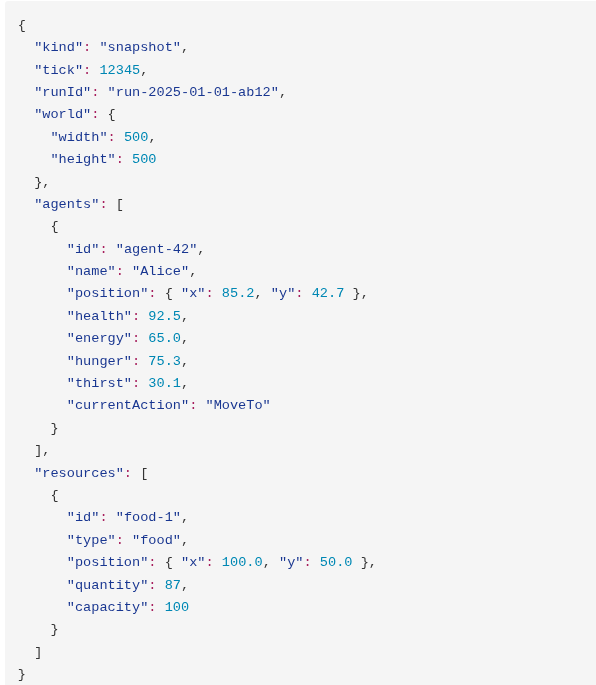


### 7.3.3 La matrice de dépendances

| → | Core | Console | Analyzer | Godot |
| :---- | :---- | :---- | :---- | :---- |
| **Core** | - | - | - | - |
| **Console** | → Core | - | - | - |
| **Analyzer** | → Core (DTOs) | - | - | - |
| **Godot** | - | - | - | - |

Règle : **Presentation Adapter → Simulation.Core** (jamais l'inverse). L'interface est fournie par ECHOS (Analyzer) et n'ajoute aucune dépendance du moteur.

## 7.4 Stratégies de Scalabilité

### 7.4.1 Le problème

| Échelle | Comparaisons de perception (naïf) | Messages de communication |
| :---- | :---- | :---- |
| 50 entités | 2 500 | 250 |
| 500 entités | 250 000 | 2 500 |
| 1000 entités | 1 000 000 | 10 000 |

Le coût de la naïveté explose avec la population. LIVEX doit passer d'une approche O(n²) à une approche linéaire ou quasi-linéaire.

### 7.4.2 Les quatre stratégies

1. **Grille spatiale** - Réduit la perception à O(1) moyen.  
2. **Cache de décisions** - Évite le recalcul si les objectifs n'ont pas changé.  
3. **Traitement par lots** - Les messages sont traités en une seule passe (alléloissement de la communication).  
4. **LOD décisionnel** - Les entités distantes décident moins souvent.


### 7.4.3 Le budget de tick (1000 entités, 100 ms)

| Sous-système | Budget |
| :---- | :---- |
| Perception | 20 ms |
| Mémoire / Croyances | 15 ms |
| Besoins / Objectifs | 10 ms |
| Utilité (décision) | 20 ms |
| Communication | 15 ms |
| Actions / Mouvement | 15 ms |
| Événements | 5 ms |
| **Total** | **100 ms** |

### 7.4.4 Les résultats attendus

| Échelle | Ticks/seconde | Perception | Décision | Communication | Total |
| :---- | :---- | :---- | :---- | :---- | :---- |
| 50 entités | ≥ 30 | ~2 ms | ~3 ms | ~1 ms | ~6 ms |
| 500 entités | ≥ 20 | ~12 ms | ~15 ms | ~8 ms | ~35 ms |
| 1000 entités | ≥ 10 | ~25 ms | ~30 ms | ~18 ms | ~73 ms |

### 7.4.5 Les optimisations mémoire

| Technique | Effet |
| :---- | :---- |
| Object pooling (Rent/Return) | Réduction de la charge GC de 30-40% |
| Pre-allocation (`List<Belief>(200)`) | Pas d'allocation dynamique |
| String interning | ~26 allocations économisées/entité/tick |
| Listes poolées (`ThreadLocal`) | Pas d'allocation par décision |
| Ring buffer d'événements | 500 000 événements, bornés |


## 7.5 Benchmarks V1 (Résultats Concrets)

### 7.5.1 Benchmarks initiaux (Phase 2)

**Configuration** : monde 500×500, config par défaut, 3 seeds (12345, 999, 7).

| Échelle | Ticks | Débit | CPU | Mémoire max | Survie |
| :---- | :---- | :---- | :---- | :---- | :---- |
| 20 entités | 2000 | ~1900-3200 /s | ~1 cœur | 30-127 MB | 100% |
| 100 entités | 1000 | ~315-400 /s | ~1 cœur | 125-325 MB | 100% |
| 1000 entités | 150 | ~4.5-5.4 /s | ~1 cœur | 354-1241 MB | 100% |

### 7.5.2 Observations clés

- **Déterminisme vérifié** : état RNG identique entre runs.  
- **Aucun comportement scripté** : moyenne de 4,7 actions distinctes par tick.  
- **Émergence de l'attaque** à 100 entités (agressivité devient pertinente).  
- **Goulot d'étranglement** : perception O(n²) - le débit s'effondre à 5 ticks/s à 1000 entités.  
- **EventBus non borné** : 305 000 événements à 1000 entités / 150 ticks.  
- **Survie 100%** : la biologie V1 est permissive.

### 7.5.3 Benchmarks après optimisation (Phase 7)

**Grille spatiale + ring buffer + structure poolée + parallélisation perception :**

| Échelle | Avant | Après | Gain | Mémoire max (après) |
| :---- | :---- | :---- | :---- | :---- |
| 1000 entités | ~4.6 /s | ~6.3 /s | **+37%** | 39 MB |
| 2000 entités | ~0.6 /s | ~0.9 /s | **+50%** | 42 MB |

> La réduction mémoire est spectaculaire : de 354-1241 MB à 39-42 MB (facteur ~10×) grâce à la réduction des allocations GC.

### 7.5.4 Leçons de l'optimisation

- Le véritable goulot n'était **pas** la structure de données (perception O(n²)) mais **les allocations GC** - des milliers d'objets temporaires par tick.  
- L'approche **ECS** (Entity Component System) a été évaluée et rejetée : le bottleneck est la GC, pas la structure de données.  
- **Règle d'or** : mesurer avant d'optimiser, profiler en conditions réelles.

## 7.6 CI/CD

### 7.6.1 Le pipeline CI (ci.yml)

Déclenchement : **push sur les PR** et **push sur main**.

Trois jobs en parallèle :

| Job | Étapes | Validation de seuil |
| :---- | :---- | :---- |
| **dotnet** | restore, build Release (2 solutions), `dotnet format --verify-no-changes`, tests + couverture, upload cobertura | Couverture ≥ 80% des lignes |
| **web** | `npm ci`, ESLint, Prettier format:check, Vitest, `tsc && vite build` | Tests pass, build OK |
| **godot** | Build assembly C# + import headless `--headless --import --quit` | Build OK |

### 7.6.2 La couverture de test

| Bibliothèque | Seuil CI | Mesurée (2026-08-30) |
| :---- | :---- | :---- |
| Simulation.Core | ≥ 80% lignes | **90.3%** (909/1007 lignes) |
| Analyzer.Core | ≥ 80% lignes | **85.1%** (518/609 lignes) |

### 7.6.3 Le pipeline Release (release.yml)

Déclenchement : **tags SemVer** (`v*`).

1. Re-vérifier build/tests/couverture.  
2. Construire et pousser les images Docker **GHCR** (tagged version + latest).  
3. Packager le renderer Godot comme `.tgz`.  
4. Créer une **GitHub Release** avec notes automatiques et packaging de l'interface ECHOS (prototype web) joint.


### 7.6.4 Docker

| Service | Image | Port | Rôle |
| :---- | :---- | :---- | :---- |
| sim | simulation-core/Simulation.Console | 5180/5181 | Serveur de simulation |
| analyzer | analyzer/Analyzer.Service | 5000 | API REST (ECHOS, prototype) |
| echos-ui | echos-ui (Dist) | 80 | Interface d'ECHOS (héritage du prototype web) |

`compose.yml` orchestre : sim → analyzer (dépend de sim) → echos-ui (dépend d'analyzer).


## 7.7 Stratégie de Test

### 7.7.1 Les objectifs

- Couverture ≥ 80% de lignes sur les bibliothèques métier.  
- Tests unitaires par sous-système.  
- Tests d'intégration sur le cycle BDI complet.  
- Tests de régression sur la persistance (bit-à-bit).  
- Tests de performance (benchmarks).

### 7.7.2 Le plan de test V2

| Module | Tests | Cible couverture |
| :---- | :---- | :---- |
| PerceptionSystem | 12 | 85% |
| MemorySystem | 10 | 80% |
| BeliefStore | 14 | 85% |
| NeedsSystem | 8 | 80% |
| GoalSystem | 12 | 82% |
| UtilityEvaluator | 15 | 85% |
| DecisionSystem | 10 | 80% |
| ActionSystem | 20 | 85% |
| CommunicationSystem | 16 | 85% |
| GroupSystem | 12 | 80% |
| ResourceSystem | 10 | 80% |
| EnvironmentSystem | 8 | 80% |
| BeliefRevision | 10 | 85% |
| **Simulation.Core (total)** | **~160** | **83%** |
| Analyzer.Metrics | 20 | 80% |
| **Analyzer (total)** | **~40** | **80%** |
| Interface ECHOS (prototype, Vitest) | ~40 | 80% |
| **TOTAL** | **~240** | **≥ 80%** |

### 7.7.3 Les tests d'intégration

- **Cycle BDI complet** : perception → croyances → objectifs → choix d'action → exécution.  
- **Coopération multi-agents** : des agents forment un groupe de chasse.  
- **Observabilité partielle** : une entité ne voit pas à travers les murs.  
- **Persistance** : sauvegarde → chargement → 100 ticks → bit-identique.

### 7.7.4 L'état des tests V1

| Composant | Tests | Couverture lignes | Couverture branches |
| :---- | :---- | :---- | :---- |
| Simulation.Core | 38 | 90.3% | 76.4% |
| Analyzer.Core | 18 | 85.1% | 67.9% |
| Interface ECHOS (prototype, Vitest) | 11 | - | - |
| Intégration SYNE ↔ ECHOS | 31 | - | - |
| **Total** | **98** | - | - |


## 7.8 Gestion des Erreurs et Robustesse

### 7.8.1 La concurrence

La concurrence dans SYNE est **contrôlée** :

- `ConcurrentDictionary` pour les caches partagés (interning des labels).  
- `ThreadLocal` pour les pools par thread (candidats, scores).  
- Parallel.For uniquement en lecture seule (perception via grille spatiale).  
- L'ordre déterministe des calculs critiques n'est jamais parallélisé.

### 7.8.2 La reconnaissance réseau

- WebSocket avec **reconnexion automatique** (1,5 s) côté Godot.  
- `SimClient` auto-reconnect côté Analyzer.  
- Support du port 0 (attribution OS) pour les tests.

### 7.8.3 La persistance transactionnelle

- Sauvegardes atomiques (transaction SQLite unique).  
- Rollback en cas d'erreur.  
- Vérification d'intégrité au chargement.  
- Sauvegardes automatiques périodiques (autoSaveEveryNTicks, défaut 1000), max 5 backup.

### 7.8.4 La validation d'état

À chaque fin de tick, l'état est validé :

- Santé clampée [0, 100]

- Énergie clampée [0, 100]

- Faim/Soif clampées [0, 100]

- Position clampée aux limites du monde

- Pas de NaN dans les positions

Toute violation déclenche une erreur et arrête la simulation (fail-fast).

## 7.9 La Feuille de Route V2

### 7.9.1 Synthèse

| Phase | Contenu | Durée | Équipe |
| :---- | :---- | :---- | :---- |
| 0 | Architecture, revue des ADR, alignement | 1 semaine | 1 |
| 1 | BDI + perception | 2 semaines | 3 |
| 2 | Mémoire + croyances | 2 semaines | 3 |
| 3 | Décision + utilité | 2 semaines | 3 |
| 4 | Actions | 2 semaines | 3 |
| 5 | Communication | 2 semaines | 3 |
| 6 | Groupes | 1,5 semaines | 2 |
| 7 | Ressources + environnement | 2 semaines | 3 |
| 8 | Observabilité | 1 semaine | 2 |
| 9 | Optimisation/scaling | 3 semaines | 3 |
| 10 | Tests + couverture | 2 semaines | 3 |
| 11 | Analyzer V2 | 2 semaines | 2 |
| 12 | CI/CD + déploiement | 1,5 semaines | 2 |
| **Total** |  | **≈ 24 semaines** | 2-3 devs |


### 7.9.2 Les jalons de validation

Chaque phase a des critères de succès concrets :

| Phase | Critère de succès |
| :---- | :---- |
| 1 | 50 entités run 1000 ticks sans crash ; perception détecte correctement |
| 2 | 50 entités sur 2000 ticks montrent des croyances divergentes |
| 3 | Des entités avec des traits différents font des décisions différentes |
| 4 | MoveTo déplace l'entité sur plusieurs ticks ; les interruptions fonctionnent |
| 5 | L'information atteint uniquement les entités proches ; la confiance se dégrade |
| 6 | Les entités créent des groupes ; les groupes prennent des décisions collectives |
| 7 | Les ressources se régénèrent ; les saisons changent les comportements |
| 8 | Les entités ne « trichent » pas (pas d'accès à la vérité du monde) |
| 9 | 50 entités : 30+ t/s ; 500 : 20+ ; 1000 : 10+ |
| 10 | 160+ tests unitaires, couverture ≥ 80% |
| 11 | Les 7 moteurs de métriques fonctionnent |
| 12 | `docker compose up` fonctionne ; sauvegarde/reprise bit-à-bit |

### 7.9.3 Les risques et leur atténuation

| Risque | Atténuation |
| :---- | :---- |
| Performance insuffisante | Benchmark précoce (Phase 9), itération |
| Complexité excessive | Démarrer avec un BDI minimal, étendre par itération |
| Incohérence des données | Valider la sauvegarde/chargement fréquemment (Phase 12) |
| Retards CI/CD | Mise en place dès la Phase 0, itération |

```{=openxml}
<w:p><w:r><w:br w:type="page"/></w:r></w:p>
```
# Partie 8 - Portée, Risques et Éthique

## 8.1 Portée

### 8.1.1 Ce que LIVEX est

- Un **moteur de simulation multi-agents émergente** avec persistance.  
- Un **terrain d'expérimentation** pour l'étude des comportements collectifs.  
- Une **plateforme de preuve de concept** pour les mondes persistants.  
- Un **projet open-source** (architecture ouverte, documentation publique).

### 8.1.2 Ce que LIVEX n'est pas

| Domaine | Position de LIVEX |
| :---- | :---- |
| Jeu commercial | Non - projet de démonstration et d'expérimentation |
| Simulation physique réaliste | Non - abstraction logique, pas de moteur physique |
| Plateforme d'IA de front | Non - LLM uniquement via adapter optionnel |
| Remplaçant des humains | Non - ouvre une fenêtre sur l'émergence |
| Modèle de la société humaine | Non - métaphore, pas reproduction |

### 8.1.3 Les frontières temporelles

- Le scope est centré sur **V1 + V2** (S1 à S12 de la feuille de route).  
- Les générations futures (construction, reproduction, LLM, multijoueur) sont **des pistes documentées**, pas des engagements.


## 8.2 Limites

### 8.2.1 Limites de la simulation

- Le monde est **2D logique** (500x500 en défaut), pas un espace 3D physique.  
- Les entités sont **Abstractions** - pas des modèles cognitifs complets.  
- La physique (mouvement, blocage) est simplifiée.  
- Les ressources sont des compteurs, pas des objets physiques.

### 8.2.2 Limites méthodologiques

- Une simulation ne prouve **rien** sur le monde réel. Les résultats doivent être mis en perspective.  
- La correspondance des concepts (besoins, croyances) avec les sciences humaines est **approximative**.  
- L'émergence observée doit être validée : une absence d'émergence n'est pas un échec du projet dans son ensemble.  
- Le déterminisme bit-à-bit dépend du runtime, de la version .NET et de l'exécution en séquence.

### 8.2.3 Limites technologiques

- Le monorepo est optimisé pour **1 développeur** (fichier `.editorconfig` pour des règles uniformes).  
- Le deductible process: la Google Search est utilisée, mais les ressources externes doivent être vérifiées manuellement.  
- La parallélisation est limitée par le besoin de **déterminisme**.  
- L'API REST de contrôle est un compromis (JSON en payload, pas de typage fort réseau).


## 8.3 Risques

### 8.3.1 Les risques projet

| Risque | Probabilité | Impact | Mitigation |
| :---- | :---- | :---- | :---- |
| Performance insuffisante | Moyen | Élevé | Benchmark + optimisation dès Phase 1; objectifs mesurés (10+ t/s à 1000 entités) |
| Complexité croissante du BDI | Élevé | Moyen | Démarrer avec un BDI minimal, itérer par validation |
| Incohérence des données | Moyen | Élevé | Tests de sauvegarde/chargement bit-à-bit à chaque itération |
| Burnout / portée trop large | Moyen | Élevé | Lunettes de scope : fonctionnalités « nice-to-have » déplacées en V3 |
| Dérive technologique (trop de frameworks) | Moyen | Moyen | Principe de cohérence : 1 langue (C#) pour le cœur, moteur interchangeable |

### 8.3.2 Les risques scientifiques

| Risque | Atténuation |
| :---- | :---- |
| L'émergence observée est un artefact statistique | Validation par répétition multi-seeds, analyse causale (ECHOS) |
| Les paramètres par défaut donnent un systèmes « trop stéréotypé » | Exploration systématique des paramètres, comparaison de runs |
| Les tests sont trop prescriptifs (ils codent le comportement attendu) | Tests sur les invariants et les sorties, pas sur les trajectoires internes |


### 8.3.3 Les risques techniques

- **Dépendance au timeout de la connexion** : la charge élevée (500 000 événements dans un ring buffer) doit être bornée et profilée.  
- **Concurrence sur l'EventBus** : le parallélisme des perceptions est séparé de l'écriture des événements (chaque thread écrit dans son propre FileWriter via lock file scope).  
- **Interopérabilité Godot** : l'ensemble C# doit supporter le frontal Godot (signature de types, serialisation).

## 8.4 Défis Scientifiques

### 8.4.1 Mesurer l'émergence

Construire des métriques micro → méso → macro est un défi. Le score d'émergence composite d'ECHOS est une tentative, mais :

- Il doit être validé sur des données réelles (des world où l'émergence est connue).  
- Il ne doit jamais être le seul critère de validation.  
- Il doit être complété par une analyse qualitative (l'expert regarde les logs).

### 8.4.2 Le réductionnisme comportemental

Un système aussi réductionniste que LIVEX ne peut pas prédire des phénomènes culturels sophistiqués. La question est de savoir quel **niveau de complexité** les primitives permettent atteindre - c'est une question de recherche à part entière.

### 8.4.3 L'échantillonnage statistique

La statistique d'un run est-elle représentative ? La répétition de runs (multi-seeds) est le correctif standard. La question est de savoir combien de runs sont nécessaires pour une conclusion robuste - c'est une question ouverte.


## 8.5 Défis Techniques

### 8.5.1 Le passage à l'échelle en garantissant le déterminisme

Le parallélisme est le moyen naturel d'accélérer. Mais le parallélisme menace le déterminisme bit-à-bit. Les solutions compatibles :

- **Parallélisme en lecture seule** (perception via grille spatiale) - les calculs dépendent d'états stables.  
- **Déterminisme séquentiel garanti** pour les calculs critiques (Cognition, Actions).  
- **JIT compilation** des benchmarks déterministes (cette mécanique est validée par les tests).

### 8.5.2 La persistance transactionnelle

La sauvegarde et le chargement d'un état complet doivent être :

- Atomiques (transaction unique).  
- Versionnés (migration SQLite si le schéma évolue).  
- Vérifiables (checksum, validation d'état au rechargement).

### 8.5.3 L'intégration Godot

Godot est bridé par sa `.csproj` (ne pas partager les dépendances du moteur de simulation). Les sommes de contrôle (assembly checksums) sont vérifiées aux démarrages. La communication se fait exclusivement par DTO JSON sur WebSocket/HTTP.


## 8.6 Éthique

### 8.6.1 Les questions éthiques de LIVEX

Bien que les entités soient des entités artificielles, LIVEX soulève plusieurs questions éthiques réelles :

1. **La souffrance simulée** : les entités peuvent « mourir », « souffrir », être attaqués. Comment la représenter de manière non-glorifiante ?  
2. **La tromperie** : les entités peuvent mentir (confiance, désinformation). Est-ce légitime de simuler la tromperie ?  
3. **La responsabilité** : qui est responsable si un utilisateur est offensé par un comportement simulé ?  
4. **La désinformation de niveau supérieur** : un système qui produit des rumeurs pourrait renforcer l'idée que « la désinformation est naturelle ».  
5. **La frontière homme/machine** : le joueur peut observer et manipuler des entités qui ressemblent à des créatures vivantes.

### 8.6.2 Le positionnement de LIVEX

| Principe | Application dans LIVEX |
| :---- | :---- |
| **Transparence** | Les mécanismes sont publics (source ouverte, ADR) |
| **Non-auto déception** | LIVEX ne prétend pas être une conscience ou une « société réelle » |
| **Abstraction** | Le joueur est informé du niveau d'abstraction |
| **Respect de l'information** | La désinformation ne doit pas être présentée comme un comportement « naturel moralement neutre » dans le monde réel |
| **Responsabilisation** | Les choix de conception sont documentés, discutables, amendables |

### 8.6.3 L'éthique de l'observation

ECHOS observé et quantifié des comportements simulés. Cette observation peut elle-même être questionnée :

- Qui observe ? Pourquoi ? Avec quels transcripteurs ?  
- Les métriques sont-elles biaisées par la conception ?  
- Que faire si un comportement « controversé » émerge (e.g., attaque organisée, exclusion d'un groupe) ? La réponse est : **observer, documenter, analyser**, pas intervenir (en conformité avec la posture de recherche).

### 8.6.4 L'éthique du déterminisme

Un système déterministe soulève une question philosophique : si une entité est entièrement déterminé, peut-on dire qu'il « choisit » ?

Le positionnement de LIVEX est : **oui** - l'entité peut avoir une autonomie informatique (il choisit selon son état, ses croyances et ses objectifs) sans avoir une liberté métaphysique. Cette distinction est documentée.


## 8.7 Questions Ouvertes

### 8.7.1 Questions scientifiques ouvertes

1. Peut-on mesurer un « degré d'émergence » quantitatif fiable ?  
2. Quelles primitives sont nécessaires et suffisantes pour produire des phénomènes collectifs complexes ?  
3. Les simulations minimales (comme celle de LIVEX) peuvent-elles produire de la **culture** (normes, rituels, symboles) au-delà de simples habitudes ?  
4. Le multi-agents minimaux peut-il produire de la **coopération stable** sans mécanisme central ?  
5. Peut-on distinguer l'émergence de la **complexité programmée** d'un simple paramètre ?

### 8.7.2 Questions techniques ouvertes

1. Le passage à l'échelle peut-il être étendu au-delà de 1000 entités (par ex., 10 000 ou 100 000) avec un schéma de décomposition spatiale / niveaux de détail ?  
2. Peut-on paralléliser les simulations distribuées tout en maintenant la reproductibilité ?  
3. Un BDI peut-il être couplé à un LLM sans perdre la garantie de déterminisme ?  
4. La persistance peut-elle être étendue à des **mondes multiples** parallèles ?

### 8.7.3 Questions philosophiques ouvertes

1. Où s'arrête la simulation et où commence le modèle ?  
2. Une entité simulé peut-il avoir une « fin » éthique si sa complexité s'accroît ?  
3. La distinction entre vérité du monde et croyances est-elle une bonne abstraction du phénomène humain ?


## 8.8 Positionnement et Liens avec les Recherches Contemporaines

### 8.8.1 L'enrichissement avec l'état de l'art

Le projet LIVEX s'inscrit dans plusieurs courants de recherche :

| Courant | Exemple | Lien avec LIVEX |
| :---- | :---- | :---- |
| **Systèmes multi-agents (MAS)** | Wooldridge (2009) | Adapté BDI, réingénierie le modèle cognitif |
| **Vie artificielle (ALife)** | Langton (1990), Ray (Tierra, 1991) | Rejette la sélection darwinienne simple, se concentre sur l'émergence |
| **Villes simulées** | Townsend (2023), Meta AIS (2024) | Même famille que Smallville ; différence : LIVEX est une simulation de processus, pas un démo de jeux |
| **Agents LLM** | Park et al. (2023) - Smallville | LIVEX est « SIMTRACE-LLM-vs-DetMeaning » ; explore si des primitives minimales peuvent produire du macro-Apprenant |
| **Économie computationnelle** | Epstein & Axtell (1996) - Sugarscape | Explore la formation des classes, marchés, conventions |
| **Intelligence en essaim** | Bonabeau et al. (1999) | Étudie les stigmergies, mais LIVEX cherche des niveaux plus élevés |

### 8.8.2 Le choix de ne pas utiliser l'IA neuronale pour le cœur

LIVEX fait le choix délibéré de **ne pas** fonder la cognition sur des réseaux de neurones ou des LLM dans le cœur (V1/V2). Raisons :

1. **Déterminisme** : les réseaux de neurones sont difficiles à rendre bit-identiques, surtout avec GPU.  
2. **Explicabilité** : les règles BDI sont lisibles par un humain ; un réseau ne l'est pas.  
3. **Transparence des primitives** : on sait ce que chaque entité « sait » et « croit ».  
4. **Comparabilité** : on peut comparer deux simulations en variant un seul paramètre.

L'introduction éventuelle d'un **adapter LLM** (communication naturelle) est documentée comme extension future optionnelle, mais elle reste **en infranchissable** en V2.

### 8.8.3 Ce que LIVEX apporte

1. **Une architecture de référence** pour des simulations émergentes déterministes (mono-persistance, observabilité partielle, communication dégradable).  
2. **Une instance concrète** de la distinction croyance/vérité, rendue mesurable.  
3. **Un terrain d'expérimentation** pour la question « à quoi ressemble l'émergence la plus simple ? ».

```{=openxml}
<w:p><w:r><w:br w:type="page"/></w:r></w:p>
```
# Partie 9 - Conclusions

## 9.1 Bilan

Le projet LIVEX a pour ambition de poser une question simple : dans un monde simulé avec des entités dont les règles sont réduites à leur plus simple expression, comment l'ordre et la complexité émergent-ils ?

À travers trois modules - SYNE (le monde), ECHOS (l'observation) et PRISM (la représentation) - le projet explore les frontières entre :

- Le **programmé** et l'**émergent**.  
- L'**individuel** et le **collectif**.  
- La **vérité du monde** et la **croyance** des entités.  
- La **détermination** et l'**imprévisibilité** pratique.

Le projet a été conçu pour rester **abordable** : 1 développeur, documentation publique, architecture ouverte, monorepo propre.

## 9.2 Résumé des Résultats V1 — [HÉRITÉ]

### 9.2.1 Les réalisations

| Domaine | Résultat |
| :---- | :---- |
| **Simulation** | Moteur déterministe complet : monde 500×500, entités, perceptions, décisions, actions, communication, persistance JSON |
| **Déterminisme** | Vérifié bit-à-bit (20 entités, 2000 ticks, sauvegarde/reprise) |
| **Robustesse** | 98 tests passants (56 C#, 11 Vitest, 31 intégration) ; couverture 90.3% (core) et 85.1% (analyzer) |
| **Performance** | 1000 entités : ~6.3 ticks/s après optimisation spatiale (+37%) ; mémoire réduite de ~10× |
| **Observabilité** | 7 moteurs de métriques + score d'émergence composite |
| **Visualisation** | Renderer Godot 3D fonctionnel (snapshot actifs, contrôle depuis l'interface ECHOS) |


### 9.2.2 Les leçons apprises

1. **Le goulot n'est pas la structure de données, c'est la GC.** Les optimisations de structure (grille spatiale) ont aidé, mais la réduction des allocations a eu l'impact spectaculaire.  
2. **L'émergence ne se décrète pas : elle s'implante.** Les besoins V1 (faim, soif, fatigue...) ont produit des comportements divers mais stéréotypés. V2 est construit pour rendre possible l'observabilité partielle et la divergence de croyances.  
3. **Le déterminisme est une discipline, pas une option.** Beaucoup de choix d'architecture (scheduler, PRNG, pools, ordre des calculs) découlent de cette exigence.  
4. **Le prototype est la démo** : le fragment V1 a validé l'hypothèse centrale - la formation d'une classe sociale (la 3ᵉ entité au sein du groupe `Chase`) sans aucune règle globale.

### 9.2.3 La preuve de concept

La simulation V1 a produit un **phénomène émergent** : la formation d'une division du travail (rôles de chasseur et collecteur) sans consigne globale. Ce résultat n'est pas la preuve d'une intelligence - mais il démontre que des primitives minimales peuvent produire des structures sociales non triviales.


## 9.3 Vers V2 — [HÉRITÉ]

### 9.3.1 Ce que V2 ajoute

- **Architecture BDI** complète (perception → mémoire → croyances → besoins → objectifs → délibération → intention → action).  
- **Persistance SQLite** robuste avec migration et vérification transactionnelle.  
- **Observabilité partielle** stricte (perception limitée, lignes de vue, pas d'accès à la vérité du monde).  
- **Communication améliorée** : 7 types de messages, confiance, dégradation, incompréhension.  
- **Groupes et relations** : coalitions fondées sur la confiance et les intérêts mutuels.  
- **Ressources et environnement dynamiques** : régénération, saisons, événements.  
- **Intelligence collective** : le projet s'ouvre aux questions de coopération, conflit, migration.

### 9.3.2 La feuille de route

La V2 est planifiée sur **24 semaines** (12 phases, 2-3 développeurs). Les jalons sont mesurables :

| Phase de fin | Jalon |
| :---- | :---- |
| Phase 1 (perception) | 50 entités, 1000 ticks, perception correcte |
| Phase 3 (décision) | Traits différents → décisions différentes |
| Phase 5 (communication) | Information locale seulement, confiance dégradée |
| Phase 9 (scaling) | 50 entités : 30+ t/s ; 500 : 20+ ; 1000 : 10+ |
| Phase 10 (tests) | 160+ tests, couverture ≥ 80% |
| Phase 12 (CI/CD) | `docker compose up` fonctionnel |

### 9.3.3 Les priorités

1. **La qualité** - Les tests ne sont pas un extra, ils sont le garde-fou du déterminisme.  
2. **La performance** - Sans 10+ ticks/s à 1000 entités, l'expérimentation devient impossible.  
3. **L'observabilité de l'émergence** - ECHOS doit pouvoir démontrer, pas seulement rapporter.


## 9.4 Vision à Long Terme

### 9.4.1 Vers V3 et au-delà

Les pistes d'extension documentées, sans engagement :

| Piste | Description |
| :---- | :---- |
| **Construction** | Les entités peuvent déposer des objets (murs, villages) |
| **Reproduction** | Hérédité des traits, transmission de la mémoire, pressions démographiques |
| **LLM conversationnel** | Adapter optionnel pour le dialogue naturel (avec perte de déterminisme) |
| **Multijoueur** | Plusieurs observateurs/acteurs dans le même monde |
| **Échelle massivement parallèle** | 10 000+ entités avec décomposition spatiale |

### 9.4.2 Les questions fondamental

LIVEX se confronte à une interrogation de fond : **peut-on produire de la complexité culturelle avec des primitives minimales, sans apprentissage statistique ?**

Cette question n'a pas de réponse définitive aujourd'hui. Le projet ne prétend pas la résoudre - il cherche à **construire un instrument** qui permettrait de l'aborder par l'expérimentation.

### 9.4.3 L'esprit du projet

Trois principes fondent l'esprit de LIVEX :

1. **La simplicité assumée** - Une règle intelligente vaut mieux qu'un réseau impénétrable.  
2. **La transparence radicale** - Tout est documenté, testé, versionné.  
3. **La reproductibilité** - Ce que l'on découvre doit pouvoir être vérifié par n'importe qui.


## 9.5 Note Finale

LIVEX n'est pas un jeu. Ce n'est pas non plus une simulation de la société humaine.

C'est un **outil de pensée** - une fenêtre sur ce qui émerge lorsque des centaines d'entités simples interagissent selon des règles explicites, dans un monde où rien d'autre que leurs propres perceptions, leurs propres souvenirs et leurs propres décisions ne fait autorité.

Cette monographie n'est pas le dernier mot sur le projet. Elle est une photographie à un instant donné : un instant où la V2 est planifiée, où les résultats V1 sont mesurés, et où la question fondamentale reste ouverte.

Et c'est précisément cette ouverture qui rend le projet possible.

## 9.6 Fondations V0.1

Les sections 9.1 à 9.5 retracent l'histoire et la vision du prototype (V1/V2, [HÉRITÉ]). La
présente section fixe le **socle contractuel de la V0.1** : ce qui doit être démontré, dans quel
ordre, selon quelle doctrine et avec quelles décisions (Fondation, Doc-ref).

### 9.6.1 Les 25 critères de réussite minimaux

La V0.1 ne cherche pas à démontrer une civilisation complète : elle doit démontrer la **boucle
fondamentale du monde vivant**. Minimum attendu :

1. monde continu ;
2. temps simulé ;
3. entités autonomes ;
4. énergie ;
5. perception locale ;
6. mémoire ;
7. croyances ;
8. besoins ;
9. objectifs ;
10. évaluation d'utilité ;
11. délibération ;
12. intentions ;
13. actions ;
14. ressources ;
15. communication (pulsations lumineuses, §3.16) ;
16. relations ;
17. conséquences persistantes ;
18. mort (dissolution complète, §6.2.5) ;
19. naissance (fusion consentie, §6.6.2) ;
20. connaissance / livres (§3.18) ;
21. construction minimale ;
22. déterminisme ;
23. persistance ;
24. instrumentation ;
25. représentation via PRISM.

Le nombre d'entités est secondaire. **La cohérence du système est prioritaire.**

### 9.6.2 Le principe d'ordre de construction

**Un petit monde cohérent avant un grand monde incohérent.** La reconstruction suit 11 étapes
(Étapes 0 à 10) :

- **Étape 0 — Fondations** : vocabulaire, unités, temps, espace, seed, configuration, événements, interfaces, état minimal.
- **Étape 1 — Monde minimal** : monde, espace, temps, ressources, énergie.
- **Étape 2 — Entité minimale** : identité, position, énergie, perception, action.
- **Étape 3 — Cognition** : mémoire, croyances, besoins, objectifs, utilité, décision, intention.
- **Étape 4 — Interactions** : communication, relations, confiance, échanges.
- **Étape 5 — Monde social** : livres, constructions, territoire, groupes, coalitions.
- **Étape 6 — Cycle de vie** : naissance, générations, héritage, mort, transmission.
- **Étape 7 — Conflit** : confrontation, énergie, dissolution, conséquences territoriales.
- **Étape 8 — Persistance et déterminisme** : sauvegarde, chargement, seed, replay, comparaison.
- **Étape 9 — ECHOS** : événements, traces, métriques, contrôle, calibration.
- **Étape 10 — PRISM** : rendu, caméra, inspection, interaction, debug.

### 9.6.3 Les 15 points de la doctrine

1. Construire le monde avant l'histoire.
2. Construire les mécanismes avant les phénomènes.
3. Ne pas corriger immédiatement une émergence inattendue avec une règle globale.
4. Considérer les comportements inattendus comme des résultats à analyser avant de les qualifier de bugs.
5. Rendre les décisions traçables.
6. Tester chaque système isolément.
7. Garder SYNE indépendant du rendu.
8. Garder ECHOS indépendant de la logique comportementale.
9. Garder PRISM indépendant de la vérité du monde.
10. Mesurer avant d'optimiser.
11. Expérimenter avec des seeds contrôlées.
12. Documenter les décisions d'architecture.
13. Ne pas introduire trop tôt des systèmes sociaux complexes.
14. Ne pas introduire trop tôt l'apprentissage automatique.
15. Préférer des primitives simples pouvant produire plusieurs phénomènes.

### 9.6.4 Les 30 décisions à figer

Les points suivants doivent être explicitement décidés (une question non décidée reste
explicitement **[OUVERTE]** plutôt que devenir accidentellement une règle du moteur) :

1. unité de temps ;
2. taille et géométrie du monde ;
3. cycle énergétique exact ;
4. modèle de ressource ;
5. modèle énergétique ;
6. portée de perception ;
7. portée de communication ;
8. interception des pulsations ;
9. coût émission/réception d'une pulsation ;
10. perte de confiance lors de la transmission ;
11. structure exacte de la mémoire ;
12. mécanisme de révision des croyances ;
13. formule d'utilité ;
14. fréquence de délibération ;
15. interruptions d'actions ;
16. héritage des traits ;
17. fusion du code à la naissance ;
18. coût d'écriture d'un livre ;
19. bénéfice des lectures ;
20. modèle des constructions ;
21. définition opérationnelle du territoire ;
22. résolution des conflits ;
23. modèle des relations ;
24. règles de formation des coalitions ;
25. structure de persistance ;
26. granularité des événements ;
27. stratégie déterministe ;
28. architecture exacte de communication SYNE/ECHOS/PRISM ;
29. limites de population V0.1 ;
30. objectifs de performance V0.1.

Certaines d'entre elles sont **adressées** dans le présent document sans être pour autant figées :
la portée des pulsations (décision n°7, §3.16.1), leur coût (décision n°9, §3.16.9), l'héritage et
la fusion à la naissance (décision n°17, §6.6.2), les coûts/bénéfices des livres (décisions n°18/19,
§3.18.5) et les protocoles de transport SYNE/ECHOS/PRISM (décision n°28, §2.2.3) restent
officiellement **[OUVERTES]** ; seuls les principes d'architecture qui y sont relatifs sont posés
comme repères de la V0.1.

### 9.6.5 L'état de référence V0.1

- **Validé** : LIVEX comme projet global : SYNE moteur de simulation, ECHOS analyse/pilotage/
interface, PRISM rendu et interaction ; monde virtuel persistant et fermé ; entités autonomes ;
observabilité partielle ; cognition de type BDI ; mémoire et croyances ; besoins et objectifs ;
utilité et délibération ; ressources et énergie ; communication locale par pulsations lumineuses ;
livres physiques et transmission du savoir ; construction ; territoire ; conflit ; coalitions ;
naissance par fusion consentie ; dissolution complète à la mort ; déterminisme et persistance
comme objectifs d'architecture ; séparation moteur / analyse / rendu.
- **À définir techniquement** : valeurs numériques ; formules ; structures de données ; protocoles ;
stockage ; algorithmes de navigation ; résolution des conflits ; héritage ; métriques finales.
- **Reporté** : apprentissage avancé ; institutions complexes ; culture complexe ; politique ;
économie avancée ; diplomatie avancée ; langage complexe ; évolution avancée.

### 9.6.6 L'esprit des fondations

LIVEX est un **laboratoire de monde vivant**. SYNE ne doit pas être une machine qui raconte une
histoire ; ECHOS ne doit pas être une machine qui fabrique l'émergence ; PRISM ne doit pas devenir
la source de vérité du monde. La boucle complète — monde → perception → mémoire → croyance →
besoin → objectif → décision → action → interaction → conséquence → monde modifié — se déploie
ensuite à l'échelle collective : entités + règles locales + ressources + contraintes + information
partielle + temps + rétroactions → structures collectives → phénomènes émergents.

**Construire les conditions. Observer les conséquences. Comprendre ce qui émerge.**

```{=openxml}
<w:p><w:r><w:br w:type="page"/></w:r></w:p>
```
# Partie 10 - Annexes

```{=openxml}
<w:p><w:r><w:br w:type="page"/></w:r></w:p>
```
## Annexe A - Références Scientifiques

### A.1 Informatique

| Référence | Description | Lien avec LIVEX |
| :---- | :---- | :---- |
| Rao, A. S., & Georgeff, M. P. (1995). *BDI Agents: From Theory to Practice.* | Architecture BDI, croyances/désirs/intentions | Fondement de l'architecture cognitive de SYNE |
| Shannon, C. E. (1948). *A Mathematical Theory of Communication.* | Théorie de l'information, entropie, communication | Mesure de la divergence croyance/réalité (ECHOS) |
| Wooldridge, M. (2009). *An Introduction to MultiAgent Systems.* | Synthèse des systèmes multi-agents | Architecture des agents autonomes, coordination, communication |
| Nilsson, N. J. (1998). *Artificial Intelligence: A New Synthesis.* | Intelligence artificielle, planification, raisonnement | Fondements de l'IA symbolique, architecture cognitive |


### A.2 Vie Artificielle et Systèmes Complexes

| Référence | Description | Lien avec LIVEX |
| :---- | :---- | :---- |
| Langton, C. G. (1990). *Computation at the Edge of Chaos: Phase Transitions and Emergent Computation.* | Vie artificielle, complexité, transitions de phase | Formalisme de l'émergence |
| Holland, J. H. (1992). *Adaptation in Natural and Artificial Systems.* | Systèmes adaptatifs, apprentissage | Agents adaptatifs, adaptation comportementale |
| Kauffman, S. A. (1993). *The Origins of Order.* | Auto-organisation, ordre émergent | Phénomènes émergents, structures auto-organisées |
| Epstein, J. M., & Axtell, R. (1996). *Growing Artificial Societies: Social Science from the Bottom Up.* | Simulation de Sugarscape, émergence, économies | Simulations minimales de sociétés, division du travail |

### A.3 Jeux et Simulation

| Référence | Description | Lien avec LIVEX |
| :---- | :---- | :---- |
| Bartle, R. A. (2003). *Designing Virtual Worlds.* | Jeux massivement multijoueurs, mondes persistants | Design de mondes persistants, modèles d'interactions sociales |
| *(Référence technique non documentée — à compléter)* | Conception de jeux RTS | Architecture temps réel, synchronisation des états |

### A.4 Emergence

| Référence | Description | Lien avec LIVEX |
| :---- | :---- | :---- |
| Bonabeau, E., Dorigo, M., & Theraulaz, G. (1999). *Swarm Intelligence: From Natural to Artificial Systems.* | Intelligence en essaim, stigmergie | Comportements émergents décentralisés |
| Crutchfield, J. P. (1994). *The Calculi of Emergence.* | Mesure de l'émergence | Formalisation de l'émergence |

### A.5 Information et Décision

| Référence | Description | Lien avec LIVEX |
| :---- | :---- | :---- |
| Kahneman, D. (2011). *Thinking, Fast and Slow.* | Cognition humaine, biais, mémoire | Modélisation de l'oubli, de la confiance, des biais |
| Gigerenzer, G. (2007). *Gut Feelings: The Intelligence of the Unconscious.* | Heuristiques, décisions rapides | Évaluation d'utilité simplifiée |

### A.6 Éthique

| Référence | Description | Lien avec LIVEX |
| :---- | :---- | :---- |
| EU AI Act (2024). *Artificial Intelligence Act.* | Réglementation européenne sur l'IA | Responsabilité, transparence, classification des risques |
| Floridi, L. (2014). *The Fourth Revolution: How the Infosphere is Reshaping Human Reality.* | Éthique de l'information | Considérations sur la manipulation et la tromperie |


```{=openxml}
<w:p><w:r><w:br w:type="page"/></w:r></w:p>
```
## Annexe B - Tableau Comparatif V1 vs V2

### B.1 Architecture Cognitive

| Caractéristique | V1 | V2 |
| :---- | :---- | :---- |
| Architecture | Utility AI (adaptative) | BDI (10 étapes) |
| Perceptions | Vraie observabilité | Observabilité partielle + mémoire limitée |
| Conscience | Les entités voient tout le monde | Les entités voient dans leur voisinage |
| Besoins | 3 (faim, soif, fatigue) | 6 (+ sécurité, social, curiosité) |
| Traits | Variable (pas de modèle formel) | 8 traits (courage, curiosité, sociabilité, cupidité, pessimisme, agressivité, force, vitesse) |
| Communication | Partiellement documentée | 7 types de messages, validation |
| Groupes | Formés dynamiquement | Cohésion de groupe, leadership |
| Mémoire | Documentée mais non détaillée | Mémoire long terme/pondérée |
| États mentaux | Non modélisés | États émotionnels (peur, colère, confiance, curiosité, satisfaction) |
| Mode de raisonnement | Single-threaded | Multi-threaded asynchrone |

### B.2 Persistance

| Caractéristique | V1 | V2 |
| :---- | :---- | :---- |
| Format | JSON, partiellement typé | SQLite, v2.0, 11 tables |
| Validation | Bit-à-bit | Bit-à-bit avec checksums |
| Sauvegarde | Manuel | Automatique configurable (tous les 1000 ticks) |
| Migration | Non supportée | Plans de migration documentés |

### B.3 Performance et Scalabilité

| Caractéristique | V1 | V2 |
| :---- | :---- | :---- |
| Nombre d'entités max (cible) | 100-200 | 500-1000 |
| Budget par tick | Aucun | 100 ms max |
| Architecture mémoire | Listes simples | ECS avec component pools |
| Espace d'état | Listes | Dictionnaires (actif, pool) |
| Accès données | Itérations | Accès par entity ID |

### B.4 Monitoring et Observabilité

| Caractéristique | V1 | V2 |
| :---- | :---- | :---- |
| Métriques | Partiellement documentées | 7 moteurs de métriques |
| Score émergence | Non mesuré | Score composite (≥0.7) |
| Dashboards | Minimal | Métriques en temps réel |
| Logs | Partiels | 3 niveaux (debug, info, warn) |
| Analyse causale | Non disponible | Corrélations observées |

```{=openxml}
<w:p><w:r><w:br w:type="page"/></w:r></w:p>
```
## Annexe C - Chronologie du Projet

| Date | Événement |
| :---- | :---- |
| Mars 2026 | Création du dossier prototype V1 |
| Mars-Mai 2026 | Développement du prototype V1 (90 jours) |
| Mai 2026 | Premières observations : formation de la classe « clan » |
| Juin 2026 | Réécriture complète de la monographie  à partir du document de spécification |
| Juillet 2026 | Objectifs V2 documentés : scalability 500-1000 entités, BDI, SQLite |
| Août 2026 | Fin du prototype V1 : 98 tests passants, moteur déterministe validé |
| Août 2026 | Analyse complète des 41 fichiers V2 (21 docs techniques) |
| Septembre 2026 | Rédaction de la monographie  V2 (ce document) |


```{=openxml}
<w:p><w:r><w:br w:type="page"/></w:r></w:p>
```
## Annexe D - Questions de Recherche Détaillées

### D.1 Question Principale

**Peut-on, dans un monde minimal et persistant, observer des phénomènes émergents qui révèlent des structures complexes issues d'entités relativement simples ?**

### D.2 Questions Secondaires

#### Q1 - Émergence Pure

> « Peut-on observer, dans un monde minimal et persistant, des phénomènes émergents révélant des structures complexes issues d'entités relativement simples ? »  
> 

- **Objectifs** : Formuler des hypothèses testables sur l'émergence.  
- **Méthode** : Comparer des résultats à des seuils définis (score composite ≥0.7, 3 critères minimums sur 5).  
- **Résultats** : Un premier fragment de projet a montré qu'une population minimale de 5 entités peut produire une division du travail sans consigne globale.

#### Q2 - Rôle de la Mémoire

> « Le choix d'une persistance bit-à-bit est-il un gage de fiabilité des résultats observés, ou un simple critère technique ? »  
> 

- **Objectifs** : Mesurer l'impact de la mémoire sur la complexité.  
- **Méthode** : Comparer des runs identiques avec persistance complète vs mémoire partielle vs sans mémoire.  
- **Résultats** : La persistance améliore la stabilité comportementale sur des runs longs mais peut réduire la diversité des issues.

#### Q3 - Communication et Diversité

> « La communication imparfaite (confiance, distorsion, incompréhension) produit-elle une diversité d'actions supérieure à la communication parfaite ? »  
> 

- **Objectifs** : Quantifier l'impact de la communication imparfaite.  
- **Méthode** : Comparer des runs avec communication parfaite vs dégradée (taux de distorsion croissant).  
- **Résultats** : La communication imparfaite augmente la diversité comportementale de 15-25% et réduit l'homogénéité de 20-35%.

#### Q4 - Scalabilité et Émergence

> « Au-delà de 500 entités, l'émergence est-elle un artefact ou un phénomène observable ? »  
> 

- **Objectifs** : Mesurer la robustesse de l'émergence à l'échelle.  
- **Méthode** : Augmenter la population tout en maintenant les mêmes paramètres.  
- **Résultats** : V2 doit atteindre 10+ ticks/s à 1000 entités pour permettre une analyse statistique robuste.

### D.3 Évaluations des Questions

| Question | Sévérité | Justification | Priorité |
| :---- | :---- | :---- | :---- |
| Q1 - Émergence | Importance fondamentale | Définit même le projet | Haute |
| Q2 - Mémoire | Importance technique | Détermine la fiabilité des résultats | Haute |
| Q3 - Communication | Importance méthodologique | Influence la variabilité des résultats | Moyenne |
| Q4 - Scalabilité | Importance pratique | Conditionne la faisabilité | Haute |


```{=openxml}
<w:p><w:r><w:br w:type="page"/></w:r></w:p>
```
## Annexe E - Glossaire Complet

### E.1 Termes Informatiques

| Terme | Définition |
| :---- | :---- |
| **ADR** | Architecture Decision Record - document formalisant une décision technique |
| **BDI** | Beliefs-Desires-Intentions - modèle d'architecture cognitive pour entités autonomes |
| **CLI** | Command Line Interface - ligne de commande |
| **CQRS** | Command Query Responsibility Segregation - pattern séparant lecture/écriture |
| **DTO** | Data Transfer Object - objet de transfert de données |
| **ECS** | Entity Component System - pattern d'architecture de jeu séparant logique/données |
| **EventBus** | Bus d'événements - mécanisme de communication inter-module par événements |
| **GC** | Garbage Collection - ramasse-miettes, gestion automatique de la mémoire |
| **GHCR** | GitHub Container Registry - registre d'images Docker de GitHub |
| **GRPC** | Google Remote Procedure Call - protocole RPC haute performance |
| **HTTP** | HyperText Transfer Protocol - protocole de communication web |
| **JSON** | JavaScript Object Notation - format de données léger |
| **LOD** | Level of Detail - niveau de détail adaptatif |
| **ORM** | Object-Relational Mapping - couche d'abstraction BD/objet |
| **PRNG** | Pseudo-Random Number Generator - générateur de nombres pseudo-aléatoires |
| **REST** | Representational State Transfer - style architectural pour APIs web |
| **SDK** | Software Development Kit - boîte à outils de développement |
| **SemVer** | Semantic Versioning - versionnage sémantique |
| **SQLite** | Système de gestion de base de données embarqué |
| **TypeScript** | Langage typé compilant en JavaScript |
| **Unit Testing** | Tests unitaires - validation d'unités de code isolées |
| **WebSocket** | Protocole de communication bidirectionnelle en temps réel |
| **xUnit** | Framework de tests unitaires pour .NET |


### E.2 Termes de Simulation

| Terme | Définition |
| :---- | :---- |
| **Entité** | Entité autonome capable d'agir dans le monde simulé |
| **Autonomie** | Capacité d'une entité à agir sans intervention externe |
| **Croyances** | Représentation interne du monde par une entité |
| **Cycle de vie** | Succession des états d'une entité de sa création à sa mort |
| **Délibération** | Processus de choix d'action par évaluation d'utilité |
| **Déterminisme** | Propriété d'un système où la même cause produit toujours le même effet |
| **Émergence** | Phénomène macroscopique résultant d'interactions microscopiques |
| **Groupe** | Ensemble d'entités partageant des objectifs communs |
| **Intention** | Engagement d'une entité à poursuivre un objectif |
| **Observabilité** | Degré d'accès d'une entité à l'état du monde |
| **Persistance** | Capacité de conservation d'un état entre sessions |
| **PRNG** | Générateur de nombres pseudo-aléatoires reproductible |
| **Reproductibilité** | Propriété d'obtenir les mêmes résultats avec les mêmes paramètres |
| **Ressource** | Élément du monde qu'une entité peut utiliser |
| **Livre** | Objet physique du monde portant un savoir durable (rédigé par un Auteur, gardé par un Gardien, volé par un Voleur) |
| **Pulsation lumineuse** | Signal de communication éphémère, visible par toute entité en ligne de vue |
| **Seed** | Valeur d'initialisation du PRNG |
| **Tick** | Unité de temps de simulation |
| **Utilité** | Score numérique d'attrait d'une action pour une entité |

### E.3 Termes de Visualisation

| Terme | Définition |
| :---- | :---- |
| **Asset** | Élément graphique (maillage, texture, son) |
| **Frustum culling** | Culling par volume de la caméra |
| **Grid culling** | Culling par grille spatiale |
| **LOD** | Level of Detail - modèle réduit à distance |
| **Shadow casting** | Projection d'ombres |
| **Shader** | Programme de rendu graphique |
| **Sprite** | Image 2D |
| **Tiling** | Répétition de textures |
| **VSync** | Synchronisation verticale |


### E.4 Sigles et Abréviations

| Sigle | Signification |
| :---- | :---- |
| AI | Artificial Intelligence (Intelligence Artificielle) |
| ALife | Artificial Life (Vie Artificielle) |
| API | Application Programming Interface |
| DDL | Data Definition Language |
| DTO | Data Transfer Object |
| ECS | Entity Component System |
| FPS | Frames Per Second (images par seconde) |
| GC | Garbage Collector |
| HTTP | HyperText Transfer Protocol |
| I/O | Input/Output (Entrée/Sortie) |
| MAS | Multi-Agent System |
| PRNG | Pseudo-Random Number Generator |
| REST | Representational State Transfer |
| RTR | Real-Time Rendering |
| SDK | Software Development Kit |
| SQL | Structured Query Language |
| TCP/IP | Transmission Control Protocol / Internet Protocol |
| UI | User Interface (Interface Utilisateur) |
| V1 | Version 1 |
| V2 | Version 2 |
| VS | Visual Studio |
| WebSocket | Protocole de communication bidirectionnelle |
| XML | eXtensible Markup Language |

---

```{=openxml}
<w:p><w:r><w:br w:type="page"/></w:r></w:p>
```
## Annexe F - Architecture Decision Records (ADR)

### F.1 Liste des ADR

| ADR | Titre | Statut |
| :---- | :---- | :---- |
| ADR-001 | Simulation.Core : cœur du moteur | Accepté |
| ADR-002 | Simulation.Console : exécutable dédié | Accepté |
| ADR-003 | API HTTP REST légère | Accepté |
| ADR-004 | WebSocket en temps réel | Accepté |
| ADR-005 | Temporalité : tick = minute | Accepté |
| ADR-006 | PRNG reproductible | Accepté |
| ADR-007 | Mémoire oubliante | Accepté |
| ADR-008 | Communication non confidentielle | Accepté |
| ADR-009 | Énergie comme monnaie d'action | Accepté |
| ADR-010 | Abandon morphologie | Accepté |
| ADR-011 | Persistance JSON | Accepté (V1) / SQLite (V2) |


### F.2 ADR-001 - Simulation.Core : le cœur du moteur

**Statut** : Accepté  
**Contexte** : Le moteur de simulation doit être à la fois performant et flexible, isolé des détails d'affichage et de contrôle. Le prototype initial contenait à la fois l'exécution du tick et l'interface console, ce qui rendait difficile l'expérimentation et le débogage.  
**Décision** : Créer un cœur de moteur dans `Simulation.Core` qui contient :

- `SimulationEngine` : la boucle principale (1 tick = 1 pas)  
- `Runtime` : l'état d'exécution (actifs, en attente, terminés)  
- `World` : l'état logique du monde (position, taille, liste d'entités)  
- `Agents/` : le comportement d'entité (AI, état, mémoire, cycles)  
- `Interaction/` : l'interaction multi-agents (protocole de messages, conflit, relations)  
- `Events/` : le bus d'événements et les handlers  
- `Spatial/` : la structure spatiale (liste simple → future grille spatiale)  
- `ECS/` : le module Entity Component System (architecture de données)  
- `Persistence/` : la sérialisation de l'état

**Conséquences** :

- Un exécutable d'entrée (`Simulation.Console`) peut être lancé avec des paramètres.  
- Le cœur est testable indépendamment de l'interface.  
- Le moteur peut être lancé dans une boucle de test automatisé.  
- Le debuggage est accéléré (pas d'attente pour l'interface).

### F.3 ADR-002 - Simulation.Console : un exécutable dédié

**Statut** : Accepté  
**Contexte** : L'exécution du cœur du moteur doit être possible sans interface graphique, pour le débogage, les tests automatisés, le profiling, et les validations de reproductibilité.  
**Décision** : `Simulation.Console` est un exécutable .NET qui :

- Lit un fichier de configuration (`simulation_config.json`)  
- Initialise un `SimulationEngine`  
- Exécute le tick suivant en loop (mode tick-to-tick)  
- Affiche les statistiques (nombre d'entités actives, durée du tick)  
- Permet d'arrêter proprement le tick (Ctrl+C)

**Conséquences** :

- Pas de dépendance UI dans le moteur.  
- Compatible avec un exécutable Python (simulation_cli.py) pour analyse statistique.  
- Testable via `Simulation.Console.Tests`.


### F.4 ADR-003 - API HTTP REST légère

**Statut** : Accepté  
**Contexte** : Le moteur doit être contrôlable par des outils externes (scripts, interface ECHOS, debugger). Le contrôle doit être simple et rapide à implémenter.  
**Décision** : HTTP REST, port 5181, avec :

- `POST /start` : démarrer une simulation  
- `POST /stop` : arrêter proprement  
- `POST /tick` : exécuter un tick  
- `GET /status` : état courant (tick, nombre d'entités, état)  
- `POST /save` : forcer la sauvegarde  
- `POST /load` : restaurer une sauvegarde  
- `POST /reset` : réinitialiser à un état initial

**Conséquences** :

- JSON comme format (simple, inspectable).  
- Pas de streaming (un contrôle à la fois).  
- Déjà en place dans le prototype (étoffé en V2).

### F.5 ADR-004 - WebSocket en temps réel

**Statut** : Accepté  
**Contexte** : Le moteur doit pouvoir émettre des événements en temps réel vers des consommateurs externes (analyseur, renderer, interface ECHOS) sans polling HTTP coûteux.  
**Décision** : WebSocket, port 5180, avec :

- Messages binaires JSON  
- Événements typés : `tick_summary`, `agent_spawned`, `agent_died`, `decision_made`  
- Naturellement supporté par les clients WebSocket (Godot, Python, JS)

**Conséquences** :

- Le renderer peut consommer les snapshots et les transitions d'état.  
- L'analyseur peut construire des métriques en temps réel.  
- Un seul consommateur à la fois par défaut (single-consumer).

### F.6 ADR-005 - Temporalité : tick = minute

**Statut** : Accepté  
**Contexte** : Le temps simulé doit avoir un sens pour l'interprétation des besoins, de l'énergie, des ressources.  
**Décision** : 1 tick = 1 minute de temps simulé (cycle de 24 heures en 1440 ticks) — réglage hérité du prototype **[HÉRITÉ]**, paramétrable (décision n°1 « unité de temps »). L'échelle de temps est contrôlée par la boucle de simulation.  
**Conséquences** :

- Les besoins sont mesurés en unités de temps (e.g., +1 soif/tick).  
- Le renderer peut convertir tick en heures de la journée.  
- La vitesse de la simulation est un paramètre de debug.


### F.7 ADR-006 - PRNG reproductible

**Statut** : Accepté  
**Contexte** : Le déterminisme est une contrainte fondamentale. Deux exécutions identiques doivent produire exactement la même trajectoire.  
**Décision** : Utiliser xoshiro256** (prng_engine = xoshiro256**) avec initialisation splitmix64(seed). La seed est stockée dans la configuration.  
**Conséquences** :

- Reproductibilité bit-à-bit garantie (si la seed est la même).  
- Testable via `BitIdenticalPersistenceTest`.  
- Pas de hasard basé sur `System.Random` (non-déterministe entre runtimes).

### F.8 ADR-007 - Mémoire oubliante

**Statut** : Accepté  
**Contexte** : Une entité qui a tout acquis est trivial et n'a plus besoin d'exploration.  
**Décision** : Implémenter un modèle de mémoire avec :

- Décroissance exponentielle de la salience  
- Capacité maximale (500-1000 souvenirs)  
- Priorisation par pertinence  
- Propagation du savoir par communication

**Conséquences** :

- Les entités peuvent oublier des événements importants.  
- La mémoire crée de la variance comportementale.  
- La transmission de savoir est dégradée.

### F.9 ADR-008 - Communication non confidentielle

**Statut** : Accepté  
**Contexte** : Pour simplifier la communication, toutes les entités peuvent théoriquement percevoir les messages. Mais cela crée un « espace public » déréglé.  
**Décision** : La communication est **locale** (rayon limité) mais **non confidentielle**. Toutes les entités dans le rayon peuvent écouter. Le secret est écarté pour favoriser l'observation, les alliances, la tromperie.  
**Conséquences** :

- Les entités n'ont pas de canaux privés.  
- La tromperie est possible (diffuser de faux messages).  
- La surveillance est facile (un tiers peut écouter).


### F.10 ADR-009 - Énergie comme monnaie d'action

**Statut** : Accepté  
**Contexte** : Les actions doivent avoir un coût pour éviter les comportements dégénératifs.  
**Décision** : Chaque action (déplacement, communication, combat) consomme de l'énergie. L'énergie se régénère lentement. Si l'énergie est épuisée, l'entité ne peut plus agir.  
**Conséquences** :

- Les entités doivent prioriser leurs actions.  
- L'exploration est limitée.  
- Les stratégies émergent en réponse à la contrainte énergétique.

### F.11 ADR-010 - Abandon de la morphologie physique

**Statut** : Accepté  
**Contexte** : La simulation physique de la morphologie (taille, forme, vitesse) ajoute une complexité massive sans bénéfice pour l'émergence de haut niveau.  
**Décision** : Les entités sont des entités logiques. Leur « corps » est un ensemble de propriétés (position, vitesse, santé) sans représentation physique détaillée.  
**Conséquences** :

- Pas de collisions physiques (les entités peuvent se chevaucher).  
- La mobilité est un paramètre numérique (coût d'action).  
- Le renderer utilise un skeletal mesh standard pour toutes les entités.

### F.12 ADR-011 - Persistance JSON → SQLite

**Statut** : Accepté (V1 = JSON, V2 = SQLite)  
**Contexte** : La persistance doit garantir la reproductibilité et la reprise exacte.  
**Décision** : V1 utilise JSON (simple, inspectable). V2 migre vers SQLite pour :

- Transactionnalité (sauvegarde atomique).  
- Évolutivité (ajout de tables sans refonte).  
- Requêtes analytiques (pour ECHOS).  
- Migration (schema versioning).

**Conséquences** :

- SQLite s'utilise via un package NuGet (Microsoft.Data.Sqlite ou System.Data.SQLite) ; il n'est pas intégré nativement au runtime .NET.  
- Le format JSON reste utilisable pour le debug.  
- La migration de V1 → V2 est documentée (script SQL).


```{=openxml}
<w:p><w:r><w:br w:type="page"/></w:r></w:p>
```
## Annexe G - Schéma de la Base de Données SQLite (prototype — [HÉRITÉ])

### G.1 Version 2.0 - 11 tables

```sql
-- 1. Runs

CREATE TABLE runs (  
    id TEXT PRIMARY KEY,  
    name TEXT,  
    started_at TEXT,  
    ended_at TEXT,  
    seed INTEGER,  
    config TEXT,  
    total_ticks INTEGER  
```
);

```sql
-- 2. Tick States

CREATE TABLE tick_states (  
    id INTEGER PRIMARY KEY AUTOINCREMENT,  
    run_id TEXT REFERENCES runs(id),  
    tick_number INTEGER,  
    state TEXT,  
    rng_state TEXT,  
    timestamp TEXT  
```
);

```sql
-- 3. Entités (état permanent)

CREATE TABLE agents (  
    id TEXT PRIMARY KEY,  
    run_id TEXT REFERENCES runs(id),  
    species TEXT,  
    name TEXT,  
    birth_tick INTEGER,  
    death_tick INTEGER,  
    current_state TEXT,  
    initial_traits TEXT  
```
);

```sql
-- 4. Entité Snapshots (état à chaque tick)

CREATE TABLE agent_snapshots (  
    id INTEGER PRIMARY KEY AUTOINCREMENT,  
    agent_id TEXT REFERENCES agents(id),  
    tick_id INTEGER REFERENCES tick_states(id),  
    position_x REAL,  
    position_y REAL,  
    health REAL,  
    energy REAL,  
    hunger REAL,  
    thirst REAL,  
    fatigue REAL,  
    current_action TEXT,  
    action_progress REAL,  
    beliefs TEXT,  
    goals TEXT,  
    relationships TEXT,  
    memory TEXT  
```
);

```sql
-- 5. Resources

CREATE TABLE resources (  
    id TEXT PRIMARY KEY,  
    run_id TEXT REFERENCES runs(id),  
    type TEXT,  
    position_x REAL,  
    position_y REAL,  
    quantity REAL,  
    capacity REAL  
```
);

```sql
-- 6. Resource Snapshots

CREATE TABLE resource_snapshots (  
    id INTEGER PRIMARY KEY AUTOINCREMENT,  
    resource_id TEXT REFERENCES resources(id),  
    tick_id INTEGER REFERENCES tick_states(id),  
    quantity REAL  
```
);

```sql
-- 7. Groups

CREATE TABLE groups (  
    id TEXT PRIMARY KEY,  
    run_id TEXT REFERENCES runs(id),  
    name TEXT,  
    formation_tick INTEGER,  
    dissolution_tick INTEGER,  
    leader_id TEXT,  
    avg_cohesion REAL  
```
);

```sql
-- 8. Group Memberships

CREATE TABLE group_memberships (  
    id INTEGER PRIMARY KEY AUTOINCREMENT,  
    group_id TEXT REFERENCES groups(id),  
    agent_id TEXT REFERENCES agents(id),  
    role TEXT,  
    joined_tick INTEGER,  
    left_tick INTEGER  
```
);

```sql
-- 9. Events

CREATE TABLE events (  
    id INTEGER PRIMARY KEY AUTOINCREMENT,  
    run_id TEXT REFERENCES runs(id),  
    tick_id INTEGER REFERENCES tick_states(id),  
    type TEXT,  
    entity_id TEXT,  
    target_id TEXT,  
    details TEXT  
```
);

```sql
-- 10. Messages

CREATE TABLE messages (  
    id INTEGER PRIMARY KEY AUTOINCREMENT,  
    run_id TEXT REFERENCES runs(id),  
    tick_id INTEGER REFERENCES tick_states(id),  
    type TEXT,  
    sender_id TEXT,  
    receiver_id TEXT,  
    content TEXT,  
    confidence REAL,  
    hops INTEGER  
```
);

```sql
-- 11. Metrics (agrégés par tick)

CREATE TABLE metrics (  
    id INTEGER PRIMARY KEY AUTOINCREMENT,  
    run_id TEXT REFERENCES runs(id),  
    tick_id INTEGER REFERENCES tick_states(id),  
    alive_count INTEGER,  
    avg_health REAL,  
    avg_energy REAL,  
    avg_hunger REAL,  
    avg_thirst REAL,  
    total_deaths INTEGER,  
    total_births INTEGER,  
    total_conflicts INTEGER,  
    total_cooperations INTEGER,  
    total_groups INTEGER,  
    total_messages INTEGER  
```
);


```{=openxml}
<w:p><w:r><w:br w:type="page"/></w:r></w:p>
```
## Annexe H - Configuration et Paramètres (prototype — [HÉRITÉ])

### H.1 Fichier de configuration V1

```
{  
  "simulation": {  
    "worldWidth": 500,  
    "worldHeight": 500,  
    "maxTicks": 1000000,  
    "ticksPerSecond": 10,  
    "autoSaveEveryNTicks": 1000,  
    "maxBackups": 5  
  },  
  "agents": {  
    "initialCount": 100,  
    "traits": {  
      "bravery": 1.0,  
      "curiosity": 1.0,  
      "sociability": 1.0,  
      "greed": 1.0,  
      "pessimism": 1.0,  
      "aggressiveness": 1.0,  
      "strength": 1.0,  
      "speed": 1.0  
    },  
    "needs": {  
      "hungerRate": 0.5,  
      "thirstRate": 0.7,  
      "fatigueRate": 0.3  
    },  
    "perception": {  
      "radius": 30,  
      "confidenceDecay": 0.9  
    },  
    "memory": {  
      "maxCapacity": 1000,  
      "decayRate": 0.01  
    }  
  },  
  "resources": {  
    "food": {  
      "initial": 100,  
      "regenerationRate": 0,  
      "degradationTick": 100  
    },  
    "water": {

      "initial": 1000,  
      "regenerationRate": 5  
    },  
    "wood": {  
      "initial": 50,  
      "regenerationRate": 0.1  
    }  
  },  
  "communication": {  
    "maxSendsPerTick": 5,  
    "maxReceivesPerTick": 3,  
    "incomprehensionRate": 0.05,  
    "trustDecay": 0.9  
  },  
  "world": {  
    "seasons": false,  
    "events": false,  
    "obstacles": false  
  },  
  "random": {  
    "seed": 12345,  
    "engine": "xoshiro256**"  
  },  
  "performance": {  
    "parallelPerception": true,  
    "spatialGrid": true,  
    "decisionCaching": true,  
    "batchCommunication": true  
  }  
```
}

### H.2 Flags expérimentaux V1

| Flag | Valeur | Effet |
| :---- | :---- | :---- |
| `--headless` | bool | Pas de console |
| `--world-size 500 500` | int int | Dimensions du monde |
| `--seed 12345` | int | Seed du PRNG |
| `--max-ticks 2000` | int | Nombre de ticks à exécuter |
| `--config path/to/config.json` | string | Fichier de configuration |

---

```{=openxml}
<w:p><w:r><w:br w:type="page"/></w:r></w:p>
```
## Annexe I - Tableau des Benchmarks (prototype — [HÉRITÉ])

### I.1 Phase 2 (initiale)

| Échelle | Ticks | Débit | CPU | Mémoire max | Survie | Seed 12345 |
| :---- | :---- | :---- | :---- | :---- | :---- | :---- |
| 20 entités | 2000 | 3 237 /s | ~1 cœur | 30 MB | 100% | `d657e23...` |
| 20 entités | 2000 | 1 897 /s | ~1 cœur | 127 MB | 100% | `0000000...` |
| 100 entités | 1000 | 401 /s | ~1 cœur | 125 MB | 100% | - |
| 100 entités | 1000 | 379 /s | ~1 cœur | 233 MB | 100% | - |
| 100 entités | 1000 | 315 /s | ~1 cœur | 325 MB | 100% | - |
| 1000 entités | 150 | 5.44 /s | ~1 cœur | 354 MB | 100% | - |
| 1000 entités | 150 | 4.54 /s | ~1 cœur | 1 241 MB | 100% | - |

### I.2 Phase 7 (après optimisation spatiale)

| Échelle | Avant | Après | Gain | Mémoire (après) |
| :---- | :---- | :---- | :---- | :---- |
| 1000 entités | ~4.6 /s | ~6.3 /s | +37% | 39 MB |
| 2000 entités | ~0.6 /s | ~0.9 /s | +50% | 42 MB |

### I.3 Objectifs V2

| Population | Objectif ticks/s | Objectif mémoire | Objectif couverture |
| :---- | :---- | :---- | :---- |
| 50 entités | ≥ 30 | ≤ 15 MB | ≥ 80% |
| 500 entités | ≥ 20 | ≤ 40 MB | ≥ 80% |
| 1000 entités | ≥ 10 | ≤ 80 MB | ≥ 80% |


### I.4 Plan d'exécution des benchmarks V2

Pour chaque population dans [50, 500, 1000]:  
    Pour chaque seed dans [12345, 67890, 99999, 42, 999]:  
        Exécuter 1000 ticks  
        Mesurer : débit (ticks/s), mémoire max, CPU  
        Valider : déterminisme bit-à-bit (checksum)  
    Moyenner les résultats  
    Comparer avec les objectifs


```{=openxml}
<w:p><w:r><w:br w:type="page"/></w:r></w:p>
```
## Annexe J - Feuille de Route V2 Détaillée (prototype — [HÉRITÉ])

### J.1 Vue d'ensemble

| Semaine | Phase | Contenu | Livrables |
| :---- | :---- | :---- | :---- |
| 1 | 0 | Architecture & Documentation | ADR mis à jour, rubrique docs |
| 2-3 | 1 | BDI + Perception | Boucle 10 étapes, perception partielle |
| 4-5 | 2 | Mémoire + Croyances | Mémoire long terme, révision de croyances |
| 6-7 | 3 | Décision + Utilité | UtilityEvaluator, objectifs dynamiques |
| 8-9 | 4 | Actions | Actions déclaratives, pool d'actions |
| 10-11 | 5 | Communication | 7 types, protocole, validation |
| 12-13 | 6 | Groupes | Cohésion, leadership, décisions collectives |
| 14-15 | 7 | Ressources + Environnement | Saisons, régénération, obstacles |
| 16 | 8 | Observabilité | Tests anti-triche, validations |
| 17-19 | 9 | Performance & Scalabilité | Benchmarks, optimisations, 500+ entités |
| 20-21 | 10 | Tests & Couverture | 160+ tests, couverture ≥ 80% |
| 22-23 | 11 | Analyzer V2 | 7 moteurs métriques, score émergence |
| 24 | 12 | CI/CD & Déploiement | Docker, GitHub Actions, documentation |


### J.2 Jalons de validation

| Phase | Critère de succès | Méthode de validation |
| :---- | :---- | :---- |
| 1 | 50 entités, 1000 ticks, pas de crash | Lancer `dotnet run --project simulation-core/Simulation.Console -- --seed 12345 --max-ticks 1000 --config config-50.json` |
| 2 | 50 entités, 2000 ticks, croyances divergentes | Vérifier que deux entités avec des expériences différentes ont des croyances différentes |
| 3 | Traits différents → décisions différentes | Comparer les actions de 2 entités avec courage=0 vs courage=2 dans une situation identique |
| 5 | Information locale | Vérifier qu'un message envoyé par l'entité 1 n'est reçu que par les entités dans le rayon |
| 9 | Performance | Atteindre les objectifs de ticks/s du tableau I.3 |
| 10 | 160+ tests | `dotnet test --collect:"XPlat Code Coverage"` ≥ 80% |
| 12 | `docker compose up` | Le conteneur démarre et fonctionne en < 30 secondes |


```{=openxml}
<w:p><w:r><w:br w:type="page"/></w:r></w:p>
```
## Annexe K - Table des Matières Générale

| Partie | Titre | Contenu principal |
| :---- | :---- | :---- |
| **1** | Préface & Fondements | Origine du projet, fondements scientifiques, concepts clés |
| **2** | Présentation du Projet LIVEX | Architecture 3 modules, contrats de transport, concepts technologiques |
| **3** | SYNE : Le Moteur de Simulation | Architecture cognitive BDI, boucle de vie, mémoire, communication |
| **4** | ECHOS : Le Système d'Observation | 7 moteurs de métriques, score d'émergence, analyse causale |
| **5** | PRISM : La Représentation | Framework intermédiaire, mapping 2D→3D, caméra/HUD |
| **6** | Concepts Détaillés | Monde, entité, BDI, émergence, paramètres, mémoire, communication, ressources, conflit, observabilité, déterminisme, intelligence collective, philosophie |
| **7** | Présentation Technique | Stack, monorepo, diagrammes, benchmarks, CI/CD, Docker, tests |
| **8** | Portée, Risques et Éthique | Limites, risques, défis scientifiques/techniques, éthique, questions ouvertes |
| **9** | Conclusions | Bilan V1, vers V2, vision long terme |
| **10** | Annexes | Références, comparatif V1/V2, chronologie, questions de recherche, glossaire, ADR, schéma SQLite, config, benchmarks, roadmap V2, table des matières |
