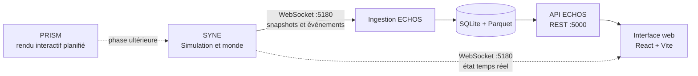

<div align="center">

# LIVEX

### Living Intelligent Virtual Ecosystem eXperience

**Un monde simulé. Des agents autonomes. Des phénomènes à observer.**

[](LICENSE)
[](VERSIONING.md)
[](ROADMAP.md)
[](GLOSSARY.md)

[Découvrir le projet](#-le-projet) · [Architecture](#-architecture) · [Démarrage](#-démarrage-rapide) · [Documentation](#-documentation) · [Contribuer](#-contribuer)

</div>

---

## 🌱 Le projet

**LIVEX explore une question : comment des comportements collectifs peuvent-ils émerger de règles locales simples, sans scénario qui les impose ?**

Le moteur fait évoluer des entités autonomes dans un monde régi par des règles explicites. Chaque entité perçoit une partie de son environnement, possède des besoins, des croyances et une mémoire, puis choisit ses actions selon une architecture cognitive BDI (*Beliefs, Desires, Intentions*). Le système observe les résultats sans les dicter.

LIVEX est un projet de recherche et d’expérimentation en vie artificielle et en simulation multi-agents. Ses résultats sont des observations à analyser, pas des preuves scientifiques en eux-mêmes. Les hypothèses, limites et choix du projet sont documentés dans la [monographie](LIVEX-Monographie_SnapV0-1.pdf) et les [décisions d’architecture](docs/docs-syne/adr/).

## ✨ Principes de conception

| Principe | Application dans LIVEX |
|:--|:--|
| **Déterminisme** | Une même graine, configuration et version du moteur permettent de reproduire une trajectoire. |
| **Décisions explicables** | Les décisions BDI produisent des traces consultables et analysables. |
| **Information locale** | Les entités agissent à partir de ce qu’elles perçoivent et mémorisent, pas d’une vérité globale. |
| **Observation indépendante** | L’analyse mesure le monde sans en devenir la source de vérité. |
| **Contrats explicites** | Les composants échangent par des interfaces documentées et versionnées. |

## 🧩 Architecture



| Composant | Responsabilité | État |
|:--|:--|:--|
| **SYNE** · *Systems & Emergent Network Engine* | Simule le monde et les agents. C’est la source de vérité de l’état simulé. | Moteur .NET 10, observabilité, persistance et contrôle local. |
| **ECHOS** · *Emergent Cognition & Holistic Observation System* | Ingère et analyse les runs, expose les métriques et fournit le pilotage. | API FastAPI, stockage SQLite/Parquet et interface React/TypeScript. |
| **PRISM** · *Perceptual Rendering & Interactive Simulation Module* | Doit représenter et rendre le monde interactif. | Documentation et contrats préparatoires ; le runtime vient après U8. |

> **U8 — Tests & persistance : terminé.** Les jalons SYNE et ECHOS couverts, les limites connues et la suite du projet sont détaillés dans la [feuille de route](ROADMAP.md).

## 🚀 Démarrage rapide

Pour lancer le moteur seul :

```bash
dotnet run --project syne/Simulation.Console --configuration Release -- \
  --seed 12345 --max-ticks 1000 --headless
```

Pour démarrer **SYNE, l’ingestion et l’API ECHOS, ainsi que l’interface web** ensemble, suivez le guide [Installation & démarrage](INSTALLATION.md#démarrage-complet-syne-echos-et-interface). Cette configuration utilise quatre terminaux afin que l’ingestion ECHOS soit prête avant le début de la simulation.

## 🗂️ Dans le dépôt

```text
LIVEX/
├── syne/                   # Moteur de simulation C#/.NET
├── echos/
│   ├── echos/              # API, analyse, ingestion et stockage
│   └── echos-ui/           # Interface React + TypeScript
├── docs/
│   ├── docs-syne/          # Documentation et décisions SYNE
│   ├── docs-echos/         # Documentation ECHOS
│   ├── docs-prism/         # Contrats et feuille de route PRISM
│   └── governance/         # Gouvernance et processus
├── ROADMAP.md              # Jalons unifiés
├── INSTALLATION.md         # Prérequis et commandes de lancement
└── LIVEX-Monographie...    # Référence scientifique et technique
```

## 📚 Documentation

| Lire… | Pour… |
|:--|:--|
| [Vision](VISION.md) | Comprendre les objectifs, le périmètre et les limites. |
| [Architecture](ARCHITECTURE.md) | Voir les composants et leurs responsabilités. |
| [Installation & démarrage](INSTALLATION.md) | Installer les dépendances et lancer la pile locale. |
| [Feuille de route](ROADMAP.md) | Suivre les jalons et les travaux à venir. |
| [Communication](COMMUNICATION.md) | Consulter les protocoles et ports inter-composants. |
| [Glossaire](GLOSSARY.md) | Retrouver le vocabulaire du projet. |
| [FAQ](FAQ.md) | Obtenir des réponses aux questions fréquentes. |
| [Monographie](LIVEX-Monographie_SnapV0-1.pdf) | Lire les fondements, modèles et choix détaillés. |
| [Documentation SYNE](docs/docs-syne/README.md) · [ECHOS](docs/docs-echos/README.md) · [PRISM](docs/docs-prism/README.md) | Entrer dans la documentation d’un composant. |

## 🤝 Contribuer

Les contributions suivent les conventions du dépôt. Avant de proposer un changement, consultez le [guide de contribution](CONTRIBUTING.md), le [Gitflow](GITFLOW.md) et le [code de conduite](CODE_OF_CONDUCT.md). Les choix techniques durables doivent rester cohérents avec l’[architecture](ARCHITECTURE.md) et les ADR du composant concerné.

## Licence & auteur

Distribué sous licence [MIT](LICENSE).

**Donovan Chartrain** · Développeur et infographiste 3D

[Portfolio développement](https://donovan-dev-web.vercel.app) · [Portfolio 3D](https://donovan-dev-3d.vercel.app)

<div align="center">

*Construire les conditions. Observer les conséquences. Comprendre ce qui émerge.*

</div>
