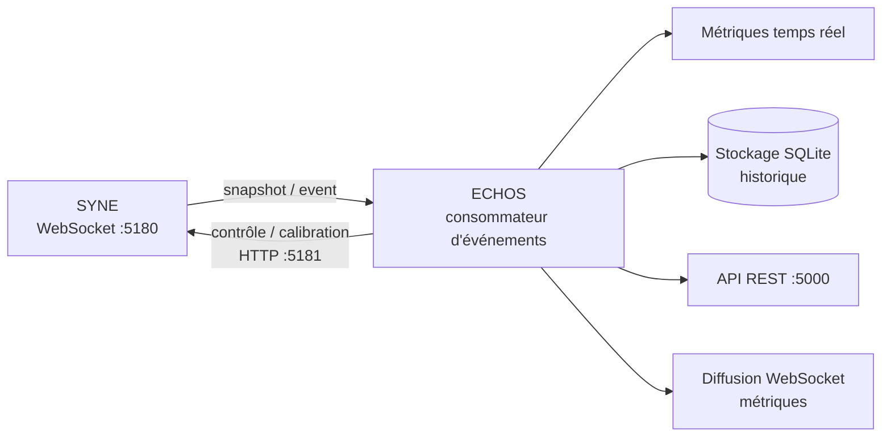

# ARCHITECTURE.md

**Composant** : ECHOS
**Statut** : [STABLE]
**Dernière mise à jour** : 17 septembre 2026
**Dépend de** : `VISION.md`, `../COMMUNICATION.md`
**Source Monographie** : §4.2

---

## 1. Architecture cible

| Composant | Rôle (V0.1) | Implémentation V0.1 |
| :-- | :-- | :-- |
| **Analyse** | Calculs scientifiques, traitement des données, métriques | Python (FastAPI) |
| **Application** | Couche applicative, API REST, pilotage | FastAPI local |
| **Interface** | Vues d'observation, contrôle, calibration (**intégrée à ECHOS**) | Electron + React/TypeScript |
| **Stockage** | Données d'analyse (séparé de la donnée SYNE) | SQLite + Parquet |
| **Source** | SYNE — production d'événements | WebSocket :5180 |

### ⚠ Divergence annoncée vs prototype

L'architecture cible de la Monographie (§4.2.1) prévoit **Django** (Application) et un **shell Electron abandonné** avec interface web React (prototype C#/.NET). **Décision V0.1 (décision utilisateur)** : la stack ECHOS est **Electron + React/TypeScript + FastAPI local (PAS Django)**, avec **NumPy/Pandas/SciPy/NetworkX** pour le calcul et **ECharts/Plotly** pour la visualisation, et **SQLite/Parquet** pour le stockage d'analyse. Cette divergence est assumée et documentée (cf. `../ARCHITECTURE.md` racine).

## 2. Intégration avec SYNE

- ECHOS **observe** SYNE (contrat de transport, WebSocket :5180) et **pilote** SYNE (contrôle, calibration) — Monographie §4.2.2.
- L'interface étant **intégrée à ECHOS** en V0.1, la diffusion temps réel des métriques (prototype `ws://localhost:5180/metrics`) alimente directement les vues d'analyse.

## 3. Séparation des données

Les données d'analyse d'ECHOS sont **séparées** des données de persistance de SYNE :
- la base SYNE contient l'**état canonique** du monde simulé (schéma 11 tables, Annexe G) ;
- la base ECHOS contient les **agrégations, métriques et indices mesurés** (SQLite + Parquet pour les séries lourdes).

Cette séparation garantit que l'observation ne modifie pas la persistance de référence.

## 4. Systèmes internes

| Système | Rôle | Doc |
| :-- | :-- | :-- |
| Ingestion temps réel | Consommateur WebSocket 5180 → `snapshot`/`event` | `../docs-syne/API_CONTRACTS.md` |
| 7 moteurs de métriques | Calculs d'analyse | `METRICS_SPEC.md` |
| Indicateurs d'émergence | Score composite, auto-détection | `EMERGENCE_INDICATORS.md` |
| Analyse causale | Reconstruction des chaînes | `CAUSAL_ANALYSIS.md` |
| Comparaison expérimentale | Runs contrôlés, reproductibilité | `EXPERIMENT_COMPARISON.md` |
| API REST | Endpoints d'interrogation (port 5000) | `API_REST.md` |
| Logging & instrumentation | 3 niveaux (structuré, traces, texte) | `LOGGING_INSTRUMENTATION.md` |

---

## Points restés ouverts dans ce document
- La divergence FastAPI/Django et Electron est tranchée et documentée — aucun reste ouvert.
- Choix des bibliothèques de visualisation (ECharts vs Plotly) par vue : à affiner à l'implémentation.