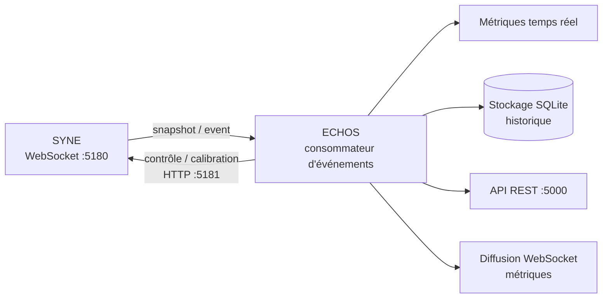

# ARCHITECTURE.md

**Composant** : ECHOS
**Statut** : [STABLE]
**Dernière mise à jour** : 21 septembre 2026
**Dépend de** : `VISION.md`, `../COMMUNICATION.md`
**Source Monographie** : §4.2

---

## 1. Architecture cible

| Composant | Rôle (V0.1) | Implémentation V0.1 |
| :-- | :-- | :-- |
| **Analyse** | Calculs scientifiques, traitement des données, métriques | Python (FastAPI) |
| **Application** | Couche applicative, API REST, pilotage | FastAPI local |
| **Interface** | Vues d'observation, contrôle, calibration (**intégrée à ECHOS**) | Electron + React/TypeScript |
| **Stockage** | Données d'analyse (séparé de la donnée SYNE) | SQLite + Parquet |
| **Source** | SYNE — production d'événements | WebSocket :5180 |

### ⚠ Divergence annoncée vs prototype

L'architecture cible de la Monographie (§4.2.1) prévoit **Django** (Application) et un **shell Electron abandonné** avec interface web React (prototype C#/.NET). **Décision V0.1 (décision utilisateur)** : la stack ECHOS est **Electron + React/TypeScript + FastAPI local (PAS Django)**, avec **NumPy/Pandas/SciPy/NetworkX** pour le calcul et **ECharts/Plotly** pour la visualisation, et **SQLite/Parquet** pour le stockage d'analyse. Cette divergence est assumée et documentée (cf. `../ARCHITECTURE.md` racine).

## 2. Intégration avec SYNE



- ECHOS **observe** SYNE (contrat de transport, WebSocket :5180) et **pilote** SYNE (contrôle, calibration) — Monographie §4.2.2.
- L'interface étant **intégrée à ECHOS** en V0.1, la diffusion temps réel des métriques (prototype `ws://localhost:5180/metrics`) alimente directement les vues d'analyse.

## 3. Séparation des données

Les données d'analyse d'ECHOS sont **séparées** des données de persistance de SYNE :
- la base SYNE contient l'**état canonique** du monde simulé (schéma 11 tables, Annexe G) ;
- la base ECHOS contient les **agrégations, métriques et indices mesurés** (SQLite + Parquet pour les séries lourdes).

Cette séparation garantit que l'observation ne modifie pas la persistance de référence.

## 4. Systèmes internes

| Système | Rôle | Doc |
| :-- | :-- | :-- |
| Ingestion temps réel | Consommateur WebSocket 5180 → `snapshot`/`event` — clients `ws_client` (transport injectable) + `control_client` HTTP 5181 | `../docs-syne/API_CONTRACTS.md`, `echos/echos/ingestion/` |
| Stockage d'analyse | Agrégation incrémentale par tick (sans perte, sous-échantillonnage `sample_every`), SQLite `AnalyticsStore` (schéma stable versionné) + séries lourdes Parquet (jointure SQLite↔Parquet cohérente), pipeline `consume()` | `echos/echos/storage/` |
| 7 moteurs de métriques | Calculs d'analyse | `METRICS_SPEC.md` |
| Indicateurs d'émergence | Score composite, auto-détection | `EMERGENCE_INDICATORS.md` |
| Analyse causale | Reconstruction des chaînes | `CAUSAL_ANALYSIS.md` |
| Comparaison expérimentale | Runs contrôlés, reproductibilité | `EXPERIMENT_COMPARISON.md` |
| API REST | Endpoints d'interrogation lecture seule (port 5000) — `api/app.py` (factory + `ECHOS_ANALYTICS_DB`), `api/routes.py` (ECHOS-040→044), `api/series.py` (cache LRU) | `API_REST.md` |
| Logging & instrumentation | 3 niveaux (structuré, traces, texte) | `LOGGING_INSTRUMENTATION.md` |

---

## 5. Structure de code

Mise en œuvre découpée, chaque sous-composant buildable/testable séparément (ECHOS-002) :

```
echos/
├── pyproject.toml            # paquet echos, pytest --cov-fail-under=80
├── .flake8                   # flake8 (max-line-length=100)
├── echos/
│   ├── __init__.py           # __version__ (synchro pyproject)
│   ├── api/                  # API REST (ECHOS-040 → 045)
│   │   ├── app.py            #   create_app(store) FastAPI + ECHOS_ANALYTICS_DB, /health
│   │   ├── routes.py         #   /api/runs*, /metrics, /export, /beliefs, /relationships, /groups, /emergent-phenomena
│   │   └── series.py         #   SeriesCache LRU invalide par ingest_version
│   ├── analysis/             # 8 moteurs (7 métriques + EmergenceIndicators)
│   │   └── __init__.py       #   registre ENGINES + known_engines() + compute_all(snapshot)
│   └── ingestion/            # clients ws/control SYNE (API_CONTRACTS.md §2-3)
│       ├── models.py         #   WorldSnapshot / ExternalEvent (camelCase) + parse_message
│       ├── stream.py         #   TickSegment / aligned_ticks (flux aligné par tick)
│       ├── ws_client.py      #   WsClient :5180 (transport injectable, réception déterministe)
│       └── control_client.py #   ControlClient :5181 (start / pause / resume / reset)
│   └── storage/              # stockage d'analyse (ECHOS-011 → 013, v2 en ph4)
│       ├── aggregation.py    #   TickRecord.from_segment / summarize / downsample
│       ├── sqlite.py         #   AnalyticsStore (SCHEMA_VERSION "2", tables tick_metrics + tick_contexts, thread-safe)
│       ├── parquet.py        #   séries lourdes PyArrow + coherence_errors
│       └── pipeline.py       #   consume() flux → SQLite + Parquet + moteurs (compute_all)
├── tests/                    # pytest (api, registre moteurs, versionnage) + fixtures/golden
└── echos-ui/                 # interface React + TypeScript (Vite, vitest/jsdom)
```

- `echos` est le composant **Application + Analyse** ; `echos-ui` le composant **Interface** (§1).
- Les moteurs exposent le contrat `ENGINE_NAME` / `METRICS` / `compute(snapshot)` ; implémentation au jalon U1.
- Les contrats d'ingestion (`WorldSnapshot`/`ExternalEvent`) sont des modèles pydantic camelCase validés ; le client WebSocket et le client de contrôle sont testés de façon **déterministe sur fixtures** (E2E réel SYNE = jalon U1).

---

## Points restés ouverts dans ce document
- La divergence FastAPI/Django et Electron est tranchée et documentée — aucun reste ouvert.
- Choix des bibliothèques de visualisation (ECharts vs Plotly) par vue : à affiner à l'implémentation.