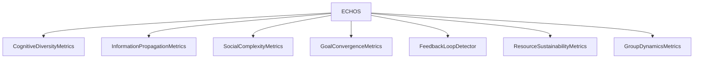

# METRICS_SPEC.md

**Composant** : ECHOS
**Statut** : [STABLE]
**Dernière mise à jour** : 17 septembre 2026
**Dépend de** : `ARCHITECTURE.md`, `../docs-syne/API_CONTRACTS.md`
**Source Monographie** : §4.3

---

## 1. Vue d'ensemble

ECHOS implémente **7 moteurs de métriques** pour analyser la simulation.



## 2. Moteur 1 — CognitiveDiversityMetrics (diversité cognitive)

Mesure la séparation des croyances et des comportements entre entités.

| Métrique | Définition |
| :-- | :-- |
| `BeliefDiversity` | Entropie de Shannon des croyances de la population |
| `BeliefDisagreement` | % d'entités qui divergent sur un même fait |
| `BeliefConfidenceVariance` | Variance de la confiance entre entités |
| `GoalDiversity` | Entropie de Shannon des objectifs |
| `GoalConvergence` | % d'entités partageant le même objectif principal |
| `DecisionDiversity` | % d'entités faisant des choix différents |
| `IntentionStability` | Durée moyenne d'engagement sur une intention |
| `TraitExpressionDiversity` | Variance des comportements émergents selon les traits |

## 3. Moteur 2 — InformationPropagationMetrics (propagation de l'information)

Mesure la circulation et la dégradation de l'information.

| Métrique | Définition |
| :-- | :-- |
| `MessageVolume` | Messages par entité et par tick |
| `InformationDiffusionSpeed` | Ticks nécessaires pour atteindre 80 % des entités |
| `RumorAccuracyDegradation` | Perte de confiance par saut |
| `MaxMessageHops` | Plus longue chaîne avant perte du message |
| `NetworkCentrality` | Concentration des hubs : `max_senders / total_messages` |

## 4. Moteur 3 — SocialComplexityMetrics (complexité sociale)

Mesure la structure des réseaux de relations.

| Métrique | Définition |
| :-- | :-- |
| `AverageTrustLevel` | Confiance moyenne sur toutes les relations |
| `TrustVariance` | Variance des niveaux de confiance |
| `NetworkDensity` | Arêtes / arêtes possibles : `edges / (n×(n-1))` |
| `ClusteringCoefficient` | Tendance à former des triangles (A→B→C→A) |
| `AverageCentrality` | Centralité intermédiaire moyenne |
| `NumberOfCommunities` | Communautés détectées (**propagation d'étiquettes déterministe**) |
| `CommunityStability` | % de communautés stables vs fluctuantes |

> **Écart documenté vs Monographie (Louvain)** : la détection de communautés
> utilise une **propagation d'étiquettes asynchrone** (mise à jour en place,
> ordre trié, ex-aequo → étiquette la plus petite, ≤ 10 itérations). Le Louvain
> de la Monographie n'est pas déterministe bit-à-bit (dépend de la graine de
> découverte) et n'est pas disponible en stdlib Python pure — la propagation
> d'étiquettes préserve la **contrainte ECHOS de déterminisme bit-à-bit**
> (`TESTING.md` §5) sans dépendance tierce.

## 5. Moteur 4 — GoalConvergenceMetrics (convergence des objectifs)

Mesure l'alignement ou la divergence des objectifs.

| Métrique | Définition |
| :-- | :-- |
| `GlobalGoalAlignment` | % d'entités partageant le même objectif principal |
| `GoalDiversity` | Entropie de Shannon de la distribution des objectifs |
| `CooperationPotential` | % d'entités avec des objectifs compatibles (vérification par paire) |
| `GoalTypeCounts` | Distribution des types d'objectifs actifs |

## 6. Moteur 5 — FeedbackLoopDetector (boucles de rétroaction)

Identifie les cycles où `action → conséquence → décision`.

| Métrique | Définition |
| :-- | :-- |
| `IdentifiedLoops` | Nombre de cycles détectés |
| `LoopStrength` | Facteur d'amplification moyen |
| `SystemStability` | `1 - divergence de l'équilibre` |
| `CriticalLoops` | Boucles où `AmplificationFactor > 1.5` |
| `LoopTypes` | Classification positive / négative |

**Heuristique de détection** : un pattern est considéré comme une boucle s'il se répète avec une fréquence > 2 dans une fenêtre configurable (défaut : 100 ticks).

**Implémentation (U2, `feedback_loop_detector.py`)** : fenêtre glissante lue sur
la clé `history` du snapshot (série `{tick, actions: {agentId, action}}`), boucle
= (agent, action) répété **> 2 fois** sur `WINDOW_SIZE = 100` ; facteur
d'amplification = fréquence observée / fréquence uniforme attendue
(fenêtre/nb d'actions distinctes) ; boucle critique si > 1,5 ; `SystemStability`
= `1 − Σ|pᵢ − 1/k|` clampé [0,1]. Historique vide → neutre 0.0.

## 7. Moteur 6 — ResourceSustainabilityMetrics (durabilité des ressources)

Mesure l'équilibre entre consommation et production.

| Métrique | Définition |
| :-- | :-- |
| `ResourceToConsumptionRatio` | Ratio ressource disponible / consommation |
| `CriticalityPoints` | Points proches de l'épuisement |
| `RecoveryTime` | Temps de récupération après un effondrement |

## 8. Moteur 7 — GroupDynamicsMetrics (dynamique des groupes)

Mesure la formation, la vie et la dissolution des groupes.

| Métrique | Définition |
| :-- | :-- |
| `ActiveGroups` | Nombre de groupes actifs |
| `AverageGroupSize` | Membres moyens par groupe |
| `AverageGroupLifetime` | Durée de vie moyenne (en ticks) |
| `GroupFormationRate` | Nouveaux groupes par 1000 ticks |
| `GroupDissolutionRate` | Groupes dissous par 1000 ticks |
| `GroupObjectiveSuccessRate` | Succès / total des groupes dissous |
| `MemberTurnoverRate` | % de membres qui quittent par 100 ticks |

## 9. Outil commun : entropie de Shannon

Utilisée par diversité cognitive et complexité :

```text
H(P) = -Σᵢ pᵢ × log₂(pᵢ)     pour toute pᵢ > 0
```

---

## Points restés ouverts dans ce document
- Aucun : les 7 moteurs et leurs métriques proviennent de la Monographie §4.3.
- Implémentation : fenêtres temporelles et seuils de détection (fenêtre 100 ticks, seuil > 2) restent des valeurs config [HÉRITÉ] à confirmer en calibration.