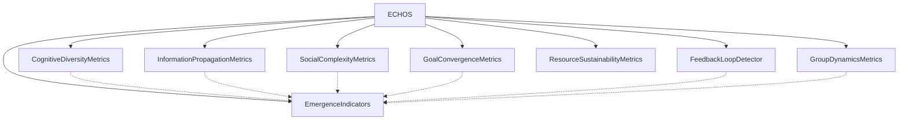

# METRICS_SPEC.md

**Composant** : ECHOS
**Statut** : [STABLE]
**Dernière mise à jour** : 6 octobre 2026
**Dépend de** : `ARCHITECTURE.md`, `METRICS_DICTIONARY.md`, `ANALYSIS_FOUNDATIONS.md`, `../docs-syne/API_CONTRACTS.md`
**Source Monographie** : §4.3

---

## 1. Vue d'ensemble

ECHOS implémente **7 moteurs de métriques** pour analyser la simulation, plus un **moteur composite** `EmergenceIndicators` (ECHOS-030 → ECHOS-033, `EMERGENCE_INDICATORS.md`) qui compose les 6 premiers (hors durabilité).


```mermaid
flowchart TD
    E[ECHOS] --> M1[CognitiveDiversityMetrics]
    E --> M2[InformationPropagationMetrics]
    E --> M3[SocialComplexityMetrics]
    E --> M4[GoalConvergenceMetrics]
    E --> M5[FeedbackLoopDetector]
    E --> M6[ResourceSustainabilityMetrics]
    E --> M7[GroupDynamicsMetrics]
    E --> M8[EmergenceIndicators]
    M1 -.-> M8
    M2 -.-> M8
    M3 -.-> M8
    M4 -.-> M8
    M5 -.-> M8
    M7 -.-> M8
```

### 1.1 Le registre versionné fait foi

Le **catalogue versionné** est la source unique de vérité documentaire :

- code : `echos/analysis/catalog.py` (`CATALOG_VERSION`, `HISTORY`, `METRICS_CATALOG`) ;
- lecture : `GET /api/metrics/catalog` (`API_REST.md` §3.15) — **61 fiches** en v2.0.0 ;
- contenu par fiche : `id`, `engine`, `label` (français), `unit`, `domain`,
  `definition`, `calculation` (formule et dénominateurs), `population`
  (dénominateur), `window`, `direction` (lecture d'une hausse), `status`,
  `states` (états de données possibles), `warning`, `visual` (forme recommandée
  ou à éviter) et `renamedFrom`.

Ce document raconte l'ensemble (lecteur humain, revue de conception) ; en cas
d'écart, **le catalogue et l'API font foi**. Le Launcher restaure ces fiches telles
quelques : libellés, plages, avertissements et statuts viennent d'ECHOS, jamais
d'une redéfinition locale (ADR-003).

**`ANALYSIS_FOUNDATIONS.md`** expose, pour chaque équation, l'expression
mathématique complète, la justification du choix et l'interprétation (fondements
scientifiques du cœur analytique) ; ce document décrit ce que chaque métrique
**mesure** et **publie**.

Toute modification de formule ou d'unité **augmente** `CATALOG_VERSION` et est
consignée dans `HISTORY` (§13) : deux versions incompatibles ne se comparent
jamais silencieusement.

### 1.2 Renommages de la refonte sémantique (catalogue 2.0.0)

Les anciens noms affirmaient plus que la mesure ; ils sont conservés dans
`renamedFrom` pour migrer les séries historiques, mais ne doivent plus être
écrits dans les documents ni les interfaces.

| Ancien identifiant | Identifiant actuel | Motif |
| :-- | :-- | :-- |
| `NetworkCentrality` | `SenderConcentration` | « centralité » : la formule mesurait la concentration des émissions |
| `InformationDiffusionSpeed` | `EmitterCoverageDelay` | mesure le délai d'**émission** (80 % des entités), pas une réception |
| `RumorAccuracyDegradation` | `TheoreticalHopDecay` | transformation théorique, aucune précision observée |
| `CooperationPotential` | `GoalCategoryConcordance` | aucune compatibilité par paire n'est testée |
| `DecisionDiversity` | `ActionDiversity` (+ `DecisionCount`) | mélangeait décisions et objectifs |
| `IntentionStability` | `AverageGoalAge` | une durée d'engagement, pas une stabilité |
| `IdentifiedLoops`, `LoopStrength`, `CriticalLoops`, `SystemStability`, `LoopTypes` | `RepeatedActionPairs`, `RepeatedActionShare`, `AmplifiedRepetitions`, `ActionDistributionBalance`, `RepeatedActionCounts` | l'heuristique mesure des **répétitions**, pas des boucles causales |
| `ActiveGroups`, `AverageGroupSize` | `InferredCommunities`, `AverageCommunitySize` | communautés **inférées** du graphe de confiance, pas des groupes SYNE |
| `GroupObjectiveSuccessRate` | `DissolvedGroupSuccessShare` | dénominateur : les dissolutions qui publient `success` |
| `MemberTurnoverRate` | `MemberExitsPerDissolution` | sorties **par dissolution**, pas un % par 100 ticks |
| `ResourceToConsumptionRatio`, `CriticalityPoints` | `ResourceFillRatio`, `CriticalResourceCount` | stock/capacité, plus un ratio ambigu |
| `AverageCentrality` | `AverageOutDegree` | degré sortant, **pas** une betweenness |
| `CommunityStability` | `CommunitySizeMatch` | compare des **tailles**, pas des identités |
| `UnpredictabilityIndex` | *retiré* | exigerait une baseline prédictive hors échantillon |

Corrections de formule associées : `NetworkDensity` (dénominateur `n(n−1)/2`),
`SystemComplexity` (grandeur bornée [0,1]), `EmergenceScore` (composantes
normalisées, contributions publiées).

## 2. Moteur 1 — CognitiveDiversityMetrics (diversité cognitive)

Mesure la séparation des croyances et des comportements entre entités.

### `CognitiveDiversityMetrics`

| Métrique | Unité | Statut | Définition | Ancien nom |
| :-- | :-- | :-- | :-- | :-- |
| `BeliefDiversity` | bits | mesurée | Entropie de Shannon des triplets (sujet, prédicat, valeur) observés. Mesure la dispersion des énoncés, pas une « diversité cognitive » normalisée. | — |
| `BeliefDiversityNorm` | fraction | mesurée | Entropie des croyances ramenée à son maximum pour le nombre de catégories observées. | — |
| `BeliefDisagreement` | fraction | mesurée | Part des croyances hors de la valeur majoritaire, moyennée sur les faits qui admettent plusieurs valeurs. Les faits unanimes sont exclus. | — |
| `BeliefConfidenceVariance` | unité² (confiance) | mesurée | Variance population des confiances déclarées — hétérogénéité, pas exactitude. | — |
| `GoalDiversity` | bits | mesurée | Entropie de Shannon de la distribution des catégories d'objectifs actifs. | — |
| `GoalDiversityNorm` | fraction | mesurée | Entropie des objectifs ramenée à son maximum pour le nombre de catégories observées. | — |
| `GoalConvergence` | fraction | mesurée | Part de la population dans la catégorie d'objectif la plus fréquente. | — |
| `GoalCoverage` | fraction | mesurée | Part d'entités vivantes qui déclarent au moins un objectif. | — |
| `ActionDiversity` | fraction | mesurée | Entropie normalisée de la distribution des actions décidées. Ne se mélangent plus aux objectifs (l'ancien DecisionDiversity le faisait). | `DecisionDiversity` |
| `DecisionCount` | count | mesurée | Nombre de décisions (event decision_made) dans la fenêtre d'événements. | — |
| `AverageGoalAge` | ticks | mesurée | Âge moyen des objectifs actifs — une durée d'engagement, pas une stabilité. | `IntentionStability` |
| `TraitExpressionDiversity` | unité² (traits) | mesurée | Moyenne, par trait, de la variance de ses valeurs sur la population. | — |

## 3. Moteur 2 — InformationPropagationMetrics (propagation de l'information)

Mesure la circulation et la dégradation de l'information.

### `InformationPropagationMetrics`

| Métrique | Unité | Statut | Définition | Ancien nom |
| :-- | :-- | :-- | :-- | :-- |
| `MessageVolume` | messages/entité/tick | mesurée | Messages envoyés au tick courant rapportés à la population vivante. | — |
| `EmitterCoverageDelay` | ticks | mesurée | Ticks entre le premier message de la fenêtre et le moment où 80 % des entités vivantes ont émis. **Ne mesure pas la réception.** | `InformationDiffusionSpeed` |
| `TheoreticalHopDecay` | fraction | exploratoire | 1 − 0,9^hops : **transformation théorique** du nombre de sauts sous l'hypothèse de 10 % de perte par saut. Aucune précision n'est observée. | `RumorAccuracyDegradation` |
| `MaxMessageHops` | sauts | mesurée | Maximum des compteurs de sauts observés dans la fenêtre. | — |
| `SenderConcentration` | fraction | mesurée | Part du message le plus productif dans le volume total. 1 = un seul émetteur concentre tout le volume. | `NetworkCentrality` |
| `SenderCoverage` | fraction | mesurée | Part d'entités vivantes ayant émis au moins un message dans la fenêtre (« 18/24 émetteurs »). | — |

## 4. Moteur 3 — SocialComplexityMetrics (complexité sociale)

Mesure la structure des réseaux de relations.

### `SocialComplexityMetrics`

| Métrique | Unité | Statut | Définition | Ancien nom |
| :-- | :-- | :-- | :-- | :-- |
| `AverageTrustLevel` | confiance | mesurée | Moyenne des poids de confiance déclarés (relations orientées). | — |
| `TrustVariance` | unité² | mesurée | Variance population des poids de confiance déclarés. | — |
| `NetworkDensity` | fraction | mesurée | Arêtes non orientées uniques / paires d'entités possibles. | — |
| `ClusteringCoefficient` | fraction | mesurée | Coefficient local moyen sur voisinage symétrisé : triangles fermés / possibles. | — |
| `AverageOutDegree` | fraction | mesurée | Degré sortant moyen rapporté à n−1. Ce n'est **pas** une centralité intermédiaire (betweenness). | `AverageCentrality` |
| `NumberOfCommunities` | count | mesurée | Nombre de communautés (taille ≥ 2) issues de la propagation d'étiquettes déterministe ; les singletons sont exclus. | — |
| `CommunitySizeMatch` | fraction | mesurée | Part des communautés de l'historique dont la **taille** est présente dans le partition courant. | `CommunityStability` |

> **Écart documenté vs Monographie (Louvain)** : la détection de communautés
> utilise une **propagation d'étiquettes asynchrone** (mise à jour en place,
> ordre trié, ex-aequo → étiquette la plus petite, ≤ 10 itérations). Le Louvain
> de la Monographie n'est pas déterministe bit-à-bit (dépend de la graine de
> découverte) et n'est pas disponible en stdlib Python pure — la propagation
> d'étiquettes préserve la **contrainte ECHOS de déterminisme bit-à-bit**
> (`TESTING.md` §5) sans dépendance tierce.
>
> **`CommunitySizeMatch` ne prouve pas une stabilité d'identité** : elle compare
> des tailles. Deux communautés de même taille mais de membres différents
> ressortent « stables » — cas étalon documenté dans `REFERENCE_SCENARIOS.md` §5.

## 5. Moteur 4 — GoalConvergenceMetrics (convergence des objectifs)

Mesure l'alignement ou la divergence des objectifs.

### `GoalConvergenceMetrics`

| Métrique | Unité | Statut | Définition | Ancien nom |
| :-- | :-- | :-- | :-- | :-- |
| `GlobalGoalAlignment` | fraction | mesurée | Part de la population dans la catégorie d'objectif la plus fréquente. | — |
| `GoalDiversity` | bits | mesurée | Entropie de Shannon de la distribution des catégories d'objectifs. | — |
| `GoalCategoryConcordance` | fraction | mesurée | Probabilité que deux tirages indépendants d'entités tombent sur la même catégorie de buts (Σ p²). **Aucune compatibilité par paire n'est testée.** | `CooperationPotential` |
| `GoalTypeCounts` | non numérique | mesurée | Comptage par catégorie d'objectif actif — sortie composite, jamais persistée comme série numérique. | — |

## 6. Moteur 5 — FeedbackLoopDetector (répétitions d'action)

Cherche des **répétitions** dans l'historique de décisions. Ce moteur ne
détecte **pas** de boucle causale : aucune conséquence n'est observée, et le
contrat ne publie aucune sémantique causale (décision P0/P1).

### `FeedbackLoopDetector`

| Métrique | Unité | Statut | Définition | Ancien nom |
| :-- | :-- | :-- | :-- | :-- |
| `RepeatedActionPairs` | count | exploratoire | Nombre de paires (agent, action) répétées plus de 2 fois dans la fenêtre de décisions. **Pas des boucles causales.** | `IdentifiedLoops` |
| `RepeatedActionShare` | fraction | exploratoire | Fréquence moyenne des paires répétées rapportée à la taille de la fenêtre. | `LoopStrength` |
| `ActionDistributionBalance` | fraction | exploratoire | 1 − divergence (écart absolu total) à la distribution uniforme des actions observées. | `SystemStability` |
| `AmplifiedRepetitions` | count | exploratoire | Paires dont la fréquence dépasse de 1,5× la fréquence uniforme théorique. | `CriticalLoops` |
| `RepeatedActionCounts` | non numérique | exploratoire | Nombre de paires (agent, action) répétées, classées par nom d'action. Aucune catégorie normative positive/négative (retirée en P2). | `LoopTypes` |

**Implémentation** : fenêtre glissante de `WINDOW_SIZE = 100` décisions lues sur
la clé `history` du snapshot ; une paire compte si sa fréquence est
`> FREQUENCY_THRESHOLD = 2` ; facteur d'amplification = fréquence observée /
fréquence uniforme attendue, `AmplifiedRepetitions` si `> 1,5`.
Historique vide → repli neutre 0.0 (**non mesuré**, pas un zéro observé).

## 7. Moteur 6 — ResourceSustainabilityMetrics (durabilité des ressources)

Mesure les stocks, les capacités et les flux des réserves.

### `ResourceSustainabilityMetrics`

| Métrique | Unité | Statut | Définition | Ancien nom |
| :-- | :-- | :-- | :-- | :-- |
| `ResourceFillRatio` | fraction | mesurée | Part de capacité restante, moyenne des réserves dont la capacité est publiée. Une réserve au-delà de sa capacité est comptée saturée (1,0). | `ResourceToConsumptionRatio` |
| `CriticalResourceCount` | count | mesurée | Nombre de réserves sous 20 % de leur capacité publiée. | `CriticalityPoints` |
| `ResourceCoverage` | fraction | mesurée | Part de réserves dont la capacité est publiée (dénominateur exploitable). | — |
| `ConsumptionPerTick` | unité/tick | mesurée | Volume total consommé dans la fenêtre rapporté à la durée observée de cette fenêtre. | — |
| `RecoveryTime` | ticks | mesurée | Durée moyenne entre un passage sous 20 % de capacité et un retour à ≥ 80 %. | — |
| `RecoveryEpisodes` | count | mesurée | Nombre de cycles sous 20 % puis retour ≥ 80 % observés dans l'historique. | — |
| `UnresolvedCrisisCount` | count | mesurée | Crises ouvertes (sous 20 %) encore ouvertes au dernier tick de l'historique — observation censurée, jamais un zéro rassurant. | — |

Seuils (20 % / 80 %) **[HÉRITÉ]** : voir `RAPPORT-ANALYSE-ECHOS-LAUNCHER.md` §9 P2
(campagnes de calibration à mener avant de les présenter comme référence).

## 8. Moteur 7 — GroupDynamicsMetrics (dynamique des groupes)

Mesure formation, vie et dissolution des **communautés inférées** du graphe de
confiance — distinctes des groupes déclarés par SYNE (les deux ne sont jamais
additionnés).

### `GroupDynamicsMetrics`

| Métrique | Unité | Statut | Définition | Ancien nom |
| :-- | :-- | :-- | :-- | :-- |
| `InferredCommunities` | count | mesurée | Communautés (taille ≥ 2) du graphe de confiance. **Ce ne sont pas les groupes déclarés par SYNE.** | `ActiveGroups` |
| `AverageCommunitySize` | entités | mesurée | Moyenne des tailles des communautés inférées. | `AverageGroupSize` |
| `CommunityCoverage` | fraction | mesurée | Part d'entités vivantes rattachées à une communauté de taille ≥ 2. | — |
| `AverageGroupLifetime` | ticks | mesurée | Moyenne des durées de vie déclarées sur les dissolutions observées. | — |
| `GroupFormationRate` | groupes/1000 ticks | mesurée | Événements group_formed normalisés sur la fenêtre **réellement observée**. | — |
| `GroupDissolutionRate` | groupes/1000 ticks | mesurée | Événements group_dissolved normalisés sur la fenêtre observée. | — |
| `FormationCount` | count | mesurée | Nombre brut d'événements group_formed dans la fenêtre. | — |
| `DissolutionCount` | count | mesurée | Nombre brut d'événements group_dissolved dans la fenêtre. | — |
| `DissolvedGroupSuccessShare` | fraction | exploratoire | Moyenne du booléen `success` sur les dissolutions observées **qui le publient** — pas sur tous les groupes. | `GroupObjectiveSuccessRate` |
| `MemberExitsPerDissolution` | membres | exploratoire | Nombre moyen de `membersOut` déclarés par dissolution observée. | `MemberTurnoverRate` |

## 9. Moteur 8 — EmergenceIndicators (composite)

Voir `EMERGENCE_INDICATORS.md` : score composite, contributions publiées,
phénomènes auto-détectés et disclaimer.

### `EmergenceIndicators`

| Métrique | Unité | Statut | Définition | Ancien nom |
| :-- | :-- | :-- | :-- | :-- |
| `DetectedPhenomena` | non numérique | exploratoire | Signaux de la règle active dont la condition est satisfaite, avec la valeur observée et le seuil pour chaque signal. | — |
| `Disclaimer` | non numérique | mesurée | Texte invariant publié par ECHOS, affiché tel quel et jamais reformulé. | — |
| `EmergenceScore` | fraction | exploratoire | Somme pondérée de six composantes normalisées. **Indicateur exploratoire** : ni mesure établie, ni preuve d'émergence. | — |
| `ContributionBeliefDiversity` | fraction | exploratoire | Part du score apportée par la diversité des croyances normalisée. | — |
| `ContributionGoalDiversity` | fraction | exploratoire | Part du score apportée par la diversité des objectifs normalisée. | — |
| `ContributionEmitterCoverage` | fraction | exploratoire | Part du score apportée par la couverture des émetteurs (délai normalisé). | — |
| `ContributionClustering` | fraction | exploratoire | Part du score apportée par le coefficient de clustering. | — |
| `ContributionRepeatedActions` | fraction | exploratoire | Part du score apportée à la part moyenne des répétitions d'action. | — |
| `ContributionCommunityCoverage` | fraction | exploratoire | Part du score apportée par la part de population en communauté. | — |
| `SystemComplexity` | fraction | exploratoire | Moyenne de trois grandeurs normalisées : croyances, objectifs et couverture des émetteurs. **Pas** une approximation de la complexité de Kolmogorov. | — |

## 10. Outil commun : entropie de Shannon

Utilisée par diversité cognitive et complexité sociale :

```math
H(P) = -\sum_{i} p_i \cdot \log_2(p_i) \qquad \text{pour toute } p_i > 0
```

Deux conventions coexistent et ne se mélangent jamais :

- `BeliefDiversity`, `GoalDiversity` : **bits bruts** (croissent avec le nombre
  de catégories) ;
- `BeliefDiversityNorm`, `GoalDiversityNorm`, `ActionDiversity` : **fractions
  [0,1]** (ramenées au maximum atteignable) — seules ces dernières entrent dans
  `EmergenceScore`.

## 11. Méta-métriques de reproductibilité (ECHOS-071, jalon ph7)

Calculées par `echos/echos/analysis/reproducibility.py` sur deux runs contrôlés
(`/api/compare`, EXPERIMENT_COMPARISON.md §2/§4) — fonctions pures, stables
entre rejeux (déterminisme ECHOS) :

| Méta-métrique | Définition |
| :-- | :-- |
| `IsReproducible` | même seed ∩ même version moteur ∩ empreinte SHA-256 du contenu canonique identique |
| `ReproducibilityScore` | `1.0` si reproductible, sinon `1.0 − (CognitiveDiff + SocialDiff)/2` |
| `CognitiveDiff` | norme L2 normalisée (borne [0, 1]) entre distributions de croyances de la population |
| `SocialDiff` | norme L2 normalisée entre réseaux de confiance (poids de paire moyen, non orienté) |

- **Empreinte canonique** : séries `tick_metrics`, résumés de tick, `events_log`,
  contextes `agents`/`groups`/`phenomena`, `decision_traces` — sérialisés triés,
  cellule `run_id` exclue (deux runs du même protocole diffèrent seulement par leur
  étiquette) ; SHA-256 hex.
- **Distributions normalisées** (somme = 1) : croyances `subject|predicate|value`
  (population entière), confiance par paire (moyenne des deux directions, arêtes
  positives).
- Ces méta-métriques ne modifient **aucune** métrique des moteurs (§2–§9) et ne
  consomment aucun PRNG.

## 12. Statuts et états de données

### 12.1 Statut de la mesure (`status`)

| Statut | Signification | Règle d'affichage |
| :-- | :-- | :-- |
| `measured` | calculée sur les données réellement présentes | affichée comme une mesure, avec sa fenêtre |
| `exploratory` | heuristique ou composite non calibré | **toujours** étiquetée « exploratoire » ; jamais présentée comme un fait |
| `suspended` | retemporairement retirée (formule ou données insuffisantes) | non publiée comme résultat |

### 12.2 États de données (`states`) — vocabulaire commun

Le même chiffre « 0 » recouvre des situations différentes ; le catalogue borne
les états possibles de chaque métrique et l'interface ne doit pas les confondre :

| État | Signification |
| :-- | :-- |
| `observed_zero` | zéro observé dans une fenêtre publiée — c'est une mesure |
| `window_empty` | fenêtre publiée mais sans occurrence (aucun événement) |
| `insufficient_coverage` | couverture partielle du dénominateur (ex. 18/24 émetteurs) |
| `absent` | donnée non produite par SYNE pour ce run |
| `unmeasured` | repli neutre servi faute de fenêtre (`measured=false`) — **jamais un 0 observé** |
| `censored` | observation interrompue avant la fin de l'épisode (crise encore ouverte) |

## 13. Revue de changement de métrique

Toute modification d'une métrique (formule, unité, dénominateur, fenêtre,
seuil, identifiant) suit ce circuit avant d'être fusionnée — le catalogue est un
contrat public, une modification silencieuse rend les séries historiques
mentalement fausses.

| Étape | Contenu exigé |
| :-- | :-- |
| 1. **Propriétaire** | un binôme (auteur + relecteur) désigné dans l'issue, rattaché au composant ECHOS |
| 2. **Motivation** | le problème mesuré que l'ancienne formule résolvait mal (cas concret, run ou cas étalon) |
| 3. **Analyse de sensibilité** | variation du résultat sur au moins deux cas étalons (`REFERENCE_SCENARIOS.md`) et, pour un seuil, sur une campagne multi-runs ; les écarts sont publiés dans la MR |
| 4. **Compatibilité des séries** | impact sur l'historique : `renamedFrom` (renommage), `CATALOG_VERSION` majeur (formule/unité), migration ou séparation explicite des séries incompatibles ; les comparaisons avant/après sont refusées ou étiquetées |
| 5. **Notes de version** | entrée `HISTORY` du catalogue + `CHANGELOG.md` + mise à jour de `METRICS_SPEC.md`, `METRICS_DICTIONARY.md`, `ANALYSIS_FOUNDATIONS.md` (équations concernées) et de la vue Launcher concernée |

Une modification qui échoue à l'étape 3 reste `exploratory` : elle peut être
publiée comme observation, jamais comme référence.

---

## Annexe A — Provenance des valeurs (`measured`, par tick)

Plusieurs métriques dépendent d'une fenêtre que le tick courant ne porte pas
(`FeedbackLoopDetector`, `RecoveryTime`, `CommunitySizeMatch`) et renvoient
alors leur **repli neutre**. Cette valeur est la bonne réponse du moteur, mais
elle n'est pas une observation : la confondre avec une mesure réelle est
exactement ce qui a laissé passer 7 métriques à 0 sur tout run réel.

Le champ `measured` distingue les deux cas, par couple (moteur, métrique) :

| Valeur | Signification |
| :-- | :-- |
| `true` | la métrique a été calculée sur les données du tick |
| `false` | la valeur servie est le repli neutre du moteur, faute de fenêtre |
| `null` | tick sans observation (trou de série) — distinct de `false` |

Trois portées coexistent :

- `provenance(snapshot)` dans `analysis/__init__.py` — drapeaux **calculés
  depuis les mêmes entrées que le calcul** (aucune liste déclarée à côté du
  code) ; les composites `EmergenceIndicators` propagent depuis leurs
  **dépendances réelles** (`COMPOSITE_DEPENDENCIES`), jamais depuis
  l'intégralité des moteurs entrants ;
- persistance : `tick_metrics.measured` à **chaque tick** (schéma SQLite v5) ;
- publication : `measured_by_tick` aligné sur `ticks` dans
  `GET /api/runs/{id}/metrics` (`API_REST.md` §3.3) ; `measured` (dernier tick
  seul) est conservé pour compatibilité.

Règle de consommation : un `false` ne doit pas être affiché comme un `0`. C'est
« non mesuré », pas « mesuré à zéro » — et un `null` n'est « aucunement
observé à ce tick ».

## Annexe B — Fenêtre réellement couverte

Ce que la mesure couvre est publié, jamais supposé :

- `ticks` / `missing_ticks` / `missing_ticks_count` (`API_REST.md` §3.3) — les
  lacunes entre le premier et le dernier tick observé sont listées, jamais
  comblées ;
- `every` (sous-échantillonnage de lecture) et `context_every` (cadence des
  contextes détaillés, `API_REST.md` §3.11) — l'âge maximal d'un contexte est
  `context_every − 1` ticks ;
- `conservation` (`base` / `sampled_details` / `high_fidelity`) persisté au
  tick 0 par run : le niveau de fidélité **réellement configuré** est annoncé
  avant toute lecture (`API_REST.md` §3.16).

Détails : `METRICS_DICTIONARY.md` (unités, échelles, matrice
métrique → API → vue) et `REFERENCE_SCENARIOS.md` (cas étalons interprétés).

---

## Points restés ouverts dans ce document

- Les fenêtres et seuils des moteurs (fenêtre 100 ticks, seuil > 2, seuils de
  ressources 20 %/80 %, horizon de diffusion 100 ticks) sont **[HÉRITÉ]** :
  à confirmer par campagne de calibration (`RAPPORT-ANALYSE-ECHOS-LAUNCHER.md`
  §9 P2) avant d'être présentés comme référence.
- Les pondérations d'`EmergenceScore` restent non calibrées — voir
  `EMERGENCE_INDICATORS.md` « Points restés ouverts ».
- La matrice complète métrique → API → vue est maintenue dans
  `METRICS_DICTIONARY.md` §3 ; toute nouvelle vue doit y être ajoutée.
