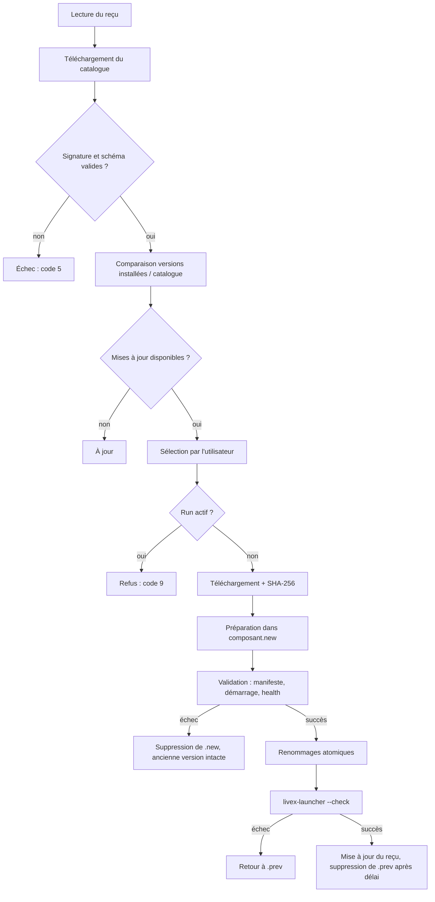

# RELEASE_AND_UPDATE.md — Livraison et mise à jour

**Composant** : LIVEX (Installateur)
**Statut** : [DRAFT]
**Dernière mise à jour** : 8 octobre 2026
**Dépend de** : `ARCHITECTURE.md`, `adr/ADR-004`, `../../VERSIONING.md`, `../../CI_CD.md`, `../docs-launcher/PACKAGING.md`
**Source Monographie** : —

---

## 1. Objet

Ce document décrit comment les artefacts installables sont **produits** par la CI,
**décrits** par un catalogue, **installés** et **mis à jour** par l'installateur,
et comment leur **intégrité** est garantie.

## 2. Artefacts de release

Les tags existants (`syne-v*`, `echos-v*`, `prism-v*`, `livex-v*`,
`VERSIONING.md` §4) restent la source. Chaque tag de composant produit un
artefact par OS ; le tag `livex-v*` produit en plus l'installateur et le
catalogue.

| Artefact | Contenu | Nommage |
| :-- | :-- | :-- |
| Launcher | Application self-contained, assets, modèles | `livex-launcher-<version>-<os>-x64.zip` |
| SYNE | Binaire publié self-contained + manifeste de release | `syne-<version>-<os>-x64.zip` |
| ECHOS | Sources, `uv.lock`, lanceur, manifeste de release | `echos-<version>-<os>.zip` |
| syne-mock | Sources, runtime Node embarqué, manifeste de release | `syne-mock-<version>-<os>-x64.zip` |
| PRISM-LDK | Plugin `PrismLdk` (sans binaires compilés) | `prism-ldk-<version>.zip` |
| Documentation | `docs/` et documents racine | `livex-docs-<version>.zip` |
| Installateur | Binaire self-contained | `livex-setup-<version>-win-x64.exe`, `livex-setup-<version>-linux-x64.tar.gz` |
| Catalogue | Description signée des artefacts | `catalog.json`, `catalog.json.sig` |
| Empreintes | SHA-256 de chaque artefact | `SHA256SUMS` |
| Paquet hors-ligne | Installateur + tous les artefacts d'un OS + roues Python | `livex-offline-<version>-<os>.<ext>` (OI-08) |

Un artefact est **immuable** : il n'est jamais réécrit sous le même nom. Une
correction produit une nouvelle version.

## 3. Catalogue

### 3.1 Rôle

Le catalogue est le **contrat entre la CI et l'installateur** : liste des
composants installables, de leurs versions, OS, tailles, dépendances et
empreintes. L'installateur n'a aucune connaissance en dur d'une URL d'artefact.

### 3.2 Format (`catalog.json`, schéma 1)

```json
{
  "schema": 1,
  "livexVersion": "0.1.0",
  "publishedAt": "2026-10-31T12:00:00Z",
  "minInstaller": "0.1.0",
  "components": [
    {
      "id": "syne",
      "name": "SYNE",
      "version": "0.15.0",
      "protocolVersion": 1,
      "requires": ["launcher"],
      "accepted": { "linux-x64": true, "win-x64": false },
      "artifacts": {
        "linux-x64": {
          "url": "https://…/syne-0.15.0-linux-x64.zip",
          "sha256": "…",
          "downloadBytes": 0,
          "installedBytes": 0
        }
      },
      "systemRequirements": {
        "linux-x64": { "libraries": [], "minRamMb": 0 }
      }
    }
  ]
}
```

| Champ | Règle |
| :-- | :-- |
| `schema` | Entier ; un schéma inconnu est refusé avec la version requise et la version lue (même règle que les manifestes, `PACKAGING.md` §4) |
| `components[].id` | Identique à l'`id` du manifeste de release |
| `accepted` | Par OS : le composant a passé l'acceptation Launcher (`V1-CAPABILITY-MATRIX.md`). `false` = affiché grisé avec sa cause, non installable |
| `protocolVersion` | Lu aussi dans le manifeste ; le catalogue permet de refuser avant téléchargement |
| `downloadBytes`, `installedBytes` | Mesurés par la CI, jamais estimés à la main |
| `requires` | Identifiants de composants requis, même syntaxe que `requires` du manifeste |
| `systemRequirements` | Alimente le contrôle de l'étape 3 (bibliothèques, mémoire) |

Un fichier JSON Schema du catalogue sera publié dans `installer/contracts/`, sur le
modèle de `launcher/contracts/component-manifest-v1.schema.json`, et validé en CI.

## 4. Manifestes de release

Le manifeste du dépôt est un manifeste **de développement** ; la CI en produit un
manifeste **de release** par OS, conforme au même schéma
(`component-manifest-v1.schema.json`, qui accepte les clés `windows` et `linux`
dans `executable`). Les chemins sont relatifs au répertoire du composant installé.

Exemple — SYNE, release :

```json
{
  "schema": 1,
  "id": "syne",
  "name": "SYNE",
  "type": "simulation",
  "version": "0.15.0",
  "protocolVersion": 1,
  "runtime": "dotnet",
  "executable": {
    "linux": "bin/Simulation.Console",
    "windows": "bin/Simulation.Console.exe"
  },
  "workingDirectory": ".",
  "endpoints": {
    "control": { "transport": "http", "port": 5181, "enabled": true, "launchArgument": "--control-port" },
    "ws": { "transport": "websocket", "port": 5180, "enabled": true, "launchArgument": "--observe-port" }
  },
  "capabilities": ["headless", "control", "observability", "batch"],
  "health": { "probe": "http", "path": "/health/ready", "intervalMs": 500 },
  "timeouts": { "startupMs": 30000, "shutdownMs": 15000 }
}
```

Différences avec le manifeste de développement : chemin de l'exécutable
(`bin/…` au lieu de l'arborescence de build) et clé `windows` ajoutée.

| Composant | Exécutable Linux | Exécutable Windows | Statut |
| :-- | :-- | :-- | :-- |
| SYNE | `bin/Simulation.Console` | `bin/Simulation.Console.exe` | À produire et accepter (O-39, O-41) |
| ECHOS | Lanceur `echos-launcher` | Lanceur équivalent | Lanceur Windows à créer |
| syne-mock | Lanceur appelant le Node embarqué | Idem | À créer |

La CI **valide chaque manifeste de release** avec le schéma et le script
`launcher/contracts/validate_manifests.py` avant publication.

## 5. Pipeline de release

Extension de `release.yml` (`CI_CD.md` §4). Le job de vérification actuel
(Ubuntu) est conservé ; les jobs suivants sont ajoutés :

| Job | Runner | Rôle |
| :-- | :-- | :-- |
| `verify` | `ubuntu-latest` | Existant : build + tests + couverture |
| `build-launcher` | matrice `windows-latest`, `ubuntu-latest` | `dotnet publish` self-contained du Launcher par OS |
| `build-syne` | matrice | `dotnet publish` self-contained de SYNE par OS |
| `package-echos`, `package-mock` | matrice | Sources + lanceur + manifeste ; roues Python et runtime Node pour le paquet hors-ligne |
| `build-installer` | matrice | `dotnet publish` self-contained fichier unique de l'installateur |
| `catalog` | `ubuntu-latest` | Mesure les tailles, calcule les SHA-256, génère `catalog.json`, signe (OI-04) |
| `test-installer-clean` | matrice | Exécute l'installateur en `--unattended` dans un environnement vierge, puis `livex-launcher --check` (`TESTING.md` §5) |
| `publish` | `ubuntu-latest` | Crée la GitHub Release avec tous les artefacts, `SHA256SUMS` et le catalogue |

Règles :

- aucun artefact n'est publié si `test-installer-clean` échoue ;
- un composant dont l'acceptation Launcher n'est pas passée sur un OS est publié
  avec `accepted: false` pour cet OS (ou absent), jamais avec `true` par défaut ;
- le catalogue référence exactement les artefacts de la release (pas de « latest »
  implicite).

## 6. Versionnement

| Élément | Règle |
| :-- | :-- |
| Version de l'installateur | SemVer, indépendante des composants ; tag proposé `setup-v*` ou rattachement à `livex-v*` (à décider, `ADR-004`) |
| Version du catalogue | `livexVersion` = version de la release assemblée |
| Composant | Version lue dans le manifeste de release, jamais supposée (`PACKAGING.md` §9) |
| Compatibilité | Un composant plus récent que l'installateur est autorisé avec avertissement ; un `schema` de manifeste inconnu est refusé |
| `minInstaller` | Version minimale de l'installateur capable de lire le catalogue |

## 7. Parcours hors-ligne

Le paquet hors-ligne contient l'installateur, les artefacts d'un OS, les roues
Python figées et le runtime Node. Il est lancé avec
`livex-setup --offline <répertoire>`. Le catalogue y est local. Aucun accès réseau
n'est tenté.

Le choix entre un paquet unique volumineux et un téléchargement séparé reste
ouvert (OI-08).

## 8. Mise à jour

### 8.1 Politique

| Règle | Comportement |
| :-- | :-- |
| Déclenchement | **Manuel** : l'utilisateur lance la vérification (depuis l'installateur ou le Launcher) ; aucune installation en arrière-plan en V0.1 (`PACKAGING.md` §8) |
| Granularité | **Par composant** : la mise à jour du Launcher n'implique pas celle de SYNE, ECHOS ou PRISM |
| Données | Le workspace n'est jamais modifié ; les paquets `.livexp` scellés restent relisibles selon leur `schema` |
| Run actif | Mise à jour refusée (code 9) si un composant concerné est en cours d'exécution |
| Rétrogradation | Refusée sans option explicite ; refusée si elle rend le workspace illisible |

### 8.2 Flux



### 8.3 Retour arrière

- La version précédente (`<id>.prev`) est conservée jusqu'à la validation de
  l'étape `--check` et, au minimum, jusqu'à la fermeture de l'installateur.
- `livex-setup --repair --rollback <id>` restaure la version précédente tant
  qu'elle existe.
- Si le démarrage de la nouvelle version échoue, l'installateur restaure sans
  intervention et signale la cause.

### 8.4 Mise à jour du Launcher

Un exécutable en cours d'exécution ne peut pas se remplacer sous Windows. Deux
options à trancher (OI-06, `ADR-004`) :

- **A. Processus assistant** : le Launcher demande à l'installateur (binaire distinct
  déjà installé) de remplacer `launcher/` après sa fermeture ;
- **B. Bibliothèque de mise à jour tierce** pour l'application (par exemple
  Velopack), qui fournit mise à jour différentielle et retour arrière pour le seul
  Launcher, tandis que les composants restent gérés par le catalogue. Cette option
  est **à évaluer** (compatibilité Avalonia, Linux, signature) avant adoption.

Dans les deux cas, la même politique s'applique : manuelle, par composant,
conservation des données.

## 9. Intégrité et authenticité

| Niveau | Mesure | Statut |
| :-- | :-- | :-- |
| Artefact | SHA-256 dans le catalogue, vérifié avant extraction | Requis V0.1 |
| Catalogue | Signature détachée (clé publique embarquée dans l'installateur) | Cible V0.1, OI-04 |
| Installateur Windows | Signature Authenticode | À décider, OI-04 |
| Installateur Linux | Empreinte publiée, signature détachée | À décider, OI-04 |
| Transport | TLS ; aucun repli en clair | Requis |
| Clé de signature | Générée hors dépôt, stockée comme secret de la CI ; procédure de rotation à documenter | À définir |

Le format `.livexp` n'est pas signé en V0.1 (`ISSUES.md` O-04) ; cette décision
n'est pas modifiée par l'installateur.

## 10. Désinstallation

| Élément | Retiré par défaut | Sur demande |
| :-- | :-- | :-- |
| Programme, composants, runtimes embarqués | Oui | — |
| Raccourcis, entrée de désinstallation | Oui | — |
| Variables `LIVEX_DATA`, `LIVEX_HOME` posées par l'installateur | Oui | — |
| Ligne ajoutée à `components.registry` | Oui | — |
| `~/.livex/` (autres fichiers du Launcher : composant actif, préférences) | Non | Oui |
| Workspace (paquets, archives, sessions, préférences) | **Non** | Oui, `--purge-workspace`, après confirmation écrite du chemin |

Seuls les éléments inscrits au reçu sont retirés ; un fichier que l'installateur
n'a pas créé n'est jamais supprimé.

---

## Points restés ouverts dans ce document

- **Hébergement** des artefacts et du catalogue (OI-07) et conséquences sur la
  disponibilité à long terme des anciennes versions.
- **Clé de signature** et procédure de rotation (OI-04).
- **Canaux** (stable, développement) : un seul canal stable en V0.1 ; le canal de
  développement n'est pas spécifié.
- **Délai de conservation** de `<id>.prev` après une mise à jour réussie.
