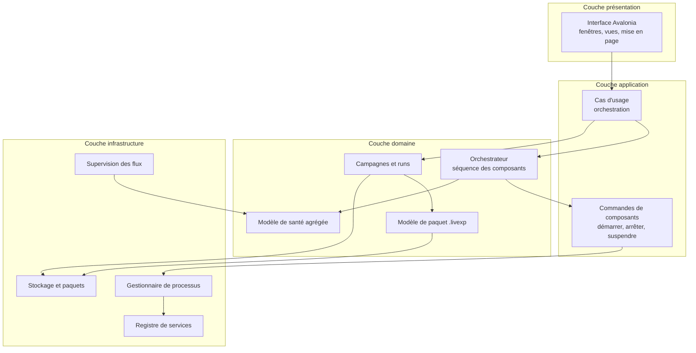
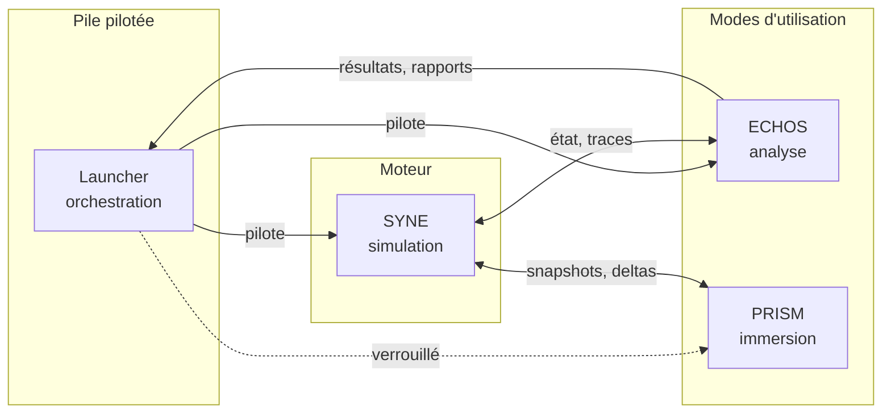

# ARCHITECTURE.md

**Composant** : LIVEX (Launcher)
**Statut** : [DRAFT]
**Dernière mise à jour** : 30 septembre 2026
**Dépend de** : `VISION.md`, `../../ARCHITECTURE.md`, `../../COMMUNICATION.md`
**Source Monographie** : —

---

## 1. Vue d'ensemble

Le Launcher est une application de bureau .NET organisée en couches strictes. Chaque
couche ne connaît que celle qui la suit, à l'exception de l'interface de
présentation qui ne connaît que la couche application.



| Couche | Rôle | Dépend de |
| :-- | :-- | :-- |
| Présentation | Rendu, navigation, saisie, mise en page | Application |
| Application | Cas d'usage, validation des intentions utilisateur | Domaine |
| Domaine | Règles d'orchestration, modèle de campagne, modèle de paquet | Infrastructure (via interfaces) |
| Infrastructure | Processus, réseau, fichiers, horloge, journaux | Aucune |

Le domaine ne référence **jamais** Avalonia, ni les types de processus, ni les
chemins de fichiers. Ces dépendances sont introduites par l'infrastructure à
travers des interfaces déclarées dans le domaine.

## 2. Le Launcher dans l'architecture de LIVEX

Le Launcher est un **pair** de SYNE, ECHOS et PRISM. Il ne contient aucun
composant et n'est contenu dans aucun autre.



Trois relations distinctes, à ne pas confondre :

| Relation | Nature | Direction |
| :-- | :-- | :-- |
| **Pilote** | Le Launcher contrôle le cycle de vie d'un composant | Launcher → composant |
| ** flux de données** | Un composant produit des données consommées par un autre | SYNE → ECHOS, SYNE → PRISM |
| **Restitution** | Un composant remet ses résultats au Launcher pour archivage | composant → Launcher |

Le Launcher n'intervient pas dans les chemins de données entre composants. Il
n'est jamais un relais : il ne transporte pas de snapshot SYNE vers ECHOS, ni de
snapshot vers PRISM. Il archive ce que les composants lui remettent.

## 3. Frontière contrôle et frontière données

C'est la distinction la plus importante de l'architecture.

| Frontière | Contenu | Sens |
| :-- | :-- | :-- |
| **Contrôle** | Démarrage, arrêt, suspension, configuration, requêtes d'état, requêtes d'analyse | Launcher → composant |
| **Données** | Snapshots, deltas, événements, résultats d'analyse, rapports | composant ↔ composant |

Le Launcher intervient **uniquement sur la frontière de contrôle**, et **uniquement
en bordure sur la frontière de données**, pour l'archivage. Il ne relaie pas les
données entre composants, et ne s'interpose pas entre SYNE et ECHOS.

Cette frontière a trois conséquences :

1. **Le Launcher ne dégrade pas un composant.** Si ECHOS est indisponible, il ne
   le remplace pas par une lecture simplifiée de SQLite : il signale l'absence et
   laisse le mode Analyse indisponible.
2. **Le Launcher ne devient jamais le propriétaire de l'état simulé.** Il ne
   détient aucune copie de l'état du monde, seulement des références et des
   empreintes.
3. **Le Launcher ne dégrade pas la science.** Il n'interprète jamais un résultat.
   Il le transporte, le dater, le rattache à un run et l'archive.

## 4. Modèle de concurrence

Le Launcher est un processus de bureau événementiel avec une boucle d'interface.
Il n'exécute jamais de calcul scientifique et ne doit pas être mis en concurrence
avec les threads de calcul des composants.

| Unité | Modèle | Rôle |
| :-- | :-- | :-- |
| Thread d'interface | Mono-thread, asynchrone | Fenêtre, mise en page, saisie |
| Boucle d'orchestration | Tâche de fond unique | Séquencement des composants, décisions de démarrage et d'arrêt |
| Pool de supervision | Tâches parallèles | Sondage d'état, collecte de journaux, mesures de santé |
| Écriture de paquet | Tâche séquentielle dédiée | Écriture du paquet `.livexp`, sérialisée et ordonnée |

Règles :

- **Une seule séquence d'orchestration.** Les décisions de cycle de vie sont prises
  par une unique boucle ordonnée, afin qu'une requête de l'utilisateur ne puisse
  pas entrer en conflit avec une réaction automatique.
- **Aucune attente bloquante sur l'interface.** Un composant lent ou figé ne fige
  jamais la fenêtre.
- **Écriture de paquet sérialisée.** L'écriture du paquet passe par une file
  d'attente ordonnée. Aucun accès concurrent au fichier.
- **Annulation coopérative.** L'arrêt du Launcher et l'annulation d'une campagne
  se propagent par jeton d'annulation, jamais par terminaison forcée d'un thread.

## 5. Découpage .NET

Le Launcher est un dépôt autonome. Il ne référence **aucun** assembly de SYNE,
ECHOS ou PRISM : les trois composants sont des processus externes, pas des
bibliothèques. Un seul assembly de référence est autorisé, `Simulation.Core`, et
uniquement pour réutiliser les types de contrats sérialisés de l'observabilité.

```text
launcher/
├── Launcher.App/                 Application Avalonia, composition, fenêtre
├── Launcher.Presentation/        Vues, mise en page, liaison aux cas d'usage
├── Launcher.Application/         Cas d'usage, validation, intention utilisateur
├── Launcher.Domain/              Orchestration, campagnes, modèle de paquet, santé
├── Launcher.Infrastructure/      Processus, registre, flux, stockage, horloge
├── Launcher.Protocol/            Types de contrat versionnés, sans dépendance
├── Launcher.Package/             Lecture et écriture du format .livexp
├── Launcher.Gateway/             forme de sortie — routage, authentification, santé agrégée (non planifié)
├── Launcher.Agent/               forme de sortie — relais sur machine distante (non planifié)
├── Launcher.Tests.Unit/
├── Launcher.Tests.Integration/
└── Launcher.Tests.EndToEnd/
```

| Projet | Dépend de | Interdit |
| :-- | :-- | :-- |
| `Launcher.App` | tous | logique métier |
| `Launcher.Presentation` | Application, Domain | accès processus, réseau, disque |
| `Launcher.Application` | Domain | Avalonia, types d'infrastructure |
| `Launcher.Domain` | Protocol | Avalonia, `System.Diagnostics`, `System.Net` |
| `Launcher.Infrastructure` | Domain, Protocol | Avalonia |
| `Launcher.Protocol` | aucun | tout autre projet du Launcher |
| `Launcher.Package` | Domain, Protocol | Avalonia, composants |
| `Launcher.Gateway` | Protocol | Avalonia, `Launcher.Domain` |
| `Launcher.Agent` | Protocol | Avalonia, `Launcher.Domain` |

`Launcher.Protocol` porte les types de contrat, et **l'adaptateur de protocole** qui
isole le Launcher de la décision encore ouverte sur le format des messages
`snapshot` et `event`. Seul cet assembly connaît le protocole ; `Launcher.Domain`
n'en dépend pas. Voir `NETWORK.md` §2.5.

`Launcher.Gateway` et `Launcher.Agent` sont des **formes de sortie** : des processus
séparés qui ne seraient construits que si une répartition multi-machine était un
jour décidée — aucune n'est planifiée (`NETWORK.md` §3, §4.2–4.3). La Gateway, le jour où
elle existerait, doit pouvoir tourner sans interface graphique, sur une machine
dédiée.

`Launcher.Package` est isolé : c'est lui qui lit et écrit le format `.livexp`, et
il doit pouvoir être testé sans démarrer un seul composant.

## 6. Persistance de l'orchestration

Le Launcher possède ses propres données d'orchestration, indépendantes de celles
d'ECHOS. Ces données servent à la reprise après incident et à la traçabilité.

| Support | Contenu | Durée de vie |
| :-- | :-- | :-- |
| **Paquet `.livexp`** | Campagne, runs, métadonnées, journaux, artefacts collectés | Durée de la campagne, puis archivage |
| **Journal local** | Événements de session du Launcher, décisions prises, incidents | Rotation quotidienne, purge configurable |
| **Préférences** | Profils, chemins, préférences d'interface, préférences réseau | Durable, faible volume |

Le Launcher ne tient **aucun** état scientifique durable hors paquet. Après le
scellement d'une campagne, la seule trace conservée est le paquet lui-même et le
journal de session.

## 7. Modèle de déploiement

Le Launcher est distribué comme une **application de bureau autonome**, sans
installation de langage ni de moteur de base de données.

| Cible | Support | Contrainte |
| :-- | :-- | :-- |
| Windows x64 | Natif | Auto-extractible ou installateur MSI |
| Linux x64 | Natif | Paquet ou AppImage, à arbitrer |
| macOS | Non prévu en V0.1 | Aucun besoin fonctionnel ne le justifie |
| Architecture sans état | Non applicable | Le Launcher est un processus local, jamais un service |

Le Launcher ne s'installe pas comme service et ne s'exécute pas dans un
conteneur. Il suppose un poste de travail de recherche, avec une session
interactive et un système de fichiers local accessible.

## 8. Traçabilité des décisions

Les décisions structurantes de cette architecture sont consignées dans `adr/`.

| ADR | Sujet |
| :-- | :-- |
| [`ADR-001-stack-dotnet-avalonia.md`](adr/ADR-001-stack-dotnet-avalonia.md) | .NET et Avalonia pour une interface native multi-plateforme |
| [`ADR-002-modes-analyse-et-immersion-de-poids-egal.md`](adr/ADR-002-modes-analyse-et-immersion-de-poids-egal.md) | Deux modes d'utilisation de poids égal |
| [`ADR-003-analyse-propriete-de-echos.md`](adr/ADR-003-analyse-propriete-de-echos.md) | ECHOS est seul propriétaire de l'analyse |
| [`ADR-004-format-de-paquet-livexp.md`](adr/ADR-004-format-de-paquet-livexp.md) | Le paquet `.livexp` |
| [`ADR-005-execution-sequentielle-mono-espace.md`](adr/ADR-005-execution-sequentielle-mono-espace.md) | Exécution séquentielle et mono-espace en V0.1 |
| [`ADR-006-prism-verrouille-en-attente.md`](adr/ADR-006-prism-verrouille-en-attente.md) | PRISM conçu mais verrouillé |

## 9. Références

- `VISION.md` — finalité, principes, non-objectifs
- `COMPONENTS.md` — modèle de composants et profils
- `PACKAGE_FORMAT.md` — structure du paquet `.livexp`
- `INTEGRATION_CONTRACT.md` — exigences d'intégration
- `TESTING.md` — stratégie de validation de ces règles de dépendance

## 10. Arbre hiérarchique et structure de dossiers à terme

Cette section réunit, en une vue unique, la hiérarchie des couches du Launcher et
l'arborescence de dossiers complète d'une installation — sources de détail :
§5 pour les projets .NET, `PACKAGING.md` §2 pour la livraison, `DATA_FLOW.md` §2
pour l'espace de travail.

### 10.1 Arbre hiérarchique des couches

La dépendance est strictement descendante : une couche ne connaît que celles
au-dessous d'elle. Le flux d'exécution monte (l'utilisateur agit sur la
présentation), les dépendances descendent (la présentation dépend de tout, le
protocole ne dépend de rien).

```text
Launcher.App                     point d'entrée, composition Avalonia
└── Launcher.Presentation        vues, mise en page
    └── Launcher.Application     cas d'usage, intentions utilisateur
        └── Launcher.Domain      orchestration, campagnes, paquet, santé
            ├── Launcher.Protocol        types de contrat, adaptateur (aucune dépendance)
            └── Launcher.Infrastructure  processus, registre, flux, stockage
                └── (implémente les interfaces de Domain)

Processus séparés (V0.1 : absents — formes de sortie) :
Launcher.Gateway, Launcher.Agent      dépendent de Protocol uniquement

Bancs de tests : Launcher.Tests.Unit / Integration / EndToEnd
```

| Règle de l'arbre | Portée |
| :-- | :-- |
| Une flèche = une référence d'assembly autorisée | Toute autre référence est interdite et vérifiée par analyse statique (`TESTING.md`) |
| `Domain` au sommet des règles | Ne référence ni Avalonia, ni processus, ni réseau — uniquement `Protocol` |
| `Protocol` sans dépendance | Porté par tous, ne dépend de personne ; isolé de la décision de protocole |

### 10.2 Structure de dossiers finale

Deux hiérarchies, **séparées par construction** : l'installation (remplaçable) et
les données (durables). Les formes de paquet par plateforme — `.exe` installateur
Windows, `.deb`/AppImage ou archive Linux — sont l'affaire de `PACKAGING.md` §3 ;
l'arborescence interne, elle, est identique partout.

```text
livex/                                   # INSTALLATION (racine choisie à l'installation)
├── launcher/                            # le Launcher
│   ├── livex-launcher(.exe)             # exécutable principal (Avalonia)
│   ├── Launcher.*.dll                   # couches + dépendances managées .NET
│   ├── docs/                            # documentation embarquée, rendue par le lecteur Markdown
│   │   ├── guide-paquet.md
│   │   ├── profils.md
│   │   └── diagnostic.md
│   ├── templates/                       # modèles de paquet, de campagne, de profil
│   └── components/                      # composants détectés (PACKAGING §2.1)
│       ├── syne/
│       │   ├── component.json          # manifeste (INTEGRATION_CONTRACT §2)
│       │   ├── Simulation.Console(.exe) # hôte du moteur (--serve :5181 / --observe :5180)
│       │   ├── Simulation.Core.dll      # moteur + contrats d'observabilité
│       │   └── *.dll                    # dépendances managées
│       ├── echos/
│       │   ├── component.json
│       │   └── echos-launcher       # adaptateur Python de l'API ECHOS (API seule, ADR-007)
│       └── prism/                       # livré quand PRISM sera prêt (ADR-006)
│           ├── component.json
│           └── ...
├── templates/                           # alias racine des modèles (PACKAGING §2.1)
├── LICENSE
└── VERSION

<données utilisateur>/                   # DONNÉES — hors installation (PACKAGING §2.2)
├── preferences/                          # profils, préférences réseau (network.json)
├── sessions/                             # journaux de session (rotation quotidienne)
├── packages/                             # paquets .livexp de campagnes vivantes
├── archives/                             # paquets scellés conservés
├── cache/                                # jetable
└── workspace/                            # espace de travail Launcher (DATA_FLOW §2)
    ├── Config/                           # configuration Launcher et profils, network.json (NETWORK §6.3)
    ├── Simulations/                      # simulations installées par l'utilisateur
    ├── Experiments/
    │   └── EXP-2026-001/
    │       ├── experiment.json
    │       ├── experiment.log
    │       ├── runs/
    │       │   └── RUN-0042/
    │       │       ├── run.json
    │       │       ├── config.resolved.json
    │       │       ├── data/             # sorties SYNE du run
    │       │       ├── metrics.jsonl
    │       │       ├── logs/
    │       │       └── integrity.json
    │       └── analysis/
    │           ├── individual/           # analyses ECHOS par run
    │           ├── aggregate/            # analyses ECHOS agrégées
    │           └── emergence_report.md   # rapport de référence — rendu par le lecteur Markdown
    ├── Reports/                          # exports volontaires (copies)
    ├── Data/
    │   └── Cache/
    ├── Logs/                             # journaux par composant
    └── State/                            # état de session du Launcher
```

| Règle de structure | Source |
| :-- | :-- |
| Installation remplaçable sans perte de données | `PACKAGING.md` §2.2 |
| Le Launcher s'installe **sans** composants ; il détecte ceux présents | `PACKAGING.md` §2.1, §4 |
| Un run n'écrit que dans son dossier | `DATA_FLOW.md` §3 |
| `Experiments/` porte la valeur métier ; `Data/` ne porte que du régénérable | `DATA_FLOW.md` §2 |
| Le rapport a **un seul** emplacement de référence | `DATA_FLOW.md` §3.1 |
| `Launcher.Gateway`/`Launcher.Agent` ont leurs propres répertoires le jour où ils existent | §5 — formes de sortie |

> **Emplacements système exacts** (racine des données utilisateur par OS, variable
> `LIVEX_HOME`) : points ouverts `PACKAGING.md` §12 et `ISSUES.md` O-17. La
> structure interne, elle, ne dépend pas de ces choix.

---

## Points restés ouverts dans ce document

- **Réaction aux plantages de composants.** Le Launcher doit détecter un
  composant arrêté de façon inattendue, mais la politique de redémarrage
  automatique (nombre de tentatives, délai, escalade vers l'utilisateur) n'est
  pas tranchée. Voir `OBSERVABILITY.md` et `ISSUES.md`.
- **Traitement de la dérive de schéma.** Si un composant écrit dans le paquet avec
  une version de schéma plus récente que celle du Launcher, la politique de
  lecture (refus, lecture dégradée, lecture seule) doit être arrêtée. Voir
  `PACKAGE_FORMAT.md` §8.
- **Artefacts volumineux.** Le plafond au-delà duquel le Launcher refuse
  d'héberger un artefact dans un paquet doit être fixé, ainsi que la stratégie de
  dépôt externe avec référence. Voir `ISSUES.md`.
- **Support macOS.** L'exclusion est actée pour la V0.1, mais aucune décision n'est
  prise sur une éventuelle réouverture.
