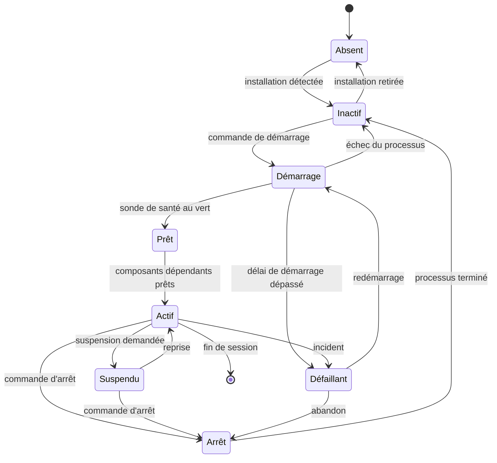
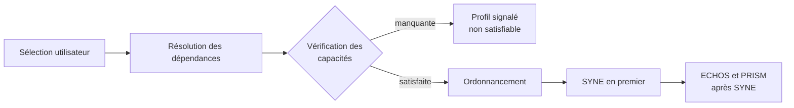
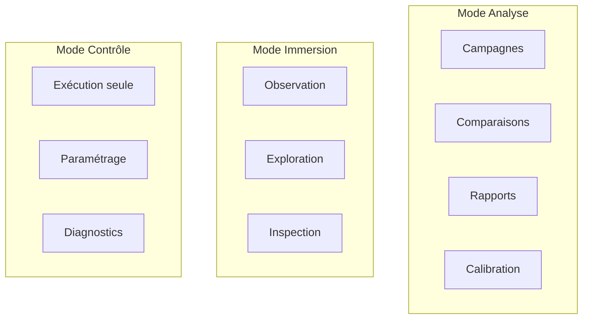
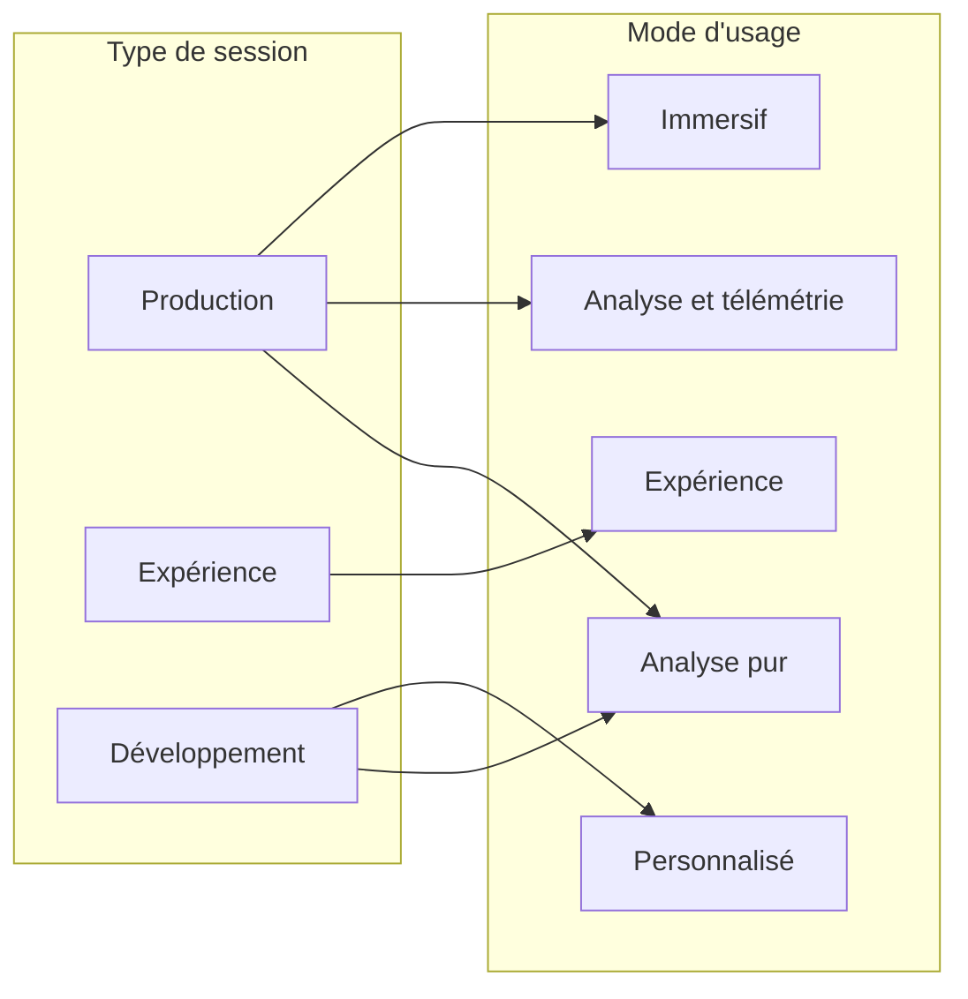

# COMPONENTS.md

**Composant** : LIVEX (Launcher)
**Statut** : [DRAFT]
**Dernière mise à jour** : 30 septembre 2026
**Dépend de** : `ARCHITECTURE.md`, `INTEGRATION_CONTRACT.md`, `../../COMMUNICATION.md`
**Source Monographie** : —

> **Cible contractuelle et état du code :** les exemples de ce document
> décrivent le modèle visé, pas la preuve qu'un composant le respecte déjà.
> À la référence du 2 octobre 2026, SYNE réel, ECHOS headless et `syne-mock`
> fournissent chacun un manifeste limité à Linux. Le batch SYNE ne connaît que
> `reference` et son intégration au collecteur de paquets n'est pas acceptée ;
> les opérations d'analyse ECHOS lisent des runs déjà présents dans la base
> analytique, dont le flux d'ingestion depuis le Launcher n'est pas validé.
> PRISM n'a pas de manifeste Launcher. Le mock remplace le rôle SYNE, il n'est
> pas un quatrième rôle. Voir la
> [matrice des capacités](../../launcher/V1-CAPABILITY-MATRIX.md) pour l'état
> observé et les critères d'acceptation.

---

## 1. Principes du modèle

Le Launcher ne connaît pas les composants individuellement. Il connaît un **modèle
de composant** générique, déclaré par un manifeste, et il pilote chaque instance
à travers une interface unique. Ajouter un composant à la pile ne doit pas
modifier le code du Launcher.

Quatre principes gouvernent ce modèle.

| Principe | Conséquence |
| :-- | :-- |
| **Déclaratif** | Un composant se décrit par un manifeste. Le Launcher ne le connaît pas à la compilation. |
| **Indépendant** | Un composant absent, en panne ou lancé manuellement n'empêche aucun autre composant de fonctionner. |
| **Pilotable** | Le Launcher démarre, arrête et suspend tout ce qu'il est censé piloter, par des commandes à effet observable. |
| **Observable** | Tout composant expose un état interrogeable et des mesures de santé. Un composant muet est traité comme défaillant. |

## 2. Notions de base

| Notion | Définition |
| :-- | :-- |
| **Type de composant** | La nature du composant : moteur, analyse, immersion, utilitaire. Déclaré dans le manifeste. |
| **Installation** | Une présence physique sur le poste, repérée par un chemin et une version. |
| **Instance** | Un processus en cours d'exécution, piloté par le Launcher, rattaché à une installation. |
| **Profil** | Un ensemble prédéfini de types de composants à activer, avec leur configuration. |
| **Session** | L'espace de travail ouvert par l'utilisateur, instance de profil et composants actifs. |
| **Compte-rendu de santé** | L'état d'un composant et la cause principale de cet état. |

Un même type de composant peut avoir plusieurs installations (par exemple deux
versions de SYNE en parallèle). Le Launcher laisse l'utilisateur choisir
l'installation active par type.

## 3. Le manifeste de composant

Chaque installation fournit un manifeste que le Launcher lit pour connaître le
composant. Le manifeste est la **seule** source de vérité pour l'orchestration :
aucune donnée d'intégration n'est codée en dur dans le Launcher.

```json
{
  "schema": 1,
  "id": "syne",
  "type": "engine",
  "name": "SYNE",
  "version": "0.13.0",
  "runtime": "dotnet",
  "executable": "Simulation.Console",
  "workingDirectory": ".",
  "arguments": ["--headless", "--serve"],
  "endpoints": {
    "control": { "transport": "http", "port": 5181 },
    "observability": { "transport": "websocket", "port": 5180 }
  },
  "capabilities": ["deterministic", "headless", "checkpointing"],
  "health": { "probe": "http", "path": "/health", "intervalMs": 2000 },
  "timeouts": { "startupMs": 30000, "shutdownMs": 15000 },
  "contributesTo": ["analyse", "immersion"]
}
```

| Champ | Rôle | Obligatoire |
| :-- | :-- | :-- |
| `schema` | Version de la structure du manifeste | oui |
| `id` | Identifiant stable du composant | oui |
| `type` | Type fonctionnel (moteur, analyse, immersion) | oui |
| `version` | Version du composant, semver | oui |
| `runtime` | Exécution requise (dotnet, natif, script) | oui |
| `executable` | Chemin de l'exécutable, relatif à l'installation | oui |
| `endpoints` | Points d'accès exposés, avec ports | si applicable |
| `capabilities` | Capacités déclarées, utilisées pour valider un profil | oui |
| `health` | Sonde de santé et fréquence | oui |
| `timeouts` | Délais de démarrage et d'arrêt | oui |
| `contributesTo` | Modes d'utilisation servis | oui |

Le Launcher refuse un manifeste dont `schema` est supérieur à celui qu'il connaît,
plutôt que de l'interpréter de façon approximative.

## 4. Cycle de vie et états

Un composant piloté par le Launcher traverse un cycle de vie explicite. Chaque
transition est une **décision d'orchestration**, tracée dans le journal.



| État | Signification | L'interface |
| :-- | :-- | :-- |
| **Absent** | Aucune installation détectée | Gris, non sélectionnable |
| **Inactif** | Installation présente, aucun processus | Neutre, démarrable |
| **Démarrage** | Processus lancé, attente de la sonde de santé | Activité, non pilotable |
| **Prêt** | Sonde au vert, pas encore sollicité | Vert, prêt |
| **Actif** | En service, sollicité par le mode | Vert, actif |
| **Suspendu** | Vivant mais inactif, prêt à reprendre | Ambre, reprenable |
| **Arrêt** | Arrêt demandé, attente de terminaison | Activité, non pilotable |
| **Défaillant** | Sonde au rouge ou processus perdu | Rouge, cause affichée |

### 4.1 Règles de transition

- **Aucune transition implicite.** Un composant ne change pas d'état sans
  décision du Launcher ou événement observable consigné.
- **Le délai prime sur l'état.** Un dépassement de délai produit toujours
  l'état **Défaillant**, avec la cause `délai de démarrage dépassé`, jamais un
  état indéterminé.
- **Un état vert sans cause est interdit.** Tout état autre que **Inactif** porte
  une cause principale, une date de dernière observation et un compteur
  d'observations consécutives.
- **La perte de contact est un incident.** Un composant qui ne répond plus pendant
  trois intervalles de sonde consécutifs passe en **Défaillant**, quel que soit
  son état précédent.

## 5. Registre de services

Le Launcher tient un **registre** de ce qu'il pilote, avec l'instance, l'état, la
version et les points d'accès actifs. Le registre est l'unique source pour
l'interface, la supervision et la résolution des appels de contrôle.

| Information | Usage |
| :-- | :-- |
| Identifiant de type | Résolution d'un profil |
| Installation et version | Affichage, contrôle de compatibilité |
| Processus et ligne de commande | Supervision, arrêt propre |
| État et cause | Compte-rendu de santé |
| Points d'accès actifs | Routage du contrôle et des données |
| Capacités | Validation d'un profil |
| Dates de démarrage et d'arrêt | Journal, métriques |

Le registre est en mémoire. Il est reconstruit au démarrage par détection, et
n'est pas persisté : aucune session ne survit à l'arrêt du Launcher.

## 6. Sélection de composants

La sélection d'un profil produit un ** graphe de composants**. Le Launcher doit
résoudre ce graphe de manière déterministe.



| Étape | Règle |
| :-- | :-- |
| Complétion | Le Launcher ajoute les dépendances obligatoires non sélectionnées. |
| Validation | Toute capacité requise mais non déclarée rend le profil non satisfiable. |
| Ordre d'arrêt | Inverse strict de l'ordre de démarrage. |
| Non-sélection | Un composant non sélectionné mais requis devient une erreur explicite, jamais une sélection silencieuse. |

Le Launcher ne démarre **jamais** un composant en dehors du profil actif sans
action explicite de l'utilisateur.

## 7. Modes d'utilisation

Le Launcher distingue le **composant** du **mode d'utilisation**. Un mode est une
manière d'utiliser le moteur, portée par un composant et dotée de sa propre vue.



| Mode | Composant porteur | État | Accès |
| :-- | :-- | :-- | :-- |
| **Contrôle** | SYNE | Ouvert | Toujours |
| **Analyse** | ECHOS | Ouvert | Toujours |
| **Immersion** | PRISM | Verrouillé | Désactivé, avec raison affichée |

### 7.1 Mode Contrôle

Le mode Contrôle est le socle. Il expose le paramétrage du moteur, l'exécution
sans mode associé, les diagnostics du moteur et la gestion de la pile. Il est
disponible dès lors que SYNE est présent, car il ne dépend d'aucun autre
composant.

### 7.2 Mode Analyse

Le mode Analyse porte la chaîne scientifique. ECHOS en est le composant porteur :
il calcule les métriques, les statistiques et le rapport d'émergence.

La frontière porte sur le **calcul**, pas sur l'affichage :

- le Launcher **demande** l'analyse — `AnalyzeRun`, `AnalyzeExperiment`,
  `GenerateReport` — et attend le résultat ;
- ECHOS **produit** l'analyse et le rapport ;
- le Launcher **présente** le rapport d'émergence dans son interface, et l'archive
  avec l'expérience ;
- le Launcher ne calcule **aucune** statistique et n'interprète **aucune** donnée.

L'observation en direct est assurée par les **fenêtres natives du Launcher**
(`USER_INTERFACE.md` §9) : les consoles de logs, ouvertes au démarrage de chaque
composant, et la fenêtre d'analyse qui sonde l'API REST d'ECHOS. Aucune fenêtre
de navigateur n'est nécessaire — et ECHOS n'en expose plus (ADR-007) : la
télémétrie est optionnelle au sens où aucune campagne ne dépend de l'ouverture
d'une fenêtre quelconque.

Voir `adr/ADR-003-analyse-propriete-de-echos.md`.

### 7.3 Mode Immersion

Le mode Immersion porte la représentation temps réel du monde. Il est conçu et
documenté comme un composant de plein exercice : il a son type, son manifeste, ses
capacités, ses états et sa vue.

Son accès est **verrouillé** tant que son implémentation n'est pas disponible. Le
verrouillage est un état du Launcher, pas une absence de conception :

| Règle | Comportement |
| :-- | :-- |
| Le mode est visible | L'entrée de navigation existe et affiche son état. |
| La sélection est refusée | Un clic sur le mode verrouillé explique la raison et le jalon attendu. |
| Le manifeste est exigé | Le Launcher sait lire un manifeste de type immersion. |
| Les vues sont spécifiées | `USER_INTERFACE.md` décrit la disposition du mode. |
| Le déverrouillage est un jalon | Il est conditionné par l'implémentation de PRISM, pas par une date. |

Le verrouillage ne doit jamais êtrecodé en dur. Il est la conséquence d'une
condition d'implémentation évaluée au démarrage et à chaque changement de
profil. Voir `adr/ADR-006-prism-verrouille-en-attente.md`.

## 8. Modes d'usage et types de session

Un mode d'usage est **ce que l'utilisateur veut faire**. Un type de session est **le
cadre dans lequel il le fait**. Ce sont deux axes indépendants, et non une liste
unique.



### 8.1 Axe 1 — le type de session

| Type | Ce qu'il autorise | Ce qu'il retire |
| :-- | :-- | :-- |
| **Production** | Usage courant : campagne, observation, analyse | Les commandes de bas niveau et les options de diagnostic |
| **Expérience** | Conduite d'une campagne, analyse, rapports, statistiques | L'exécution non supervisée |
| **Développement** | Diagnostic, injection de panne, arguments, protocole | Rien : c'est le type le plus permissif |

### 8.2 Axe 2 — le mode d'usage

| Mode | Composants lancés | Ce qu'il apporte |
| :-- | :-- | :-- |
| **Analyse pur** | SYNE + ECHOS | Analyse et rapport ; aucune fenêtre d'observation ouverte |
| **Analyse et télémétrie** | SYNE + ECHOS + fenêtres natives | Consoles de logs et fenêtre d'analyse du Launcher ouvertes pendant la simulation |
| **Immersif** | SYNE + PRISM | Représentation temps réel du monde |
| **Expérience** | SYNE + ECHOS + PRISM | Campagne multi-run, analyse, rapports, immersion |
| **Personnalisé** | Choisis manuellement | Composants, fonctionnalités et services sélectionnés à la main |

### 8.3 La matrice

|  | Analyse pur | Analyse et télémétrie | Immersif | Expérience | Personnalisé |
| :-- | :-- | :-- | :-- | :-- | :-- |
| **Production** | licite | licite | licite | licite | licite |
| **Expérience** | licite | licite | licite | licite | licite |
| **Développement** | licite | licite | licite | licite | licite |

Toute combinaison est permise, mais **toutes ne sont pas réalisables** :

- en type Développement, le moteur réel peut être remplacé par `Stub.Syne` ;
- le mode Immersif reste verrouillé tant que PRISM n'est pas implémenté ;
- un mode qui requiert ECHOS est indisponible si ECHOS ne l'est pas, et
  l'indisponibilité est **affichée**, jamais contournée.

### 8.4 Le mode Personnalisé

Le mode Personnalisé n'ajoute aucun cas particulier : il laisse l'utilisateur
composer lui-même. Il permet de choisir :

- les **composants** à lancer, ou aucun ;
- les **modes d'usage** à activer simultanément ;
- les **services** à exposer ou à laisser fermés ;
- le **moteur**, réel ou factice ;
- les **profils de campagne** et les politiques associées.

| Règle | Comportement |
| :-- | :-- |
| **Aucun composant imposé** | Une sélection vide est valide : le Launcher n'exige aucun moteur pour s'ouvrir. |
| **Cohérence vérifiée** | Une combinaison incohérente est refusée à la sélection, avec la raison. |
| **Enregistrement** | Une combinaison peut être enregistrée comme profil réutilisable. |
| **Traçabilité** | Le profil enregistré indique le type de session et les composants retenus. |

### 8.5 Contraintes communes

- **SYNE n'est pas obligatoire.** Le mode Personnalisé peut démarrer sans moteur,
  par exemple pour consulter des rapports existants.
- **Les modes sont combinables.** Analyse et Immersion ne s'excluent pas.
- **L'égalité des modes est structurelle.** Aucun mode n'est qualifié de principal
  ou de secondaire.
- **Le type de session ne change pas les composants.** Il change ce que l'interface
  expose et les garde-fous qui s'appliquent.

## 9. Profils d'exécution

Un profil est une **sélection nommée, stockée et réutilisable**. C'est la forme
enregistrée d'une combinaison de la matrice.

| Profil | Type | SYNE | ECHOS | PRISM | Usage |
| :-- | :-- | :-- | :-- | :-- | :-- |
| **Simulation seule** | Production | ✓ | — | verrouillé | Exécuter sans analyser, sans observer |
| **Analyse** | Production | ✓ | ✓ | verrouillé | Analyse et rapport |
| **Analyse avec télémétrie** | Production | ✓ | ✓ | verrouillé | Idem, fenêtre d'analyse du Launcher ouverte |
| **Immersion** | Production | ✓ | — | verrouillé | Observer le monde en temps réel |
| **Expérience** | Expérience | ✓ | ✓ | verrouillé | Campagne multi-run et rapports |
| **Développement** | Développement | stub possible | stub possible | stub possible | Diagnostic et injection de panne |
| **Personnalisé** | au choix | au choix | au choix | au choix | Sélection manuelle libre |

## 10. Coexistence des modes

Les modes partagent le même moteur et le même espace de travail, sans se gêner.

| Ressource | Partage | Règle |
| :-- | :-- | :-- |
| Instance de moteur | Partagée | Un seul moteur pour l'ensemble des modes d'une session. |
| Campagnes | Propre à l'Analyse | Une campagne appartient à ECHOS, pas au Launcher. |
| Scène temps réel | Propre à l'Immersion | Une scène appartient à PRISM. |
| Paquets `.livexp` | Partagés | Écrits par le Launcher, lus par les deux modes. |
| Ports du moteur | Partagés | Un seul jeu de ports par instance. |

## 11. Composants lancés manuellement

Un composant déjà en cours d'exécution, lancé indépendamment du Launcher, est
détecté au démarrage.

| Situation | Comportement du Launcher |
| :-- | :-- |
| Détecté, même installation | Le Launcher le propose en adoption, sans l'arrêter. |
| Détecté, autre installation | Le Launcher signale un conflit et demande un choix explicite. |
| Détecté après démarrage | Le Launcher le signale et refuse de démarrer un doublon. |
| Non détecté | Le Launcher démarre sa propre instance. |

L'**adoption** permet d'éviter le cycle arrêt-démarrage, donc la perte d'un monde
en cours. Un composant adopté est supervisé, mais son arrêt est demandé avec
préférence, car il n'appartient pas à la session.

## 12. Détection des installations

La détection est purement déclarative et s'appuie sur les manifestes.

| Source | Usage | Priorité |
| :-- | :-- | :-- |
| Arborescence de l'application | Composants livrés avec le Launcher | Première |
| Variable d'environnement `LIVEX_HOME` | Installation personnalisée | Seconde |
| Emplacements de l'utilisateur | Composants développés localement | Troisième |
| Registre de composants | Installations déclarées hors arborescence | Quatrième |

Un composant absent apparaît comme **Absent**, avec la raison et l'emplacement
attendu. Un composant installé mais dont le manifeste est invalide apparaît comme
**Inactif** avec la cause `manifeste invalide`, plutôt que d'être
silencieusement ignoré. Voir `PACKAGING.md`.

## 13. Références

- `INTEGRATION_CONTRACT.md` — exigences que les manifestes doivent satisfaire
- `OBSERVABILITY.md` — sonde de santé, compte-rendu, métriques
- `NETWORK.md` — résolution des points d'accès et registre réseau
- `EXPERIMENTS.md` — campagnes et runs, qui s'appuient sur le registre
- `USER_INTERFACE.md` — mise en page des modes et des états

---

## Points restés ouverts dans ce document

- **Politique de redémarrage.** Le nombre de tentatives, le délai entre
  tentatives et la conditions d'abandon ne sont pas tranchés. Voir
  `OBSERVABILITY.md` et `ISSUES.md`.
- **Adoption multiple.** Le cas d'un composant détecté en double exemplaire doit
  être précisé : le Launcher bloque-t-il, ou choisit-il le plus récent ?
- **Capacités formelles.** La liste close des capacités déclarables doit être
  stabilisée pour valider les profils de façon fiable.
- **Composant de type utilitaire.** Le type est prévu dans le modèle, mais aucun
  composant de ce type n'est défini. Il faut trancher s'il est conservé.
