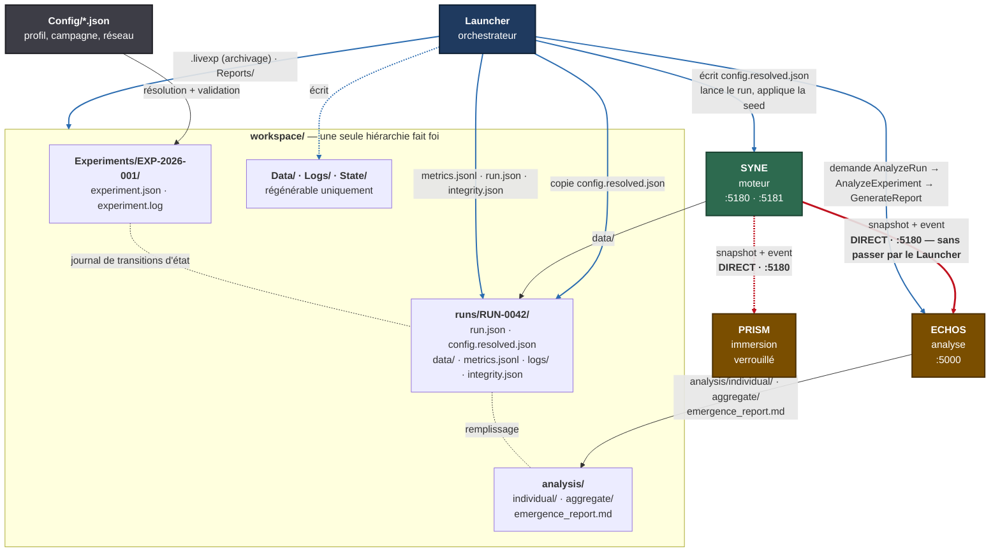
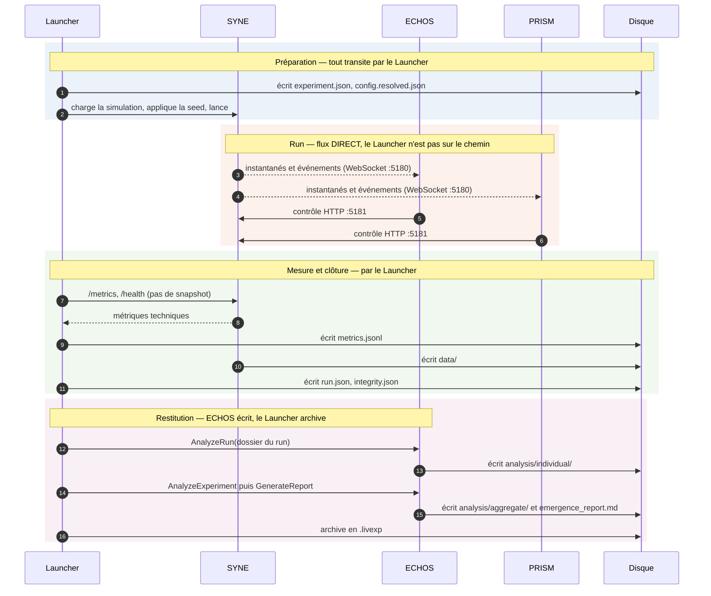

# DATA_FLOW.md

**Composant** : LIVEX (Launcher)
**Statut** : [DRAFT]
**Dernière mise à jour** : 30 septembre 2026
**Dépend de** : `COMPONENTS.md`, `NETWORK.md`, `PACKAGE_FORMAT.md`, `EXPERIMENTS.md`, `INTEGRATION_CONTRACT.md`
**Source Monographie** : —

---

## 1. Objet

Ce document décrit **où vivent les données** et **comment elles circulent** : de la
configuration au paquet archivé, en passant par les données de run, les métriques et
le rapport.

Il répond à trois points distincts, souvent confondus :

1. **Où** sont stockées les données, et laquelle des deux hiérarchies fait foi.
2. **Quand** chaque producteur écrit, et dans quel périmètre.
3. **Ce qui traverse** quel canal entre quels composants.

## 2. Arborescence : une seule hiérarchie fait foi

Il existe une règle unique, à retenir :

> **`Experiments/` porte les données de valeur métier. `Data/` ne porte que du
> régénérable et du jetable.**

| Répertoire | Contenu | Régénérable |
| :-- | :-- | :-- |
| `Config/` | Configuration du Launcher et des profils | Non |
| `Simulations/` | Simulations installées par l'utilisateur | Non |
| `Experiments/` | Expériences, runs, données, analyses, rapports | **Non — données scientifiques** |
| `Reports/` | Exports et copies volontaires de rapports | Oui |
| `Data/` | Cache, index, données temporaires | Oui |
| `Logs/` | Journaux par composant | Oui |
| `State/` | État de session du Launcher | Oui |

`Data/` ne contient donc **que** du contenu dont la perte n'a aucune conséquence
scientifique :

```text
Data/
└── Cache/
```

Les données brutes d'une expérience ne doivent **jamais** être mélangées avec la
configuration du Launcher ni avec le contenu de `Data/`. Toute tentative de faire
 cohabiter les deux hiérarchies est un défaut de conception, pas une préférence.

## 3. Arborescence d'une expérience

```text
Experiments/
└── EXP-2026-001/
    ├── experiment.json            # définition, état, seeds, politiques
    ├── experiment.log             # journal de l'expérience
    ├── runs/
    │   └── RUN-0042/
    │       ├── run.json           # métadonnées, statut, empreinte
    │       ├── config.resolved.json   # configuration effective complète
    │       ├── data/              # données produites par SYNE (result.json, stream.jsonl)
    │       ├── metrics.jsonl      # métriques techniques échantillonnées
    │       ├── logs/              # extraits de journaux corrélés au run
    │       └── integrity.json     # tailles et empreintes des fichiers de data/
    └── analysis/
        ├── individual/            # analyse par run, produite par ECHOS
        ├── aggregate/             # analyse agrégée, produite par ECHOS
        └── emergence_report.md    # rapport de référence
```

**Règle d'écriture : un run n'écrit que dans son dossier.** Aucun fichier partagé
entre deux runs. C'est ce qui rend un run isolable, copiable et supprimable sans
effet de bord.

### 3.1 Le rapport de référence

Le rapport d'émergence est écrit à **un seul emplacement de référence** :

```text
Experiments/EXP-2026-001/analysis/emergence_report.md
```

`Reports/<id>/` n'est **jamais** écrit par le processus de génération. Ce n'est qu'un
dossier de copies, alimenté uniquement quand l'utilisateur **exporte** ou **archive**
explicitement un rapport pour le partager. Sans cette règle, un même fichier aurait
deux emplacements concurrents et aucune source de vérité.

## 4. Schémas essentiels

Tous les fichiers JSON portent un champ `schema` obligatoire, et sont validés par
JSON Schema au chargement. Une version de schéma inconnue est refusée
explicitement, jamais tolérée en silence.

### 4.1 `experiment.json`

```json
{
  "schema": 1,
  "id": "EXP-2026-001",
  "name": "Emergence Test",
  "simulation": "reference",
  "runs": 100,
  "ticks": 50000,
  "seed": { "strategy": "derived", "masterSeed": 20260930 },
  "onRunFailure": "RetryThenSkip",
  "retryPolicy": { "enabled": true, "maxAttempts": 2 },
  "reproducibility": { "level": "exact" },
  "state": "Running"
}
```

### 4.2 `run.json`

```json
{
  "schema": 1,
  "runId": "RUN-0042",
  "experimentId": "EXP-2026-001",
  "status": "Completed",
  "attempt": 1,
  "seed": 918273645,
  "ticksRequested": 50000,
  "ticksReached": 50000,
  "startedAt": "2026-09-30T10:12:00Z",
  "endedAt": "2026-09-30T10:47:31Z",
  "exitCode": 0,
  "versions": { "livex": "0.1.0", "syne": "0.1.0", "protocol": 1 },
  "platform": { "os": "linux", "arch": "x64", "dotnet": "…" },
  "simulation": "reference",
  "resultFingerprint": "sha256:…"
}
```

`run.json` enregistre **la configuration résolue**, jamais la configuration demandée.
Sans cela, une reprise dans six mois ne peut pas reconstituer ce qui a réellement
tourné.

### 4.3 Stratégies de seed

| Stratégie | Définition | Reproductibilité |
| :-- | :-- | :-- |
| `fixed` | Liste de seeds explicite | Totale |
| `derived` | Seeds dérivées d'une **seed maîtresse** | Totale — **recommandée** |
| `random` | Seeds tirées, puis **enregistrées** | Partielle : l'expérience n'est rejouable qu'à partir de l'enregistrement |

Une campagne qui prétend être reproductible avec la stratégie `random` ne l'est pas.
La seed tirée doit être écrite dans `experiment.json` avant le premier run.

## 5. Règles d'écriture

| Règle | Mise en œuvre |
| :-- | :-- |
| **Écriture atomique** | Écrire dans un fichier temporaire, puis renommer. Un artefact n'est jamais visible à moitié écrit. |
| **Un seul écrivain par fichier** | `experiment.json` n'est écrit que par le Launcher. `run.json` est écrit par le Launcher pour le statut, et enrichi par le composant pour les résultats. |
| **Journal d'expérience** | `experiment.log` trace les transitions d'état. La reprise s'appuie sur ce journal, pas sur un balayage du disque. |
| **Horodatage UTC** | Les horodatages de fichier sont en UTC, avec suffixe. |
| **Integrité** | `integrity.json` porte taille et empreinte de chaque fichier de `data/`. |

L'écriture atomique n'est pas une précaution théorique : la reprise dépend de l'état
sur disque, et une écriture interrompue de `experiment.json` à la lettre près de sa
mise à jour rendrait une campagne de 100 runs irrécupérable.

## 6. Flux de bout en bout

```text
  Configuration                    Expérience                      Paquet archivé
  ────────────                     ───────────                     ──────────────

  Config/*.json
        │  résolution + validation par schéma
        ▼
  config.resolved.json ──────────► experiment.json
  (copié dans chaque run)                │  lecture
                                       ▼
                                  ┌─────────────┐
                                  │  SYNE       │
                                  │  run 0042   │
                                  └──────┬──────┘
                        WebSocket snapshot / event
                    ┌────────────┬───────┴────────┐
                    ▼            ▼                ▼
               PRISM        ECHOS            metrics.jsonl
              (immersion)   (analyse)         (métriques
                    │            │            techniques)
                    │            ▼                │
                    │      analysis/individual    │
                    │      analysis/aggregate     │
                    │            │                │
                    │            ▼                │
                    │   emergence_report.md      │
                    │            │                │
                    └────────────┴────────┬───────┘
                                        ▼
                                   .livexp (archivage)
```

### 6.1 Cartographie des flux

La cartographie ci-dessus est exacte mais ne dit pas **une chose essentielle** :
la nature de chaque lien. Un lien qui traverse le Launcher et un lien direct ne
sont pas équivalents — le premier est sous le contrôle de l'orchestrateur, le
second ne l'est pas.

La version ci-dessous fait apparaître cette distinction.



**Ce que le schéma établit :**

| Lien | Passe par le Launcher ? | Conséquence |
| :-- | :-- | :-- |
| `CFG → EXP` | Non | La résolution de configuration est une lecture, pas un transit. |
| `L → S` | **Oui** | Le Launcher est seul à pouvoir lancer et arrêter le moteur. |
| `S → E` (rouge) | **Non** | La télémétrie d'ECHOS survit à un arrêt du Launcher. |
| `S → P` (rouge) | **Non** | L'immersion survit à un arrêt du Launcher. |
| `S → data/` | Non | SYNE écrit ses propres sorties ; le Launcher ne les relaie pas. |
| `E → analysis/` | Non | ECHOS écrit ses propres résultats dans le dossier du run. |
| `L → WS` | **Oui** | Le Launcher est le seul écrivain de `run.json`, `metrics.jsonl` et du paquet. |

Le trait commun : **le Launcher est sur le chemin de tout ce qu'il doit
contrôler ou archiver, et sur le chemin d'aucun flux de données temps réel.**

### 6.2 Ce qui traverse quel canal

| Émetteur | Destinataire | Canal | Volume | Fréquence |
| :-- | :-- | :-- | :-- | :-- |
| Launcher | Composants | HTTP de contrôle, port de contrôle | Faible | Sur commande |
| SYNE | PRISM | WebSocket, instantanés et événements | **Très élevé** | Continue |
| SYNE | ECHOS | WebSocket, instantanés et événements | **Très élevé** | Continue |
| Composants | Launcher | `/health`, `/info`, `/metrics` | Faible | Cadence configurable |
| Composants | SYNE | HTTP de contrôle | Faible | Sur commande |
| ECHOS | Launcher | Analyse individuelle et agrégée, rapport | Moyen | À la fin de chaque run |
| Launcher | Fichiers | `Experiments/<id>/` | Élevé | À la fin de chaque run |

Le constat central : **le flux de données est volumineux et direct**, tandis que le
flux de contrôle est faible et centralisé. C'est le fondement de `NETWORK.md` §2.

> **Cohérence avec `COMMUNICATION.md`.** Les ports et chemins de ce tableau
> correspondent au transport transverse du projet : WebSocket `:5180` pour les
> snapshots et événements, HTTP `:5181/api/control/` pour le contrôle SYNE, HTTP
> `:5000` pour l'API REST d'ECHOS. Voir `../../COMMUNICATION.md` §3.

### 6.3 Qui écrit quoi — le principe d'un seul écrivain

| Artefact | Écrivain unique | Le Launcher peut-il l'écrire aussi ? |
| :-- | :-- | :-- |
| `experiment.json` | Launcher | — c'est lui |
| `config.resolved.json` | Launcher | — c'est lui |
| `run.json` | Launcher pour le statut | Oui — enrichi par le composant pour les résultats |
| `data/` | SYNE | **Non** — jamais |
| `analysis/individual/`, `analysis/aggregate/` | ECHOS | **Non** — jamais |
| `emergence_report.md` | ECHOS, sur demande du Launcher | **Non** — il le demande, il ne le rédige pas |
| `metrics.jsonl`, `integrity.json` | Launcher | — c'est lui |

Cette table est la version exécutable de la règle « un run n'écrit que dans son
dossier » (§3) et de la frontière de `ARCHITECTURE.md` §3 : le Launcher **ne
dégrade pas** un composant en écrivant à sa place.

### 6.4 Le flux au fil d'un run

1. Le Launcher alloue une instance, un port et un dossier de run, puis écrit
   `config.resolved.json` — qui atteste la configuration réellement transmise, pas
   seulement la définition demandée (EXPERIMENTS.md §12).
2. Le Launcher demande à SYNE de charger la simulation, applique la seed, puis lance
   le run.
3. Pendant le run, SYNE émet le flux d'instantanés et d'événements vers les clients
   connectés. PRISM le consomme pour l'affichage ; ECHOS le consomme pour l'analyse
   en direct, s'il est en mode analyse. Le Launcher, lui, ne consomme rien de ce flux :
   il sonde `GET /api/control/status` toutes les 200 ms pour lire le tic et piloter
   la barre d'avancement (EXPERIMENTS.md §8) — une lecture de supervision, qui ne
   modifie jamais l'état du moteur.
4. Le Launcher échantillonne des métriques techniques et les écrit dans
   `metrics.jsonl`, et rattache les journaux du run.
5. À la fin, SYNE écrit ses données dans `data/` : `result.json` et, avec
   `--export-stream`, le flux `stream.jsonl` qui a servi à produire ces données.
   Le Launcher écrit `run.json` avec le statut, le code de sortie et l'empreinte
   de résultat.
6. Le Launcher ingère le flux archivé dans la base analytique d'ECHOS
   (`POST /ingest/run`), puis demande l'analyse du run à ECHOS, qui écrit dans
   `analysis/`. Sans cette ingestion préalable, l'analyse porterait sur un run
   qu'ECHOS n'a jamais vu.
7. Le Launcher demande le rapport, qui est écrit dans `analysis/emergence_report.md`.
8. `integrity.json` est écrit et vérifié.

> `stream.jsonl` est ce qui rend le paquet rejouable : ECHOS peut le relire
> plus tard, SYNE éteint, et rendre l'analyse à l'identique
> (`INTEGRATION_CONTRACT.md` §10.2).

## 7. Séquence d'un run



> **Correction de fond.** Ce diagramme montrait auparavant une flèche
> `SYNE → Launcher : instantanés et événements (WebSocket)`. Elle était fausse et
> contredisait §6.4, `NETWORK.md` §2 et `ARCHITECTURE.md` §2-3, qui pose tous trois
> que **le flux de données ne transite jamais par le Launcher**. Ce que le Launcher
> prélève pendant un run, ce sont des **métriques techniques** via `/metrics` — un
> échantillon faible et lent, pas le flux temps réel.
>
> PRISM apparaît ici en pointillés conceptuels : il est verrouillé en V0.1
> (`adr/ADR-006`). Sa place dans la séquence est documentée, pas implémentée.

## 8. Transport des métriques

Le Launcher **ne définit aucune métrique scientifique**. ECHOS les définit.

Le Launcher transporte et organise :

```text
Metric
 ├── Name
 ├── Value
 ├── Unit
 ├── Run
 └── Timestamp
```

Les **métriques techniques** — cadence de tick, mémoire, latence — ont un autre
propriétaire : elles sont définies par chaque composant et exposées sur `/metrics`.
Elles sont décrites dans `OBSERVABILITY.md` §5 et stockées dans `metrics.jsonl`.

La distinction est Maintenance, pas sémantique : une métrique technique décrit le
fonctionnement de la machine, une métrique scientifique décrit le résultat de
l'expérience.

## 9. Nettoyage, archivage et export

| Opération | Effet | Garde-fou |
| :-- | :-- | :-- |
| Nettoyer les fichiers temporaires | Vide `Data/Cache` | Aucun risque scientifique |
| Archiver une expérience | Produit un `.livexp` depuis `Experiments/<id>/` | Copie, la source reste |
| Supprimer une expérience | Supprime le dossier complet | Confirmation explicite |
| Supprimer les données brutes | Retire `data/`, conserve `analysis/` | Confirmation explicite |

Toute suppression portant sur des résultats scientifiques exige une confirmation.
Le Launcher ne doit jamais pouvoir détruire une donnée de valeur sans action
explicite de l'utilisateur.

L'archivage est traité dans `PACKAGE_FORMAT.md`, qui définit la structure du paquet.
L'export produit des copies dans `Reports/`, aux formats Markdown, JSON et CSV ; le
HTML et le PDF sont envisagés pour plus tard.

## 10. Volumétrie

Un ordre de grandeur à surveiller : une campagne de 100 runs, à 50 000 ticks, avec
plusieurs milliers d'agents, produit un volume qui n'a pas d'équivalent dans le reste
du dépôt. Les conséquences :

- l'espace disque est **vérifié avant** de lancer un run, pas découvert ensuite ;
- la durée totale est estimée avant le départ, et affichée comme telle ;
- la rétention des `metrics.jsonl` est bornée indépendamment de celle des données
  scientifiques ;
- l'archivage est la réponse à la croissance, pas la suppression.

---

## Points restés ouverts dans ce document

- Les formats d'export de SYNE ne sont pas figés, donc la structure exacte de `data/`
  ne peut pas être décrite plus finement.
- La volumétrie réelle d'un run de référence n'est pas mesurée ; la politique de
  rétention ne peut donc pas être chiffrée.
- Le mécanisme exact de reprise à partir de `experiment.log` reste à concevoir.
- La granularité de l'archivage — expérience entière ou run isolé — n'est pas
  tranchée.
