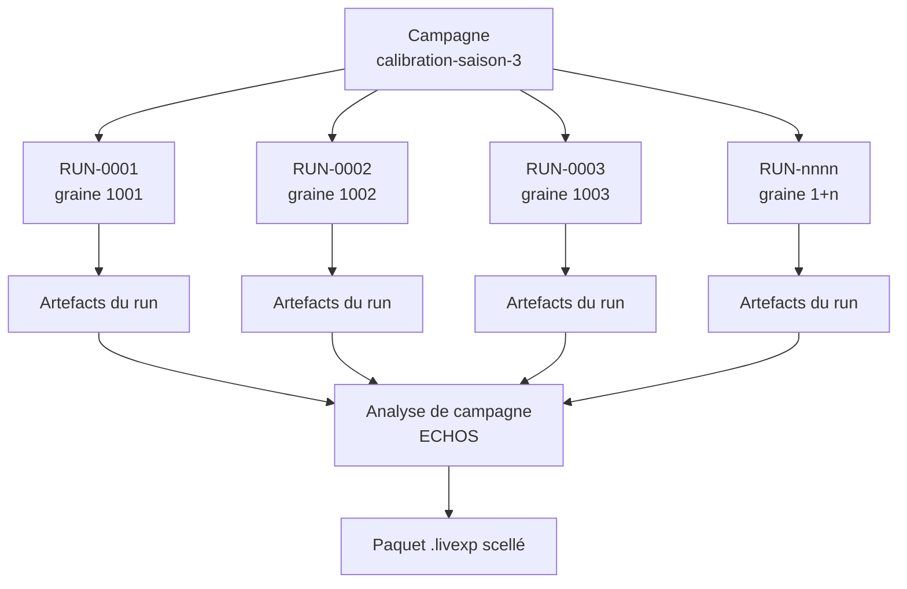
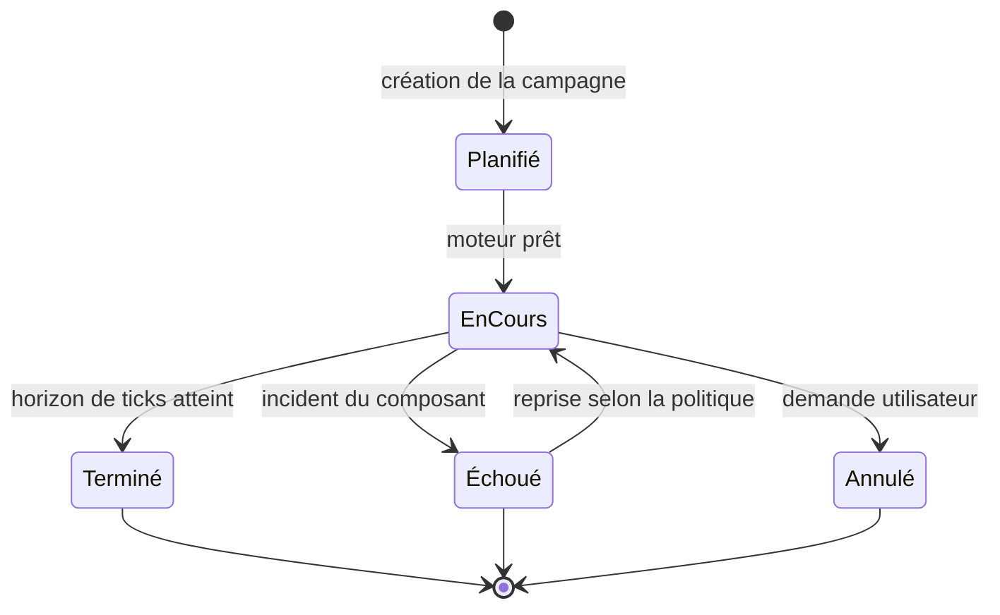
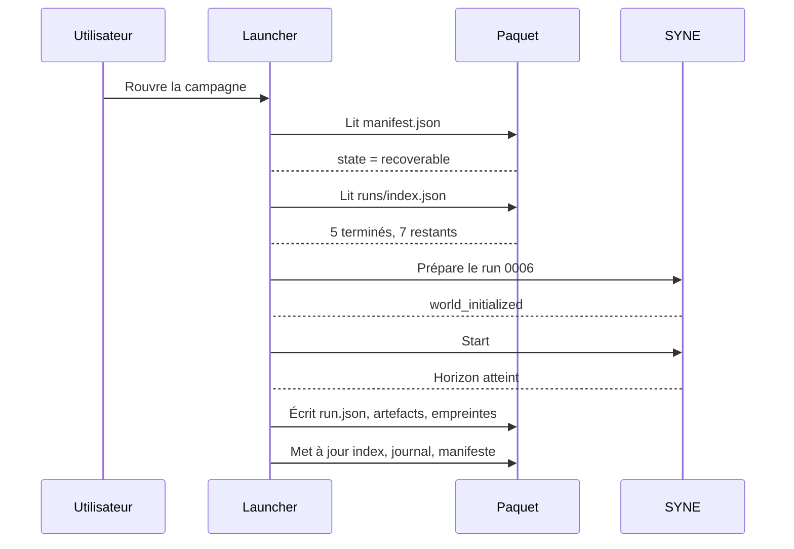

# EXPERIMENTS.md

**Composant** : LIVEX (Launcher)
**Statut** : [DRAFT]
**Dernière mise à jour** : 30 septembre 2026
**Dépend de** : `PACKAGE_FORMAT.md`, `COMPONENTS.md`, `adr/ADR-003-analyse-propriete-de-echos.md`
**Source Monographie** : —

---

## 1. Objet

Ce document spécifie comment le Launcher **planifie, exécute, supervise, reprend et
archive** une campagne, c'est-à-dire une suite de runs reproductibles.

Le Launcher orchestre des exécutions. Il ne produit aucun résultat : l'analyse d'un
run et d'une campagne appartient à ECHOS. Le rôle du Launcher se limite à
**demander, attendre, collecter et archiver**.

## 2. Deux niveaux d'exécution

| Niveau | Définition | Propriétaire |
| :-- | :-- | :-- |
| **Campagne** | Ensemble paramétré de runs, destiné à produire une analyse agrégée | Launcher |
| **Run** | Une exécution élémentaire, reproductible et autonome | Launcher |

Un run est l'unité d'échec et de reprise. Une campagne est l'unité de partage et
d'archivage.

## 3. Définition d'une campagne

Une campagne est entièrement décrite par un objet `experiment.json`, écrit dans le
paquet au moment de sa création.

| Champ | Rôle | Exemple |
| :-- | :-- | :-- |
| `id` | Identifiant stable de la campagne | `calibration-saison-3` |
| `title` | Libellé affichable | `Calibration saison 3` |
| `profile` | Profil d'exécution | `analyse` |
| `config` | Configuration du moteur, référencée ou incluse | `base.json` |
| `runCount` | Nombre de runs | `12` |
| `ticks` | Horizon de ticks par run | `5000` |
| `seedStrategy` | Stratégie de dérivation des graines | `derived` |
| `baseSeed` | Graine de base | `1000` |
| `failurePolicy` | Comportement en cas d'échec | `continue` |
| `notes` | Note libre de l'utilisateur | texte |

La définition est **complète et autosuffisante** : le fichier suffit à rejouer la
campagne, sans leLauncher, si le moteur et les composants sont disponibles.

## 4. Exécution séquentielle

En V0.1, les runs d'une campagne s'exécutent **l'un après l'autre**.

| Règle | Justification |
| :-- | :-- |
| **Un seul moteur actif** | Un seul SYNE sert toute la campagne |
| **Pas de chevauchement** | Un run n'est jamais lancé tant que le précédent n'est pas terminé |
| **Ordre stable** | Les runs sont numérotés et exécutés dans l'ordre numérique |
| **Pas de partage de graine** | Chaque run a une graine distincte |

La séquentialité n'est pas une limite de conception mais un choix de la V0.1,
tranché dans `adr/ADR-005-execution-sequentielle-mono-espace.md`. La
parallélisation est prévue : elle introduira un ordonnancement par slots et des
granularités de reprise plus fines.

## 5. Dérivation des graines

La reproductibilité d'une campagne repose sur des graines **prévisibles et
dérivables**, jamais tirées au hasard à l'exécution.

| Stratégie | Règle | Usage |
| :-- | :-- | :-- |
| `derived` | `graine(n) = baseSeed + n` | Campagnes de calibration systématiques |
| `explicit` | Liste de graines donnée dans la définition | Campagnes reprenant un jeu connu |
| `derived-hashed` | `graine(n) = hash(baseSeed, n)` | Campagnes nécessitant une dispersion large |

La stratégie `derived` est celle de la V0.1 par défaut. Le Launcher n'invente
jamais de graine : une campagne sans stratégie explicite est refusée à la
création.

La relation entre campagne, numéro de run et graine est écrite dans
`run.json`, afin qu'un run isolé reste reproductible sans la campagne entière.

## 6. Cycle de vie d'un run

| État | Signification | Écriture dans le paquet |
| :-- | :-- | :-- |
| **Planifié** | Créé, non encore lancé | Entrée dans `runs/index.json` |
| **En cours** | Exécution en cours | Entrée mise à jour au fil de l'eau |
| **Terminé** | Horizon de ticks atteint | Métadonnées, artefacts, empreintes |
| **Échoué** | Incident du composant | Métadonnées, cause, journaux |
| **Annulé** | Arrêt demandé par l'utilisateur | Métadonnées, cause |

Un run **Terminé** est un run dont le moteur a confirmé avoir atteint son horizon.
Un run **Échoué** conserve l'ensemble de ses journaux, même incomplets : le
diagnostic d'un échec fait partie du paquet.

## 7. Politiques d'échec

| Politique | Comportement | Usage |
| :-- | :-- | :-- |
| `stop` | Le premier échec interrompt la campagne | Campagnes où tout run doit réussir |
| `continue` | La campagne se poursuit, les échecs sont consignés | Campagnes exploratoires, usage par défaut |
| `retry` | Un échec est réessayé jusqu'à `maxRetries` | Pannes intermittentes attendues |
| `tolerate` | L'échec est attendu et ne produit pas d'incident | Tests de robustesse deliberés |

En `continue` et `tolerate`, la campagne se termine malgré les échecs, et le
manifeste porte `runsFailed` non nul. Le scellement reste possible : un paquet
scellé peut contenir des runs échoués, à condition que le manifeste le dise.

## 8. Progression et estimation

Le Launcher expose la progression d'une campagne, sans rien calculer sur les
résultats.

| Information | Source | Usage |
| :-- | :-- | :-- |
| Runs terminés / total | `runs/index.json` | Progression globale |
| Run en cours | Registre | Identification du run actif |
| Progression du run en cours | Tic de simulation rapporté par le moteur | Barre d'avancement |
| Durée écoulée | Horloge du Launcher | Contexte |
| Durée moyenne par run | Historique de la campagne | Estimation de fin |

La progression du run vient de `GET /api/control/status` sur le port de contrôle du
moteur (`tick`, `maxTicks`, `aliveCount`, `state`), sondé par le Launcher toutes les
200 ms pendant l'exécution. La sonde est *best-effort* : un moteur qui n'expose pas
cette route laisse la barre vide et n'entrave en rien le run — c'est l'affichage qui
est conditionnel, jamais l'exécution.

**Aucun pourcentage n'est affiché sans horizon.** Si le moteur ne rapporte pas
`maxTicks`, l'interface montre le tic atteint et le nombre d'agents vivants, pas un
ratio : une barre à 0 % pour un moteur muet afficherait une progression inexistante.

L'estimation de fin est une **moyenne des runs terminés**, jamais une
extrapolation scientifique. Le Launcher n'a pas qualité pour estimer un résultat.

## 9. Reprise après incident

La reprise s'appuie sur `runs/index.json`, jamais sur l'examen des répertoires.

| Règle | Comportement |
| :-- | :-- |
| **Source de vérité** | `runs/index.json` fait foi. Un répertoire sans entrée d'index est ignoré. |
| **Aucune reprise de run réussi** | Un run **Terminé** n'est jamais rejoué. |
| **Reprise d'un run interrompu** | Un run **En cours** au moment de l'incident est relancé depuis le début, avec la même graine. |
| **Reprise d'un run échoué** | Un run **Échoué** est rejoué seulement si la politique le prévoit. |
| **Traçabilité** | La reprise ajoute une entrée au journal, avec le motif et la liste des runs rejoués. |
| **Graine conservée** | Un run rejoué utilise exactement la même graine et la même configuration. |

## 10. Annulation

| Étape | Action |
| :-- | :-- |
| Demande | L'utilisateur demande l'arrêt de la campagne |
| Propagation | Le Launcher demande l'arrêt du run en cours, puis du moteur |
| Attente | Le Launcher laisse le composant terminer proprement, jusqu'au délai d'arrêt |
| Écriture | Le run interrompu passe à **Annulé**, avec la cause et les journaux conservés |
| Décision | L'utilisateur choisit de reprendre la campagne ou de la sceller |

Une annulation ne supprime rien. Un paquet annulé est un paquet valide, scellable,
qui documente une campagne interrompue.

## 11. Collecte des artefacts

Le Launcher collecte, il ne produit pas.

| Étape | Rôle |
| :-- | :-- |
| **Demande** | Le Launcher demande à ECHOS l'analyse du run terminé |
| **Attend** | Le Launcher attend la fin de l'analyse, sans l'accélérer ni l'inspecter |
| **Collecte** | Le Launcher reçoit les artefacts et vérifie leur présence et leur empreinte |
| **Classe** | Le Launcher range les artefacts selon la structure du paquet |
| **Archive** | Le Launcher écrit les empreintes et met à jour le manifeste |

Le Launcher **ne lit pas le contenu scientifique** des artefacts. Il vérifie leur
intégrité, leur provenance et leur rattachement à un run, rien de plus. Toute
interprétation d'un résultat est hors périmètre, conformément à
`adr/ADR-003-analyse-propriete-de-echos.md`.

**Délais** (mesurés le 07/10/2026 sur un flux réel) : l'ingestion d'un run de
2500 ticks × 50 agents (2,34 Gio) prend environ **5 min 30 s** côté ECHOS — de
l'ordre de 11 min pour 100 agents. Les appels d'analyse (`ingest/run`,
`analysis/run`, `analysis/experiment`, `analysis/report`) sont donc budgétés à
**30 min** chacun ; les appels ordinaires (santé, état) restent à 30 s. Sans ce
budget, l'ancien plafond de 30 s coupait l'ingestion et le rapport de campagne
n'était jamais produit. Le reste des appels vit dans `EchosAnalysisService`.

## 12. Reproductibilité d'une campagne

Une campagne est reproductible si, et seulement si :

| Condition | Vérifiable par |
| :-- | :-- |
| La graine de chaque run est écrite | `run.json` |
| La configuration effective est écrite | `config.resolved.json`, sans valeur implicite |
| Les versions des composants sont écrites | `manifest.json` |
| La plateforme et l'environnement sont décrits | `provenance.json` |
| L'ordre d'exécution est inscrit | `journal.ndjson` |

`config.resolved.json` porte les trois niveaux qui pourraient diverger — ce
que la condition ci-dessus exclut précisément :

| Bloc | Contenu |
| :-- | :-- |
| `campaign` | la définition demandée par l'opérateur |
| `run` | les paramètres résolus du run : `runId`, tentative, **graine dérivée**, `ticks`, `agentCount`, `simulation` |
| `engine` | ce que le Launcher a transmis : la surcouche `configOverlay` effectivement remise au moteur, le mode `headless`/`autoStart`/`exportStream`, et l'identité analytique du run |

La surcouche écrite dans `launcher-config.json` et celle archivée dans
`config.resolved.json` sont produites par le même type (`RunEngineProfile`) à partir
du seul `RunSpec` : le paquet ne peut donc pas attester une configuration différente
de celle qui a été appliquée.

Les valeurs de transport — port de contrôle, jeton de session, identifiant de
corrélation, horodatages, chemins — sont **délibérément absentes** : elles varient
à chaque exécution, et les inscrire rendrait deux runs de la même campagne
différents là où le paquet se compare octet pour octet. Elles ne sont pas de la
configuration.

Ce document n'a pas qualité pour décrire les réglages internes du moteur : ceux-ci
restent la propriété du composant (DATA_FLOW.md §6.3). Il n'enregistre que ce que le
Launcher a décidé et transmis.

Un paquet scellé est donc **auto-porteur pour la ré-exécution**, et déterministe à
la comparaison octet pour octet. Voir `PACKAGE_FORMAT.md` §6.

## 13. Références

- `PACKAGE_FORMAT.md` — structure du paquet, cycle de vie, reprise
- `COMPONENTS.md` — profils, registre, cycle de vie des composants
- `OBSERVABILITY.md` — progression, états, métriques de campagne
- `adr/ADR-003-analyse-propriete-de-echos.md` — propriété de l'analyse
- `adr/ADR-005-execution-sequentielle-mono-espace.md` — séquentialité et mono-espace

---

## Points restés ouverts dans ce document

- **Reprise partielle d'un run.** Un run interrompu est relancé depuis le début.
  Faut-il exploiter les points de contrôle du moteur pour reprendre au dernier
  point valide ? Le gain dépend du coût réel d'un run long.
- **Estimation de durée.** L'estimation est une moyenne. Une estimation robuste
  par tendance est à définir, ainsi que son comportement sur une campagne à un seul
  run terminé.
- **Stratégies de graines.** Seule `derived` est spécifiée en détail. `explicit` et
  `derived-hashed` sont décrites mais non validées.
- **Réutilisation entre campagnes.** Le cas d'une campagne qui réutilise les
  artefacts d'une campagne antérieure n'est pas traité.
- **Parallélisation.** Le modèle de données ne comporte aucun élément propre à
  une exécution parallèle. Il faudra l'ajouter avant d'ouvrir cette voie.
