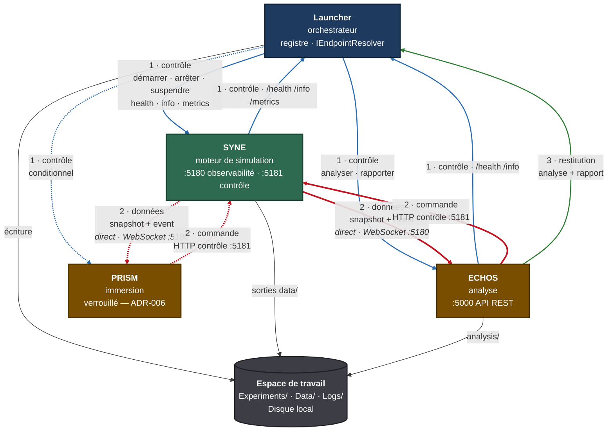
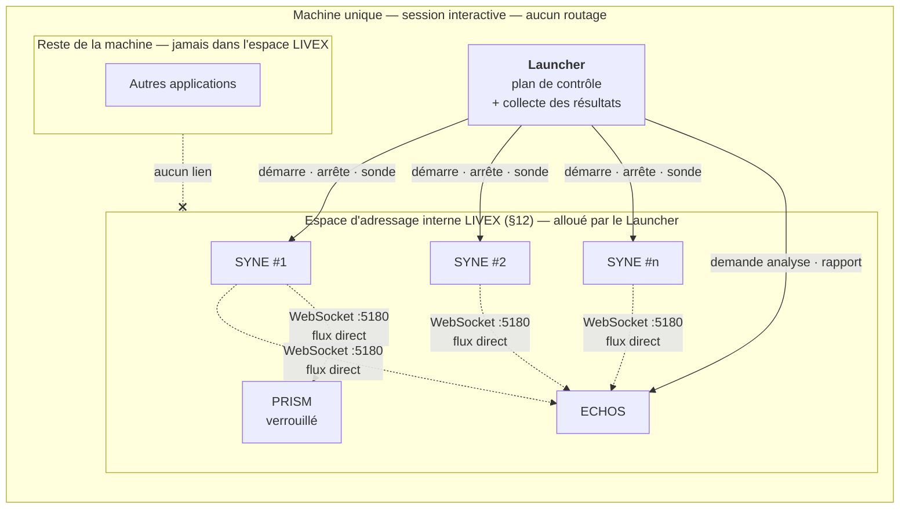
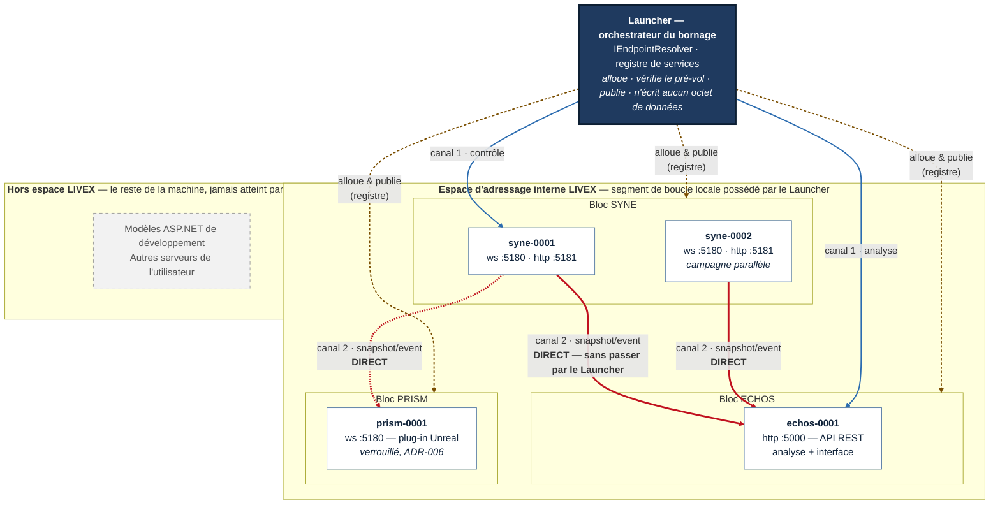

# NETWORK.md

**Composant** : LIVEX (Launcher)
**Statut** : [DRAFT]
**Dernière mise à jour** : 30 septembre 2026
**Dépend de** : `ARCHITECTURE.md`, `COMPONENTS.md`, `OBSERVABILITY.md`, `INTEGRATION_CONTRACT.md`
**Source Monographie** : —

---

## 1. Objet et périmètre

Ce document spécifie les communications entre le Launcher, SYNE, ECHOS et PRISM.
En V0.1, **tous les composants tournent sur la même machine** — aucune répartition
réseau n'est prévue. Le problème réseau à résoudre n'est donc pas la connexion de
machines distantes, mais la **cohabitation propre des composants sur une seule
machine** : éviter les collisions de ports avec le reste du système, et rendre les
flux internes mesurables pour le monitoring.

> **Sens retenu de « sous-réseau ».** Il ne s'agit **pas** d'un sous-réseau physique
> ou VLAN reliant des machines distinctes — aucun composant distant n'est prévu.
> Il s'agit d'un **espace d'adressage interne à LIVEX**, une plage de la boucle
> locale réservée au projet (voir §12), dans laquelle chaque composant obtient sa
> propre adresse : plus de course aux ports, et une segmentation qui permet de
> **mesurer précisément les flux de données** entre composants pour le monitoring.

### 1.1 Objectifs

1. Faire fonctionner LIVEX **sans configuration réseau** sur une seule machine — le
   cas par défaut.
2. Donner à LIVEX un **espace d'adressage interne dédié** : chaque composant reçoit
   une adresse stable de la plage, sans collision avec les ports du reste de la
   machine.
3. Permettre **plusieurs instances de SYNE**, pour des campagnes parallèles ou la
   comparaison de versions, sans collision.
4. Rendre les **flux internes mesurables** : la segmentation par composant permet
   d'attribuer chaque octet échangé à une paire de composants (monitoring,
   `OBSERVABILITY.md`).
5. Sécuriser par défaut : tout reste confiné à la machine ; rien n'est exposé
   au-delà de la boucle locale sans action explicite.
6. Garder une **porte de sortie propre** vers une répartition multi-machine
   (Gateway, Node Agent — V1.x, §4.2 et §4.3) sans refonte, sans la construire
   aujourd'hui.

**Non-objectifs** : répartition des composants sur plusieurs machines (V0.1),
exposition Internet, multi-utilisateur avec droits, cloud.

## 2. Plan de contrôle et plan de données

C'est la distinction qui permet d'avoir une Gateway sans que le Launcher devienne
un proxy de tout.

Il y a **trois canaux**, pas deux. Les confondre est l'erreur qui conduit à faire
du Launcher une passerelle de données qu'il ne doit pas être.

| Canal | Direction | Ce qui le traverse | Volume | Passe par le Launcher ? |
| :-- | :-- | :-- | :-- | :-- |
| **1 — Contrôle** | Launcher ⇄ composants | Démarrage, arrêt, suspension, santé, `info`, métriques, registre | Faible, sur commande | **Oui — c'est son rôle** |
| **2 — Données** | SYNE ⇄ ECHOS, SYNE ⇄ PRISM | `world_initialized`, snapshots par tick, événements typés | **Très élevé, continu** | **Non — jamais** |
| **3 — Restitution** | ECHOS → Launcher | Analyse d'un run, analyse d'expérience, rapport d'émergence | Moyen, en fin de run | **Oui — en bordure, pour archivage** |

### 2.1 Cartographie complète des flux

Voici la carte de référence du document. Elle répond à la question centrale :
**le Launcher est-il une passerelle ?**



**Réponse à la question posée par ce schéma.** Le Launcher est une passerelle
pour le **contrôle** (canal 1) et un **point de collecte** pour les **résultats**
(canal 3). Il n'est **jamais** une passerelle pour les **données** (canal 2) :

- aucune flèche rouge (canal 2) ne traverse `L` ;
- le canal 2 relie `E` et `P` directement à `S`, dans les deux sens ;
- le Launcher est **topologiquement à côté** du flux de données, pas **sur** le
  chemin critique.

### 2.2 Pourquoi le canal 2 ne passe pas par le Launcher

Ce n'est pas une préférence de style, c'est une exigence de volume et de
disponibilité.

| Raison | Conséquence si le Launcher relaisait |
| :-- | :-- |
| **Volume** | Un snapshot par tick sur un monde de plusieurs milliers d'agents. Le Launcher ferait un travail qu'aucun de ses composants ne lui demande. |
| **Disponibilité** | Un bug, un ralentissement ou un plantage de l'interface interromprait la télémétrie **pendant que la simulation continue**. Le mode Immersion casserait sans raison. |
| **Modèle de couches** | Le Launcher ne détient aucune copie de l'état simulé (`ARCHITECTURE.md` §3). Relayer suppose d'être au courant de l'état, donc de le posséder. |
| **Mesure** | Le flux direct reste attribuable à une paire de composants par son bloc d'adresses (§12). Un relais le confondrait avec le trafic du canal 1. |

Le Launcher ne dégrade donc pas un composant en se substituant à lui
(`ARCHITECTURE.md` §3) : il ne se substitue à **rien**.

### 2.3 Le Launcher comme point d'entrée unique — la nuance

« Point d'entrée unique » est vrai **du point de vue de l'utilisateur et des
commandes de cycle de vie**, pas du point de vue des octets.

| Affirmation | Vrai ? | Précision |
| :-- | :-- | :-- |
| Le Launcher est le seul à pouvoir démarrer ou arrêter un composant | **Oui** | Processus local : seul le Launcher peut le faire. |
| Le Launcher est le seul point d'entrée des requêtes d'analyse | **Oui** | `AnalyzeRun`, `AnalyzeExperiment`, `GenerateReport` passent par lui. |
| Le Launcher est le seul chemin par où circule la donnée | **Non** | Le canal 2 le contourne entièrement. |
| Le Launcher est la Gateway du réseau | **Non** | Il n'y a pas de réseau à faire respecter en T0 (§3). La Gateway est une **autre** forme de sortie (§4.3), jamais construite. |

### 2.4 Règles

- Le **plan de données reste direct**, de composant à composant, dans l'espace
  d'adressage interne de LIVEX (§12). Un instantané d'un monde de plusieurs
  milliers d'agents ne doit pas transiter par un intermédiaire sans nécessité.
- Le **plan de contrôle** passe par le Launcher, seul point d'entrée des commandes
  de cycle de vie.
- Le **canal 3 — restitution** est une bordure, pas un relais : le Launcher reçoit
  un résultat produit ailleurs, l'écrit sur disque, et ne le réémet pas.
- En V0.1, **aucune Gateway** : tous les flux restent sur la machine, dans la
  plage interne. La Gateway (§4.3, V1.x) n'a de sens que si une répartition
  multi-machine était un jour décidée ; le §5 la garde ajoutable sans refonte,
  jamais requise.

### 2.5 L'adaptateur de protocole

Le protocole de données — le format des messages `snapshot` et `event` — est une
décision encore ouverte. Le Launcher ne doit pas en dépendre pour fonctionner.

Un **adaptateur de protocole** est donc la couche qui isole cette décision. Il
traduit le protocole courant vers les types internes du Launcher, et rien d'autre.

| Règle | Comportement |
| :-- | :-- |
| **Isolation** | `Launcher.Domain` ne référence aucun type du protocole. Seul `Launcher.Integration` le connaît. |
| **Remplacement** | Changer de protocole revient à remplacer l'adaptateur, sans toucher au domaine ni à l'interface. |
| **Indépendance du contrôle** | Le plan de contrôle — santé, infos, métriques, registre, arrêt — ne dépend **jamais** de l'adaptateur. C'est ce qui permet de développer le Launcher avant la décision. |
| **Version déclarée** | Chaque instance publie son `protocolVersion` dans le registre. Une incompatibilité est détectée à l'enregistrement. |
| **Adaptateur minimal** | Si aucun protocole n'est résolu, l'adaptateur minimal suffit : le Launcher pilote le plan de contrôle et ne consomme aucun flux de données. |

Cette séparation a une conséquence concrète : **le Launcher peut être développé,
testé et packagé avant que le protocole soit tranché**. Les stubs n'ont qu'à produire
des messages au format courant ; si le protocole change, seul l'adaptateur change.

## 3. Topologies

| ID | Topologie | Réseau | Gateway | Cible |
| :-- | :-- | :-- | :-- | :-- |
| **T0** | Tout sur un poste, plage interne LIVEX | `127.0.0.1` + espace interne (§12) | Non | **V0.1** |
| **T1** | Plusieurs postes, même sous-réseau | LAN | Optionnelle | Forme de sortie — non planifiée |
| **T2** | Plusieurs sous-réseaux physiques — calcul, affichage, administration | LAN routé ou VLAN | Recommandée si retenu | Forme de sortie — non planifiée |
| **T3** | Poste distant ou laboratoire | VPN | Requise, avec TLS | Forme de sortie — non planifiée |

> **T1 à T3 sont des formes de sortie, pas des plans de travail.** Aucun
> composant distant n'est prévu : LIVEX reste sur une machine. Ces lignes
> décrivent seulement ce que deviendraient les mécanismes — registre,
> résolution d'adresse, Gateway — si une répartition était un jour décidée.

### 3.1 T0 — V0.1, la seule topologie réalisée



Deux propriétés que ce schéma doit faire apparaître :

- **N instances de SYNE, un seul Launcher.** Les runs parallèles se distinguent
  par leur bloc d'adresses, pas par une machine différente.
- **Le Launcher n'est pas sur le chemin des pointillés.** Les flèches fines sont
  les flux de données, directs ; les flèches pleines sont le contrôle, qui passe
  par le Launcher.

Chaque instance a son propre bloc : les flux sont donc **attribuables à une paire
concrète** (`syne-0001` → `echos-0001`), ce qui est le service que rend la
segmentation (§12.3).

## 4. Composants réseau

Le V0.1 s'appuie sur **un seul mécanisme** : le registre de services, qui porte
l'indirection d'adresse. Le Node Agent et la Gateway sont des **formes de
sortie** pour une future répartition multi-machine — conçues sur le papier,
non planifiées à la réalisation, sans quoi elles imposeraient des composants
dont LIVEX n'a pas l'usage sur une seule machine.

### 4.1 Registre de services — V0.1

Le registre est la table des instances vivantes, tenue dans le cœur du Launcher.

```json
{
  "instances": [
    {
      "instanceId": "syne-0001",
      "component": "syne",
      "node": "local",
      "state": "Running",
      "endpoints": {
        "ws":      "ws://127.0.0.1:5180/",
        "control": "http://127.0.0.1:5181/",
        "health":  "http://127.0.0.1:5181/health/ready"
      },
      "experimentId": "EXP-2026-001",
      "runId": "RUN-0042",
      "protocolVersion": 1,
      "startedAt": "2026-09-30T10:12:00Z"
    }
  ]
}
```

- Alimenté par le gestionnaire de services au démarrage et à l'arrêt.
- Consulté via l'abstraction **`IEndpointResolver`**, dont la signature est
  `Resolve(component, instanceId?) → Endpoint`. C'est le **seul** endroit où le
  Launcher connaît une adresse. En T0 elle renvoie une adresse de la plage interne
  LIVEX (§12) ; une répartition multi-machine future changerait cette résolution,
  rien d'autre.
- Exposé aux autres composants, en lecture seule, via `GET /registry`.

Cette indirection est ce qui permet de changer d'adressage sans refonte : le
Launcher ne connaît pas l'adresse, il connaît une résolution.

### 4.2 Node Agent (`livex-agent`) — forme de sortie, non planifié

Petit service installé sur chaque machine distante. Il :

- démarre et arrête les processus **locaux** à la demande du Launcher, qui ne peut
  pas lancer un processus sur une autre machine ;
- relaie la santé, les informations et les métriques de son nœud ;
- applique les mêmes règles de validation des arguments et de chemins que le
  gestionnaire de processus local.

### 4.3 Gateway (`LIVEX.Gateway`) — forme de sortie, non planifiée

Proxy inverse .NET, fondé sur **YARP**, le proxy inverse de Microsoft qui gère HTTP
et WebSocket. **[À valider par spike.]**

Fonctions :

1. **Routage** par composant et par instance.
2. **Authentification** par jeton et contrôle d'origine.
3. **Agrégation** de la santé globale et par composant.
4. **Relais WebSocket** de SYNE vers les clients quand le lien direct est impossible.
5. **Journalisation** des accès aux commandes de contrôle.

| Route Gateway | Cible |
| :-- | :-- |
| `/syne/{instanceId}/ws` | WebSocket de l'instance SYNE |
| `/syne/{instanceId}/control/*` | HTTP de contrôle SYNE |
| `/echos/{instanceId}/*` | REST et interface ECHOS |
| `/registry` | Registre, en lecture |
| `/gateway/status` | Santé agrégée, globale et par composant |
| `/gateway/metrics` | Métriques de la Gateway |

**Pourquoi en parler alors qu'elle n'est pas planifiée** : parce que le coût de
l'option doit rester faible. Tant que le Launcher consomme une **résolution**
d'adresse et non une adresse, ajouter un jour une Gateway ne serait qu'ajouter un
processus qui fournit cette résolution — sans toucher au reste. Ce qui serait un
défaut de conception serait de graver les adresses dans les composants.

**Pourquoi un processus séparé et non une fonction du Launcher** : le Launcher doit
rester mince, indépendant et remplaçable. La Gateway a un cycle de vie et des
exigences de sécurité propres, et doit pouvoir tourner sans interface graphique,
sur une machine dédiée.

## 5. Options et recommandation

| Option | Description | Avantages | Inconvénients |
| :-- | :-- | :-- | :-- |
| **A** | Pas de Gateway ; registre et `IEndpointResolver` ; espace d'adressage interne dédié (§12) | Simple, couvre tout le besoin mono-machine, flux mesurables par composant | N'adresse pas une future répartition multi-machine (hors besoin V0.1) |
| **B** | A + Node Agent + Gateway YARP séparée | Point d'entrée unique, prépare T1–T3 | Composants sans usage tant que tout tourne sur une machine |
| **C** | Maillage complet de type service mesh | — | Disproportionné |

**Recommandation** : **A en V0.1**, en concevant `IEndpointResolver` et le registre
pour que **B** s'ajoute sans refonte le jour où une répartition serait décidée.
**C est écartée.**

## 6. Adressage, identité et ports

### 6.1 Identifiants

- `nodeId` : `local` par défaut, sinon le nom de la machine.
- `instanceId` : `<composant>-<nnnn>`, par exemple `syne-0003`.
- Toute requête inter-composants porte un `X-Livex-Correlation-Id`.

### 6.2 Ports et adressage interne

- **Espace interne LIVEX (§12)** : tout composant reçoit son adresse de la plage
  interne du projet, allouée par le Launcher et publiée dans le registre. Les
  composants **ne consomment jamais un port du reste de la machine au hasard** :
  c'est la garantie « pas de collision », et celle de flux attribuables à une
  paire de composants pour le monitoring.
- **V0.1** : les valeurs par défaut du prototype — SYNE 5180 et 5181, ECHOS 5000 —
  sont migrées dans la plage interne. **[À CONFIRMER, décision n°28.]** Noter que
  5000 est le port historique des modèles ASP.NET de développement et entre
  facilement en conflit : c'est précisément ce que la plage interne élimine.
- **Multi-instance** : le Launcher alloue chaque instance dans la plage interne,
  sans collision, et la transmet à l'instance par argument ou variable
  d'environnement ; l'instance la publie dans le registre.
- **Pré-vol** : tester la disponibilité de l'adresse **avant** le démarrage. En cas
  d'échec, produire une erreur de configuration explicite, avec le processus
  occupant s'il est identifiable.
- Une instance ne doit **jamais** choisir seule une adresse sans la déclarer.

### 6.3 Configuration

`Config/network.json` :

```json
{
  "version": 1,
  "bind": "127.0.0.1",
  "portRange": { "from": 5200, "to": 5399 },
  "nodes": [
    { "nodeId": "local", "address": "127.0.0.1", "agent": null }
  ],
  "gateway": { "enabled": false, "listen": "127.0.0.1:5100" },
  "security": {
    "requireToken": true,
    "allowedOrigins": ["http://127.0.0.1:5000"],
    "tls": { "enabled": false }
  }
}
```

*Les valeurs de plage — l'espace interne LIVEX, §12 — et de port Gateway sont des
exemples à arrêter.*

## 7. Sécurité réseau

| Règle | Détail |
| :-- | :-- |
| **Bind local par défaut** | Tous les composants écoutent sur `127.0.0.1`. L'écoute sur le réseau local est une option explicite, jamais implicite. |
| **Jeton de session** | Généré par le Launcher à chaque démarrage, transmis par variable d'environnement — jamais en argument de ligne de commande, visible dans la liste des processus. Exigé sur toutes les commandes de contrôle. |
| **Lecture et écriture** | `/health` et `/info` peuvent rester en lecture sans jeton en local ; toute commande exige le jeton. |
| **Origine navigateur** | L'interface ECHOS appelle SYNE et l'API ECHOS depuis un navigateur : liste blanche d'origines et vérification de l'en-tête `Origin` à l'ouverture du WebSocket. |
| **TLS** | Non requis en T0. Obligatoire dès qu'on quitte la boucle locale. Gestion des certificats à spécifier. |
| **Pare-feu** | L'installeur ne modifie pas le pare-feu sans confirmation ; les ports à ouvrir sont documentés. |
| **Validation** | Les arguments envoyés à un Node Agent respectent les règles de chemins connus et de paramètres validés. |
| **Journal d'audit** | Toute commande de contrôle reçue est journalisée : origine, instance, commande, résultat. |

## 8. Résilience réseau

- **Reconnexion WebSocket** : temporisation exponentielle avec plafond. À la
  reconnexion, le client reçoit d'abord un `snapshot` complet — ce type de message
  existe déjà — puis les `event`. Aucun rejeu d'historique n'est nécessaire.
- **Partition réseau** : un nœud injoignable passe à **Injoignable** dans le
  registre après N battements de cœur manqués. **[N à calibrer.]** Les runs qu'il
  porte suivent la politique `OnRunFailure`.
- **Gateway indisponible** : en T0 et T1 les composants continuent en direct. En T2
  la visualisation est interrompue, mais **la simulation continue**.
- **Charge** : le volume des instantanés croît avec le nombre d'agents. Mesurer
  taille et fréquence avant de décider d'une compression ou d'un mode différentiel.
  **[À mesurer, pas à supposer.]**
- **Horloges** : ne jamais corréler des événements de machines différentes par heure
  murale. Utiliser le **tick** comme temps de référence, l'heure UTC pour les
  journaux.

## 9. Réseau requis par mode d'usage

Cette section s'aligne sur la taxonomie canonique de `COMPONENTS.md` §8 : deux
axes indépendants, **type de session** et **mode d'usage**. Le mot « hors ligne »
n'y figure pas — ce n'est pas un mode, mais l'absence de moteur (voir §9.2).

### 9.1 Ce que chaque mode d'usage exige du réseau

| Mode d'usage (`COMPONENTS.md` §8.2) | Composants | Réseau requis |
| :-- | :-- | :-- |
| **Simulation seule** | SYNE | Canal 1 seulement : Launcher → SYNE, :5181 |
| **Analyse pur** | SYNE + ECHOS, sans interface | + canal 2 : ECHOS ⇄ SYNE sur :5180, en direct |
| **Analyse et télémétrie** | SYNE + ECHOS complet | + interface ECHOS ouverte sur :5000, même flux |
| **Immersif** | SYNE + PRISM | + canal 2 : PRISM ⇄ SYNE sur :5180, en direct |
| **Expérience** | SYNE + ECHOS + PRISM | Tous les canaux, plus N instances SYNE |
| **Personnalisé** | au choix | Le strict nécessaire aux composants retenus |

Le type de session — Production, Expérience, Développement — **ne change rien au
réseau**. Il change ce que l'interface expose et les garde-fous, pas les flux.

### 9.2 L'absence de moteur n'est pas un mode

Il arrive qu'aucun moteur ne tourne : consultation d'un rapport existant,
relecture d'une campagne archivée, analyse d'un paquet `.livexp` hors ligne.

> Ce cas **n'est pas un mode d'usage**. C'est le mode **Personnalisé** avec une
> sélection vide de composants, ce que `COMPONENTS.md` §8.5 autorise
> explicitement : « SYNE n'est pas obligatoire ». Le réseau requis est alors
> **aucun** — le Launcher lit des fichiers et n'ouvre aucune connexion sortante.

Cette clarification lève une contradiction du corpus : « analyse hors ligne »
était listé comme mode ici et comme **non-objectif explicite** dans `VISION.md`.
Il ne s'agit pas d'un objectif du Launcher — l'analyse reste la propriété d'ECHOS
— mais de l'absence de SYNE à un instant donné.

### 9.3 Le multi-run parallèle

| Besoin | Ce que le réseau doit fournir |
| :-- | :-- |
| Campagne de N runs simultanés | N instances SYNE, N blocs d'adresses distincts dans l'espace interne (§12) |
| Comparaison de deux versions de SYNE | Deux instances de versions différentes, coexistant |
| Reproductibilité | `protocolVersion` et versions vérifiés à l'enregistrement dans le registre |

C'est la raison d'être principale de l'espace d'adressage interne : sans lui, le
parallélisme se heurte à la table de ports du système.

## 10. Plan de mise en œuvre

| Étape | Contenu | Jalon |
| :-- | :-- | :-- |
| **R0** | `IEndpointResolver`, registre en mémoire, `network.json`, pré-vol d'adresses | Launcher V0.1 |
| **R1** | Bind local, jeton de session, contrôle d'origine | Launcher V0.1 |
| **R2** | Allocation dynamique dans la plage interne, pour le parallèle | Après validation de l'exécution parallèle |
| **R3** | Node Agent | Si répartition multi-machine décidée (non planifié) |
| **R4** | Gateway YARP : routage et santé agrégée | Si répartition multi-machine décidée (non planifié) |
| **R5** | TLS et audit | Avant tout usage hors boucle locale |
| **R6** | Découverte automatique en mDNS | Optionnel |

**Spikes à réaliser** : (1) YARP relaie-t-il correctement le flux `snapshot` au débit
réel de SYNE ? (2) Coût CPU et latence du relais ? (3) Comportement des
navigateurs avec le contrôle d'origine sur WebSocket ? *(Spikes conditionnés par
une future décision de répartition — sans objet en V0.1.)*

**Tests** : conflits de ports ; reconnexion WebSocket après coupure ; jeton invalide
ou absent, refus ; origine non autorisée, refus ; perte de nœud pendant un run ;
Gateway arrêtée en cours de simulation.

## 11. Risques

| Risque | Impact | Mitigation |
| :-- | :-- | :-- |
| La Gateway devient un point unique de défaillance | Perte de visualisation | Mode direct de repli ; simulation indépendante de la Gateway — risque sans objet tant qu'aucune Gateway n'est déployée |
| Latence ajoutée sur le flux d'instantanés | Rendu saccadé | Relais seulement si nécessaire ; mesurer avant de généraliser |
| Commandes de contrôle non authentifiées | Prise de contrôle locale ou réseau | Jeton et bind local |
| Dérive de configuration entre nœuds | Runs non reproductibles | Versions et `protocolVersion` vérifiés à l'enregistrement dans le registre |

## 12. L'espace d'adressage interne de LIVEX

C'est le mécanisme qui répond au vrai problème réseau de LIVEX : **tous les
composants tournent sur la même machine**, et le partage de la table de ports avec
tout le reste du système est une source de collisions et de flux inattribuables.

### Cartographie des sous-espaces orchestrés par le Launcher

Voici la vue d'ensemble demandée : **quels sous-espaces existent, qui les
orchestre, et quel flux les traverse.**

Le Launcher est le **seul propriétaire du bornage**. Il alloue une adresse par
instance, la publie dans le registre, et chaque composant consomme une adresse
qu'on lui a donnée — jamais une adresse qu'il a choisie.




Ce que le schéma établit, point par point :

| Lecture du schéma | Ce qu'elle signifie |
| :-- | :-- |
| `LAU` est à l'**extérieur** du rectangle `ESPACE` | Le Launcher possède le bornage sans résider dedans. Il n'est pas un pair réseau : il alloue, il ne relaie pas. |
| Les flèches `LAU` → blocs sont des **allouations**, pas des trafics | Elles ne transportent pas de snapshot. Le Launcher ne s'insère dans aucun chemin de données. |
| Les blocs sont **séparés** | Une campagne parallèle obtient `syne-0002` : aucune collision, et chaque flux est attribuable à une paire nommée. |
| `HORS` est en pointillés | Le port 5000 des modèles ASP.NET de développement ne peut plus entrer en conflit avec `echos-0001` : c'est le bénéfice concret du bornage. |
| Les flèches rouges ne touchent **jamais** `LAU` | Confirmation graphique du canal 2 direct (§2.1). |

### 12.1 Principe

LIVEX réserve un **segment de la boucle locale** et y alloue les adresses de ses
composants. Le principe est celui d'un **namespace interne au projet**, pas d'un
sous-réseau physique : aucune machine distante, aucun routage, aucun matériel —
un bornage d'adresses que le Launcher possède et distribue.

> **Note de vocabulaire.** Le mot « sous-réseau » est employé ici au sens de
> **sous-espace d'adressage** : un bloc d'adresses interne, pas un réseau
> physique. Le schéma ci-dessus est un sous-espace, pas un VLAN. Voir §12.4.

Deux mécanismes complémentaires, à trancher par spike :

| Mécanisme | Principe | Avantages | Limites |
| :-- | :-- | :-- | :-- |
| **Plage de ports réservée** | Une plage dédiée (ex. `127.100.x.y:ports` ou ports `52xxx`) allouée par le Launcher | Simple, aucun privilège, aucun pilote | Ne crée pas de vraie interface ; « plage de ports » plutôt que « sous-réseau » |
| **Interface loopback dédiée** | Adresse loopback propre au projet (ex. `127.100.0.0/16` sous Linux ; alias `lo:0` style BSD) | Segmentation réelle : compteur d'octets par adresse = mesure du flux par composant ; zéro collision possible | Comportement dépendant de l'OS ; la plage `127.0.0.0/8` est locale par construction, mais son usage au-delà de `.0.1` varie |

> **Spike à mener (V0.1)** : comportement de la plage `127.100.0.0/16` sur Windows
> et Linux — bind sans privilège, mesure `octets par adresse` (via `/proc/net/dev`,
> compteurs socket, ou eBPF léger), compatibilité pare-feu. Le résultat décide du
> mécanisme ; le contrat (§12.2) ne dépend pas de ce choix.

### 12.2 Contrat — indépendant du mécanisme retenu

1. **Attribution** : le Launcher alloue chaque adresse ; une instance reçoit la
   sienne par argument ou variable d'environnement et la publie dans le registre.
2. **Unicité** : deux instances ne partagent jamais une adresse, y compris deux
   SYNE d'une campagne parallèle.
3. **Attribution par composant** : chaque composant a un bloc identifiable — c'est
   ce qui rend les **flux mesurables par paire** (SYNE→ECHOS, SYNE→PRISM) sans
   instrumentation dans les composants eux-mêmes.
4. **Stabilité de session** : les adresses tiennent au moins une session ; la
   stabilité entre sessions est un confort, pas une exigence (le registre fait foi).
5. **Confinement** : la plage n'est joignable que depuis la machine. Aucune règle
   de pare-feu à ouvrir, jamais.
6. **Pré-vol** : le Launcher vérifie la disponibilité avant de démarrer une
   instance ; en cas d'échec, erreur de configuration explicite.
7. **Résolution** : `IEndpointResolver` renvoie ces adresses ; les consommateurs ne
   les codent jamais en dur.

### 12.3 Ce que cela apporte

| Besoin | Réponse |
| :-- | :-- |
| « Pas de collision de ports avec la machine » | L'espace interne est réservé au projet ; le reste du système n'y touche pas |
| « Plusieurs SYNE en parallèle » | Chaque instance reçoit son adresse dans le bloc du composant |
| « Mesurer précisément les flux pour le monitoring » | Le trafic est agrégeable par adresse source/destination : volume par paire de composants, sans instrumenter chaque composant (`OBSERVABILITY.md`) |
| « Sécurité par défaut » | La plage reste confinée à la boucle locale ; rien n'est joignable depuis le réseau physique |

### 12.4 Ce que cela n'est pas

- **Pas un sous-réseau physique ni un VLAN** : aucune machine distante, aucun
  routage réseau, aucun privilège administrateur requis.
- **Pas une connexion de composants distants** : tout tourne sur la machine ; les
  topologies T1–T3 (§3) restent des formes de sortie non planifiées.
- **Pas un conteneur ni une VM** : ce n'est pas une isolation de processus, juste
  un bornage d'adresses — la sécurité des processus reste celle de §7.
- **Pas une Gateway** : la Gateway (§4.3) reste une forme de sortie, sans usage
  tant que LIVEX tient sur une machine.

---

## Points restés ouverts dans ce document

- **Mécanisme de l'espace interne (§12)** : plage de ports réservée ou interface
  loopback dédiée — à trancher par le spike Windows/Linux. Le contrat (§12.2) est
  stable quel que soit le choix.
- **Bornes exactes de l'espace interne** : la plage (ex. `127.100.0.0/16`, ports
  `52xxx`) est un exemple à arrêter, ainsi que la migration des valeurs par défaut
  du prototype (SYNE 5180/5181, ECHOS 5000) — dont le port 5000, en conflit facile
  avec les modèles ASP.NET, ce que l'espace interne élimine.
- **Mesure des flux** : le mécanisme de comptage par adresse (compteurs socket,
  `/proc`, eBPF léger) dépend du spike §12.1 ; les métriques restent définies dans
  `OBSERVABILITY.md`.
- Le relais WebSocket par YARP n'est pas validé au débit réel de SYNE — question
  conditionnée par une future décision de répartition, sans objet en V0.1.
- Le mode d'arrêt propre sous Windows sans console n'est pas tranché.
- Le mécanisme de gestion des certificats TLS reste à spécifier.
