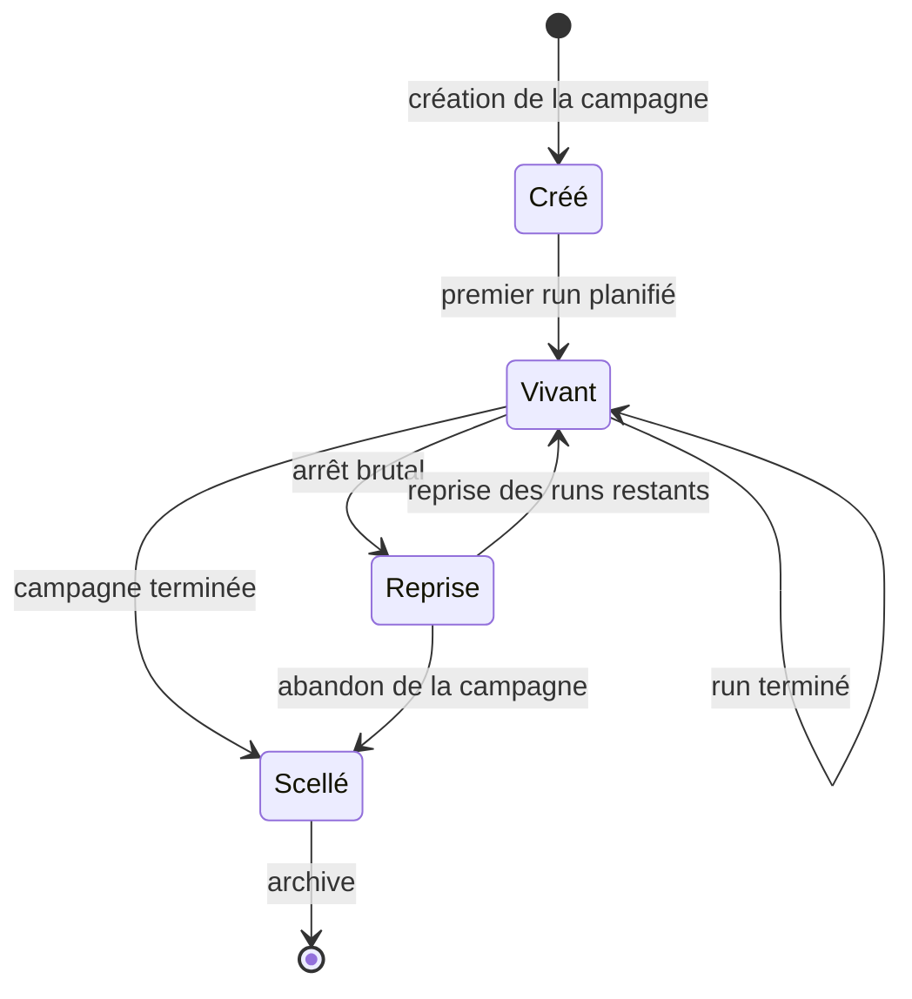

# PACKAGE_FORMAT.md

**Composant** : LIVEX (Launcher)
**Statut** : [DRAFT]
**Dernière mise à jour** : 30 septembre 2026
**Dépend de** : `ARCHITECTURE.md`, `EXPERIMENTS.md`, `../../VERSIONING.md`
**Source Monographie** : —

---

## 1. Objet

Le paquet `.livexp` (*LIVEX Package*) est le **format unique** de données du
Launcher. Il porte une campagne, ses runs, les artefacts qu'ils ont produits et
les rapports qui en découlent.

Un paquet a une **double nature** :

| Phase | Durée | Écriture | Usage |
| :-- | :-- | :-- | :-- |
| **Vivant** | Durée de la campagne | Continue, en incrément | Reprise après incident, supervision |
| **Scellé** | Après la campagne | Aucune | Partage, archivage, reproductibilité |

Cette double nature est la propriété structurante du format. Elle permet au
paquet d'être à la fois un **espace de travail durable** pendant l'exécution et un
**artefact autonome** après coup, sans conversion ni export.

## 2. Choix du conteneur

| Caractéristique | Choix | Justification |
| :-- | :-- | :-- |
| **Conteneur** | ZIP, extension `.livexp` | Lecture partielle sans extraction, disponibilité d'outils, append possible |
| **Variante** | ZIP64 obligatoire | Une campagne dépasse couramment 4 Gio |
| **Compression** | `deflate` par défaut, `store` au choix | `store` pour les entrées déjà compressées, évite le coût inutile |
| **Chiffrement** | Aucun en V0.1 | Le chiffrement du paquet est une question distincte, à trancher |
| **Signature** | Aucune en V0.1 | La signature suppose une autorité de certification à définir |
| **Encodage** | UTF-8, fins de ligne LF | Portabilité entre systèmes |

Le conteneur est un choix d'**implémentation**. Le format est la structure
logique : un lecteur doit pouvoir ouvrir un `.livexp` sans dépendre de ZIP.

## 3. Structure du paquet

```text
campagne.livexp
├── manifest.json                  # identité, état, schéma, inventaire
├── experiment.json                # définition : profil, graines, config résolue
├── journal.ndjson                 # journal d'exécution, ajout seul
├── provenance.json                # qui, quand, quelles versions, quelle plateforme
├── README.md                      # note de lecture, générée à la création
├── runs/
│   ├── index.json                 # index des runs et de leur état
│   ├── RUN-0001/
│   │   ├── run.json               # graine, versions, dérivation, empreinte
│   │   ├── config.resolved.json   # configuration effective complète
│   │   ├── data/                  # artefacts de données du run
│   │   ├── logs/                  # journaux corrélés au run
│   │   └── integrity.json         # tailles et empreintes SHA-256
│   └── RUN-0002/
│       └── ...
└── analysis/
    ├── individual/                # résultats d'analyse par run
    ├── aggregate/                 # analyse agrégée de la campagne
    └── emergence_report.md        # rapport d'émergence, fichier de référence
```

Le nom `emergence_report.md` est celui du **rapport de référence**, identique à
celui produit dans `Experiments/<id>/analysis/` sur le disque. Voir
`DATA_FLOW.md` §3.1 : un rapport n'a qu'un seul emplacement de référence, et
`Reports/` ne contient que des copies volontaires.

| Entrée | Écrit par | Rôle |
| :-- | :-- | :-- |
| `manifest.json` | Launcher | **Point de commit.** Identité, état, schéma, inventaire |
| `experiment.json` | Launcher | Définition déclarative de la campagne |
| `journal.ndjson` | Launcher | Journal d'exécution, une ligne par événement |
| `provenance.json` | Launcher | Traçabilité de la production |
| `README.md` | Launcher | Note de lecture, pour qui ouvre le paquet sans le Launcher |
| `runs/` | Launcher et composants | Un répertoire par run, numéroté à partir de 1 |
| `runs/index.json` | Launcher | État de chaque run, pour reprise sans relire les répertoires |
| `runs/RUN-nnnn/run.json` | Launcher | Métadonnées d'exécution d'un run |
| `runs/RUN-nnnn/config.resolved.json` | Launcher | Configuration effective, sans valeur par défaut implicite |
| `runs/RUN-nnnn/data/` | ECHOS | Artefacts de données produits pour ce run |
| `runs/RUN-nnnn/logs/` | SYNE et ECHOS | Journaux corrélés au run |
| `runs/RUN-nnnn/integrity.json` | Launcher | Empreintes des entrées du run |
| `analysis/individual/` | ECHOS | Résultats d'analyse par run |
| `analysis/aggregate/` | ECHOS | Analyse agrégée de la campagne |
| `analysis/emergence_report.md` | ECHOS | Rapport d'émergence, que le Launcher présente |

## 4. Le manifeste

`manifest.json` est la seule entrée qui atteste de l'état du paquet. Il est
écrit en dernier, et son absence à jour signifie que le paquet est récupérable
plutôt que valide.

```json
{
  "schema": 1,
  "packageId": "01JQ8X4M2N7P",
  "kind": "campaign",
  "state": "live",
  "createdAt": "2026-09-30T10:12:04Z",
  "sealedAt": null,
  "generator": {
    "name": "livex-launcher",
    "version": "0.1.0"
  },
  "experiment": {
    "id": "calibration-saison-3",
    "title": "Calibration saison 3",
    "profile": "analyse"
  },
  "counts": { "runs": 12, "runsDone": 5, "runsFailed": 0 },
  "components": [
    { "id": "syne", "version": "0.13.0" },
    { "id": "echos", "version": "0.9.0" }
  ],
  "integrity": { "algorithm": "sha256", "value": "…" }
}
```

| Champ | Rôle |
| :-- | :-- |
| `schema` | Version de la structure du manifeste |
| `packageId` | Identifiant unique, trié par temps |
| `kind` | Nature du paquet : `campaign` en V0.1 |
| `state` | `live`, `sealed` ou `recoverable` |
| `createdAt` | Date de création, ISO 8601 en UTC |
| `sealedAt` | Date de scellement, nulle tant que le paquet est vivant |
| `generator` | Launcher ayant produit le paquet |
| `experiment` | Identifiant, titre et profil de la campagne |
| `counts` | Nombre de runs, terminés, échoués |
| `components` | Versions des composants engagés |
| `integrity` | Empreinte du contenu utile au contrôle d'intégrité |

### 4.1 États du paquet

| État | Signification |
| :-- | :-- |
| `live` | Campagne en cours. Écriture attendue. |
| `sealed` | Campagne terminée. Paquet immuable. |
| `recoverable` | Écriture interrompue. Reprise possible, contenu incomplet. |

## 5. Le cycle de vie du paquet



### 5.1 Création

À la création, le Launcher écrit le squelette complet : `manifest.json` en état
`live`, `experiment.json`, `journal.ndjson` avec une première ligne, les
répertoires vides, et le `README.md` de lecture. Un paquet vide est déjà un
paquet valide et relisible.

### 5.2 Écriture pendant la campagne

À la fin de chaque run, le Launcher écrit, dans cet ordre :

1. `runs/RUN-nnnn/` : métadonnées, configuration résolue, données, journaux.
2. `runs/RUN-nnnn/integrity.json` : empreintes du run.
3. `runs/index.json` : mise à jour de l'état du run.
4. `journal.ndjson` : une ligne d'événement.
5. `manifest.json` : recomptage et nouvelle empreinte.

L'ordre est normatif. Un paquet interrompu entre deux étapes est `recoverable`, et
la reprise se base sur `runs/index.json`, pas sur l'examen des répertoires.

### 5.3 Scellement

Le scellement rend le paquet immuable.

| Opération | Effet |
| :-- | :-- |
| Écriture de `sealedAt` | Horodatage de fin de campagne |
| Passage de `state` à `sealed` | Le paquet n'accepte plus d'écriture |
| Recalcul de l'empreinte | Couverture de l'intégralité du contenu |
| Figage du journal | Le journal reste append, mais plus aucune ligne n'est ajoutée |
| Normalisation | Horodatages d'entrées ZIP ramenés à la valeur fixe |

Un paquet scellé est **en lecture seule**. Toute tentative d'écriture est refusée
avec la cause `paquet scellé`.

## 6. Reproductibilité du paquet

Le paquet scellé est **déterministe** : deux campagnes de contenu identique
produisent deux paquets identiques octet pour octet.

| Source de non-déterminisme | Traitement |
| :-- | :-- |
| Horodatages d'entrées ZIP | Fixés à la valeur d'époque du format |
| Permissions d'entrées | Normalisées |
| Ordre des écritures | Imposé par la séquence de la §5.2 |
| Identifiants de session | Absents du paquet |
| Chemins absolus | Interdits |
| Noms d'entrées | Dérivés, jamais horodatés |
| Compression | `deflate` à niveau fixé, `store` pour le reste |

Cette propriété est vérifiable : deux paquets scellés se comparent avec
`cmp` sans différence. Elle fait du paquet un support de reproductibilité au même
titre que la graine.

## 7. Versionnage et compatibilité

| Règle | Contenu |
| :-- | :-- |
| **Champ `schema` obligatoire** | Présent dans le manifeste et dans la configuration résolue |
| **Évolution additive** | Seuls des champs optionnels sont ajoutés dans une même version majeure |
| **Rupture majeure** | Un champ requis supprimé ou un changement de sens impose un incrément de la version majeure |
| **Refus explicite** | Un `schema` supérieur à celui connu produit un refus, jamais une lecture approximative |
| **Lecture tolérante** | Un `schema` inférieur est lu en ignorant les champs inconnus |

Le numéro de version du format est indépendant du numéro de version du
Launcher. Une règle de correspondance entre les deux doit être établie avec
`../../VERSIONING.md`.

## 8. Sécurité

| Vecteur | Mesure |
| :-- | :-- |
| **Traversal de chemin** | Toute entrée comportant `..`, un chemin absolu ou un lecteur est refusée à l'écriture et à la lecture |
| **Zip-bomb** | Plafond de taille décompressée et de ratio de compression, franchi en lecture |
| **Entrée exécutable** | Aucune entrée dont le suffixe est un exécutable n'est écrite ni extraite |
| **Lien symbolique** | Refusé à l'écriture et à la lecture |
| **Écriture concurrente** | Un seul processus écrit dans un paquet, par un verrou exclusif |
| **En-tête piégé** | Le CRC et la taille de chaque entrée sont vérifiés à la lecture |
| **Secret dans le paquet** | La configuration résolue ne contient que des valeurs effectives, jamais de secret |

## 9. Limites

| Limite | Valeur | Rôle |
| :-- | :-- | :-- |
| Taille d'un paquet | 4 Go sans ZIP64, illimitée avec | Conteneur ZIP64 obligatoire |
| Nombre de runs | 65 535 par paquet | `RUN-nnnn` sur quatre chiffres |
| Taille d'une entrée | 4 Go | Limite d'une entrée ZIP |
| Ratio de décompression | Plafonné à 100:1 | Protection zip-bomb |
| Entrées d'un paquet | Illimité | Pas de limite de count |

Le plafond de taille d'hébergement d'un artefact volumineux dans le paquet, et la
stratégie de dépôt externe avec référence, ne sont pas tranchés. Voir
`ISSUES.md`.

## 10. Ouverture d'un paquet

| Cas | Comportement |
| :-- | :-- |
| Paquet `sealed` | Ouverture en lecture, campagne consultable, scellement garanti |
| Paquet `live` | Ouverture en lecture, avec avertissement de campagne en cours |
| Paquet `recoverable` | Ouverture avec proposition de reprise |
| Paquet `schema` inconnu | Refus explicite avec la version requise et la version lue |
| Paquet corrompu | Refus avec l'entrée fautive nommée, ou lecture partielle signalée |

Le Launcher n'ouvre jamais un paquet en écriture sans l'accord explicite de
l'utilisateur, et jamais sans avoir vérifié qu'aucune autre session ne l'ouvre.

## 11. Références

- `EXPERIMENTS.md` — campagnes, runs, politique d'échec, reprise
- `ARCHITECTURE.md` §6 — persistance de l'orchestration
- `INTEGRATION_CONTRACT.md` §5, §12 — arrêt propre avant scellement, et empreinte de résultat stable
- `adr/ADR-004-format-de-paquet-livexp.md` — décision sur le format

---

## Points restés ouverts dans ce document

- **Chiffrement et signature.** Aucun des deux n'est prévu en V0.1. Il faut
  trancher si un paquet destiné au partage doit être signé, et avec quelle
  autorité. Voir `ISSUES.md`.
- **Granularité.** Le format est conçu pour un paquet par campagne. Il faut
  vérifier qu'un paquet par run ne serait pas plus utile pour de très grandes
  campagnes, et si un format d'index serait alors nécessaire.
- **Artefacts volumineux.** Plafond d'hébergement et stratégie de dépôt externe
  restent à définir.
- **Correspondance de version.** La relation entre la version du format et celle du
  Launcher doit être fixée avec `../../VERSIONING.md`.
- **Dérive de schéma.** La politique face à un `schema` supérieur à celui connu est
  proposée ici comme un refus, mais doit être confirmée. Voir
  `ARCHITECTURE.md` §9.
