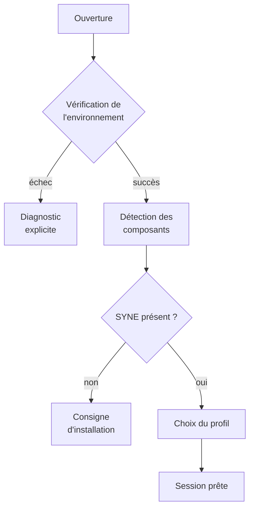

# PACKAGING.md

**Composant** : LIVEX (Launcher)
**Statut** : [DRAFT]
**Dernière mise à jour** : 30 septembre 2026
**Dépend de** : `COMPONENTS.md`, `NETWORK.md`, `TESTING.md`
**Source Monographie** : —

---

## 1. Objet

Ce document spécifie comment le Launcher est **livré, installé, mis à jour et
diagnostiqué** au premier démarrage.

Le Launcher est l'unique point d'entrée de LIVEX sur le poste de travail. Sa
distribution conditionne l'accès à tous les autres composants, ce qui en fait le
lieu naturel d'une arborescence de composants cohérente.

## 2. Forme de la livraison

| Caractéristique | Choix | Justification |
| :-- | :-- | :-- |
| **Type** | Application de bureau autonome | Aucun langage ni moteur à installer |
| **Exécutable** | Un binaire et ses dépendances managées | Installation compacte |
| **Installation** | Arborescence dans un répertoire choisi | Pas d'élévation de privilèges requise |
| **Données utilisateur** | Répertoire dédié, hors installation | L'installation reste remplaçable |
| **Installation par composant** | Non | Un seul paquet installe la pile orchestration |

### 2.1 Arborescence d'installation

```text
livex/
├── launcher/
│   ├── livex-launcher            # exécutable principal
│   ├── *.dll                    # dépendances managées
│   └── components/
│       ├── syne/
│       │   ├── component.json   # manifeste
│       │   └── ...
│       ├── echos/
│       │   ├── component.json
│       │   └── ...
│       └── prism/               # présent seulement si PRISM est livré
│           ├── component.json
│           └── ...
├── templates/                   # modèles de paquet, de campagne, de profil
├── LICENSE
└── VERSION
```

Le Launcher est installé **sans** ses composants. Il détecte ceux qui sont présents
et signale ceux qui manquent, conformément à `COMPONENTS.md` §11.

### 2.2 Répertoire de données utilisateur

| Chemin | Contenu | Volumétrie |
| :-- | :-- | :-- |
| `preferences/` | Préférences, profils enregistrés | Faible |
| `sessions/` | Journaux de session en cours | Faible, rotation quotidienne |
| `packages/` | Paquets `.livexp` en cours de campagne | **Élevée** |
| `archives/` | Paquets scellés conservés par l'utilisateur | **Élevée** |
| `cache/` | Données de travail supprimables | Modérée |

Le répertoire de données est **séparé** de l'installation. L'application peut être
remplacée ou désinstallée sans perte de préférences ni de paquets.

## 3. Plateformes cibles

| Plateforme | Paquet | V0.1 | Contrainte |
| :-- | :-- | :-- | :-- |
| **Windows x64** | Auto-extractible ou installateur | Cible principale | Aucun privilège élevé requis |
| **Linux x64** | Répertoire compressé auto-extractible | Cible secondaire | Droits d'écriture dans le répertoire de données |
| **macOS** | Aucun | Non prévue | Aucun besoin fonctionnel ne la justifie |
| **Windows arm64** | Aucun | Non prévue | Chaîne d'outils à confirmer |

Le Launcher ne requiert **aucune dépendance système** spécifique au-delà de la
couche .NET. Il n'installe pas de moteur de base de données, ni de serveur web, ni
de composant graphique tiers.

## 4. Détection des composants

La détection est purement déclarative et repose sur les manifestes.

| Source | Recherche | Priorité |
| :-- | :-- | :-- |
| `components/` de l'installation | Un sous-répertoire par composant | Première |
| Variable `LIVEX_HOME` | Arborescence de composants partagée | Seconde |
| Répertoire de l'utilisateur | Développement local de composants | Troisième |
| Registre de composants | Installations déclarées | Quatrième |

| Résultat | État | Rendu |
| :-- | :-- | :-- |
| Manifeste valide et binaire présent | **Inactif**, démarrable | Sélectionnable |
| Manifeste valide, binaire absent | **Inactif**, cause `binaire absent` | Non démarrable, emplacement affiché |
| Manifeste invalide | **Inactif**, cause `manifeste invalide` | Message d'erreur détaillé |
| Manifeste `schema` inconnu | **Inactif**, cause `version de manifeste non prise en charge` | Message indiquant la version requise et la version lue |
| Aucun manifeste trouvé | **Absent** | Emplacement attendu affiché |

## 5. Premier démarrage

Le premier lancement propose un parcours court, en quatre étapes.



| Étape | Contenu | Sortie possible |
| :-- | :-- | :-- |
| **Vérification de l'environnement** | Version de .NET, droits d'écriture, espace disque | Diagnostic et arrêt |
| **Détection** | Lecture des manifestes et vérification des binaires | Liste des composants |
| **Vérification du moteur** | Présence et manipulate SYNE | Consigne d'installation |
| **Choix du profil** | Sélection des modes disponibles | Session prête |

Le parcours est **interruptible** et **rejouable**. L'utilisateur peut le
refaire à tout moment depuis le mode Contrôle.

## 6. Vérification de l'environnement

La commande `livex-launcher --check` réalise le diagnostic sans ouvrir
d'interface. Elle est destinée au diagnostic d'incident et à la vérification
avant campagne.

| Vérification | Critère | Cause en cas d'échec |
| :-- | :-- | :-- |
| **Exécution** | Le binaire se lance | Exécution impossible |
| **Droits d'écriture** | Le répertoire de données est inscriptible | `répertoire de données non inscriptible` |
| **Espace disque** | Espace libre supérieur au seuil déclaré | `espace disque insuffisant` |
| **Version du format** | `schema` connu pour tous les paquets présents | `version de paquet non prise en charge` |
| **Composants** | Au moins un manifeste valide | `aucun composant détecté` |
| **Moteur** | SYNE présent et exécutable | `moteur absent` |
| **Ports** | Aucun conflit sur les ports déclarés | `conflit de port` |
| **Navigateur** | Un navigateur par défaut est déclaré | Information, non bloquant |

La sortie est **textuelle et stable**, afin de pouvoir être citée dans un rapport
d'incident. Elle n'écrit aucun journal de paquet.

## 7. Chemins d'accès

| Élément | Chemin | Configurable |
| :-- | :-- | :-- |
| Installation | Emplacement du binaire | Non |
| `LIVEX_HOME` | Racine de l'arborescence de composants | Oui |
| Données utilisateur | Répertoire dédié | Oui |
| Paquets | Sous-répertoire de `packages/` | Oui |
| Archives | Sous-répertoire de `archives/` | Oui |
| Journaux | Sous-répertoire de `sessions/` | Oui |
| Modèles | `templates/` de l'installation | Non |

La variable d'environnement `LIVEX_HOME` est le mécanisme principal de
personnalisation. Elle est lue au démarrage et son effet est journalisé.

## 8. Mise à jour

| Règle | Comportement |
| :-- | :-- |
| **Remplacement de l'application** | L'installation est remplacée, les données utilisateur sont conservées |
| **Aucune donnée pendant la mise à jour** | Les paquets en cours ne sont pas modifiés par une mise à jour de l'application |
| **Compatibilité des paquets** | Un paquet scellé reste relisible par toute version compatible de son `schema` |
| **Pas de mise à jour automatique** | Le Launcher ne se met pas à jour seul en V0.1 |
| **Reprise après échec** | Une mise à jour interrompue laisse l'installation précédente utilisable |

La mise à jour du Launcher **n'implique pas** la mise à jour de SYNE, ECHOS ou
PRISM. Chaque composant a son propre cycle, conformément à `../../VERSIONING.md`.

## 9. Compatibilité des versions

| Élément | Règle |
| :-- | :-- |
| **Version du Launcher** | Semver, indépendante de celle des composants |
| **Version du format** | Déduite du `schema` des paquets |
| **Version des composants** | Lue dans le manifeste, jamais supposée |
| **Fenêtre de compatibilité** | À fixer avec `../../VERSIONING.md` |
| **Manifeste en avance** | Refusé, avec la version requise et la version lue |
| **Composant en avance** | Autorisé, avec avertissement visible |

## 10. Désinstallation

La désinstallation retire l'application. Elle ne retire **jamais** les données
utilisateur, sauf demande explicite.

| Élément | Retiré par défaut | Sur demande |
| :-- | :-- | :-- |
| Application et composants livrés | Oui | — |
| Préférences et profils | Non | Oui |
| Journaux de session | Non | Oui |
| Paquets `.livexp` | Non | Jamais automatiquement |
| Archives scellées | Non | Jamais automatiquement |

Un paquet est un **résultat de recherche**. Le Launcher ne doit jamais le supprimer
sans action explicite de l'utilisateur.

## 11. Internationalisation et line endings

| Élément | Règle |
| :-- | :-- |
| **Interface** | Français |
| **Fichiers produits** | UTF-8, fins de ligne LF, sans séquence de retour chariot |
| **Champs de configuration** | JSON, en UTF-8, sans commentaire |
| **Séparateur décimal** | Point dans les fichiers, formaté selon la locale à l'affichage |
| **Fuseau** | Horodatages en UTC dans les fichiers, affichés en heure locale avec fuseau |

Les fichiers produits ne dépendent **jamais** de la locale ni de la convention
régionale. C'est une exigence de reproductibilité, pas une préférence de
présentation.

## 12. Références

- `COMPONENTS.md` — manifeste, détection, registre
- `NETWORK.md` — ports, conflits, boucle locale
- `TESTING.md` — validation de l'installation et du diagnostic
- `../../VERSIONING.md` — versionnage et compatibilité

---

## Points restés ouverts dans ce document

- **Format de livraison Linux.** Auto-extractible, `AppImage` ou paquet de
  distribution : le choix n'est pas arrêté, et il conditionne la chaîne de
  publication.
- **Installation par composant.** Le Launcher n'installe pas ses composants. Il
  faut décider si une installation de composant par le Launcher est utile, et sous
  quelles conditions de sécurité.
- **Emplacement des données.** Sur Windows, l'emplacement standard de données
  applicatives n'est pas écrasé d'un emplacement dédié sous le répertoire
  utilisateur. Le choix doit être arrêté.
- **Mise à jour automatique.** Le Launcher ne se met pas à jour seul. Il faut
  décider si un mécanisme de vérification, sans installation, est utile.
- **Seuil d'espace disque.** Le seuil de la vérification d'environnement n'est pas
  chiffré. Il dépend du volume attendu d'une campagne.
- **Signature des livraisons.** Les paquets de distribution ne sont pas signés. Une
  authority de signature pour les livraisons reste à définir, comme pour les paquets
  de données. Voir `PACKAGE_FORMAT.md` §11.
