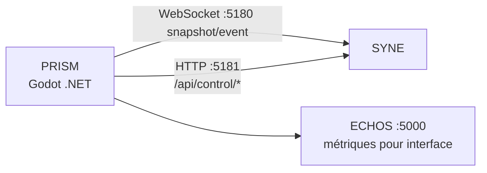

# ARCHITECTURE.md

**Composant** : PRISM
**Statut** : [STABLE]
**Dernière mise à jour** : 17 septembre 2026
**Dépend de** : `VISION.md`, `../COMMUNICATION.md`
**Source Monographie** : §5.2, §5.3

---

## 1. Le choix du moteur : Godot (édition .NET)

Le prototype utilise **Godot 4.7.2 édition .NET** (piste **[HÉRITÉ]** ; moteur graphique définitif reste **ouvert**), avec **C#** comme langage. Ce choix préserve la cohérence d'un monorepo .NET (typage fort, build/débogage via `dotnet`, tests communs).

**Alternatives évaluées** :
- **GDScript** : rompt la cohérence .NET → écarté.
- **Godot non-.NET** : incompatible avec le workflow C# → écarté.
- **Three.js** : alternative pour un rendu 2D/3D dans l'interface ECHOS ; non retenu pour PRISM.
- **Unity/Unreal** : surdimensionnés pour un prototype de visualisation.

## 2. Structure des scènes (V1)

```text
res://
  main.tscn                (scène racine)
  scripts/
    SimClient.cs            (client WebSocket)
    CameraController.cs     (contrôle caméra)
    Hud.cs                  (interface)
```

## 3. Le mapping 2D → 3D

Le monde est simulé en 2D (plan x, y). Dans l'espace 3D de Godot :

| Simulation (2D) | Godot (3D) |
| :-- | :-- |
| x | x |
| y | z |
| — | y (hauteur) |

Le sol est un `PlaneMesh` (aucune rotation nécessaire en Godot 4.7 : le plan XZ est le défaut, vérifié via AABB).

## 4. Les assets — 100 % procédural

Aucun asset externe. Primitives générées :

| Élément | Mesh |
| :-- | :-- |
| Sol | PlaneMesh |
| Entité | CapsuleMesh |
| Ressource | SphereMesh |
| Obstacle | BoxMesh / CylinderMesh |

(Voir `ASSETS_CONVENTIONS.md`.)

## 5. Transport



- **WebSocket :5180** — données (snapshot / event), reconnexion auto 1,5 s.
- **HTTP :5181** — contrôle relayé (`start`, `pause`, `resume`, `reset`), état interrogé toutes les 2 s.
- L'interface d'analyse (DashboardPage, etc.) est **intégrée à ECHOS** et consommée par PRISM comme complément.

(Détail : `TRANSPORT_API.md`.)

## 6. Intégration avec ECHOS

L'interface d'analyse (héritée du prototype web React, désormais **intégrée à ECHOS**) fournit à PRISM un tableau de bord complémentaire : `DashboardPage`, `KPICards`, `MetricsPanel`, `TimelineChart`, `AgentInspector`, `SocialGraph`, `GroupExplorer`, `MessageHeatmap`, `SimulationControls`, `SpeedControl`, `RecordingPanel`.

---

## Points restés ouverts dans ce document
- **Moteur graphique définitif** : ouvert (Godot pour le prototype). Le choix final interviendra après comparaison des besoins de PRISM, du pipeline d'assets, des performances et des contraintes de développement (§5.15).
- Version exacte de Godot à réévaluer à l'implémentation V0.1 (piste [HÉRITÉ] Godot 4.7.2).