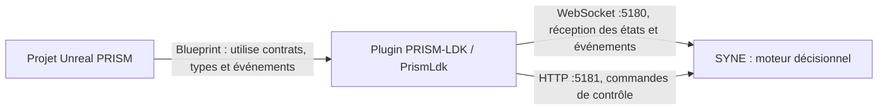

# ARCHITECTURE — PRISM / PrismLdk

**Composant** : PRISM
**Implémentation actuelle** : projet Unreal PRISM intégrant le plugin PRISM-LDK
**Dernière mise à jour** : 27 septembre 2026
**Dépend de** : [`VISION.md`](VISION.md), [`TRANSPORT_API.md`](TRANSPORT_API.md)

---

## 1. Packaging et usage

**LIVEX** est le projet complet. **PRISM** est son projet Unreal final :
il porte le monde présenté, l'interface et les interactions. PRISM intègre
**PRISM-LDK** (*LIVEX Development Kit*), le plugin d'intégration situé dans
`prism/LDK/Plugins/PrismLdk/` (nom technique du module : `PrismLdk`).
LDK désigne le plugin, pas un produit Unreal autonome.

Le dépôt fournit `prism/LDK/LDK.uproject` comme hôte technique pour compiler et
tester PRISM-LDK. Le nom de ce fichier n'en fait pas le projet complet LIVEX
ni un second projet produit. Les étapes d'installation et de configuration de
PRISM sont décrites dans
[`PRISM_UNREAL_IMPLEMENTATION.md`](PRISM_UNREAL_IMPLEMENTATION.md).

## 2. Responsabilité de PrismLdk

Le plugin est une couche d'intégration C++ légère, exposée à Blueprint. Il
fournit les types et contrats SYNE, les fonctions de connexion/contrôle,
l'adaptation des messages et des dispatchers tels que `OnWorldInitialized`,
`OnSnapshot`, `OnWorldDelta`, `OnSyneEvent`, `OnControlResult` et `OnError`.
Un `UGameInstanceSubsystem` porte l'accès au service et les fonctions
Blueprint ; `Get Prism Ldk Subsystem` permet au Blueprint d'obtenir cette
instance.

Le plugin ne crée pas automatiquement le terrain, les acteurs, les widgets,
les animations ou les règles de navigation. Il ne prend aucune décision
simulée. Le projet PRISM consomme les données Blueprint et produit leur représentation
visuelle.

## 3. Flux de données et de contrôle


```mermaid
flowchart LR
    P[Projet Unreal PRISM] -->|Blueprint : utilise contrats, types et événements| L[Plugin PRISM-LDK / PrismLdk]
    L -->|WebSocket :5180, réception des états et événements| S[SYNE : moteur décisionnel]
    L -->|HTTP :5181, commandes de contrôle| S
```

Le flux normal de préparation explicite est :

```text
Connect
 → réception WebSocket de world_initialized
 → générer/préparer la présentation du monde dans PRISM
 → Ready(worldVersion)
 → attendre le résultat HTTP positif
 → Start(seed, maxTicks)
 → recevoir les snapshots et événements de SYNE
```

Ce séquencement permet à PRISM de préparer son rendu avant le premier
tick simulé. Une commande est asynchrone ; le résultat est rapporté par
`OnControlResult`, et une erreur par `OnError`. Voir
[`TRANSPORT_API.md`](TRANSPORT_API.md) pour les routes et les contrats.

## 4. Règles de consommation

- `world_initialized` décrit le monde préparé et précède les snapshots.
- `OnSnapshot` fournit l'état dynamique complet du tick et constitue la source
  de vérité pour mettre à jour la scène.
- `world_delta` et les événements sont utiles aux notifications et effets
  ponctuels ; les changements qu'ils décrivent peuvent aussi apparaître dans
  le snapshot. Ne pas appliquer deux fois une même mutation.
- Distinguer les coordonnées continues SYNE des indices de cellule. Les
  conversions vers les unités Unreal et les particularités des types exposés
  sont détaillées dans
  [`PRISM_UNREAL_IMPLEMENTATION.md`](PRISM_UNREAL_IMPLEMENTATION.md).
- Les appels réseau et les callbacks Blueprint ne doivent pas faire dépendre
  l'état autoritaire du framerate ou de l'animation visuelle.

## 5. Principes d'évolution

- Garder les décisions, la simulation et leur état dans SYNE.
- Garder le C++ du plugin centré sur l'intégration et les contrats Blueprint.
- Ajouter les choix de rendu et de gameplay au projet Unreal PRISM, sauf
  nécessité démontrée d'étendre l'API du plugin.
- Faire évoluer les schémas de transport selon les contrats et le
  versionnage partagés, pas au moyen d'un contrat PRISM concurrent.

Les spécifications de scène, de rendu et d'interaction de ce dossier décrivent
les intentions produit pour PRISM sans imposer une implémentation interne.
