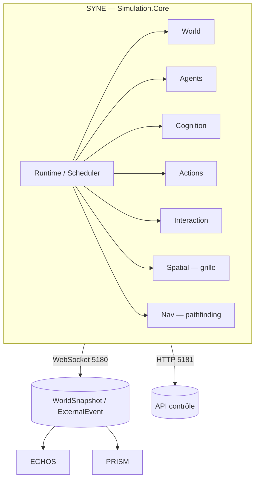

# ARCHITECTURE.md

**Composant** : SYNE
**Statut** : [STABLE]
**Dernière mise à jour** : 17 septembre 2026
**Dépend de** : `VISION.md`, `../COMMUNICATION.md`
**Source Monographie** : §3.2–3.5, §7.1 (monorepo), §7.3 (diagrammes, matrice de dépendances)

---

## 1. Vue d'ensemble

SYNE est organisé en **sous-systèmes** pilotés par un **Runtime/Scheduler** :



## 2. Sous-systèmes (Monographie §7.3.1)

| Sous-système | Rôle |
| :-- | :-- |
| **World** | Espace 2D (dimensions configurables), ressources, obstacles |
| **Agents** | Cycle de vie des entités (naissance, vie, dissolution) |
| **Cognition** | BDI : boucle cognitive de chaque entité |
| **Actions** | Répartition des actions possibles (déclaratives) |
| **Interaction** | Interactions inter-entités (social, combat, commerce) |
| **Spatial** | Grille spatiale uniforme (perception/communication O(quasi-linéaire)) |
| **Nav** | Pathfinding 2D autour des obstacles |

## 3. Runtime / Scheduler

- Exécute les sous-systèmes à des fréquences différentes selon leur coût (élevée/moyenne/adaptative/faible) — Monographie §3.4.
- **LOD décisionnel** (multi-échelle) : `decisionFrequency = 1 / 2^LOD` ; zone 0 (≤100) tous les ticks, zone 1 (100-200) tous les 2, zone 2 (200-400) tous les 4 (Monographie §3.4.3).
- Budget de tick (1000 entités, 100 ms) : Perception 20 ms, Mémoire/Croyances 15 ms, Besoins/Objectifs 10 ms, Utilité 20 ms, Communication 15 ms, Actions/Mouvement 15 ms, Événements 5 ms — Monographie §7.4.3.

## 4. Couche applicative (organisation code)

```text
syne/
├── Simulation.Core/           # bibliothèque principale
├── Simulation.Console/        # exécutable (mode serveur / CLI)
├── Simulation.Core.Tests/     # tests unitaires xUnit
└── Dockerfile
```

L'exécutable est en **mode serveur** (WebSocket + HTTP) ou **CLI** (exécution batch) — Monographie §7.1, ADR-002.

## 5. Interfaces externes

| Interface | Transport | Détail |
| :-- | :-- | :-- |
| Sortie temps réel | WebSocket 5180 | `WorldSnapshot`, `ExternalEvent` (JSON camelCase) |
| Contrôle | HTTP REST 5181 | `start`, `pause`, `resume`, `reset` |
| Persistance | JSON (V1) / SQLite (V2) | schéma Annexe G |

Voir `API_CONTRACTS.md` et `PERSISTENCE.md`.

## 6. Dépendances

- Aucune dépendance graphique.
- `.NET` SDK 10.0.400 (pinné) sur `global.json` (Monographie §7.1, [HÉRITÉ]).
- Aucune utilisation de `System.Random` (interdite — §3.6.3).

## 7. Budget temps & fréquences (repère)

| Fréquence | Sous-systèmes |
| :-- | :-- |
| Élevée | Mouvement, collisions, contraintes immédiates |
| Moyenne | Besoins, perception locale, environnement |
| Adaptative | Délibération, planification |
| Faible | Analyse, agrégations, statistiques |

(Principes d'architecture, pas valeurs figées — Monographie §3.4.2.)

---

## Points restés ouverts dans ce document
- Réorganisation finale des répertoires (`simulation-core/` historique vs `syne/` cible) — en consolidation.
- La distribution multi-fréquence exacte du scheduler sera affinée lors de l'implémentation.