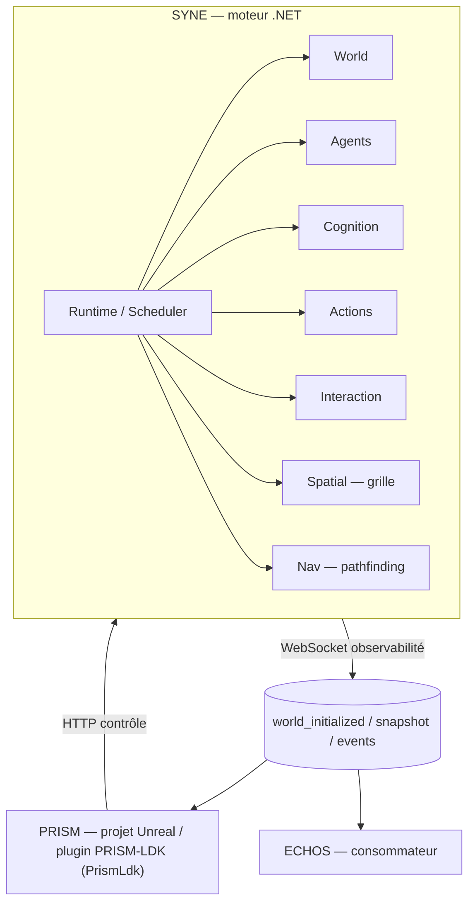

# ARCHITECTURE.md

**Composant** : SYNE
**Statut** : [STABLE]
**Dernière mise à jour** : 17 septembre 2026
**Dépend de** : `VISION.md`, `../COMMUNICATION.md`
**Source Monographie** : §3.2–3.5, §7.1 (monorepo), §7.3 (diagrammes, matrice de dépendances)

---

## 1. Vue d'ensemble — rôle actuel

SYNE est le moteur .NET autoritaire de simulation et de décision. PRISM
consomme ses données dans le projet Unreal PRISM via le plugin
PRISM-LDK (`PrismLdk`) ; ce plugin n'est
pas un moteur de simulation parallèle.


```mermaid
flowchart TB
    subgraph SYNE["SYNE — moteur .NET"]
        RT[Runtime / Scheduler]
        WORLD[World]
        AGENTS[Agents]
        COG[Cognition]
        ACT[Actions]
        INTER[Interaction]
        SPATIAL[Spatial — grille]
        NAV[Nav — pathfinding]
        RT --> WORLD
        RT --> AGENTS
        RT --> COG
        RT --> ACT
        RT --> INTER
        RT --> SPATIAL
        RT --> NAV
    end
    SYNE -->|"WebSocket observabilité"| WS[(world_initialized / snapshot / events)]
    PRISM["PRISM — projet Unreal / plugin PRISM-LDK (PrismLdk)"]
    ECHOS["ECHOS — consommateur"]
    WS --> PRISM
    WS --> ECHOS
    PRISM -->|"HTTP contrôle"| SYNE
```

Les ports par défaut sont 5180 (WebSocket) et 5181 (HTTP), sur l'interface
locale `127.0.0.1`. Les options du serveur permettent de les configurer : ce
sont des valeurs par défaut, pas des numéros à coder en dur chez les
consommateurs.

## 2. Sous-systèmes (Monographie §7.3.1)

| Sous-système | Rôle |
| :-- | :-- |
| **World** | Espace 2D (dimensions configurables), ressources, obstacles |
| **Agents** | Cycle de vie des entités (naissance, vie, dissolution) |
| **Cognition** | BDI : boucle cognitive de chaque entité |
| **Actions** | Répartition des actions possibles (déclaratives) |
| **Interaction** | Interactions inter-entités (social, combat, commerce) |
| **Spatial** | Grille spatiale uniforme (perception/communication O(quasi-linéaire)) |
| **Nav** | Pathfinding 2D autour des obstacles |

## 3. Runtime / Scheduler

- Exécute les sous-systèmes à des fréquences différentes selon leur coût (élevée/moyenne/adaptative/faible) — Monographie §3.4.
- **LOD décisionnel** (multi-échelle) : `decisionFrequency = 1 / 2^LOD` ; zone 0 (≤100) tous les ticks, zone 1 (100-200) tous les 2, zone 2 (200-400) tous les 4 (Monographie §3.4.3).
- Budget de tick (1000 entités, 100 ms) : Perception 20 ms, Mémoire/Croyances 15 ms, Besoins/Objectifs 10 ms, Utilité 20 ms, Communication 15 ms, Actions/Mouvement 15 ms, Événements 5 ms — Monographie §7.4.3.

## 4. Couche applicative (organisation code)

```text
syne/
├── global.json                   # SDK .NET 10.0.400 (pinné, rollForward latestFeature)
├── Syne.sln                      # solution du composant
├── Simulation.Core/              # bibliothèque principale
│   ├── Configuration/            # options Annexe H, loader JSON, validation, flags CLI (ADR-012)
│   ├── Prng/                     # xoshiro256** + splitmix64 (ADR-006, `System.Random` interdit)
│   ├── World/                    # monde 2D continu, grille spatiale uniforme (SYNE-003)
│   ├── Entities/                 # entité, traits [0,2], paramétrage + fabrique déterministe (SYNE-004)
│   └── Loop/                     # boucle minimale : 1 tick = 1 min, maxTicks, temps simulé (SYNE-002)
├── Simulation.Console/           # exécutable (mode serveur WebSocket/HTTP / CLI batch) — ADR-002
└── Simulation.Core.Tests/        # tests unitaires xUnit (vecteurs PRNG & fabrique épinglés)
```

`Simulation.Console` prend en charge l'exécution CLI/batch ainsi que les
interfaces de contrôle HTTP et d'observabilité WebSocket (`--serve` et
`--observe`). Le serveur HTTP de contrôle peut aussi diffuser les trames
d'observabilité du run. Les détails des options et des contrats actuels sont
décrits dans `CONFIGURATION.md` et `API_CONTRACTS.md`.

## 5. Interfaces externes

| Interface | Transport | Détail |
| :-- | :-- | :-- |
| Sortie temps réel | WebSocket (5180 par défaut) | `world_initialized`, snapshots globaux et événements (JSON camelCase) |
| Contrôle | HTTP REST (5181 par défaut) | Préparation du monde et commandes de cycle de vie |
| Persistance | JSON (V1) / SQLite (V2) | schéma Annexe G |

Les ports sont configurables et le bind par défaut est local (`127.0.0.1`).
PRISM consomme ces interfaces via le plugin Unreal PRISM-LDK (`PrismLdk`) ; le
contrôle et le rendu ne portent pas la logique de simulation. Voir
`API_CONTRACTS.md` et `PERSISTENCE.md`.

## 6. Dépendances

- Aucune dépendance graphique.
- `.NET` SDK 10.0.400 (pinné sur `global.json`, band `latestFeature`) — Monographie §7.1, [HÉRITÉ].
- Aucune utilisation de `System.Random` (interdite — §3.6.3) : PRNG **xoshiro256\*\*** + **splitmix64** (ADR-006, ADR-012).

## 7. Mock d'intégration du plugin

Le répertoire séparé `../../syne-mock/` à la racine du dépôt contient un serveur
Node.js qui simule certains contrats et flux pour développer/tester
PRISM-LDK (`PrismLdk`) sans démarrer SYNE. Il n'est ni le moteur réel ni une référence
d'équivalence algorithmique. Seuls les contrats documentés et implémentés par
le moteur .NET font autorité pour les règles et résultats de simulation.

## 8. Budget temps & fréquences (repère)

| Fréquence | Sous-systèmes |
| :-- | :-- |
| Élevée | Mouvement, collisions, contraintes immédiates |
| Moyenne | Besoins, perception locale, environnement |
| Adaptative | Délibération, planification |
| Faible | Analyse, agrégations, statistiques |

(Principes d'architecture, pas valeurs figées — Monographie §3.4.2.)

---

## Points restés ouverts dans ce document
- La distribution multi-fréquence exacte du scheduler sera affinée lors de l'implémentation (jalon SYNE-2 : boucle minimale).
- Conteneurisation (`Dockerfile` SYNE) : **retirée du périmètre LIVEX** (08/10/2026, arbitrage A1 de `ROADMAP-V01.md`) — plus aucun Docker dans le projet.