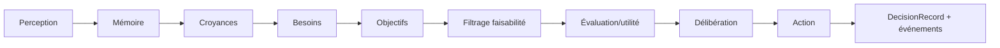

# COGNITIVE_ARCHITECTURE.md

**Composant** : SYNE
**Statut** : [STABLE]
**Dernière mise à jour** : 22 septembre 2026
**Dépend de** : `DATA_MODEL.md`, `SIMULATION_LOOP.md`
**Source Monographie** : §3.8, §3.11–3.14 (BDI, croyances, besoins, objectifs, décision/utilité)

---

## 1. Architecture BDI

Chaque entité suit le paradigme BDI (Belief-Desire-Intention) :

| Composante | Contenu |
| :-- | :-- |
| **Croyances (Beliefs)** | Faits que l'entité tient pour vrais, avec confiance (0-1) et source |
| **Désirs / Objectifs (Desires/Goals)** | États recherchés, générés depuis les besoins non satisfaits, avec priorité |
| **Intentions (Intentions)** | Action sélectionnée par la fonction d'utilité, avec niveau d'engagement (`commitmentLevel`) et conditions d'interruption |

(Monographie §3.8.2)

## 2. Pipeline cognitif

Chaîne de traçabilité : `Action ← Intention ← Objectif ← Besoin ← Croyance ← Mémoire ← Perception`.

## 3. Perception

- Rayon de perception de l'entité, **défaut 50 unités** (décision n°6, plage 20–70), doit rester > vitesse de déplacement/tick pour éviter les angles morts.
- Observation : `entity_id, entity_type, position, confidence, tick, attributes`.
- Confiance = `1.0 - (distance/radius) × 0.3`, clampée [0.7, 1.0].
- **Grille spatiale** : requêtes des cellules voisines (fenêtre 3×3, SYNE-012), mises à jour incrémentales.
- **Perception étagée** : `rotationInterval` groupes (`id % rotationInterval`, défaut 4) — chaque entité perçoit au tick `t ≡ groupe`.
- **Ligne de vue (J.V0.1, ADR-013)** : un obstacle cercle sur le segment sujet→cible masque la perception (intersection segment-disque).

(J.V0.1, SYNE-011/SYNE-012 ; Monographie §3.9)

## 4. Mémoire et Croyances

- **Mémoire** : stocke les expériences passées ; décroissance exponentielle de la salience (seuil d'oubli 0.01 ; capacité 1000 avec éviction du moins saillant ; decay par type 0.01/0.005/0.002). Ne représente pas le monde « tel qu'il est » mais « tel que perçu » (décision n°11, SYNE-013).
- **Croyances** : interprétation du monde. Révision continue (décision n°12, SYNE-014) :
  - conflictuel (sujet+prédicat, valeur différente) : concurrentes −0.1 (min 0.1) + création au signal ;
  - aligné (même fait, même source) : +0.2 (max 1.0) ;
  - même fait, sources différentes : moyenne ;
  - plafond par snap (`maxChangePerSnap`) dans la formule de révision ; les croyances expirées plafonnent à 0.4.

(Monographie §3.10, §3.11)

## 5. Besoins et Objectifs

- 6 besoins (faim, soif, fatigue, sécurité, social, curiosité).
- Objectifs générés depuis les besoins non satisfaits (seuils par défaut : **50/50/70**/0.5/0.7/0.3 — faim/soif dès **≥ 50**, repos > 70, décision n°4 ; configurables `needs.*TriggerThreshold`).
- Filtrage de faisabilité (capacité, cible croyue accessible, taux de succès > 0, pas d'échec récent en mémoire).
- Priorité : `goal.priority = need_level × success_probability × urgency_factor`.
- **Actions terminales (SYNE-042)** : faim/soif déclenchées → SeekFood/SeekWater résolus en **Eat/Drink** si la réserve globale correspondante est disponible (sinon poursuite de la quête), évalués à chaque délibération. Genèse des désirs : `DesireFactory` itère l'ordre canonique des besoins, saute `Idle`/`Eat`/`Drink` (résolus), écarte les classes déjà actives. Eat/Drink sont exécutés atomiquement par `ActionExecutor` (une action par entité par tick) et consomment la réserve (DATA_MODEL §8.1).

## 6. Décision par utilité

**Formule** : `utility = (benefit − cost − risk) × confidence × personality_modifier + urgency`

- **Benefit** : satisfaction potentielle d'un besoin par l'action (ex. `Eat = Min(Hunger, 30)`) ; bonus **×1.2** si alignés avec l'objectif courant (`deliberation.alignBonus`, configurable — implémenté).
- **Cost** : coût de l'action (énergie, temps, risques).
- **Risk** : risque de l'action.
- **Confidence** : fiabilité de l'information (moyenne des croyances associées ; base 0.5 ; plages par action ex. `Trade = 0.5 + trust × 0.5`) ; historique de succès module (`× (0.5 + successRate × 0.5)`).
- **Urgency** : sigmoïde `1 / (1 + exp(-0.1 × (need - 50))) × 20`, +5 si goalAge > 100, +10 si état critique (énergie < 10 ou faim > 85, seuils configurables).
- **PersonalityMod** : module par trait (`risky × (0.5 + bravery)`, `Explore × (0.5 + curiosity)`, `social × (0.5 + sociability)`, `Gather × (0.5 + greed)`), Min 0.1.

**Sélection** : utilité maximale. Optimisations : cache d'utilité (objectifs inchangés → pas de recalcul) ; arrêt précoce si score > 0.9.

**Anti-oscillation (hystérésis, implémenté)** : passage à une nouvelle action seulement si elle dépasse l'action courante de `actionSwitchMargin` (défaut 0.05, `deliberation.actionSwitchMargin`).

**Interruptions (implémenté)** : déclencheur **centralisé** `InterruptionTrigger` (SYNE-043) — unique point « l'action en cours est-elle interrompue ? » évalué à tout tick, y compris hors délibération : besoin critique (faim > 85 → **Eat** si réserve disponible, sinon SeekFood ; énergie < 10 → Rest) et utilité supérieure de > 10 (`interruption.utilityExcessMargin`) vs utilité de l'action courante (même formule que la délibération). Aucune consommation de PRNG (déterminisme, DETERMINISM.md §3).

(Monographie §3.13, §3.14)

## 7. DecisionRecord (trace)

Chaque décision produit une trace complète : besoins, croyances considérées, scores d'utilité par action, action choisie. C'est la base de l'analyse causale ECHOS et de l'observabilité.

Implémentation V0.1 : `MindState.LastDecisionRecord` (`DecisionRecord` : tick, identifiant d'entité, action choisie, cause, scores par action, flags `deliberated`/`interrupted`, décision par défaut en cas de holdover/catégorie vide). La délibération à fréquence (LOD, décision n°14) **reporte en holdover** la dernière décision entre deux délibérations ; `LastDecisionScores` expose les scores du dernier passage.

**Exécution (jalon SYNE ph4)** : chaque tick, après décision, `ActionExecutor` applique **atomiquement** l'action choisie — effets (coûts d'énergie, récupérations, consommation de réserve) issus du catalogue déclaratif `agents.actions.catalog` (CONFIGURATION §6.2), déplacement pseudo-aléatoire déterministe par (id, tick, désir) avec pas borné par la vitesse et **interdiction d'entrer dans un obstacle** (rejet → sur place, SYNE-041). Le résultat est tracé : `MindState.LastActionResult` (`ActionResult` : outcome Executed/Blocked, deltas d'effets, réserve consommée), émis en observabilité `action_completed` (API_CONTRACTS §2.2).

(Monographie §3.14.12, §4.5.2)

## 8. Exemple exhaustif

Voir Monographie §3.8.3 (Alice, tick 5000) et §3.13.4 (Charlie) : exemples complets de cycle perçu → décidé → exécuté avec chiffres d'utilité.

---

## Points restés ouverts dans ce document
- Dimensionnement exact des seuils de besoins : défauts actés **50/50/70** (décision n°4, configurables `needs.*TriggerThreshold`, cf. CONFIGURATION.md §6.2) — calibration générale à faire.
- Coûts/bénéfices d'actions (énergie, temps, risque) : valeurs [HÉRITÉ] du prototype à réévaluer ; cf. décision n°9 pour les coûts de communication.
- Bonus d'alignement (×1.2) et `actionSwitchMargin` (0.05) : **configurables** (`deliberation.alignBonus`/`actionSwitchMargin`), valeurs optimales à confirmer en calibration.