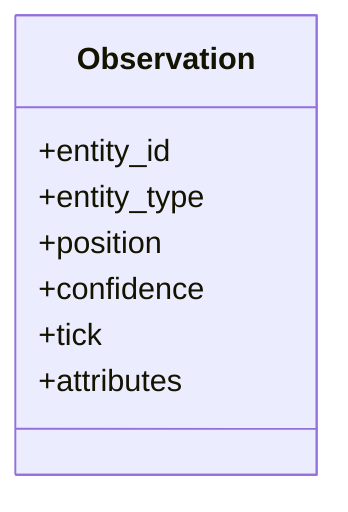

# DATA_MODEL.md

**Composant** : SYNE
**Statut** : [STABLE]
**Dernière mise à jour** : 21 septembre 2026
**Dépend de** : `ARCHITECTURE.md`
**Source Monographie** : §3.5 (monde), §3.7 (entités), §3.10 (mémoire), §3.11 (croyances), Annexe G (schéma SQLite)

---

## 1. Objectif

Ce document décrit les **structures de données** centrales de SYNE. Elles forment le contrat interne du moteur et la source pour les contrats externes (`API_CONTRACTS.md`).

## 2. Le Monde

- **Espace** : plan 2D logique, dimensions configurables (défaut 500×500 unités), positions `{x, y}`. Non-toroidal : positions clampées à `[0, width]×[0, height]` (Monographie §3.5.3).
- **Obstacles** : statiques, **cercle** `{id, x, y, radius}` (V0.1 — le rectangle est reporté). Bloquent le **mouvement** (collision simple : pas annulé si la cible est dans le disque) et, depuis le **jalon SYNE ph1**, la **ligne de vue** (perception masquée, ADR-013) — synchronisation des docs avec §3.5.2 et V2 (murs/passabilité). Depuis **SYNE-071 (engineVersion 0.8.0)** : portés par le monde comme **constructions/obstacles statiques** — layout `world.obstacleLayout[]` (CONFIGURATION §6.8), mutation dynamique validée (révision), grille A\* re-rasterisable, snapshot `obstacles[]`.
- **Saisons** : dérivées du **cycle environnemental** (SYNE-072, engineVersion 0.9.0) — `Season` (spring/summer/autumn/winter), saison courante = fonction pure du tick `(initialIndex + tick / seasonLengthTicks) mod 4` (0 tirage PRNG, DETERMINISM.md §3) ; facteurs de régénération par ressource (`SeasonFactors`) modulant le cycle de vie SYNE-070 en fin de tick ; champ snapshot `season`/`seasonIndex` (API_CONTRACTS §2.1), événement `world.season_changed` (§2.2).
- **Ressources** (V1) :

| Propriété | FoodSource | WaterSource |
| :-- | :-- | :-- |
| Id | string | string |
| Type | `"food"` | `"water"` |
| Position | {x,y} | {x,y} |
| Quantity | ≥ 0 | — |
| MaxQuantity | ≥ 0 | — |
| RegenerationRate | 0 (V1) | — |
| Capacity | — | 1000 (V1) |
| Infinite | false | **true** (V1) |
| KnownFromStart | true (V1) | true (V1) |

V2 : régénération et dégradation des ressources (Monographie §3.18, §6.9).

## 3. L'Entité

### 3.1 Structure (V1 → V2)

| Composant | Contenu V1 | Évolution V2 |
| :-- | :-- | :-- |
| **Identité** | Id (string), Espèce, Nom, Âge | idem |
| **État** | Santé (0-100), Énergie (0-100), Faim (0-100), Soif (0-100), Position | + Fatigue |
| **Traits** | Agressivité, Sociabilité | 8 traits (voir §3.7.4) |
| **Inventaire** | Nourriture (int), Eau (int) | idem |
| **Perception** | Observations courantes | structure Observation |
| **Mémoire** | Entités connues, positions, confiance | file de souvenirs, salience |
| **Décision** | État de décision, action courante | BDI complet |

### 3.2 Les 8 traits (V2, [HÉRITÉ])

| Trait | Plage | Neutre | Rôle |
| :-- | :-- | :-- | :-- |
| Bravery | 0-2 | 1.0 | Tolérance au risque |
| Curiosity | 0-2 | 1.0 | Pulsion d'exploration |
| Sociability | 0-2 | 1.0 | Préférence socialisation |
| Greed | 0-2 | 1.0 | Concentration ressources |
| Pessimism | 0-2 | 1.0 | Prudence / danger |
| Aggression | 0-2 | 1.0 | Disposition à l'attaque |
| Strength | 0-2 | 1.0 | Puissance de combat |
| Speed | 0-2 | 1.0 | Vitesse de déplacement |

Initialisation aléatoire (gaussienne autour de 1.0, plage 0.5–1.5) — Monographie §3.7.4.

> **V0.1 (paramétrage)** : pas de classes rigides d'entités — les types sont définis par **paramétrages** (« Entité A »/« Entité B » : plages de traits, taux de besoins, capacités). Les entités d'un même paramétrage restent singulières (traits tirés individuellement). (Monographie §3.7.4)

### 3.3 Cycle de vie

| État | Description |
| :-- | :-- |
| **Active** | Perçoit, décide, agit |
| **Resting** | Inactive mais consciente |
| **Sleeping** | Inactive, ne perçoit pas le danger |
| **Dead** | Prototype : mort irréversible, reste observable |

> **V0.1** : la naissance repose sur la **fusion consentie** (§6.6.2) et la mort sur la **dissolution complète** (§6.2.5) : l'entité cesse d'exister et ne laisse qu'un événement de trace. (Monographie §3.7.5)

## 4. Observations (Perception)

Confiance : `1.0 - (distance/sensor_radius) × 0.3`, clampée [0.7, 1.0] (Monographie §3.9.4).
Rayon de perception **défaut 50 unités** (décision n°6, plage 20–70) — J.V0.1 ; perception **étagée** en 4 groupes de rotation (`id % rotationInterval`, perçoit au tick `t ≡ groupe`).

Attributs perçus par type : Entités (AgentId, Énergie, Statut, Heading) ; Ressources (ResourceType, Quantité, Régénération) ; Obstacles (Position, Taille, Passable) — §3.9.5. En V0.1 le moteur émet : `species`, `x`, `y` pour les entités ; `radius` pour les obstacles (identification FNV-1a déterministe).

## 5. Mémoire

- Entrée : salience initiale, catégorie (Observation / Événement / Interaction), tick de stockage.
- Décroissance exponentielle : `salience(t) = salience(0) × exp(-decayRate × (currentTick - storedAt))`.
- Seuil d'oubli : salience > **0.01** (recall). Capacité maximale : **1000 entrées**/entité (V2 configurable) ; au-delà, purge de la plus ancienne.
- Decay par type : Observation 0.01, Événement 0.005, Interaction 0.002.
- À distinguer des **croyances** (Monographie §3.10.6).

## 6. Croyances

- Fait : `(subject, predicate, value)`.
- Confiance : 0-1 ; « vraie » pour l'entité si ≥ **0.5**.
- Source : perception, mémoire, communication, inférence.
- Cycle de vie : création (confiance initiale) → confirmation (alignement +0.2, max 1.0) → conflit (conflicting −0.1, plancher 0.1) → décroissance temporelle → expiration (expiry_tick, confiance plafonnée à 0.4) — Monographie §3.11.
- **Conflit (J.V0.1, SYNE-014)** : un signal portant sur un **sujet + prédicat** déjà croyu mais avec une **valeur différente** pénalise les croyances concurrentes (−0.1, plancher 0.1) puis crée la nouvelle croyance au signal.
- Étant donnée la clé `(subject, predicate, value)`, `position` est canoniquement sérialisée « X,Y » invariant à la culture.

## 7. Besoins

6 catégories conservées en V0.1 — seuils de déclenchement **configurables** par défaut (décision n°4, jalon SYNE ph4) :

| Besoin | Échelle | Seuil déclenchement | Objectif/Action généré |
| :-- | :-- | :-- | :-- |
| Faim (Hunger) | 0-100 | **50** (`needs.hungerTriggerThreshold`) | SeekFood → **Eat** si réserve Food disponible |
| Soif (Thirst) | 0-100 | **50** (`needs.thirstTriggerThreshold`) | SeekWater → **Drink** si réserve Water disponible |
| Fatigue | 0-100 | **70** (`needs.fatigueTriggerThreshold`) | Rest |
| Sécurité | 0-1 | 0.5 | Flee |
| Social | 0-1 | 0.7 | Socialize |
| Curiosité | 0-1 | 0.3 | Explore |

Monographie §3.12, §3.13.1.

> **Actions terminales Eat/Drink (SYNE-042)** : dès que le besoin déclenche (≥ seuil), si la
> réserve globale est disponible, l'entité **exécute l'action terminale** Eat/Drink (consomme la
> réserve, réduit le besoin) ; sinon elle poursuit SeekFood/SeekWater. Ces actions sont
> ré-évaluées à chaque délibération/holdover tant que le besoin reste déclenché.

## 8. Contrats de persistence (SQLite Annexe G)

Le schéma SQLite V2.0 (11 tables : `runs`, `tick_states`, `agents`, `agent_snapshots`, `resources`, `resource_snapshots`, `groups`, `group_memberships`, `events`, `messages`, `metrics`) est détaillé dans `PERSISTENCE.md`.

### 8.1 Réserves globales de ressources (SYNE-042)

V0.1 : **réserves globales** partagées (`ResourceStocks`), initialisées depuis `resources.*`
(CONFIGURATION.md §1) et consommées par les actions terminales Eat/Drink puis exposées dans le
snapshot d'observabilité (`resources`, API_CONTRACTS.md §2.1). Les **sources spatiales** restent
au jalon ph7 (SYNE-070). Depuis **SYNE-070 (engineVersion 0.7.0)** : cycle de vie appliqué en fin
de tick — régénération (`+ regenerationRate` par tick) puis dégradation périodique (à chaque
`degradationTick`, perte de `regenerationRate × degradationTick`, clamp ≥ 0 ; inerte sans taux).
Depuis **SYNE-071 (engineVersion 0.8.0)** : les **constructions/obstacles statiques** (§6.4.4)
sont des disques portés par le monde (`Obstacle {Id, Position, Radius}`), configurés par layout
`world.obstacleLayout[]`, mutables dynamiquement (révision `ObstacleRevision`) et exposés dans le
snapshot (`obstacles`, API_CONTRACTS.md §2.1) ; leur consommation de ressources relève de la
mécanique agentique **ouverte** (décision n°20).

| Ressource | Initial | Régénération/tick | Consommée par |
| :-- | :-- | :-- | :-- |
| Food | 100 | 0 | Eat (1.0 / exécution) |
| Water | 1000 | 5 | Drink (1.0 / exécution) |
| Wood | 50 | 0.1 | — (mécanique agentique des constructions, ouverte — décision n°20) |
| Mineral | 0 | 0 | — (mécanique agentique des constructions, ouverte — décision n°20) |

---

## Points restés ouverts dans ce document
- Dimensionnement exact des seuils de besoins : défauts actés **50/50/70** (décision n°4, configurables `needs.*TriggerThreshold`) — calibration générale à faire.
- Plage décroissance mémoire en V0.1 : valeurs de prototype conservées ([HÉRITÉ]) ; confirmer lors de la calibration générale.
- Forme **rectangle** des obstacles : reportée (V0.1 cercle seul, `LineOfSight` intersection segment-disque) — à rouvrir avec la navigation V2.
- Attribut `Passable` des obstacles : à trancher avec la passerelle/Passable — la ligne de vue est déjà bloquelle en V1 (ADR-013).