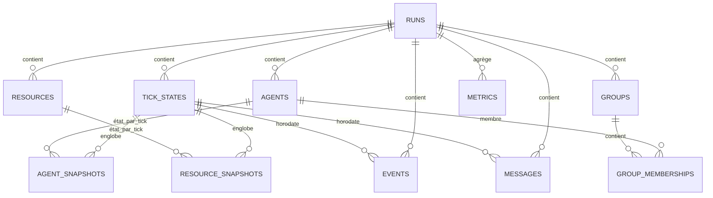

# PERSISTENCE.md

**Composant** : SYNE
**Statut** : [STABLE]
**Dernière mise à jour** : 17 septembre 2026
**Dépend de** : `DATA_MODEL.md`, `DETERMINISM.md`
**Source Monographie** : ADR-011 (Persistance JSON → SQLite), Annexe G (schéma SQLite V2.0), §3.6.4 (sérialisation état RNG)

---

## 1. Objectif

La persistance garantit la **sauvegarde** et la **reprise exacte** de la simulation, avec une garantie de **déterminisme bit-à-bit** : reprendre au tick 1000 et poursuivre doit produire exactement les mêmes événements qu'une exécution ininterrompue.

## 2. Stratégie en deux versions (ADR-011)

| Version | Format | Usage |
| :-- | :-- | :-- |
| **V1** | JSON | Simple, inspectable, débogage |
| **V2** | SQLite | Transactionnalité, évolution du schéma, requêtes analytiques (ECHOS), migration versionnée |

- SQLite intégré via NuGet (`Microsoft.Data.Sqlite` ou `System.Data.SQLite`) — voir ADR-011.
- Le format JSON reste utilisable en debug à côté du SQLite.
- La migration V1 → V2 est documentée par scripts SQL.

## 3. Schéma SQLite V2.0 (Annexe G) — 11 tables

### Tables clés

1. **runs** — identité du run : `id`, `name`, `started_at`, `ended_at`, `seed`, `config`, `total_ticks`.
2. **tick_states** — état à un tick : `run_id`, `tick_number`, `state`, `rng_state` (état 4×64 bits du PRNG), `timestamp`.
3. **agents** — entités : `id`, `run_id`, `species`, `name`, `birth_tick`, `death_tick`, `current_state`, `initial_traits`.
4. **agent_snapshots** — état par tick : position x/y, health, energy, hunger, thirst, fatigue, current_action, action_progress, beliefs, goals, relationships, memory.
5. **resources** — ressources : type, position, quantity, capacity.
6. **resource_snapshots** — quantité par tick.
7. **groups** — groupes : name, formation_tick, dissolution_tick, leader_id, avg_cohesion.
8. **group_memberships** — appartenances : role, joined_tick, left_tick.
9. **events** — événements : type, entity_id, target_id, details.
10. **messages** — communications : type, sender_id, receiver_id, content, confidence, hops.
11. **metrics** — agrégats par tick (alive_count, moyennes santé/énergie/faim/soif, totaux décès/naissances/conflits/coopérations/groupes/messages).

## 4. État RNG et reprise exacte

- L'**état complet du PRNG (4 × ulong)** est sauvegardé dans `tick_states.rng_state`.
- Reprise au tick N : charger `rng_state`, l'état du monde à N, poursuivre. Pas de re-détermination par re-jouage.
- Règle : `System.Random` est interdit (non stable entre runtimes, état non sérialisable) — §3.6.3.

## 5. Sauvegarde automatique

- `simulation.autoSaveEveryNTicks` (défaut 1000) et `maxBackups` (défaut 5) — Annexe H.
- Sauvegarde atomique (transaction SQLite en V2).

## 6. Compatibilité et migration

- `schemaVersion` propre à la persistance, versionnée.
- Changements de schéma = script de migration + évolution MINOR/MAJOR selon `VERSIONING.md` (format de persistance = contrat).

---

## Points restés ouverts dans ce document
- Choix exact du package SQLite à utiliser en V0.1 (`Microsoft.Data.Sqlite` vs `System.Data.SQLite`) — ADR-011 laisse le choix.
- Politique de compression/archivage des vieux runs (rétention) — pas spécifié dans la Monographie.