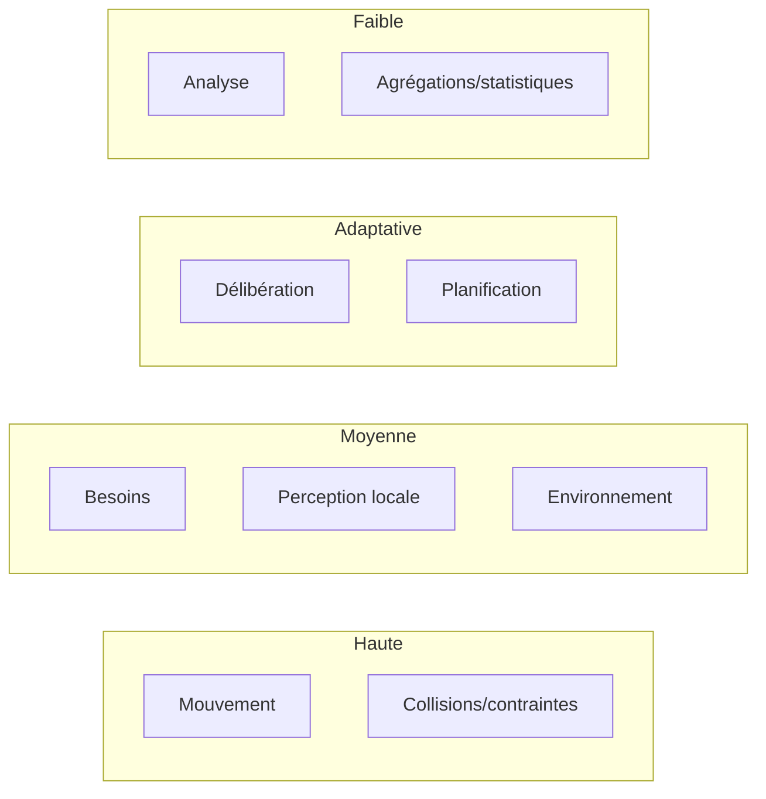

# SIMULATION_LOOP.md

**Composant** : SYNE
**Statut** : [STABLE]
**Dernière mise à jour** : 17 septembre 2026
**Dépend de** : `ARCHITECTURE.md`, `DATA_MODEL.md`
**Source Monographie** : §3.3 (boucle de simulation), §3.4 (scheduler), §3.6 (temps)

---

## 1. Le tick

- **1 tick = 1 minute simulée** par défaut (cycle 24 h = 1440 ticks) — décision n°1 « unité de temps », [HÉRITÉ] paramétrable (Monographie ADR-005 §F.6).
- Vitesse par défaut : **10 ticks/seconde réelle** → rapport **1:10** (1 s réelle = 10 min simulées).
- Modes : réel (10 tps, défaut), rapide (>10, batch), lent (<10, débogage), pause (0, inspection).
- Support : pause, reprise, avance pas-à-pas (1 tick), changement de vitesse — Monographie §3.3.5.

## 2. La boucle de référence V0.1 (15 étapes)

Source : Monographie §3.3.4 (cible V0.1, §28 de la Fondation).

| # | Étape | Description |
| :-- | :-- | :-- |
| 1 | **Percevoir** | Lire les capteurs (entités proches) |
| 2 | **Mettre à jour la mémoire** | Stocker les observations, appliquer la décroissance |
| 3 | **Réviser les croyances** | Intégrer les nouvelles informations |
| 4 | **Mettre à jour l'état interne** | Santé, énergie, fatigue |
| 5 | **Mettre à jour les besoins** | Calculer les niveaux actuels |
| 6 | **Générer / actualiser les objectifs** | Depuis les besoins non satisfaits |
| 7 | **Générer les possibilités** | Actions candidates |
| 8 | **Évaluer les possibilités** | Scoring d'utilité |
| 9 | **Délibérer** | Choix de l'action |
| 10 | **Définir une intention** | Engagement sur l'action |
| 11 | **Exécuter l'action** | Appliquer l'action (peut s'étendre sur plusieurs ticks) |
| 12 | **Produire des conséquences** | Effets sur l'entité et le monde |
| 13 | **Modifier le monde** | Mise à jour de l'environnement |
| 14 | **Produire des événements** | Événements observables (ExternalEvent) |
| 15 | **Nouvelles perceptions** ↺ | Retour au début |

> La boucle est **conceptuelle** : le scheduler peut exécuter chaque sous-système à sa propre fréquence (voir §3). Elle remplace les boucles V1/V2 conservées comme historique [HÉRITÉ].

**Traçabilité** : toute action est reconstructible vers sa perception d'origine :

```text
Action ← Intention ← Objectif ← Besoin ← Croyance ← Mémoire ← Perception
```

## 3. Distribution des fréquences (scheduler)



(Monographie §3.4.2 — principes, pas valeurs figées.)

## 4. Niveau de détail (LOD) décisionnel

| Zone | Distance | Fréquence de décision |
| :-- | :-- | :-- |
| Zone 0 | ≤ 100 | Tous les ticks (1.0) |
| Zone 1 | 100–200 | Tous les 2 ticks (0.5) |
| Zone 2 | 200–400 | Tous les 4 ticks (0.25) |

Formule : `decisionFrequency = 1 / 2^LOD` ; décision réévaluée si `currentTick % decisionInterval == 0`, sinon poursuite de l'action courante. Réduction ~2× du coût de décision pour les entités distantes. (Monographie §3.4.3)

## 5. Boucle cognitive V2 (10 étapes, historique)

Pour référence (Monographie §3.8.1) — remplacée en V0.1 par la boucle 15 étapes en §2 :

1. PERCEPTION → 2. MÉMOIRE → 3. CROYANCES → 4. BESOINS → 5. OBJECTIFS → 6. FILTRAGE → 7. ÉVALUATION → 8. DÉLIBÉRATION → 9. EXÉCUTION → 10. SORTIE (DecisionRecord, événements).

## 6. Temps et reproductibilité

- Chaque expérience associe : seed (64 bits), configuration (config.json), version moteur, état initial.
- PRNG : xoshiro256\*\* + splitmix64(seed) ; état 4×64 bits sérialisé dans la persistance (§3.6.3-3.6.4).
- `System.Random` **interdit**.

---

## Points restés ouverts dans ce document
- Fréquences numériques exactes du scheduler V0.1 (valeurs indicatives conservées [HÉRITÉ]).
- Détail des étapes 12-13 (conséquences / modification du monde) : répartition exacte entre sous-systèmes à stabiliser lors de l'implémentation.