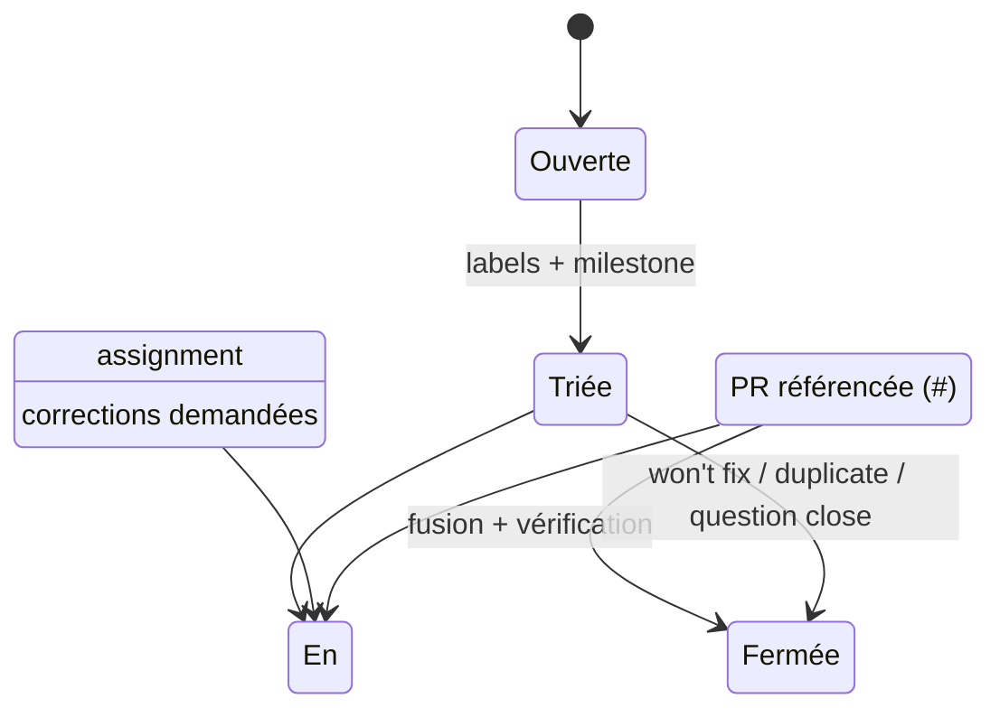

# ISSUES.md

**Composant** : LIVEX (général)
**Statut** : [STABLE]
**Dernière mise à jour** : 17 septembre 2026
**Dépend de** : —
**Source Monographie** : — (document de gouvernance)

---

## 1. Objectif

Ce document définit comment le projet LIVEX formalise, qualifie et traite les problèmes (issues) : bogues, fonctionnalités, documentation, propositions d'ADR et questions. La gouvernance est calibrée pour un dépôt **solo dans un premier temps** et applicable telle quelle à l'arrivée de contributeurs.

## 2. Types d'issues

| Type | Objectif | Template | Étiquette suggérée |
| :-- | :-- | :-- | :-- |
| Bug | Signaler un comportement incorrect ou non conforme | `bug_report.md` | `bug`, `severity/...` |
| Feature | Proposer une évolution ou un ajout | `feature_request.md` | `enhancement` |
| Documentation | Corriger ou enrichir la documentation | `documentation.md` | `docs` |
| ADR | Proposer une décision d'architecture | `adr_proposal.md` | `adr` |
| Question | Clarifier un point sans engendrer de changement | (issue libre) | `question` |

## 3. Convention de rédaction

Toute issue porte ces champs minimaux :

1. **Contexte** : situation/déclencheur.
2. **Comportement attendu** (issu de la Monographie quand applicable, avec référence `§`).
3. **Comportement constaté** (pour un bug) avec données de reproduction (seed, config, version).
4. **Critère d'acceptation** : définition vérifiable du « fait ».
5. **Liens** : issues liées, ADR concernés.

Préfixe standard du titre par composant : `[SYNE]`, `[ECHOS]`, `[PRISM]`, `[GOVERNANCE]`, `[DOCS]`.

Exemple :

```
[SYNE] Le calcul de salience mémoire utilise decayRate=0.05 alors que
Observation doit utiliser 0.01 (§3.10.3)
```

## 4. Cycle de vie



Règles :

- Une issue **Bug** doit référencer la branche (`bug`/`fix/*`) qui la résout via une PR (lien « closes #… »).
- Une issue **ADR** suit le cycle décrit dans `docs/governance/PULL_REQUESTS.md` ; seuls les ADR acceptés sont intégrés (format `docs/adr/`).
- Une issue devient **Fermée** uniquement lorsque le critère d'acceptation est vérifié (pipeline vert + vérification manuelle).

## 5. Labels de référence

| Domaine | Labels |
| :-- | :-- |
| Composant | `component/syne`, `component/echos`, `component/prism`, `component/governance` |
| Sévérité | `severity/critical`, `severity/high`, `severity/medium`, `severity/low` |
| Statut | `status/blocked`, `status/needs-input`, `status/good-first-issue` |
| Priorité (backlog) | `priority/P0`, `P1`, `P2`, `P3` |

---

## Points restés ouverts dans ce document
- La politique de tri de sévérité `P0..P3` sera affinée avec la première vraie fréquence d'issues ; les définitions actuelles restent génériques.